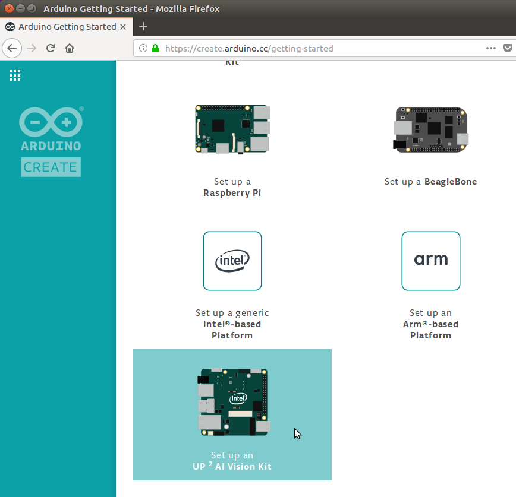
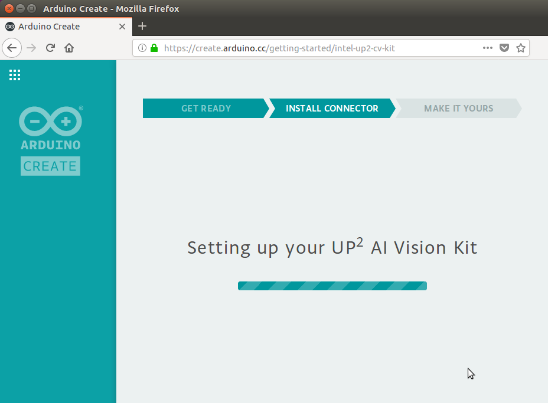
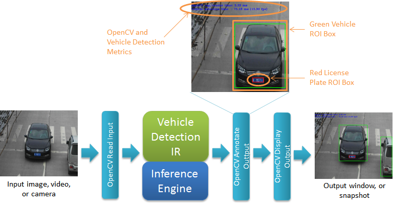
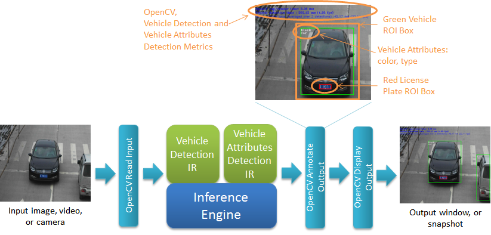

# Car Detection Tutorial

**Note**: This tutorial has been written using OpenVINO™ toolkit version 2018 R1.2 and is for use with this version only.   Using this tutorial with any other version may not be correct.

# Table of Contents

<p></p><div class="table-of-contents"><ul><li><a href="#car-detection-tutorial">Car Detection Tutorial</a></li><li><a href="#table-of-contents">Table of Contents</a></li><li><a href="#introduction">Introduction</a></li><li><a href="#getting-started">Getting Started</a><ul><li><a href="#prerequisites">Prerequisites</a></li><li><a href="#downloading-the-tutorial-from-the-git-repository">Downloading the Tutorial from the Git Repository</a><ul><li><a href="#option-1-using-git-clone-to-clone-the-entire-repository">Option #1: Using Git Clone to Clone the Entire Repository</a></li><li><a href="#option-2-using-svn-export-to-download-only-this-tutorial">Option #2: Using SVN Export to Download Only This Tutorial</a></li><li><a href="#tutorial-files">Tutorial FIles</a></li></ul></li><li><a href="#openvino-toolkit-overview-and-terminology">OpenVINOâ„¢ Toolkit Overview and Terminology</a><ul><li><a href="#using-the-inference-engine">Using the Inference Engine</a><ul><li><a href="#inference-engine-api-integration-flow">Inference Engine API Integration Flow</a></li><li><a href="#setting-up-command-line-to-use-the-openvino-toolkit-executables-and-libraries">Setting Up Command Line to Use the OpenVINO™ Toolkit Executables and Libraries</a></li></ul></li><li><a href="#where-do-the-inference-models-come-from">Where Do the Inference Models Come from?</a></li></ul></li></ul></li><li><a href="#key-concepts">Key Concepts</a><ul><li><a href="#batch-size">Batch Size</a><ul><li><a href="#how-does-batch-size-affect-performance-and-latency">How Does Batch Size Affect Performance and Latency?</a></li></ul></li><li><a href="#image-processing-pipeline">Image Processing Pipeline</a></li><li><a href="#synchronous-vs-asynchronous-api">Synchronous vs. Asynchronous API</a></li></ul></li><li><a href="#tutorial-step-1-create-the-base-opencv-application">Tutorial Step 1: Create the Base OpenCV Application</a></li><li><a href="#tutorial-step-2-add-the-first-model-vehicle-detection">Tutorial Step 2: Add the first Model, Vehicle Detection</a></li><li><a href="#tutorial-step-3-add-the-second-model-vehicle-attributes-detection">Tutorial Step 3: Add the Second Model, Vehicle Attributes Detection</a></li><li><a href="#tutorial-step-4-using-the-asynchronous-api">Tutorial Step 4: Using the Asynchronous API</a></li><li><a href="#conclusion">Conclusion</a></li><li><a href="#references-and-more-information">References and More Information</a></li></ul></div><p></p>

# Introduction

The purpose of this tutorial is to examine a sample application that was created using the Open Visual Inference & Neural Network Optimization (OpenVINO™) toolkit and UP Squared* hardware included in the UP Squared* AI Vision Development Kit.  The application is able to run inference models on the CPU, GPU and VPU devices to process images.  The models can be used to process video from the USB camera, an existing video file, or still image files.  To do that, we will download the latest Car Detection Tutorial from GitHub and then walk through the sample code for each step before compiling and running it on the UP Squared* hardware.

This tutorial will start from a base application that can read in image data and output the image to a window.  From there, each step adds deep learning models that will process the image data and make inferences.  In the third step, the application will be able to detect a vehicle and report the vehicle type (e.g. car, van, etc) and color.  In the final step, the application is improved using the Inference Engine asynchronous API to perform inference in parallel with the main processing loop.  Before that, some key concepts related to using the OpenVINO™ toolkit will be introduced and later seen along the way within the steps.  

# Getting Started

## Prerequisites

The UP Squared* AI Vision Development Kit comes ready to go with all the hardware needed for this tutorial and is fully preconfigured with all software tools, libraries, drivers, etc. needed.   A summary of what is used:

* Hardware

   * From the kit:

      * UP Squared* Board

      * AI Core mPCIe board (installed) with Intel® Movidius™ Myriad™. This is what is being referred to as the "Myriad"

      * USB Camera

      * Power supply

   * User supplied:

      * USB keyboard and mouse

      * HDMI or DisplayPort cable and monitor

      * Ethernet cable

* Software (pre-installed in the kit)

   * OpenVINO™ toolkit

      * Inference Engine with plugins support for CPU, GPU, and Myriad

      * Optimized OpenCV and OpenVX libraries

      * Samples and common helper libraries

By now you should have completed the setup and getting starting guide for the kit, however before continuing, please ensure that:

* You have followed all the steps in the getting starting guide for your UP Squared* AI Vision Development Kit.  This tutorial assumes that you have already setup and run the supplied test samples to test that your kit is fully functional including:

   * The UP Squared* board is booted and running 

   * The USB camera is connected and operating correctly

* Your UP Squared* board is connected to a network and has Internet access.  To download all the files for this tutorial, the UP Squared* board will need to access GitHub on the Internet. 

## Downloading the Tutorial from the Git Repository

The first thing we need to do is create a place for the Car Detection tutorial and then download it.  To do this, we will create a directory called "tutorials" and use it to store the files that are downloaded from the “cvs-sdk-tutorial” GitHub repository.  There are two options to download this tutorial: 1) Download as part of the entire repository using “git clone”, or 2) Use “svn export” to download just this tutorial (smaller)

### Option #1: Using Git Clone to Clone the Entire Repository

1. Bring up a command shell prompt by opening a terminal (such as xterm) or selecting a terminal that is already open.

2. Create a "tutorials" directory where we can download the Car Detection tutorial and then change to it:

```Bash
mkdir tutorials
cd tutorials
```


3. Clone the repository:

```Bash
git clone https://github.com/intel-iot-devkit/computer-vision-inference-dev-kit-tutorials.git
```


4. Change to the top git repository and check out correct version:

```Bash
cd computer-vision-inference-dev-kit-tutorials
git checkout openvino_toolkit_r1_2
```


5. Change to the car detection tutorial folder:

```Bash
cd car_detection_tutorial
```


### Option #2: Using SVN Export to Download Only This Tutorial

1. Bring up a command shell prompt by opening a terminal (such as xterm) or selecting a terminal that is already open.

2. Create a "tutorials" directory where we can download the Car Detection tutorial and then change to it:

```Bash
mkdir -p tutorials/computer-vision-inference-dev-kit-tutorials
cd tutorials/computer-vision-inference-dev-kit-tutorials
```


3. Download the subdirectory for just this tutorial from the repository:

```Bash
svn export https://github.com/intel-iot-devkit/computer-vision-inference-dev-kit-tutorials.git/branches/openvino_toolkit_r1_2/car_detection_tutorial
```


4. Change to the car detection tutorial folder:

```Bash
cd car_detection_tutorial
```


Now that we have all the files for the Car Detection Tutorial, we can take some time to look through them to see what each part of the tutorial will demonstrate.

### Tutorial FIles

In the "car_detection_tutorial" directory you will see:

* cmake\ - Common CMake files 

* data\ - Image, video, etc. data files used with this tutorial

* doc_support\ - Supporting documentation files including images, etc.

* scripts\ - Common helper scripts

* step_1\ - Tutorial Step 1: All files including Readme.md documentation

* step_2\ - Tutorial Step 1: All files including Readme.md documentation

* step_3\ - Tutorial Step 1: All files including Readme.md documentation

* step_4\ - Tutorial Step 1: All files including Readme.md documentation

* Readme.md - The top level of this tutorial (this page)

## OpenVINO™ Toolkit Overview and Terminology 

Let us begin with a brief overview of the OpenVINO™ toolkit and what this tutorial will be covering.  The OpenVINO™ toolkit enables the quick deployment of convolutional neural networks (CNN) for heterogeneous execution on Intel® hardware while maximizing performance. This is done using the Intel® Deep Learning Deployment Toolkit (Intel® DL Deployment Toolkit) included within the OpenVINO™ toolkit with its main components shown below.



The basic flow is:

1. Use a tool, such as Caffe, to create and train a CNN inference model

2. Run the created model through Model Optimizer to produce an optimized Intermediate Representation (IR) stored in files (.bin and .xml) for use with the Inference Engine

3. The User Application then loads and runs models onto devices using the Inference Engine and the IR files  

This tutorial will focus on the last step, the User Application and using the Inference Engine to run models on CPU, GPU, and Myriad.  

### Using the Inference Engine

Below is a more detailed view of the User Application and Inference Engine:


The Inference Engine includes a plugin library for each supported device that has been optimized for the Intel® hardware device CPU, GPU, and Myriad.  From here, we will use the terms "device" and “plugin” with the assumption that one infers the other (e.g. CPU device infers the CPU plugin and vice versa).  As part of loading the model, the User Application tells the Inference Engine which device to target which in turn loads the associated plugin library to later run on the associated device. The Inference Engine uses “blobs” for all data exchanges, basically arrays in memory arranged according the input and output data of the model.

#### Inference Engine API Integration Flow

Using the Inference Engine API follows the basic steps briefly described below.  The API objects and functions will be seen later in the code walkthroughs.

1. Load the plugin

   1. Create an instance of the plugin (InferenceEngine::InferencePlugin) for the specified device using the InferenceEngine::PluginDispatcher class

2. Read the model IR

   1. Read in IR files using InferenceEngine::CNNNetReader::ReadNetwork("Model.xml") and InferenceEngine::CNNNetReader::ReadWeights("Model.bin")

3. Configure the inputs and outputs formats

   1. Probe model for input and output information using InferenceEngine::CNNNetwork::getInputsInfo() and InferenceEngine::CNNNetwork::getOutputsInfo().

   2. Optionally configure the precision and memory layout of inputs and outputs to match the model inputs and outputs using InferenceEngine::InputInfo::setPrecision() and InferenceEngine::InputInfo::setLayout()

4. Load the model into the plugin

   1. Load the model into the plugin using InferenceEngine::InferencePlugin::LoadNetwork() which will return a InferenceEngine::ExecutableNetwork object for the loaded network

5. Create an inference request

   1. Use the loaded plugin to create a request object (InferenceEngine::InferRequest::Ptr) that is used for control and holds input and output blobs using InferenceEngine::ExecutableNetwork::CreateInferRequestPtr()

6. Prepare the input

   1. Get the input blob(s) to hold input data using InferenceEngine::InferRequest::getBlob()

   2. Reformat user input data into the format required by the model (e.g convert RGB user image to BGR for model) storing in the model’s format in the input blob.  

7. Run Inference

   1. Request plugin to perform inference and wait for results using one of two modes:

      1. Synchronous: 

         1. InferenceEngine::InferRequest::Infer() 

         2. Or InferenceEngine::InferRequest::StartAsync() immediately followed by InferenceEngine::InferRequest::Wait().

      2. Asynchronous: 

         1. InferenceEngine::InferRequest::StartAsync() 

         2. Then later InferenceEngine::InferRequest::Wait()

8. Process the output

   1. Get the output blob(s) holding output blob using InferenceEngine::InferRequest::getBlob()

   2. Parse and process the output blob(s) according to the output format specified by the model

In tutorial Steps 2 and 3 we will walkthrough the code that specifically integrates each of the models used in the application.  

More details on the Inference Engine can be found in the "Integrating Inference Engine into Your Application" section of the Inference Engine Development Guide [https://software.intel.com/inference-engine-devguide](https://software.intel.com/inference-engine-devguide)

and the Inference Engine API documentation located at: /opt/intel/computer_vision_sdk/deployment_tools/documentation/docs/IntegrateIEInAppNewAPI.html

#### Setting Up Command Line to Use the OpenVINO™ Toolkit Executables and Libraries

Whenever running the OpenVINO™ toolkit tools, compiling, or running the user application, always remember to source the script:

```Bash
source /opt/intel/computer_vision_sdk/bin/setupvars.sh
```


This script sets up the executable and library paths along with environment variables used by the OpenVINO™ toolkit tools as well as this tutorial.

### Where Do the Inference Models Come from?

An inference model may come from any of the supported sources and workflows such as Caffe, TensorFlow, and Apache MXNet.  For this tutorial, we will use models that have already been compiled by the Model Optimizer into .bin and .xml files and supplied within the OpenVINO™ toolkit samples.  The development and compiling of models is beyond the scope of this tutorial, for more information see [https://software.intel.com/openvino-toolkit/deep-learning-cv](https://software.intel.com/en-us/openvino-toolkit/deep-learning-cv)

# Key Concepts

Before going into the samples in the tutorial steps, first we will go over some key concepts that will be covered in this tutorial.  For more related concepts, please see the  [Face Detection Tutorials](../face_detection_tutorial/Readme.md) that covers and answers the questions:

* Intel® OpenCV - Why is it included in the OpenVINO™ toolkit?

* Floating Point Precision - What is it and why does it matter?

## Batch Size

Batch size refers to the number of input data to be inferred during a single inference run through the Inference Engine.  Things to be aware of the batch size for an inference model:

* Batch size and its effects on input and output data is model dependent:

   * The output batch size may scale with input batch size.  For example, the vehicle attributes model used in this tutorial will have one one output for each input.

   * The output may contain results across all batched inputs.  For example, the vehicle detection model used in this tutorial gives one set of outputs regardless of input batch size with each output indicating the input the results is for using the "image_id" field.

* How batch size is set:

   * The default setting is located in the model’s IR which is set either by:

      * The Model Optimizer command line option when creating the IR files

      * Or from the original source (e.g. Caffe) in which can be read using the Inference Engine API 

   * May be set explicitly using the Inference Engine API setBatchSize() function (see InferenceEngine::ICNNNetwork class)

   * **Note**: Depending upon the model and device used, which method can be used to set batch size may vary.  For example, at the time of writing this tutorial, some models (e.g. the vehicle and license plate detection model used in this tutorial) running on GPU will only use the setting form the IR model and cannot have batch size set dynamically using setBatchSize().

* Batch size is a fixed number of inputs that will be inferred for each submitted request to the Inference Engine API regardless of how many inputs contain valid data.  Depending upon the model, invalid inputs may also result in false detections and additional unnecessary processing.

### How Does Batch Size Affect Performance and Latency?

Batch size affects both latency and performance of an application.  Latency is measured as the time from acquiring the input data until inferred results are available.  Performance tells us the rate that input-to-results can occur, such as frames-per-second.  For a real-time control application, we can think of latency as the reaction time for a control to be changed while performance is how often that control can be updated.  

Choosing the appropriate batch size for an application’s requirements depends upon the input source, resources (e.g. memory to store more inputs), device(s), and model(s) being used.  The time it takes to build up a batch from the input source before processing it means more latency.  The device selected may also impose a limit on the batch size such as the Myriad which has a limit of 1.  The complexity of the model affects how fast results can be returned for the device used.  Running batch sizes >1 may be faster than running a batch size of 1 because of the efficiency of the device’s pipelined architecture (e.g. pipeline full vs. partly idle), available resources (e.g. multiple cores working in parallel), and/or a reduction of data transfers (e.g. transfer weights only once).  

For more information on an example of batch size effects on performance for clDNN running on GPU, see the whitepaper: [https://software.intel.com/en-us/articles/accelerating-deep-learning-inference-with-intel-processor-graphics](https://software.intel.com/en-us/articles/accelerating-deep-learning-inference-with-intel-processor-graphics)

## Image Processing Pipeline


Briefly, a pipeline is a chain of 0-to-N stages where each stage: receives an input, does some processing, then outputs the results.  The intention is that each stage is self-contained and runs independently focused just on its inputs and outputs allowing all stages to run in parallel.

For more details see: [https://en.wikipedia.org/wiki/Pipeline_(software)](https://en.wikipedia.org/wiki/Pipeline_(software))

 

An image processing pipeline follows the pipeline pattern to implement an algorithm that will take an input image through multiple stages to produce the desired results.  Each stage of the pipeline performs the different steps of the algorithm to do the different image processing operations.  Following the pipeline pattern:

* Helps to organize the algorithm into steps

* Reuses library and other elements to quickly build new algorithms

* Gets ready for parallelism where each pipeline stage may be run simultaneously on more than one device

The completed pipeline in Tutorial Step 3 looks like:


In Tutorial Step 3 the pipeline is completed with Stage #0 and Stage #1 waiting synchronously for inference to complete.  The pipeline is then improved in Tutorial Step 4 by using the async API to gain true parallelism when the inference models are run on another device than the CPU.

## Synchronous vs. Asynchronous API

A synchronous API is a single function that is called and does not return until all operations are complete.  This means that the calling application thread is blocked and cannot continue until the API function returns.  An asynchronous API typically has the two functions: start() and wait().  First the start() is called to begin operations and then returns immediately so that the application thread may continue doing other things before calling wait() to either check status or wait for operations to complete.  In a multi-device environment, the asynchronous API has the advantage of allowing the application thread to continue to perform other work in parallel with API operations.

When running an inference model using an InferenceEngine::InferRequest object, the Inference Engine provides the asynchronous and synchronous API functions:

* Synchronous API:

   * void Infer() - Run inference and return when complete

* Asynchronous API

   * void StartAsync() - Start inference and return immediately

   * StatusCode Wait(int64_t millis_timeout)

      * If millis_timeout==RESULT_READY, wait until inference is complete

      * Else if millis_timeout==RESULT_STATUS, return immediately with status

      * Else wait millis_timeout milliseconds and return if inference has not completed

* **Note**: Using Infer() is effectively the same as calling StartAsync() immediately followed by Wait(WaitMode::RESULT_READY).

The basic flow of the synchronous and asynchronous API is shown below.


# Tutorial Step 1: Create the Base OpenCV Application



The first tutorial will show how the Intel® OpenCV libraries are used by an application.  We will see how the OpenCV functions are included in an application as they are used to get input from image files or a video camera connected to the UP Squared* board and display the image data in a window. 

[Car Detection Tutorial Step 1](./step_1/Readme.md)

# Tutorial Step 2: Add the first Model, Vehicle Detection 



The second tutorial takes the framework in Tutorial Step 1 and adds vehicle and license plate detection to processing images.  This step shows how an inference model has been added to use the Inference Engine to run the model on hardware.  We will also learn how to specify which device the model is run on: CPU, GPU,  the Myriad.  

[Car Detection Tutorial Step 2](./step_2/Readme.md)

# Tutorial Step 3: Add the Second Model, Vehicle Attributes Detection



The third tutorial step will show how a second model is added to the application by including a model that infers the type (e.g. car, van, etc.) and color attributes of the detected vehicles from the vehicle detection model.  

[Car Detection Tutorial Step 3](./step_3/Readme.md)

# Tutorial Step 4: Using the Asynchronous API 


To complete the application, the fourth tutorial step makes full use of the asynchronous API within the processing pipeline to enable parallelism when multiple devices are used. 

[Car Detection Tutorial Step 4](./step_4/Readme.md)

# Conclusion

Congratulations! you have completed the Car Detection Tutorial.  After going through this entire tutorial and all of its steps, you have now seen:

* An overview of the Inference Engine

* The final application assembled in steps:

   * How to create a base application that uses OpenCV to perform image and video input and output.  

   * How to extend the application to use the Inference Engine and CNN models to process the images and detect cars.  

   * How to create a pipeline that takes the results of the first model’s analysis and use it as input to the next model that processes the vehicles to infer the type and color.  

   * How to load the analysis models onto different devices to distribute the workload and find the optimal device to get the best performance from the models.

   * How to convert to asynchronous Inference Engine API calls to run inference in parallel.

# References and More Information

OpenVINO™ toolkit main page: [https://software.intel.com/openvino-toolkit](https://software.intel.com/openvino-toolkit)

OpenVINO™ toolkit documentation page: [https://software.intel.com/openvino-toolkit/documentation](https://software.intel.com/openvino-toolkit/documentation)

Intel® Deep Learning Deployment Toolkit (Intel® DL Deployment Toolkit): [https://software.intel.com/openvino-toolkit/deep-learning-cv](https://software.intel.com/openvino-toolkit/deep-learning-cv)

