# Tutorial Step 1: Create the Base OpenCV Application


# Table of Contents

<p></p><div class="table-of-contents"><ul><li><a href="#tutorial-step-1-create-the-base-opencv-application">Tutorial Step 1: Create the Base OpenCV Application</a></li><li><a href="#table-of-contents">Table of Contents</a></li><li><a href="#introduction">Introduction</a></li><li><a href="#the-basic-opencv-application-input-and-output">The Basic OpenCV Application, Input and Output</a><ul><li><a href="#runtime-parameters">Runtime Parameters</a><ul><li><a href="#create-the-parameter">Create the Parameter</a></li><li><a href="#parse-parameters">Parse Parameters</a></li></ul></li><li><a href="#opencv-input-to-output">OpenCV Input to Output</a><ul><li><a href="#header-files">Header Files</a></li><li><a href="#main-function">main_function()</a></li><li><a href="#main-loop">Main Loop</a></li></ul></li></ul></li><li><a href="#arduino-specific-code">Arduino Specific Code</a><ul><li><a href="#setup">setup()</a></li><li><a href="#loop">loop()</a></li></ul></li><li><a href="#building-and-running">Building and Running</a><ul><li><a href="#build">Build</a><ul><li><a href="#start-arduino-create-web-editor">Start Arduino Create Web Editor</a></li><li><a href="#import-arduino-create-sketch">Import Arduino Create Sketch</a></li><li><a href="#build-and-upload-sketch-executable">Build and Upload Sketch Executable</a></li></ul></li><li><a href="#run">Run</a><ul><li><a href="#how-to-run-the-executable">How to Run the Executable</a></li><li><a href="#how-to-set-runtime-parameters">How to Set Runtime Parameters</a></li><li><a href="#running">Running</a></li></ul></li></ul></li><li><a href="#conclusion">Conclusion</a></li><li><a href="#navigation">Navigation</a></li></ul></div><p></p>

# Introduction

This tutorial describes the basics of what is needed to include and use OpenCV in an application. We will be walking through the sample application that has already been created.  The sample is designed to be a minimal application that demonstrates how to use OpenCV functions to read image data and then display the image data.  This tutorial will walkthrough the OpenCV portions of the code and explain what it does.  Then, we will build and run the tutorial so we can see it in action.  In later tutorials, we will be adding processing of the input image to this basic framework.

# The Basic OpenCV Application, Input and Output

Every application needs some way of getting data in and data out.  Let us now take a look at the code we will be using to do the input and output in our OpenCV application.  Then, we can compile and run our program to see how it works using the base input and output settings.  

## Runtime Parameters

To make it easier to set everything from the input video file to which model and device is to be used, parameters that can be set at runtime will be used.  At startup, the application will display the current parameter settings and prompt to make changes before continuing.  Code is provided in the Parameters.hpp file to make it easy to create parameters and parse a string at runtime to set the different parameters accordingly.  Here we will briefly go over the primary functions that are used.

To make use of the parameters code and use the supplied functions and classes, the main header file must be included:

```Cpp
#include "Parameters.hpp"
```


This is done in the main header file "car_detection.hpp" where all the runtime parameters are defined using the following steps.

### Create the Parameter

Create the parameter using the macro "DEFINE_string".  Here the “i=\<video filename\>” runtime parameter that is used to specify the input video is defined:

```cpp
/// @brief message for images argument
static const char video_message[] = "Path to a video file or \"cam\" to work with camera";

/// \brief Define parameter for set image file <br>
/// It is a required parameter
DEFINE_string(i, "cam", video_message);
```


In the above code:

* video_message[] is the argument’s description string

* DEFINE_string(i, "cam", video_message):

   * Specifies:

      * The string argument name as "i"

      * video_message as the help message

      * "cam" as the default value when not set

   * Creates the variable PARAMETERS_i to hold the string value for the "i" argument

### Parse Parameters

In cd_step_*_sketch.ino’s main_function() function, promptForParameters() is called to prompt for a parameter setting string ("\<name\>=\<value\>"), parse the string for parameters, and check for valid arguments. The actual argument parsing and setting variables is done by the call:

```Cpp
parameters::parseParameterString(line.c_str());
```


After returning, the PARAMETERS_i variable will be set with the video filename from the parameters string ‘i="\<video filename\>"’, or if not specified, it will be set to the default value of “cam”.  

It is also possible to set one parameter using another parameter’s current value.  This is done similar to shell script by using a ‘$’ before the other parameter’s name in the parameter string as "i=$i2".  For example, parameter “i2” could be created (Note that “i2” may also be set normally as a parameter) to contain a long file name known at compile time and later used to change “i” using just the variable name.  This is convenient for storing known long values to give them shorter names as we will see later in Tutorial Step 2.

Above is how the "i" parameter is done, all other arguments are handled similarly using the other forms of the supplied macros according to data type needed as follows:

* DEFINE_uint32() for an unsigned 32-bit integer arguments

* DEFINE_int32() for an signed 32-bit integer arguments

* DEFINE_string() for string arguments

* DEFINE_double() for double precision floating point arguments

* DEFINE_bool() for boolean arguments

## OpenCV Input to Output

1. Open up a terminal (such as xterm) or use an existing terminal to get to a command shell prompt.

2. Change to the directory containing Tutorial Step 1:

```bash
cd tutorials/computer-vision-inference-dev-kit-tutorials/car_detection_tutorial/step_1
```


3. Open the files "cd_step_1_sketch.ino" and “car_detection.hpp” in the editor of your choice such as ‘gedit’, ‘gvim’, or ‘vim’.

### Header Files

1. These header files are included to define helpful utility classes used to simplify common tasks as well as some functions for making logging easier.

```cpp
#include <common.hpp>
#include "slog.hpp"
```


2. The opencv.hpp file is included for the Intel® optimized OpenCV libraries included in the OpenVINO™ toolkit.

```cpp
#include <opencv2/opencv.hpp>
```


### main_function()

1. First, the OpenCV video capture object "cap" is created that will be used to source the image data.  Then, the image source is opened.  PARAMETERS_i is the command line parameter that tells the application the source of where the image.  The source can be the path to an image file, the path to a video file, or “cam” for the USB camera.

```cpp
cv::VideoCapture cap;
if (!(PARAMETERS_i == "cam" ? cap.open(0) : cap.open(PARAMETERS_i))) {
   throw std::logic_error("Cannot open input file or camera: " + PARAMETERS_i);
}
```


2. The width and height of the image source are stored for use later.  

```cpp
const size_t width  = (size_t) cap.get(CV_CAP_PROP_FRAME_WIDTH);
const size_t height = (size_t) cap.get(CV_CAP_PROP_FRAME_HEIGHT);
```


3. Storage for the image frame is created and then the first frame is read in. 

```cpp
cv::Mat frame;
if (!cap.read(frame)) {
   throw std::logic_error("Failed to get frame from cv::VideoCapture");
}
```


### Main Loop

The main loop will read in and then write out the image frames until there are no more available. 

1. The main loop runs until the conditions specified at the bottom of the loop are met:

```cpp
do {
```


2. A message is output to let the user know they can stop a multi-image source like video or camera:

```cpp
    if (firstFrame) {
   	  slog::info << "Press 's' key to save a snapshot, press any other key to stop" << slog::endl;
    }

    firstFrame = false;
```


3. The output is shown, wrapped with time functions to measure the time it took to do:

```cpp
      t0 = std::chrono::high_resolution_clock::now();
      if (!PARAMETERS_no_show) {
         cv::imshow("Detection results", frame);
      }
      t1 = std::chrono::high_resolution_clock::now();
      ocv_render_time += std::chrono::duration_cast<ms>(t1 - t0).count();
```


4. A check is made to see if there is another image available from the source:

```cpp
      // get next frame            
      doMoreFrames = cap.read(frame);
```


5. A check is made for key press to either snapshot (pressing ‘s’) or stop (any other key)

```cpp
    int keyPressed;
    if (-1 != (keyPressed = cv::waitKey(1)))
    {
   	 if ('s' == keyPressed) {
   		 // save screen to output file
   		 slog::info << "Saving snapshot of image" << slog::endl;
   		 cv::imwrite("snapshot.bmp", frame);
   	 } else {
           doMoreFrames = false;
   	 }
    }
```


6. A check is made to see if there is another image to process (doMoreFrames).  If there is not, then wait for a key press in the command window.  If no more images to process and the "no_wait=1" or “no_show=1” option was used, then exit immediately.

```cpp
      // end of file we just keep last image/frame displayed to let user check what was shown
      if (!doMoreFrames && !PARAMETERS_no_wait && !PARAMETERS_no_show) {
         slog::info << "Press 's' key to save a snapshot, press any other key to exit" << slog::endl;
         while (cv::waitKey(0) == 's') {
            // save screen to output file
            slog::info << "Saving snapshot of image" << slog::endl;
            cv::imwrite("snapshot.bmp", frame);
         }
         doMoreFrames = false;
         break;
      }
```


7. If there are more frames to do, loop back to top.  If not, exit the main loop.

```cpp
   } while(doMoreFrames);
}
```


# Arduino Specific Code

To work within the Arduino Create framework, main() is replaced with main_function() and the two entry point functions setup() and loop() are created.

## setup()

The setup() function is called once.  Here it is used to simply call main_function() which runs the entire sketch.

```cpp
void setup() {
  main_function();
}
```


## loop()

The loop() function is called once per iteration.  Here it is not used and just exits the sketch.

```cpp
void loop() {
  // put your main code here, to run repeatedly:
  exit(0);
}
```


# Building and Running

Now that we have looked at the code and understand how the program works, let us compile and run to see it in action.  

## Build

### Start Arduino Create Web Editor

If you do not already have a web browser open, open one such as the Firefox browser from the desktop or from a command line ("firefox &").  Once open, browse to the Arduino website [https://create.arduino.cc/](https://create.arduino.cc/) to begin.

### Import Arduino Create Sketch

1. After going to the Arduino website which should appear similar to below, open the Arduino Web Editor by clicking it.


2. When the editor is first opened, it will show your last opened sketch and appear similar to below.

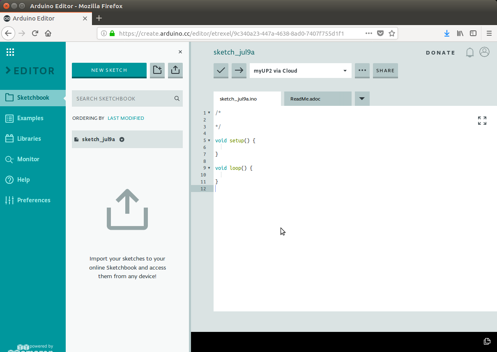

3. To begin to import this tutorial’s sketch, click on the up-arrow icon (hovering tooltip will say "Import") to the right of the “NEW SKETCH” button as shown below.


4. A "File Upload" window will appear, use it to browse to where the tutorials have been downloaded and select the file “car_detection_tutorial/step_1/cd_step_1_sketch.zip”, and then click the Open button.  After uploading and importing successfully, you will see a window similar to below.  Click the OK button to continue.

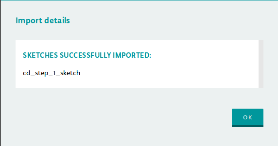

5. With the sketch now imported, it will be open in the editor similar to below and you are now ready to build.  

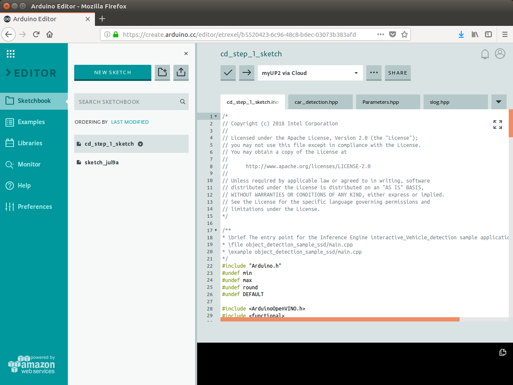

### Build and Upload Sketch Executable

1. From the Arduino Create Web Editor you build the executable and then upload it to your Arduino device.  After uploading, the executable with the same name as the sketch may be found in the "sketches" directory under your user’s home directory and may be run directly from the command line later if desired.  Before continuing, be sure that your device is ready as indicated in the box which will show “\<device name\> via Cloud” when connected as shown below for the device named “myUP2”. 


2. If unconnected and not ready, the device will appear with a line with red ‘X’ before the name as shown below.  To reconnect, you may need to refresh or reload the browser page, restart the Arduino Create Agent, or potentially run setup for your kit again.


3. After making sure your device is connected, to begin the build and upload process click on the right-arrow icon at the top of the editor as shown below.

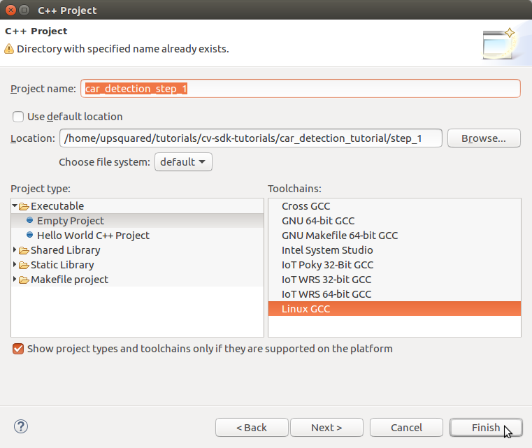

4. During the build and upload process, you will see that the button has been replaced with "BUSY" as shown below along with status text at the bottom of the window saying “Updating \<sketch name\>”.


5. Below shows after a successful build and upload.  Note that the bottom of the editor will be updated with the status and below it the output of the build.  


6. Uploading will also start the sketch which you can verify by checking the status of the sketch by clicking the "RUN/STOP" button as shown below.

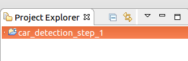

7. The status window will show all the sketches that have been uploaded to the device and the state of each as a "switch" similar below showing either “RUNNING” or “STOPPED”.  Clicking the switch will change the state of the sketch.  

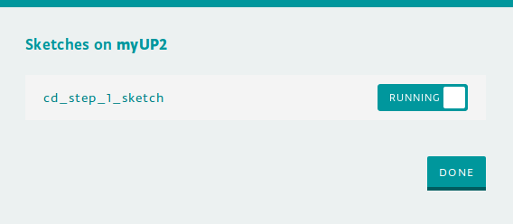

8. For now, we will stop the sketch before continuing.  First click the "RUNNING" to change it to “STOPPED”, then click the DONE button to close the window.  **Note**: Be sure to run only one tutorial sketch at a time to avoid overloading your device which may make it very slow or unresponsive.

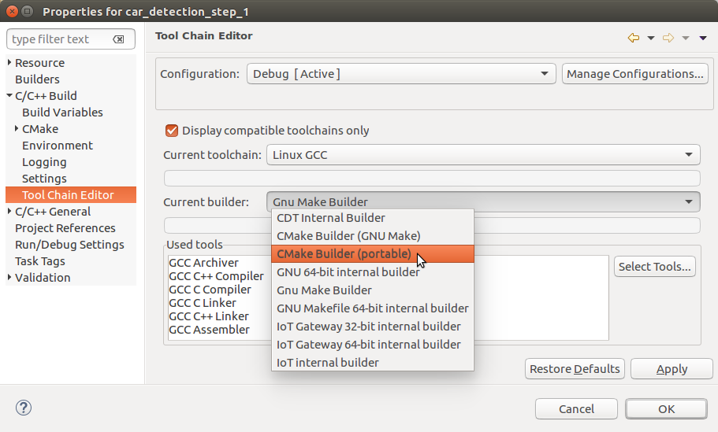

## Run

### How to Run the Executable

1. Before starting a sketch, you will need to grant the root user access to the X server to open X windows by executing the following xhost command:

```Bash
xhost +si:localuser:root 
```


2. From the command you should see the following response.  Note the xhost command will need to be run again after rebooting Linux.

```Bash
localuser:root being added to access control list
```


3. After uploading the sketch, it can be started and stopped without re-uploading.  To control and check the status of the sketch, click the "RUN/STOP" button as shown below.

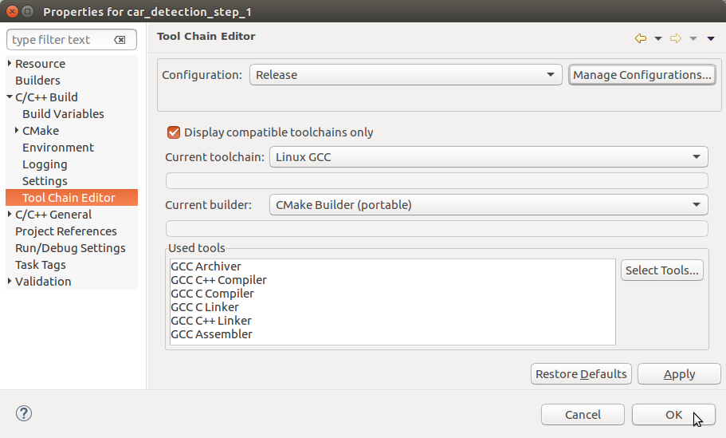

4. The sketch status window will appear with a "switch" to the right of each sketch indicating RUNNING or STOPPED as shown below already STOPPED.  

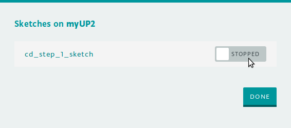

5. Clicking the RUNNING or STOPPED will change the status between states.  When starting a tutorial exercise, be sure the sketch is stopped first and then start it running.  With the sketch STOPPED, we now click it to change it to RUNNING, then click the DONE button to close the window.  **Note**: Be sure to run only one tutorial sketch at a time to avoid overloading your device which may make it very slow or unresponsive.

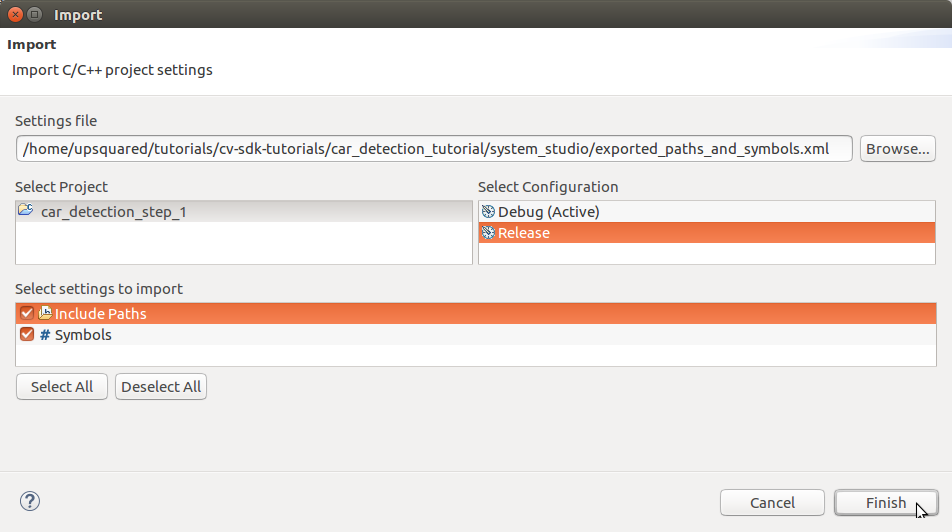

### How to Set Runtime Parameters

For flexibility and to minimize rebuilding and re-uploading the sketch when parameters change, the tutorial code allows setting parameters at runtime.  When the sketch first starts, it will first display all the current settings and then prompt for a parameters string before continuing.  Note that the sketch must first stop (or be stopped) and then restarted before accepting new parameter settings.  The steps below go through an example to set the image input parameter "i=\<video filename\>".

1. Open the "Monitor" view by clicking “Monitor” at the left side of the Arduino Create Web Editor.  The monitor is effectively the console for the sketch.  The large box will display output (stdout) from the sketch while the box to the left of the SEND button is used to send input (stdin) to the sketch.  **Note**: Be sure to open the monitor before starting the sketch otherwise you may not see initial output during startup displayed.


2. Stop the sketch if running, then start it again.  The Monitor view should now show the prompt for new parameters similar to below.  Note that each parameter is shown with a description first ("Path to a video file…"), the type of input (“sid::string”), then the current setting as name=val (“i=cam”)..  

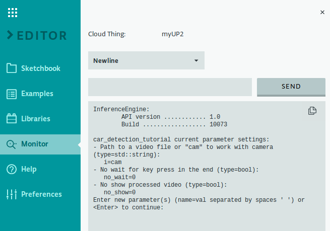

3. To change parameters, enter a string "name=val" for each parameter with a space ‘ ‘ between each “name=val”.  To change the video input file, we might use something like “i=tutorials/computer-vision-inference-dev-kit-tutorials/car_detection_tutorial/data/car_1.bmp” and press Enter or click the SEND button.  The parameters are displayed again with the new setting and a new prompt as shown below.  Note that relative paths are relative to the the user’s home directory where sketches are run.

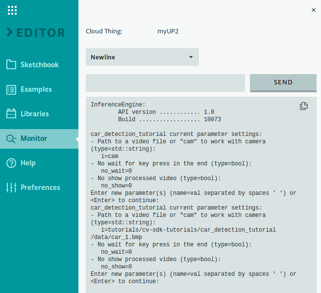

4. When ready to run the sketch with the current parameter settings, leave the input box empty and press Enter or click the SEND button.  The sketch should continue with more output shown in the monitor output box similar to below.

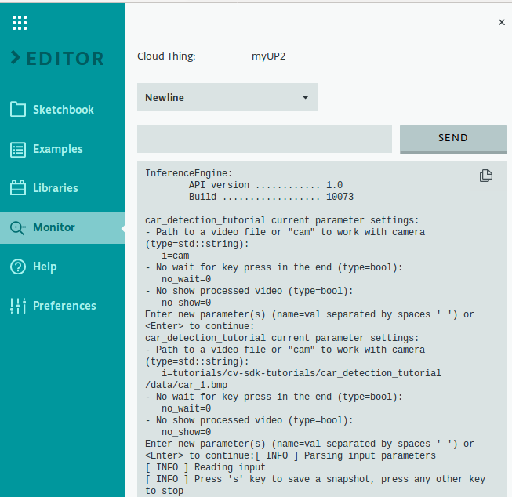

### Running

1. Now, it is time to run the application.  We will run it using each type of input (image file, video file, camera) so you will know what to expect.  We have included commands that will have the application load images or videos that come with the OpenVINO™ toolkit and this tutorial, but you can also use your own images and video.  If the application cannot find an image, or if you have not connected the USB camera to the UP Squared* board, it will print an error message and exit.  If that happens, check the path to the image or video file, to make sure it is correct and try again.

2. First, let us use the application to view a single image file.  We do this by setting the "i=\<video filename\>" parameter.  When prompted, enter the parameter string: 

```
i=tutorials/computer-vision-inference-dev-kit-tutorials/car_detection_tutorial/data/car_1.bmp
```


3. You should now see a new window with an image.  You should also see a "Press 's' key to save a snapshot, press any other key to exit" prompt in the console window.  The application will now wait for you to press a key with the image window active.

**Note**: Pressing a key in the monitor window will not do anything because the image window is detecting key presses.  Use Ctrl+C to exit.

4. Next, let us see how the application handles a video file.  When prompted, enter the parameter string: 

```
i=tutorials/computer-vision-inference-dev-kit-tutorials/car_detection_tutorial/data/cars_768x768.h264
```


5. You will now see a window appear and play the video.  After the video has finished playing, the window will continue to display the final frame of the video, waiting for you to press a key with the image window active.

6. Finally, we can use the application to view live video from the USB camera connected to the UP Squared* board.  The camera is the default source, so we do this by running the application without changing any parameters or we can still specify the camera using "cam" by when prompted, entering the parameter string:

```
i=cam
```


7. You will now see the output window appear displaying live input from the USB camera.  When you are ready to exit the application, make sure the output window is active and press a key.

# Conclusion

Now we have seen what it takes to create a basic application that uses OpenCV to read and display image data.  We have also seen how the application works with each type of image input it accepts including still images, video files, and live video from the USB camera.  We will be using the basic framework from this step of the tutorial as we move forward building up the application step-by-step.  Next, in Tutorial Step 2 we will be adding the ability to process images and actually detect cars.

# Navigation

[Car Detection Tutorial](../Readme.md)

[Car Detection Tutorial Step 2](../step_2/Readme.md)

