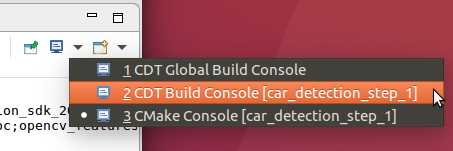
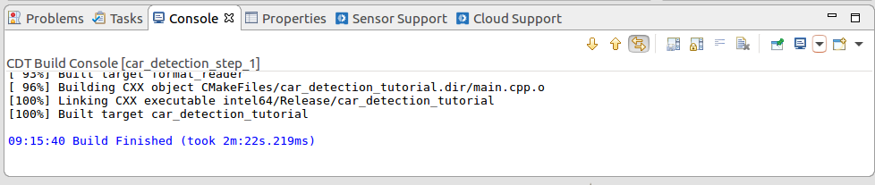
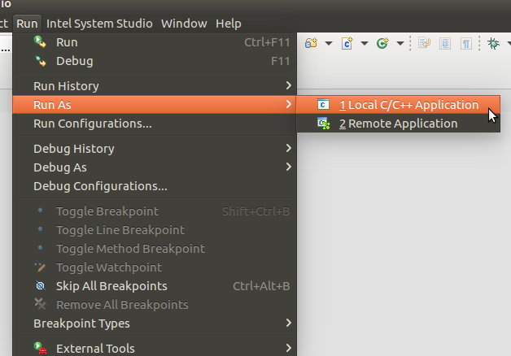
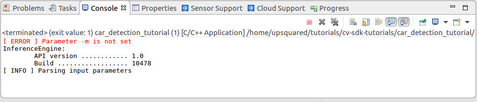
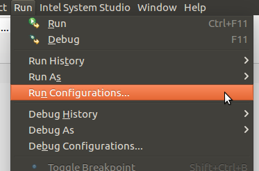
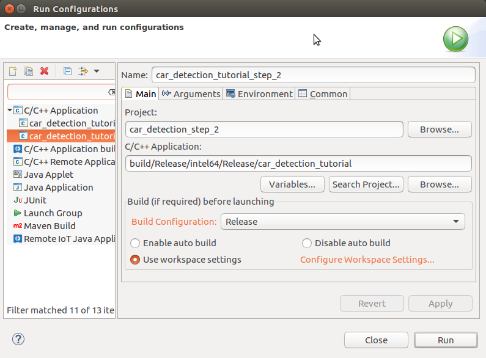
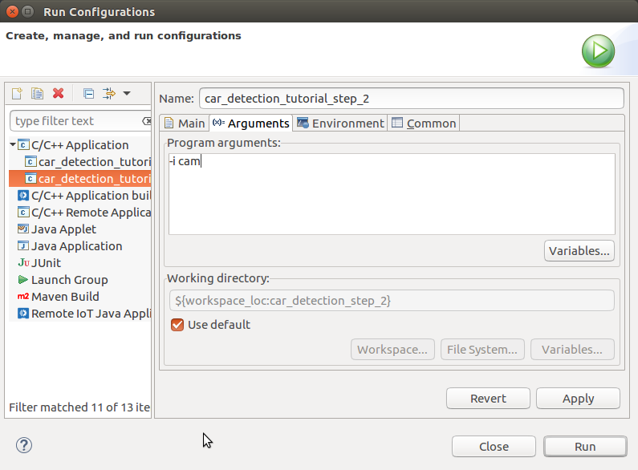
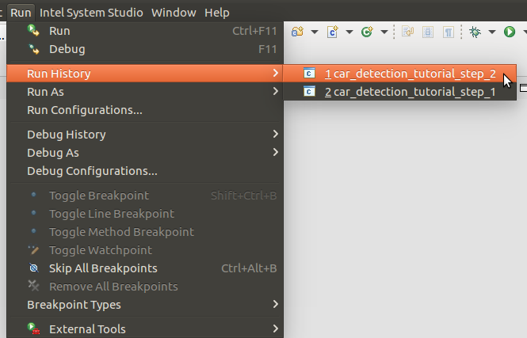

# Tutorial Step 2: Add the first model, Vehicle Detection


# Table of Contents

<p></p><div class="table-of-contents"><ul><li><a href="#tutorial-step-2-add-the-first-model-vehicle-detection">Tutorial Step 2: Add the first model, Vehicle Detection</a></li><li><a href="#table-of-contents">Table of Contents</a></li><li><a href="#introduction">Introduction</a></li><li><a href="#vehicle-detection-models">Vehicle Detection Models</a><ul><li><a href="#how-do-i-specify-which-device-the-model-will-run-on">How Do I Specify Which Device the Model Will Run On?</a><ul><li><a href="#verifying-which-device-is-running-the-model">Verifying Which Device is Running the Model</a></li></ul></li></ul></li><li><a href="#adding-the-vehicle-detection-model">Adding the Vehicle Detection Model</a><ul><li><a href="#helper-functions-and-classes">Helper Functions and Classes</a><ul><li><a href="#blob-conversion">Blob Conversion</a><ul><li><a href="#matu8toblob">matU8ToBlob</a></li><li><a href="#wrapmat2blob">wrapMat2Blob</a></li></ul></li><li><a href="#load">Load</a></li><li><a href="#basedetection-class">BaseDetection Class</a><ul><li><a href="#read">read()</a></li><li><a href="#submitrequest">submitRequest()</a></li><li><a href="#wait">wait()</a></li><li><a href="#enabled">enabled()</a></li><li><a href="#printperformanccount">printPerformancCount()</a></li></ul></li></ul></li><li><a href="#vehicledetection">VehicleDetection</a><ul><li><a href="#submitrequest">submitRequest()</a></li><li><a href="#enqueue">enqueue()</a></li><li><a href="#vehicledetection">VehicleDetection()</a></li><li><a href="#read">read()</a></li><li><a href="#fetchresults">fetchResults()</a></li></ul></li></ul></li><li><a href="#using-the-vehicledetection-class">Using the VehicleDetection Class</a><ul><li><a href="#header-files">Header Files</a></li><li><a href="#main">main()</a></li><li><a href="#main-loop">Main Loop</a><ul><li><a href="#pipeline-stage-0-prepare-and-infer-a-batch-of-frames">Pipeline Stage 0: Prepare and Infer a Batch of Frames</a></li><li><a href="#pipeline-stage-1-render-results">Pipeline Stage 1: Render Results</a></li></ul></li><li><a href="#post-main-loop">Post-Main Loop</a></li></ul></li><li><a href="#building-and-running">Building and Running</a><ul><li><a href="#command-line-using-make">Command Line using Make</a><ul><li><a href="#build">Build</a></li><li><a href="#run">Run</a></li></ul></li><li><a href="#intel-system-studio">Intel® System Studio</a><ul><li><a href="#build">Build</a><ul><li><a href="#start-intel-system-studio">Start Intel® System Studio</a></li><li><a href="#create-project">Create Project</a></li><li><a href="#configure-project">Configure Project</a></li><li><a href="#build-executable">Build Executable</a></li></ul></li><li><a href="#run">Run</a><ul><li><a href="#create-run-configuration">Create Run Configuration</a></li><li><a href="#how-to-set-command-line-arguments">How to Set Command Line Arguments</a></li><li><a href="#how-to-run-the-executable">How to Run the Executable</a></li><li><a href="#running">Running</a></li></ul></li></ul></li></ul></li><li><a href="#batch-size">Batch Size</a><ul><li><a href="#single-image">Single Image</a><ul><li><a href="#command-lines">Command Lines:</a></li><li><a href="#system-studio-run-configuration-arguments">System Studio Run Configuration Arguments:</a></li></ul></li><li><a href="#video">Video</a><ul><li><a href="#cpu">CPU</a></li><li><a href="#gpu">GPU</a></li></ul></li></ul></li><li><a href="#conclusion">Conclusion</a></li><li><a href="#navigation">Navigation</a></li></ul></div><p></p>

# Introduction

Welcome to the Car Detection Tutorial Step 2.  This is the step of the tutorial where the application starts making use of the OpenVINO™ toolkit to make inferences on image data and detect vehicles.  We get this ability by having the application use the Inference Engine to load and run the Intermediate Representation (IR) of a CNN model on the selected hardware device CPU, GPU, or Intel® Movidius™ Myriad™.  You may recall from the OpenVINO™ toolkit overview, an IR model is a compiled version of a CNN (e.g. from Caffe) that has been optimized using the Model Optimizer for use with the Inference Engine.  This is where we start to see the power of the OpenVINO™ toolkit to load and run models on several devices.  In this tutorial step, we will use the Inference Engine to run a pre-compiled model to do vehicle detection on the input image and then output the results.  

Below, you can see a sample output showing the results, where a Region of Interest (ROI) box appears around the detected vehicle.  The metrics reported include the time for OpenCV capture and display along with the time to run the vehicle detection model.


# Vehicle Detection Models

The OpenVINO™ toolkit provides a pre-compiled model that has been trained to detect vehicles.  You can find it at:

* /opt/intel/computer_vision_sdk/deployment_tools/intel_models/vehicle-detection-adas-0002

   * Available model locations are:

      * FP16: /opt/intel/computer_vision_sdk/deployment_tools/intel_models/vehicle-detection-adas-0002/FP16/vehicle-detection-adas-0002.xml

      * FP32: /opt/intel/computer_vision_sdk/deployment_tools/intel_models/vehicle-detection-adas-0002/FP32/vehicle-detection-adas-0002.xml

   * More details on the model can be found at:

      * file:///opt/intel/computer_vision_sdk/deployment_tools/intel_models/vehicle-detection-adas-0002/description/vehicle-detection-adas-0002.html

<table>
  <tr>
    <td>Model</td>
    <td>GFLOPS</td>
    <td>MParameters</td>
    <td>Average Precision</td>
  </tr>
  <tr>
    <td>vehicle-detection-adas-0002</td>
    <td>2.8</td>
    <td>1.1</td>
    <td>Vehicles: 90.6%</td>
  </tr>
</table>


Note that the model comes pre-compiled for FP16 and FP32.  So you will need to make sure you choose the correct precision for the device you want to run it on.

## How Do I Specify Which Device the Model Will Run On?

To make it easier to try different assignments, the application will use command line arguments 

to specify which device a model is to be run on.  The default device will be the CPU when not set.  Now we will do a brief walkthrough how this is done in the code, starting from the command line arguments to the Inference Engine API calls.  Here we are highlighting the specific code, so some code will be skipped over for now to be covered later in other walkthroughs.

To create the command line arguments, the previously mentioned gflags helper library is used to define the arguments for specifying both the vehicle detection model and the device to run it on.  

The code appears in "car_detection.hpp":

```cpp
/// @brief message for model argument
static const char vehicle_detection_model_message[] = "Required. Path to the Vehicle/License-Plate Detection model (.xml) file.";

/// \brief Define parameter for vehicle detection  model file <br>
/// It is a required parameter
DEFINE_string(m, "", vehicle_detection_model_message);
```


To create the command line argument: -m \<model-IR-xml-file\>, where \<model-IR-xml-file\> is the vehicle detection model’s .xml file

```cpp
/// @brief message for assigning vehicle detection inference to device
static const char target_device_message[] = "Specify the target device for Vehicle Detection (CPU, GPU, FPGA, MYRIAD, or HETERO). ";

/// \brief device the target device for vehicle detection infer on <br>
DEFINE_string(d, "CPU", target_device_message);
```


To create the argument: -d \<device\>, where \<device\> is set to "CPU", "GPU", or "MYRIAD" which we will see conveniently matches what will be passed to the Inference Engine later.

As a result of the macros used in the code above, the variables "FLAGS_m" and “FLAGS_d” have been created to hold the argument values.  Focusing primarily on how the “FLAGS_d” is used to tell the Inference Engine which device to use, we follow the code in “main()” of “main.cpp”:

1. First a map is declared to hold the plugins as they are loaded.  The mapping will allow the associated plugin InferencePlugin object to be found by name (e.g. "CPU")    

```cpp
     // ---------------------Load plugins for inference engine------------------------------------------------
        std::map<std::string, InferencePlugin> pluginsForDevices;
```


2. A vector is used to pair the device and model command line arguments to iterate through them:     

```cpp
   std::vector<std::pair<std::string, std::string>> cmdOptions = {
            {FLAGS_d, FLAGS_m}
        };
```


3. A loop iterates through device and model argument pairs:

```cpp
for (auto && option : cmdOptions) {
            auto deviceName = option.first;
            auto networkName = option.second;
```


4. A check is done to make sure the plugin has not already been created and put it into the pluginsForDevices map:            

```cpp
 if (pluginsForDevices.find(deviceName) != pluginsForDevices.end()) {
                continue;
            }
```


5. The plugin is created using the Inference Engine’s PluginDispatcher API for the given device’s name.  Here "deviceName" is the value for “FLAGS_d” which came directly from the command line argument “-d” which is set to “CPU”, “GPU”, or “MYRIAD”, the exact names the Inference Engine knows for devices.

```cpp
         slog::info << "Loading plugin " << deviceName << slog::endl;
            InferencePlugin plugin = PluginDispatcher({"../../../lib/intel64", ""}).getPluginByDevice(deviceName);
```


6. The plugin details are printed out:

```cpp 
           /** Printing plugin version **/
            printPluginVersion(plugin, std::cout);
```


7. The created plugin is stored to be found by device name later:

```cpp
            pluginsForDevices[deviceName] = plugin;
```


8. Finally the model is loaded passing in the plugin created for the specified device, again using the name given same as it appears on the command line (the "Load" class will be described later):

```cpp
       // --------------------Load networks (Generated xml/bin files)-------------------------------------------
        Load(VehicleDetection).into(pluginsForDevices[FLAGS_d], false);
```


### Verifying Which Device is Running the Model

The application will give output saying what Inference Engine plugins (devices) were loaded and which models were loaded to which plugins.

Here is a sample of the output in the console window:

Inference Engine reporting its version:

```bash
InferenceEngine:
    	API version ............ (N.N)
    	Build .................. (string)
[ INFO ] Parsing input parameters
[ INFO ] Reading input
```


The application reporting that it is loading the CPU plugin:

```bash
[ INFO ] Loading plugin CPU
```


Inference Engine reports that it has loaded the CPU plugin (MKLDNNPlugin) and its version:

```bash
	API version ............ (N.N)
	Build .................. (string)
	Description ....... MKLDNNPlugin
[ INFO ] Loading network files for VehicleDetection
[ INFO ] Batch size in IR is set to  1
[ INFO ] Checking Vehicle Detection inputs
[ INFO ] Checking Vehicle Detection outputs
```


The application reporting that it is loading the CPU plugin for the vehicle detection model:

```bash
[ INFO ] Loading Vehicle Detection model to the CPU plugin
[ INFO ] Start inference
[ INFO ] Press 's' key to save a snapshot, press any other key to stop
[ INFO ] Press 's' key to save a snapshot, press any other key to exit
```


In Tutorial Step 3, we will cover loading multiple models onto different devices.  We will also look at how the models perform on different devices.  Until then, we will let all the models load and run on the default CPU device.

# Adding the Vehicle Detection Model

From Tutorial Step 1, we have the base application that can read and display image data, now it is time process the images.  This step of the tutorial expands the capabilities of the application to use the Inference Engine and the vehicle attributes recognition model to process images.  To help accomplish this, first we are going to walkthrough the helper functions and classes.  The code may be found in the main.cpp file.

## Helper Functions and Classes

In the samples themselves and the common libraries they use are many useful helper functions and classes.  Below covers those used by the sample in this tutorial.

### Blob Conversion

There will need to be a function that takes the input image and turns it into a "blob".  Which begs the question “What is a blob?”.  In short, a blob, specifically the class InferenceEngine::Blob, is the data container type used by the Inference Engine for holding input and output data.  To get data into the model, the image data will need to be converted from the OpenCV cv::Mat to an InferenceEngine::Blob.  For doing that there are the two helper functions, “matU8ToBlob” (copies data) and “wrapMat2Blob” (does not copy data) which are both located in the file   “\opt\intel\computer_vision_sdk\inference_engine\samples\common\samples\common.hpp“.

#### matU8ToBlob

1. Variables are defined to store the dimensions for the images that the model is optimized to work with.  "blob_data" is assigned to the blob’s data buffer.

```cpp
/**
* @brief Sets image data stored in cv::Mat object to a given Blob object.
* @param orig_image - given cv::Mat object with an image data.
* @param blob - Blob object which to be filled by an image data.
* @param batchIndex - batch index of an image inside of the blob.
*/
template <typename T>
void matU8ToBlob(const cv::Mat& orig_image, InferenceEngine::Blob::Ptr& blob, int batchIndex = 0) {
    InferenceEngine::SizeVector blobSize = blob->getTensorDesc().getDims();
    const size_t width = blobSize[3];
    const size_t height = blobSize[2];
    const size_t channels = blobSize[1];
    T* blob_data = blob->buffer().as<T*>();
```


2. A check is made to see if the input image matches the dimensions of images that the model is expecting.  If the dimensions do not match, then use the OpenCV function cv::resize to resize it.  

```cpp
    cv::Mat resized_image(orig_image);
    if (width != orig_image.size().width || height!= orig_image.size().height) {
        cv::resize(orig_image, resized_image, cv::Size(width, height));
    }
```


3. Now that the image data is the proper size, the data is copied from the input image into the blob’s buffer.  A blob will hold the entire batch for a run through the inference model, so for each batch item first calculate "batchOffset" as an offset into the blob’s buffer before copying the data.

```cpp
    int batchOffset = batchIndex * width * height * channels;

    for (size_t c = 0; c < channels; c++) {
        for (size_t  h = 0; h < height; h++) {
            for (size_t w = 0; w < width; w++) {
                blob_data[batchOffset + c * width * height + h * width + w] = resized_image.at<cv::Vec3b>(h, w)[c];
            }
        }
    }
}
```


For more details on the InferenceEngine::Blob class, see "Understanding Inference Engine Memory primitives" in the documentation: [https://software.intel.com/en-us/articles/OpenVINO-InferEngine](https://software.intel.com/en-us/articles/OpenVINO-InferEngine)

#### wrapMat2Blob

1. Variables are defined to store the dimensions for the images that the model is optimized to work with.  

```/**
 * @brief Wraps data stored inside of a passed cv::Mat object by new Blob pointer.
 * @note: No memory allocation is happened. The blob just points to already existing
 *        cv::Mat data.
 * @param mat - given cv::Mat object with an image data.
 * @return resulting Blob pointer.
 */
static InferenceEngine::Blob::Ptr wrapMat2Blob(const cv::Mat &mat) {
    size_t channels = mat.channels();
    size_t height = mat.size().height;
    size_t width = mat.size().width;

    size_t strideH = mat.step.buf[0];
    size_t strideW = mat.step.buf[1];
```


2. A check is made to ensure the data buffer is compatible (dense/sequential) and an error is thrown if not.

```    bool is_dense =
            strideW == channels &&
            strideH == channels * width;

    if (!is_dense) THROW_IE_EXCEPTION
                << "Doesn't support conversion from not dense cv::Mat";
```


3. A blob descriptor for the data is created to specify the precision, depth, number of channels, height, width, and memory layout.

```    InferenceEngine::TensorDesc tDesc(InferenceEngine::Precision::U8,
                                      {1, channels, height, width},
                                      InferenceEngine::Layout::NHWC);
```


4. A shared blob is formed using the descriptor and original data buffer within the cv::Mat and then returned.

```    return InferenceEngine::make_shared_blob<uint8_t>(tDesc, mat.data);
}
```


For more details on the InferenceEngine::Blob class, see "Understanding Inference Engine Memory primitives" in the documentation: [https://software.intel.com/en-us/articles/OpenVINO-InferEngine](https://software.intel.com/en-us/articles/OpenVINO-InferEngine)

### Load

The helper class "Load" loads the model onto the device to be executed on.  

```cpp
struct Load {
    BaseDetection& detector;
    explicit Load(BaseDetection& detector) : detector(detector) { }

    void into(InferencePlugin & plg, bool enable_dynamic_batch = false) const {
        if (detector.enabled()) {
            std::map<std::string, std::string> config;
            // if specified, enable Dynamic Batching
            if (enable_dynamic_batch) {
                config[PluginConfigParams::KEY_DYN_BATCH_ENABLED] = PluginConfigParams::YES;
            }
            detector.net = plg.LoadNetwork(detector.read(), config);
            detector.plugin = &plg;
        }
    }
};
```


To help explain how this works, an example using "Load" will be used which looks like:

```cpp
Load(VehicleDetection).into(pluginsForDevices[FLAGS_d], false);
```


The line is read as "Load VehicleDetection into the plugin pluginsForDevices[FLAGS_d]" which is done as follows:

1. Load(VehicleDetection) is a constructor to initialize model object "detector" and returns a “Load” object

2. "into()" is called on the returned object passing in the mapped plugin from “pluginsForDevices”.  The map returns the plugin mapped to “FLAGS_d”, which is the command line argument “CPU”, “GPU”, or “MYRIAD”.  The function into() then first checks if the model object is enabled and if it is:

   1. If Dynamic Batching is to be enabled, sets the configuration option using "config[PluginConfigParams::KEY_DYN_BATCH_ENABLED] = PluginConfigParams::YES;".  If not, config is empty.

   2. Calls "plg.LoadNetwork(detector.read(),config)" to load the model returned by “detector.read()” (which we will see later is reading in the model’s IR file) into the plugin.  The resulting object is stored in the model object (detector.net) 

   3. Sets the model object’s plugin (detector.plugin) to the one used

### BaseDetection Class

Now we are going to walkthrough the BaseDetection class that is used to abstract common features and functionality when using a model which the code also refers to as "detector".  

1. The class is declared and its member variables, the constructor and destructor are defined.  The ExecutableNetwork holds the model that will be used to process the data and make inferences.  The InferencePlugin is the Inference Engine plugin that will be executing the Intermediate Reference on a specific device.  InferRequest is the object that will be used to hold input and output data, start inference, and wait for results.  The name of the model is stored in topoName and the command line argument for the model is stored in commandLineFlag.  Finally, maxBatch is used to set the number of inputs to infer during each run.

```cpp
struct BaseDetection {
    ExecutableNetwork net;
    InferenceEngine::InferencePlugin * plugin;
    InferRequest::Ptr request;
    std::string & commandLineFlag;
    std::string topoName;
    int maxBatch;

    BaseDetection(std::string &commandLineFlag, std::string topoName, int maxBatch)
        : commandLineFlag(commandLineFlag), topoName(topoName), maxBatch(maxBatch) {}

    virtual ~BaseDetection() {}
```


2. The operator -> is overridden for a convenient way to get access to the network.

```cpp
    ExecutableNetwork* operator ->() {
        return &net;
    }
```


#### read()

Since the networks used by the detectors will have different requirements for loading, declare the read() function to be pure virtual.  This ensures that each detector class will have a read function appropriate to the model it will be using.

```cpp
    virtual InferenceEngine::CNNNetwork read()  = 0;
```


#### submitRequest()

The submitRequest() function checks to see if the model is enabled and that there is a valid request to start.  If there is, it requests the model to start running the model asynchronously with startAsync() which returns immediately (we will show how to wait on the results next).

```cpp
    virtual void submitRequest() {
        if (!enabled() || request == nullptr) return;
        request->StartAsync();
    }
```


#### wait()

wait() will wait until results from the model are ready.  First it checks to see if the model is enabled and there is a valid request before actually waiting on the request.

```cpp
    virtual void wait() {
        if (!enabled()|| !request) return;
        request->Wait(IInferRequest::WaitMode::RESULT_READY);
    }
```


#### enabled()

Variables and the enabled() function are defined to track and check if the model is enabled or not.  The model is disabled if "commandLineFlag", the command line argument specifying the model IR .xml file (e.g. “-m”) , has not been set.

```cpp
    mutable bool enablingChecked = false;
    mutable bool _enabled = false;

    bool enabled() const  {
        if (!enablingChecked) {
            _enabled = !commandLineFlag.empty();
            if (!_enabled) {
                slog::info << topoName << " DISABLED" << slog::endl;
            }
            enablingChecked = true;
        }
        return _enabled;
    }
```


#### printPerformancCount()

The printPerformancCount() function checks to see if the detector is enabled, and if it is, then prints out the overall performance statistics for the model.

```cpp
    void printPerformanceCounts() {
        if (!enabled()) {
            return;
        }
        slog::info << "Performance counts for " << topoName << slog::endl << slog::endl;
        ::printPerformanceCounts(request->GetPerformanceCounts(), std::cout, false);
    }
```


## VehicleDetection 

Now that we have seen what the base class provides, we will now walkthrough the code for the derived VehicleDetection class to see how the vehicle detection model is implemented.

VehicleDetection is derived from the BaseDetection class and adding some new member variables that will be needed.

```cpp
struct VehicleDetection : BaseDetection {
    std::string input;
    std::string output;
    int maxProposalCount = 0;
    int objectSize = 0;
    int enquedFrames = 0;
    float width = 0;
    float height = 0;
    bool resultsFetched = false;
    using BaseDetection::operator=;

    struct Result {
       int batchIndex;
       int label;
       float confidence;
       cv::Rect location;

    };

    std::vector<Result> results;
```


Notice the "Result" struct and the vector “results” that will be used since the vehicle detection model can find more than one vehicle in an image.  Each Result will include a cvRect indicating the location and size of the vehicle in the input image.  The batchIndex variable is used to link the results with the associated batch item of the input image data.

### submitRequest()

The submitRequest() function is overridden to make sure there is input data ready and clear out any previous results before calling BaseDetection::submitRequest() to start inference.

```cpp
    void submitRequest() override {
        if (!enquedFrames) return;
        enquedFrames = 0;
        resultsFetched = false;
        results.clear();
        BaseDetection::submitRequest();
    }
```


### enqueue()

A check is made to see that the vehicle detection model is enabled.  Also a check is done to make sure that the number of inputs does not exceed the batch size. 

```cpp
    void enqueue(const cv::Mat &frame) {
        if (!enabled()) return;
        if (enquedFrames >= maxBatch) {
           slog::warn << "Number of frames more than maximum(" << maxBatch << ") processed by Vehicles detector" << slog::endl;
           return;
        }
```


An inference request object is created if one has not been already created.  The request object is used for holding input and output data, starting inference, and waiting for completion and results.

```cpp
        if (!request) {
            request = net.CreateInferRequestPtr();
        }
```


If FLAGS_auto_resize is true, the request’s input blob is set to a new blob created using wrapMat2Blob() which reuses the data buffer for the frame (no copy of data is done).  If false, a blob from the request is retrieved and then matU8ToBlob() is used to copy the image image data into the blob.

```cpp
        width = frame.cols;
        height = frame.rows;

	  InferenceEngine::Blob::Ptr inputBlob;
        if (FLAGS_auto_resize) {
            inputBlob = wrapMat2Blob(frame);
            request->SetBlob(input, inputBlob);
        } else {
			inputBlob = request->GetBlob(input);
			matU8ToBlob<uint8_t >(frame, inputBlob, enquedFrames);
    	  }
        enquedFrames++;
     }
```


### VehicleDetection()

On construction of a VehicleDetection object, the base class constructor is called passing in the model to load specified in the command line argument FLAGS_m, the name to be used when printing out informational messages, and set the batch size to FLAGS_n.  This initializes the BaseDetection subclass specifically for VehicleDetection class.

```cpp
    VehicleDetection() : BaseDetection(FLAGS_m, "Vehicle Detection", FLAGS_n) {}
```


### read()

The next function we will walkthrough is the VehicleDetection::read() function which must be specialized specifically to the model that VehicleDetection will load and run. 

1. Use the Inference Engine API InferenceEngine::CNNNetReader object to load the model IR files.  This comes from the XML file that is specified on the command line using the "-m" parameter.  

```cpp
    InferenceEngine::CNNNetwork read() override {
        slog::info << "Loading network files for VehicleDetection" << slog::endl;
        InferenceEngine::CNNNetReader netReader;
        /** Read network model **/
        netReader.ReadNetwork(FLAGS_m);
```


2. The maximum batch size is set to the value set using the "-n" parameter.

```cpp
        netReader.getNetwork().setBatchSize(maxBatch);
        slog::info << "Batch size is set to " << netReader.getNetwork().getBatchSize() << " for Vehicle Detection" << slog::endl;
```


3. Names for the model IR .bin file and optional .label file are generated based on the model name from the "-m" parameter.  

```cpp
        /** Extract model name and load it's weights **/
        std::string binFileName = fileNameNoExt(FLAGS_m) + ".bin";
        netReader.ReadWeights(binFileName);
```


4. The input data format is configured for the proper precision (U8 = 8-bit per BGR channel) for the model. 

```cpp
        slog::info << "Checking Vehicle Detection inputs" << slog::endl;
        InferenceEngine::InputsDataMap inputInfo(netReader.getNetwork().getInputsInfo());
        if (inputInfo.size() != 1) {
            throw std::logic_error("Vehicle Detection network should have only one input");
        }
        auto& inputInfoFirst = inputInfo.begin()->second;
        inputInfoFirst->setInputPrecision(Precision::U8);
```


5. If FLAGS_auto_resize is true, the input is set to be automatically resized by setting the resizing algorithm to use using setResizeAlgorithm(RESIZE_BILINEAR).  The input data format is configured for the proper memory layout, NHWC when automatically resizing and NCHW when data will be copied using OpenCV.  

```Cpp
		if (FLAGS_auto_resize) {
	        // set resizing algorithm
       inputInfoFirst->getPreProcess().setResizeAlgorithm(RESIZE_BILINEAR);
			inputInfoFirst->getInputData()->setLayout(Layout::NHWC);
		} else {
			inputInfoFirst->getInputData()->setLayout(Layout::NCHW);
		}
```


6. A check to make sure that there is only one output result defined for the expected model being used. 

```cpp
        slog::info << "Checking Vehicle Detection outputs" << slog::endl;
        InferenceEngine::OutputsDataMap outputInfo(netReader.getNetwork().getOutputsInfo());
        if (outputInfo.size() != 1) {
            throw std::logic_error("Vehicle Detection network should have only one output");
        }
```


7. A check to make sure that the output the model will return matches as expected.

```cpp
        auto& _output = outputInfo.begin()->second;
        const InferenceEngine::SizeVector outputDims = _output->dims;
        output = outputInfo.begin()->first;
        maxProposalCount = outputDims[1];
        objectSize = outputDims[0];
        if (objectSize != 7) {
            throw std::logic_error("Output should have 7 as a last dimension");
        }
        if (outputDims.size() != 4) {
            throw std::logic_error("Incorrect output dimensions for SSD");
        }
```


8. The output format is configured to use the output precision and memory layout that is expect for results from the model being used.

```cpp
        _output->setPrecision(Precision::FP32);
        _output->setLayout(Layout::NCHW);
```


9. The name of the input blob (inputInfo.begin()->first) is saved for later use when getting a blob for input data.  Finally, the InferenceEngine::CNNNetwork object that references this model is returned.

```cpp
        slog::info << "Loading Vehicle Detection model to the "<< FLAGS_d << " plugin" << slog::endl;
        input = inputInfo.begin()->first;
        return netReader.getNetwork();
    }
```


### fetchResults()

fetchResults() will parse the inference results saving them in the "Results" variable.

1. A check to make sure that the model is enabled.  If so, clear out any previous results. 

```cpp
    void fetchResults() {
        if (!enabled()) return;
        results.clear();
```


2. Whether results have been fetched are tracked to only fetch once.  submitRequest() resets resultsFetched=false to indicate results have not been fetched yet for each request.

```cpp
        if (resultsFetched) return;
        resultsFetched = true;
```


3. "detections" is set to point to the inference model output results held in the output blob. 

```cpp
        const float *detections = request->GetBlob(output)->buffer().as<float *>();
```


4. A loop is started to iterate through the results from the vehicle detection model.  "maxProposalCount" has been set to the maximum number of results that the model can return.  

```cpp
        for (int i = 0; i < maxProposalCount; i++) {
```


5. The loop to retrieve all the results from the output blob buffer.  The output format is determined by the model.  For the vehicle detection model used, the following fields are expected:

   1. Image_id (index into input batch)

   2. Label

   3. Confidence 

   4. X coordinate of ROI

   5. Y coordinate of ROI

   6. Width of ROI

   7. Height of ROI

```cpp
      for (int i = 0; i < maxProposalCount; i++) {
         int proposalOffset = i * objectSize;
         float image_id = detections[proposalOffset + 0];
         Result r;
         r.batchIndex = image_id;
         r.label = static_cast<int>(detections[proposalOffset + 1]);
         r.confidence = detections[proposalOffset + 2];
         if (r.confidence <= FLAGS_t) {
            continue;
         }
         r.location.x = detections[proposalOffset + 3] * width;
         r.location.y = detections[proposalOffset + 4] * height;
         r.location.width = detections[proposalOffset + 5] * width - r.location.x;
         r.location.height = detections[proposalOffset + 6] * height - r.location.y;

```


6. If the returned image_id is not valid, no more valid outputs are expected so exit the loop.

```cpp
         if ((image_id < 0) || (image_id >= maxBatch)) {  // indicates end of detections
            break;
         }

```


7. A check to see if the application was requested to display the raw information (-r) and print it to the console if necessary.

```cpp
         if (FLAGS_r) {
            std::cout << "[" << i << "," << r.label << "] element, prob = " << r.confidence <<
                      "    (" << r.location.x << "," << r.location.y << ")-(" << r.location.width << ","
                      << r.location.height << ")"
                      << ((r.confidence > FLAGS_t) ? " WILL BE RENDERED!" : "") << std::endl;
         }
```


8. The populated Result object is added to the vector of results to be used later by the application.

```cpp
            results.push_back(r);
        }
    }
```


See the Inference Engine Development Guide [https://software.intel.com/inference-engine-devguide](https://software.intel.com/inference-engine-devguide) for more information on the steps when using a model with the Inference Engine API.

# Using the VehicleDetection Class

We have now seen what happens behind the scenes in the VehicleDetection class, we will move into the application code and see how it is used.

1. Open up a terminal (such as xterm) or use an existing terminal to get to a command shell prompt.

2. Change to the directory containing Tutorial Step 2:

```bash
cd tutorials/computer-vision-inference-dev-kit-tutorials/car_detection_tutorial/step_2
```


3. Open the files "main.cpp" and “car_detection.hpp” in the editor of your choice such as ‘gedit’, ‘gvim’, or ‘vim’.

## Header Files

1. The first header file to include is necessary to access the Inference Engine API.

```cpp
#include <inference_engine.hpp>
```


2. There are three more headers that needed for using the vehicle detection model and the data it gives.

```cpp
#include "car_detection.hpp"
#include "mkldnn/mkldnn_extension_ptr.hpp"
#include <ext_list.hpp>
using namespace InferenceEngine;
```


## main()

1. In the main() function, there are a map and vector that help make it easier to reference plugins for the Inference Engine. The map stores created plugins to be indexed by the device name of the plugin.  The vector pairs the input models with their corresponding devices using the command line arguments specifying model and device (this was also covered previously while explaining the path from command line to passing which device to use through the Inference Engine API).  Here also instantiates the VehicleDetection object of type VehicleDetection.

```cpp
std::map<std::string, InferencePlugin> pluginsForDevices;
std::vector<std::pair<std::string, std::string>> cmdOptions = {
   {FLAGS_d, FLAGS_m}
};

VehicleDetection VehicleDetection;
```


2. A loop is used to iterate through the device/model pairs and a check is made to see if a plugin for the device already exists.  if not, create the appropriate plugin.  

```cpp
for (auto && option : cmdOptions) {
   auto deviceName = option.first;
   auto networkName = option.second;
   if (deviceName == "" || networkName == "") {
      continue;
   }
   if (pluginsForDevices.find(deviceName) != pluginsForDevices.end()) {
      continue;
   }
```


3. The plugin for the given deviceName is loaded and then its version is reported.

```cpp
   slog::info << "Loading plugin " << deviceName << slog::endl;
   InferencePlugin plugin = PluginDispatcher({"../../../lib/intel64", ""}).getPluginByDevice(deviceName);
   /** Printing plugin version **/
   printPluginVersion(plugin, std::cout);
```


4. If loading the CPU plugin, then load the available CPU extensions library.  Also check is made to see if the -l or -c arguments have specified an additional library to load.

```cpp
   /** Load extensions for the CPU plugin **/
   if ((deviceName.find("CPU") != std::string::npos)) {
      plugin.AddExtension(std::make_shared<Extensions::Cpu::CpuExtensions>());

      if (!FLAGS_l.empty()) {
         // CPU(MKLDNN) extensions are loaded as a shared library and passed as a pointer to base extension
         auto extension_ptr = make_so_pointer<InferenceEngine::MKLDNNPlugin::IMKLDNNExtension>(FLAGS_l);
          plugin.AddExtension(std::static_pointer_cast<IExtension>(extension_ptr));
      }
   } else if (!FLAGS_c.empty()) {
      // Load Extensions for other plugins not CPU
      plugin.SetConfig({ { PluginConfigParams::KEY_CONFIG_FILE, FLAGS_c } });
   }
```


5. The created plugin is stored into the map pluginsForDevices to be used later when loading the model.

```cpp
   pluginsForDevices[deviceName] = plugin;
}
```


6. The model is loaded into the Inference Engine and associated with the device using the Load helper class previously covered.

```cpp
Load(VehicleDetection).into(pluginsForDevices[FLAGS_d], false);
```


7. Enough storage is created for input image frames that can hold all of the frames in a batch.

```cpp
const int maxNumInputFrames = VehicleDetection.maxBatch + 1;  // +1 to avoid overwrite
cv::Mat inputFrames[maxNumInputFrames];
std::queue<cv::Mat*> inputFramePtrs;
for(int fi = 0; fi < maxNumInputFrames; fi++) {
   inputFramePtrs.push(&inputFrames[fi]);
}
```


8. Variables are created that will be used to calculate and report the performance of the application as it processes each image and displays the results.  Variables are also created to track the number of frames being processed.

```cpp
typedef std::chrono::duration<double, std::ratio<1, 1000>> ms;
auto wallclock = std::chrono::high_resolution_clock::now();

bool firstFrame = true;
bool haveMoreFrames = true;
bool done = false;
int numFrames = 0;
int totalFrames = 0;
double ocv_decode_time = 0, ocv_render_time = 0;
cv::Mat* lastOutputFrame;
```


9. A structure is declared to hold a frame and associated data that will be used to pass data from one pipeline stage to another.  The FIFO between stages is also created.

```cpp
typedef struct {
   std::vector<cv::Mat*> batchOfInputFrames;
   cv::Mat* outputFrame;
   std::vector<cv::Rect> vehicleLocations;
   std::vector<cv::Rect> licensePlateLocations;
} FramePipelineFifoItem;
typedef std::queue<FramePipelineFifoItem> FramePipelineFifo;
// Queues to pass information across pipeline stages
FramePipelineFifo pipeS0toS1Fifo;
```


## Main Loop

The main loop in main() is where all the work is done.  The loop has been organized into pipeline stages to perform the different tasks and uses FIFOs to pass data.  There are two stages to the pipeline.  The first stage reads the input frames in batches, infers vehicles, then passes the results to the second stage.  The second stage then takes the results for each frame and renders the results that are displayed.

Begin main loop:

```cpp
   do {
      ms detection_time;
      std::chrono::high_resolution_clock::time_point t0,t1;
```


### Pipeline Stage 0: Prepare and Infer a Batch of Frames

Stage 0 reads in frames, prepares and runs inference, then processes the results to pass to the next stage.

1. A check is made to see if there are more frames to read, if so enter Stage 0.  Else there is nothing to do, so skip Stage 0.

```cpp
      if (haveMoreFrames) {
```


2. A loop is started for gathering input images.

```cpp
         FramePipelineFifoItem psos1i;
         for(numFrames = 0; numFrames < VehicleDetection.maxBatch; numFrames++) {
```


3. An input frame buffer is retrieved and a new image is read into it (curFrame).   If there are no more frames to read, then exit the loop.

```cpp
            cv::Mat* curFrame = inputFramePtrs.front();
            inputFramePtrs.pop();
            haveMoreFrames = cap.read(*curFrame);
            if (!haveMoreFrames) {
               break;
            }
```


4. The total number of frames is tracked and enqueue the new frame for inference.

```cpp
            totalFrames++;

            // should have first frame from above cap.read()
            t0 = std::chrono::high_resolution_clock::now();
            VehicleDetection.enqueue(frame[numFrames]);
            t1 = std::chrono::high_resolution_clock::now();
            ocv_decode_time += std::chrono::duration_cast<ms>(t1 - t0).count();
```


5. The frame is stored for reference by the next pipeline stage.  If this is the first frame, print an informational note to the command window and set firstFrame to print message only once.

```cpp
            ps0s1i.batchOfInputFrames.push_back(curFrame);

            if (firstFrame && !FLAGS_no_show) {
               slog::info << "Press 's' key to save a snapshot, press any other key to stop" << slog::endl;
            }

            firstFrame = false;
         }
```


6. If there are images in the batch, continue to infer and wait for results.  

```cpp
         std::vector<FramePipelineFifoItem> batchedFifoItems;
            if (numFrames > 0) {
```


7. The inference request is submitted to the vehicle detection model and then wait for the results.  When the results are ready, fetch the results for processing.

```cpp
               t0 = std::chrono::high_resolution_clock::now();
               // start inference
               VehicleDetection.submitRequest();

               // wait for results
               VehicleDetection.wait();
               t1 = std::chrono::high_resolution_clock::now();
               detection_time = std::chrono::duration_cast<ms>(t1 - t0);

               // parse inference results internally (e.g. apply a threshold, etc)
               VehicleDetection.fetchResults();
```


8. Each input frame in the batch will continue on as individual frames to the next stages of the pipeline.  Here create a new FramePipelineFifoItem for each input frame.

```cpp
               for (auto && bFrame : ps0s1i.batchOfInputFrames) {
                  FramePipelineFifoItem ps1s2i;
                  ps1s2i.outputFrame = bFrame;
                  batchedFifoItems.push_back(ps1s2i);
               }
```


9. The loops iterates through the results and stores the vehicle results with the associated frame.  The results indicate which input frame from the batch it belongs to using batchIndex.

```cpp
               for (auto && result : VehicleDetection.results) {
                  FramePipelineFifoItem& ps1s2i = batchedFifoItems[result.batchIndex];
                  if (result.label == 1) {  // vehicle
                     ps1s2i.vehicleLocations.push_back(result.location);
                  } else { // license plate
                     ps1s2i.licensePlateLocations.push_back(result.location);
                  }
               }
            }
```


10. The current results have been processed, clear "results". 

```cpp
            VehicleDetection.results.clear();
```


11. For each input frame from the batch, pass the frame along with its results to the next stage of the pipeline.

```cpp
            for (auto && item : batchedFifoItems) {
               item.batchOfInputFrames.clear(); // done with batch storage
               pipeS0toS1Fifo.push(item);
            }
         }
```


### Pipeline Stage 1: Render Results

Stage 1 takes the inference results gathered in the previous stage and renders them for display.  

1. While there are items in the input FIFO, the first item is retrieved and removed from the input FIFO.

```cpp
         while (!pipeS0toS1Fifo.empty()) {
            FramePipelineFifoItem ps0s1i = pipeS0toS1Fifo.front();
            pipeS0toS1Fifo.pop();
```


2. outputFrame is set to the frame being processed and frame rectangles are drawn for all the vehicles and license plates (if model detects licenses plates too) that were detected during inference.

```cpp
            cv::Mat& outputFrame = *(ps0s1i.outputFrame);

            // draw box around vehicles and license plates
            for (auto && loc : ps0s1i.vehicleLocations) {
               cv::rectangle(outputFrame, loc, cv::Scalar(0, 255, 0), 2);
            }
            // draw box around license plates
            for (auto && loc : ps0s1i.licensePlateLocations) {
               cv::rectangle(outputFrame, loc, cv::Scalar(0, 0, 255), 2);
            }
```


3. If there is only one image in the output batch, then report the results for that image.  If there are multiple images, then report the average time for the images in the batch.

```cpp
            std::ostringstream out;
            if (VehicleDetection.maxBatch > 1) {
               out << "OpenCV cap/render (avg) time: " << std::fixed << std::setprecision(2)
                   << (ocv_decode_time / numFrames + ocv_render_time / totalFrames) << " ms";
            } else {
               out << "OpenCV cap/render time: " << std::fixed << std::setprecision(2)
                   << (ocv_decode_time + ocv_render_time) << " ms";
               ocv_render_time = 0;
            }
            ocv_decode_time = 0;
            cv::putText(outputFrame, out.str(), cv::Point2f(0, 25), cv::FONT_HERSHEY_TRIPLEX, 0.5, cv::Scalar(255, 0, 0));
```


4. Vehicle detection time metrics are added to the image.

```cpp
            out.str("");
            out << "Vehicle detection time ";
            if (VehicleDetection.maxBatch > 1) {
               out << "(batch size = " << VehicleDetection.maxBatch << ") ";
            }
            out << ": " << std::fixed << std::setprecision(2) << detection_time.count()
                << " ms ("
                << 1000.f * numFrames / detection_time.count() << " fps)";
            cv::putText(outputFrame, out.str(), cv::Point2f(0, 45), cv::FONT_HERSHEY_TRIPLEX, 0.5,
                        cv::Scalar(255, 0, 0));
```


5. The final rendered image is shown with annotations and metrics.

```cpp
            t0 = std::chrono::high_resolution_clock::now();
            if (!FLAGS_no_show) {
               cv::imshow("Detection results", outputFrame);
               lastOutputFrame = &outputFrame;
            }
            t1 = std::chrono::high_resolution_clock::now();
            ocv_render_time += std::chrono::duration_cast<ms>(t1 - t0).count();
```


6. The frame buffer is returned so it can be reused for another input frame.

```cpp
            inputFramePtrs.push(ps0s1i.outputFrame);
```


7. The last things done in the "do while" loop are the tests to see if a key has been pressed to exit or save a screenshot.  This code was covered in Tutorial Step 1 and not covered  again here.

## Post-Main Loop

1. After the main loop, calculate the performance statistics for the application and log them.  The time reported is for the main loop and average time across the total number of frames processed.

```cpp
      auto wallclockEnd = std::chrono::high_resolution_clock::now();
      ms total_wallclock_time = std::chrono::duration_cast<ms>(wallclockEnd - wallclockStart);

        // report loop time
		slog::info << "     Total main-loop time:" << std::fixed << std::setprecision(2)
				<< total_wallclock_time.count() << " ms " <<  slog::endl;
		slog::info << "           Total # frames:" << totalFrames <<  slog::endl;
		float avgTimePerFrameMs = total_wallclock_time.count() / (float)totalFrames;
		slog::info << "   Average time per frame:" << std::fixed << std::setprecision(2)
					<< avgTimePerFrameMs << " ms "
					<< "(" << 1000.0f / avgTimePerFrameMs << " fps)" << slog::endl;
```


2. If the the command line parameter "-pc" was specified, then print out the performance counts.

```cpp
      if (FLAGS_pc) {
         VehicleDetection.printPerformanceCounts();
      }
```


# Building and Running

Now that we have looked at the code and understand how the program works, let us compile and run to see it in action.  To do that, two ways are covered in the following sections: 1) Command line using "make" and 2) using Intel® System Studio (ISS).  Both ways do the same things, so choose according to your preference.

## Command Line using Make

The following covers how to build and run from the command line using "make".

### Build

1. Open up a terminal (such as xterm) or use an existing terminal to get to a command shell prompt.

2. Change to the directory containing Tutorial Step 2:

```bash
cd tutorials/computer-vision-inference-dev-kit-tutorials/car_detection_tutorial/step_2
```


3. The first step is to configure the build environment for the OpenVINO™ toolkit by sourcing the "setupvars.sh" script.

```bash
source  /opt/intel/computer_vision_sdk/bin/setupvars.sh
```


4. Now we need to create a directory to build the tutorial in and change to it.

```bash
mkdir build
cd build
```


5. The last thing we need to do before compiling is to configure the build settings and build the executable.  We do this by running CMake to set the build target and file locations.  Then we run Make to build the executable.

```bash
cmake -DCMAKE_BUILD_TYPE=Release ../
make
```


### Run

1. You now have the executable file to run ./intel64/Release/car_detection_tutorial.  In order to have it run the vehicle detection model, we need to add arguments to the command line:

   1. "-i \<input-image-or-video-file\>" to specify an input image or video file instead of using the USB camera by default

   2. "-m \<model-xml-file\>"  to specify where to find the module.  For example: -m  /opt/intel/computer_vision_sdk/deployment_tools/intel_models/vehicle-detection-adas-0002/FP32/vehicle-detection-adas-0002.xml”

   3. That is a lot to type and keep straight, so to help make the model names shorter to type  and easier to read, let us use the helper script scripts/setupenv.sh that sets up shell variables we can use.  For reference, here are the contents of scripts/setupenv.sh:

   ```bash
   # Create variables for all models used by the tutorials to make
   #  it easier to reference them with short names
   
   # check for variable set by setupvars.sh in the SDK, need it to find models
   : ${InferenceEngine_DIR:?Must source the setupvars.sh in the SDK to set InferenceEngine_DIR}
   
   modelDir=$InferenceEngine_DIR/../../intel_models
   
   # Vehicle and License Plates Detection Model
   modName=vehicle-license-plate-detection-barrier-0106
   export mVLP16=$modelDir/$modName/FP16/$modName.xml
   export mVLP32=$modelDir/$modName/FP32/$modName.xml
   
   # Vehicle-only Detection Model used with the batch size exercise
   modName=vehicle-detection-adas-0002
   export mVDR16=$modelDir/$modName/FP16/$modName.xml
   export mVDR32=$modelDir/$modName/FP32/$modName.xml
   
   # Vehicle Attributes Detection Model
   modName=vehicle-attributes-recognition-barrier-0039
   export mVA16=$modelDir/$modName/FP16/$modName.xml
   export mVA32=$modelDir/$modName/FP32/$modName.xml
   ```


   4. To use the script we source it using the command: 

   ```bash
   source ../../scripts/setupenv.sh 
   ```


2. We will be using images and video files that are included with this tutorial.  Once you have seen the application working, feel free to try it on your own images and videos.

3. Let us first run it on a single image, to see how it works.

```bash
./intel64/Release/car_detection_tutorial -m $mVDR32 -i ../../data/car_1.bmp
```


4. You will now see an output window open up with the image displayed.  Over the image, you will see some text with the statistics of how long it took to perform the OpenCV input and output and model processing time.  You will also see a green rectangle drawn around the cars in the image, including the partial van on the right edge of the image.

5. Let us see how the application handles a video file.

```bash
./intel64/Release/car_detection_tutorial -m $mVDR32 -i ../../data/cars_768x768.h264
```


6. Now, you should see a window open, playing the video.  Over each frame of the video, you will see green rectangles drawn around the cars as they move through the parking lot.

7. Finally, let us see how the application works with the default camera input.

```bash
./intel64/Release/car_detection_tutorial -m $mVDR32 -i cam
```


Or

```bash
./intel64/Release/car_detection_tutorial -m $mVDR32
```


8. Now you will see a window displaying the input from the USB camera.  If the vehicle detection model sees anything it detects as any type of vehicle (car, van, etc.), it will draw a green rectangle around it.  Red rectangles will be drawn around anything that is detected as a license plate (if model detects license plates too).  Unless you have a car in your office, or a parking lot outside a nearby window, the display may not be very exciting.

9. When you want to exit the program, make sure the output window is active and press a key.  The output window will close and control will return to the terminal window.

## Intel® System Studio

The following covers how to build and run from within Intel® System Studio (ISS).

### Build

#### Start Intel® System Studio

1. We need to start ISS using the desktop icon or the supplied scripts that will setup environment variables and launch the ISS Eclipse IDE.

   1. Desktop icon: Locate and double-click the icon shown below on the desktop.


   2. Command line: Configure the build environment when using the OpenVINO™ toolkit by sourcing the "setupvars.sh" script.  Be sure to source the helper script “scripts/setupenv.sh” which defines environment variables that point to inference models used so that short names may be used instead of long paths.  Then finally start ISS using the supplied script that will setup environment variables and launch the ISS Eclipse IDE.

```bash
source /opt/intel/computer_vision_sdk/bin/setupvars.sh
# assumes shell is in step_* directory
source ../scripts/setupenv.sh
/opt/intel/system_studio_2018/iss_ide_eclipse-launcher.sh
```


2. At first, the ISS splash window will appear that looks like:


3. The splash window will automatically disappear and be replaced with the workspace selection window.  We will use the default workspace "/home/upsquared/system_studio/workspace", so click the “OK” button to continue.


4. The first time ISS is opened, the ISS IDE will show the "Getting Started" tab as shown.  We will not be using it so if it is present, close the tab using the “X” on the tab that is just to the right of “Getting Started”.


5. With the "Getting Started” tab now closed, the ISS IDE will default in the Intel® C/C++ perspective which appears similar to below:

   1. **Note**: The perspective may be different if ISS has been started before and changes were made.  A different perspective may be open, such as the standard C/C++ perspective, or if the windows have been moved.


#### Create Project

1. Before building the executable, a project must be created.  Start by opening File->New->Project...


2. Expand "C/C++", select “C++ Project”, and then click the Next button.

   1. **Note**: If the "C/C++" wizard is not available, you will need to unhide it by going to Window->Preferences,”Intel System Studio”, unchecking the option “Hide unsupported wizards”, and then click the OK button.


3. The "C++ Project" window will appear.  Set the following items:

   1. Set "Project name" to: car_detection_step_2

   2. Uncheck the "Use default location" box, then click the Browse… button.  Using the file open dialog, browse to the tutorial “step_2” directory and then click the OK button.

   3. Make sure under "Project type", the Executable->”Empty Project” is selected

   4. Under "Toolchain", select “Linux GCC”

   5. When complete the window should look similar to below.  Click the Finish button to continue.


4. You may see a "Open Associated Perspective?" window prompting to open the C/C++ perspective.  If so click the Yes button.


5. You now should be in the C/C++ perspective with the tutorial added as a project similar to below.


6. Note that the "Project Explorer" window shows the new project “car_detection_step_2”.


#### Configure Project

1. To build the project, it must be configured to use the CMake files present.  Start by selecting the project in the "Project Explorer" window and then from the menu select Project->Properties.


2. The "Properties for …" window will appear.   First, expand “C/C++ Build” and select “Tool Chain Editor”.  Then in the “Current builder” drop-down list, select the “CMake Builder (portable)”.  Then click the Apply button.


3. Now change "Configuration" to “Release”, then again set “Current builder” to “CMake Builder (portable)”.  Then click the OK button.


4. At this point, if you open the source file main.cpp you will see include files not found and syntax errors listed in the "Problems" window.  These errors are not really errors and compiling the executable will succeed.  The false errors appear because the CMake builder does not automatically import include paths for the IDE’s code analysis (also referred to as the “Indexer”) from the CMake files.  To fix the false errors reported by the indexer, you must set some include paths and define a macro.  Start by again selecting the project in the “Project Explorer” window and then from the menu select Project->Properties.  Expand “C/C++ General” and then select “Paths and Symbols”.  With Configuration set to  “[All configurations]”, the path and symbol settings need to be set as follows:

   1. On the Include tab for Language "GNU C++", the list of “Include directories” needs to have:

      1. /opt/intel/computer_vision_sdk/deployment_tools/inference_engine/include

      2. /opt/intel/computer_vision_sdk/deployment_tools/inference_engine/samples/common

      3. /opt/intel/computer_vision_sdk/deployment_tools/inference_engine/samples/extension

      4. /opt/intel/computer_vision_sdk/opencv/include

      5. /opt/intel/computer_vision_sdk/deployment_tools/inference_engine/samples/common/samples

   2. On the Symbol tab for Language "GNU C++":

      1. Symbol "__cplusplus" set to value “201103”

   3. Instead of manually making all theses changes, a settings file that can be imported for all the above is included with the tutorial files under "system_studio/exported_paths_and_symbols.xml".  The following steps will use the settings file instead of entering manually.	

5. Starting from Project->Properties, "C/C++ General"->“Paths and Symbols”, import the paths and symbols needed by the indexer by clicking the “Import Settings…” button.  The “Import” window will appear.  Select the “Settings file” by clicking on the “Browse…” button then browsing to the XML file supplied with the tutorial to select the file “system_studio/exported_paths_and_symbols.xml”.   By default, “Select Configuration” should have “Debug” selected.  The window should appear similar to below.  Click the Finish button to complete (this will close the project properties window too).


6. Starting again from Project->Properties, "C/C++ General"->“Paths and Symbols”, import the paths and symbols needed by the indexer by clicking the “Import Settings…” button.  The “Import” window will appear.  Select the “Settings file” by clicking on the “Browse…” button then browsing to the XML file supplied with the tutorial to select the file “system_studio/exported_paths_and_symbols.xml”.  This time under “Select Configuration”, select “Release”.  The window should appear similar to below.  Click the Finish button to complete.


7. Going back to Project->Properties, "C/C++ General"->“Paths and Symbols” should appear similar to below for the Includes and Symbols tabs.

   1. **Note**: After these settings are made, to remove the false errors you may need to re-index the project by selecting from the menu Project->"C/C++ Index”->Rebuild


#### Build Executable

1. Now that the project is configured, we will build the executable.  We will be using the Release configuration build which is set by Project->"Build Configurations”->”Set Active” and selecting "Release”.


2. Build the executable using Project->"Build Project”.


3. The "Build Project" window will appear.  The first build will take a minute to complete because it is building all the sample libraries needed.  Click the “Run in Background” button to close the window and letting the build continue as we look at the consoles.


4. In the Console window you may see the output of CMake similar to below.  


5. To see the output of the compiler, we need to change to the build console.  To do so, click on the down-arrow to the right of the terminal icon, then select "CDT Build Console [...]".



6. When the build completes successfully, the Console will appear similar to below.



7. Now that the executable is built, we can move on to running it.

### Run

#### Create Run Configuration

1. Before running the executable from within ISS, a run configuration must be created.  The quickest way to setup a new one is to just run the project and then edit the details.  To start this, from the Run menu, select "Run As" then “Local C/C++ Application”.



2. You may see a "C Local Application" window appear similar to below prompting to choose which binary to run.  If so, choose “car_detection_tutorial” and click the OK button.  **Note**: The other binaries listed are side effects from CMake and may be ignored.


3. The project’s executable will be started with the output appearing in the Console window.  At this point no command line arguments are given to the executable which will run (or exit) accordingly.  The models need to be specified so you should see an error and exit similar to below.



4. Since the default name used is the name of the executable, it is a good idea to have the run configuration’s name match the project to make it easier to distinguish it from multiple projects.  Begin by editing the run configuration’s name by first opening the run configuration up starting from the Run menu, selecting "Run Configurations…".



5. Under "C/C++ Application", select the correct project’s run configuration which will appear in the the Project setting.  Now edit the Name at the top changing to closer match the project name, here setting it to “car_detection_tutorial_step_2” as shown below.



#### How to Set Command Line Arguments

1. The run configuration just created does not have any command line arguments being passed to it.  To add arguments when running the executable, you must edit the run configuration starting from the Run menu, selecting "Run Configurations…".  Depending upon how many configurations are present, you may need to select the one for the current project.  Initially the Main tab is selected which shows the main project settings similar to below.


2. To set command line arguments, select the Arguments tab which will appear similar to below.  

   1. In the "Program arguments" area goes the command line arguments to be passed to the executable when run.  Here we have entered “-i cam” as an example.  Literal command line arguments will be passed exactly as they appear.  Environment variables require special treatment and are specified as “${env_var:\<var_name\>}” where “\<var_name\>” is the environment variable name.

   2. Also shown is the "Working directory".  This is where the executable is run and by default set to the top project directory.  **Note**: This is important to know when command line arguments use relative paths.

   3. When done, click the Run button to run the executable or the Close button to close the window.



#### How to Run the Executable

1. Running the executable can always be done from the Run Configuration window using the Run button.  To run without opening the Run Configuration window is done using the Run Menu, "Run History", then selecting the name of the run configuration as shown below.  



#### Running

1. You now have the executable file to run.  In order to have it run the vehicle detection model, we need to add arguments to the command line:

   1. "-i \<input-image-or-video-file\>" to specify an input image or video file instead of using the USB camera by default

   2. "-m \<model-xml-file\>"  to specify where to find the module.  For example: -m  /opt/intel/computer_vision_sdk/deployment_tools/intel_models/vehicle-detection-adas-0002/FP32/vehicle-detection-adas-0002.xml”

   3. That is a lot to type and keep straight, so to help make the model names shorter to type  and easier to read, let us use the helper script scripts/setupenv.sh that sets up shell variables we can use.  For reference, here are the contents of scripts/setupenv.sh:

```bash
# Create variables for all models used by the tutorials to make
#  it easier to reference them with short names

# check for variable set by setupvars.sh in the SDK, need it to find models
: ${InferenceEngine_DIR:?Must source the setupvars.sh in the SDK to set InferenceEngine_DIR}

modelDir=$InferenceEngine_DIR/../../intel_models

# Vehicle and License Plates Detection Model
modName=vehicle-license-plate-detection-barrier-0106
export mVLP16=$modelDir/$modName/FP16/$modName.xml
export mVLP32=$modelDir/$modName/FP32/$modName.xml

# Vehicle-only Detection Model used with the batch size exercise
modName=vehicle-detection-adas-0002
export mVDR16=$modelDir/$modName/FP16/$modName.xml
export mVDR32=$modelDir/$modName/FP32/$modName.xml

# Vehicle Attributes Detection Model
modName=vehicle-attributes-recognition-barrier-0039
export mVA16=$modelDir/$modName/FP16/$modName.xml
export mVA32=$modelDir/$modName/FP32/$modName.xml
```


   4. To use the script we source it using the command below.  **Note**: The script must be source’d before starting ISS in order to pass along the environment variables to the executable when running from ISS. 

```bash
source ../scripts/setupenv.sh 
```


2. We will be using images and video files that are included with this tutorial.  Once you have seen the application working, feel free to try it on your own images and videos.

3. Let us first run it on a single image, to see how it works.  Set the command line arguments for the run configuration to:

```
-m ${env_var:mVDR32} -i ../data/car_1.bmp
```


4. You will now see an output window open up with the image displayed.  Over the image, you will see some text with the statistics of how long it took to perform the OpenCV input and output and model processing time.  You will also see a green rectangle drawn around the cars in the image, including the partial van on the right edge of the image.

5. Let us see how the application handles a video file.  Set the command line arguments for the run configuration to: 

```
-m ${env_var:mVDR32} -i ../data/cars_768x768.h264
```


6. Now, you should see a window open, playing the video.  Over each frame of the video, you will see green rectangles drawn around the cars as they move through the parking lot.

7. Finally, let us see how the application works with the default camera input.  The camera is the default source, so we do this by running the application without using any parameters or we can still specify the camera using "cam" by setting the command line arguments for the run configuration to:

```
-m ${env_var:mVDR32} -i cam
```


8. Now you will see a window displaying the input from the USB camera.  If the vehicle detection model sees anything it detects as any type of vehicle (car, van, etc.), it will draw a green rectangle around it.  Red rectangles will be drawn around anything that is detected as a license plate (if model detects licenses plates too).  Unless you have a car in your office, or a parking lot outside a nearby window, the display may not be very exciting.

9. When you want to exit the program, make sure the output window is active and press a key.  The output window will close and control will return to the terminal window.

# Batch Size

In the previous commands the batch size was 1 by default.  This means inference was performed on each image or frame of the video, one at a time.  To work with different sized batches, we will now use the command line argument "-n \<batch size\>" running on a single image and the video to see what happens.  

**Note **: The Inference Engine does not fully support dynamically setting batch size for the available vehicle and license plates model.  For this exercise we must use the vehicle-only (no license plates) detection model pointed to by the mVDR16 and mVDR32 variables.  

## Single Image

First, let us use the default without Dynamic Batching to run a single image through each of the batch sizes 1, 2, 4, 8, and 16 using the commands below.  As you may recall from the key concepts description, the default behavior is that setting the input batch size acts like a fixed number of inputs that are always run through inference, regardless of how many may be valid.

### Command Lines:

```Bash
./intel64/Release/car_detection_tutorial -m $mVDR32 -i ../../data/car_1.bmp -n 1
./intel64/Release/car_detection_tutorial -m $mVDR32 -i ../../data/car_1.bmp -n 2
./intel64/Release/car_detection_tutorial -m $mVDR32 -i ../../data/car_1.bmp -n 4
./intel64/Release/car_detection_tutorial -m $mVDR32 -i ../../data/car_1.bmp -n 8
./intel64/Release/car_detection_tutorial -m $mVDR32 -i ../../data/car_1.bmp -n 16
```


### System Studio Run Configuration Arguments:

```
-m ${env_var:mVDR32} -i ../data/car_1.bmp -n 1
-m ${env_var:mVDR32} -i ../data/car_1.bmp -n 2
-m ${env_var:mVDR32} -i ../data/car_1.bmp -n 4
-m ${env_var:mVDR32} -i ../data/car_1.bmp -n 8
-m ${env_var:mVDR32} -i ../data/car_1.bmp -n 16
```


As you run each command, you should notice it takes longer each time the batch size increases and is also reflected in the performance metrics reporting slower performance.  This is because inference is run on the entire batch, even if only one input frame is present all inputs are inferred.  The increasingly longer time also shows the increasing latency from the time the image is input to the time the output is displayed when inferring more input frames per batch.

## Video

### CPU

Now let us run on the CPU using the video to see what happens.

1. First, run the video with a batch size of 1 on the CPU using the command:  

Command Line:

```Bash
./intel64/Release/car_detection_tutorial -m $mVDR32 -i ../../data/cars_768x768.h264 -n 1
```


System Studio Run Configuration Arguments:

```
-m ${env_var:mVDR32} -i ../data/cars_768x768.h264 -n 1
```


2. Now, jump to the largest batch size of 16 running the command:

Command Line:

```Bash
./intel64/Release/car_detection_tutorial -m $mVDR32 -i ../../data/cars_768x768.h264 -n 16
```


System Studio Run Configuration Arguments:

```
-m ${env_var:mVDR32} -i ../data/cars_768x768.h264 -n 16
```


3. You should notice that the application appears to pause, fast forward frames, then pause, then fast forward, and repeat until done.  This is due to running batches rather than one frame at a time.  The pause is when inference is running the batch, then the fast forward is when the batch of results are displayed.  Feel free to try this with all the batch sizes. 

4. When looking at the performance of batch size of 1 and 16, you may not notice much of a difference.  This is primarily because the inference model is being run on the CPU.  

### GPU

Now we will repeat the same exercise on the GPU using the two commands:

1. First, run the video with a batch size of 1 on the GPU using the command:  

Command Line:

```Bash
./intel64/Release/car_detection_tutorial -m $mVDR16 -d GPU -i ../../data/cars_768x768.h264 -n 1
```


System Studio Run Configuration Arguments:

```
-m ${env_var:mVDR16} -d GPU -i ../data/cars_768x768.h264 -n 1
```


2. Now, jump to the largest batch size of 16 running the command:

Command Line:

```Bash
./intel64/Release/car_detection_tutorial -m $mVDR16 -d GPU -i ../../data/cars_768x768.h264 -n 16
```


System Studio Run Configuration Arguments:

```
-m ${env_var:mVDR16} -d GPU -i ../data/cars_768x768.h264 -n 16
```


3. You should see some improvement in frame per second (~10-20%) using the larger batch size.  This comes primarily from saving some overhead of inferring images one at a time and instead issuing one request from the CPU to run multiple inferences on the GPU.  

# Conclusion

Congratulations on using a CNN model to detect vehicles!  You have now seen that the process can be done quite quickly.  The classes and helper functions that we added here are aimed at making it easy to add more models to the application by following the same pattern.  We also saw a pipeline in use for the application workflow to help organize processing steps.  We will see it again in Step 3, when adding a model that infers vehicle attributes.

# Navigation

[Car Detection Tutorial](../Readme.md)

[Car Detection Tutorial Step 1](../step_1/Readme.md)

[Car Detection Tutorial Step 3](../step_3/Readme.md)

