# Tutorial Step 3: Add a second model, Vehicle Attributes Detection


# Table of Contents

<p></p><div class="table-of-contents"><ul><li><a href="#tutorial-step-3-add-a-second-model-vehicle-attributes-detection">Tutorial Step 3: Add a second model, Vehicle Attributes Detection</a></li><li><a href="#table-of-contents">Table of Contents</a></li><li><a href="#introduction">Introduction</a></li><li><a href="#vehicle-attributes-detection-model">Vehicle Attributes Detection Model</a></li><li><a href="#adding-the-vehicle-attributes-detection-model">Adding the Vehicle Attributes Detection Model</a><ul><li><a href="#vehicleattribsdetection">VehicleAttribsDetection</a><ul><li><a href="#vehicleattribsdetection">VehicleAttribsDetection()</a></li><li><a href="#submitrequest">submitRequest()</a></li><li><a href="#enqueue">enqueue()</a></li><li><a href="#fetchresults">fetchResults()</a></li><li><a href="#read">read()</a></li></ul></li></ul></li><li><a href="#using-vehicleattribsdetection">Using VehicleAttribsDetection</a><ul><li><a href="#main-function">main_function()</a></li><li><a href="#main-loop">Main Loop</a><ul><li><a href="#pipeline-stage-0-prepare-and-infer-a-batch-of-frames">Pipeline Stage 0: Prepare and Infer a Batch of Frames</a></li><li><a href="#pipeline-stage-1-infer-vehicle-attributes">Pipeline Stage 1: Infer Vehicle Attributes</a></li><li><a href="#pipeline-stage-2-render-results">Pipeline Stage 2: Render Results</a></li></ul></li><li><a href="#post-main-loop">Post-Main Loop</a></li></ul></li><li><a href="#building-and-running">Building and Running</a><ul><li><a href="#build">Build</a><ul><li><a href="#start-arduino-create-web-editor">Start Arduino Create Web Editor</a></li><li><a href="#import-arduino-create-sketch">Import Arduino Create Sketch</a></li><li><a href="#build-and-upload-sketch-executable">Build and Upload Sketch Executable</a></li></ul></li><li><a href="#run">Run</a><ul><li><a href="#how-to-run-the-executable">How to Run the Executable</a></li><li><a href="#how-to-set-runtime-parameters">How to Set Runtime Parameters</a></li><li><a href="#running">Running</a></li></ul></li></ul></li><li><a href="#checking-performance">Checking Performance</a><ul><li><a href="#runtime-parameter-settings">Runtime Parameter Settings</a></li></ul></li><li><a href="#conclusion">Conclusion</a></li><li><a href="#navigation">Navigation</a></li></ul></div><p></p>

# Introduction

Welcome to Car Detection Tutorial Step 3.  Now that the application can detect vehicles in images, we want it to tell us what type of vehicles were found and what color the vehicle are.  The precompiled "vehicle-attributes-recognition-barrier-0039" model included with the OpenVINO™ toolkit is what we will be using to accomplish this.  The sample output below shows the results where the ROI box now appears with the vehicle type (e.g. “car”) and its color (e.g. “black”).  The metrics reported now also include the time to run the vehicle attribute detection model.


# Vehicle Attributes Detection Model

The OpenVINO™ toolkit provides a pre-compiled model for inferring vehicle type and color from an image of a car.  You can find it at:

* /opt/intel/computer_vision_sdk/deployment_tools/intel_models/vehicle-attributes-recognition-barrier-0039

   * Available model locations:

      * FP16: /opt/intel/computer_vision_sdk/deployment_tools/intel_models/vehicle-attributes-recognition-barrier-0039/FP16/vehicle-attributes-recognition-barrier-0039.xml

      * FP32: /opt/intel/computer_vision_sdk/deployment_tools/intel_models/vehicle-attributes-recognition-barrier-0039/FP32/vehicle-attributes-recognition-barrier-0039.xml

   * More details can be found at:

      * file:///opt/intel/computer_vision_sdk/deployment_tools/intel_models/vehicle-attributes-recognition-barrier-0039/description/vehicle-attributes-recognition-barrier-0039.html

The results it is capable of producing are shown in the summary below (for more details, see the descriptions HTML pages for each model): 

<table>
  <tr>
    <td>Model</td>
    <td>GFLOPS</td>
    <td>MParameters</td>
    <td>Average Accuracy</td>
  </tr>
  <tr>
    <td>vehicle-attributes-recognition-barrier-0039</td>
    <td>0.125</td>
    <td>0.626</td>
    <td>Color accuracy: 82.04%
Type accuracy: 87.70%</td>
  </tr>
</table>


# Adding the Vehicle Attributes Detection Model

Thanks to the setup work done in Tutorial Step 2, adding the vehicle attributes detection model in this step will just be a matter of deriving a new class from the BaseDetection class, adding an additional command line argument to specify the new model, and updating the application to run and track the statistics for the new model.  This means there will not be as much code to walk through this time.

1. Open up a terminal (such as xterm) or use an existing terminal to get to a command shell prompt.

2. Change to the directory containing Tutorial Step 3:

```bash
cd tutorials/computer-vision-inference-dev-kit-tutorials/car_detection_tutorial/step_3
```


3. Open the files "main.cpp" and “car_detection.hpp” in the editor of your choice such as ‘gedit’, ‘gvim’, or ‘vim’.

## VehicleAttribsDetection

VehicleAttribsDetection is derived from the BaseDetection class and adding some new member variables that will be needed along with using the operator= from the base class.

```cpp
struct VehicleAttribsDetection : BaseDetection {
    std::string inputName;
    std::string outputNameForType;
    std::string outputNameForColor;
    int enquedVehicles = 0;

    using BaseDetection::operator=;
```


### VehicleAttribsDetection()

On construction of a VehicleAttribsDetection object, the base class constructor is called, passing in the model to load specified in the command line argument PARAMETERS_m_va, the name to be used when we printing out informational messages, and set the batch size to the command line argument FLAFS_n_va.  This initializes the BaseDetection subclass specifically for VehicleAttribsDetection class.

```cpp
    VehicleAttribsDetection() : BaseDetection(PARAMETERS_m_va, "Vehicle Attribs", PARAMETERS_n_va) {}
```


### submitRequest()

The submitRequest() function is overridden to make sure that there are vehicles queued up to be processed before calling BaseDetection::submitRequest() to start inference.

```cpp
    void submitRequest() override {
        if (!enquedVehicles) return;
        BaseDetection::submitRequest();
        enquedVehicles = 0;
    }
```


### enqueue()

A check is made to see that the vehicle attributes detection model is enabled.  Also check to make sure that the number of inputs does not exceed the batch size.  

```cpp
    void enqueue(const cv::Mat &Vehicle) {
        if (!enabled()) {
            return;
        }
        if (enquedVehicles >= maxBatch) {
            slog::warn << "Number of detected vehicles more than maximum(" << maxBatch << ") processed by Vehicles Attributes detector" << slog::endl;
            return;
        }
```


An inference request object is created if one has not been already created.  The request object is used for holding input and output data, starting inference, and waiting for completion and results.

```cpp
        if (!request) {
            request = net.CreateInferRequestPtr();
        }
```


The input blob from the request is retrieved and then matU8ToBlob() is used to copy the image image data into the blob.

```cpp
        auto  inputBlob = request->GetBlob(input);

        if (matU8ToBlob<uint8_t>(Vehicle, inputBlob, 1.0f, enquedVehicles)) {
        	enquedVehicles++;
        }
    }
```


### fetchResults()

fetchResults() will parse the inference results saving them in the "Results" variable.

1. A structure and vector are declared in the main class to store the information that fetchResults() will retrieve.

```cpp
   struct Attributes { std::string type; std::string color;};
   std::vector<Attributes> results;
```


2. Lookup arrays of string names are declared for the results coming from the model.  Clear out any previous results. 

```cpp
   void fetchResults() {
      static const std::string colors[] = {
         "white", "gray", "yellow", "red", "green", "blue", "black"
      };
      static const std::string types[] = {
         "car", "van", "truck", "bus"
      };

      results.clear();
```


3. A loop is used to iterate through all the results that were returned from the model.  From each result, the vehicle type and color values are retrieved.

```cpp
      for (int bi = 0; bi < maxBatch; bi++) {
         // 7 possible colors for each vehicle and we should select the one with the maximum probability
         const auto colorsValues = request->GetBlob(outputNameForColor)->buffer().as<float*>() + (bi * 7);
         // 4 possible types for each vehicle and we should select the one with the maximum probability
         const auto typesValues  = request->GetBlob(outputNameForType)->buffer().as<float*>() + (bi * 4);
```


4. The type and color values are converted into indexes into the lookup arrays.  An Attrib object is created to hold the inferred type and color.

```cpp
         const auto color_id = std::max_element(colorsValues, colorsValues + 7) - colorsValues;
         const auto type_id =  std::max_element(typesValues,  typesValues  + 4) - typesValues;

         Attributes attrib( { types[type_id], colors[color_id] } );
```


5. A check is made to see if the application was requested to display the raw information (-r) and print it to the console if necessary.  

```cpp
         if (PARAMETERS_r) {
            std::cout << "[Vehicle Attribute detected: type=" << attrib.type << ","
                      << "color=" << attrib.color << "]" << std::endl;
         }
```


6. The populated Attrib object is added to the vector of results to be used later by the application.

```cpp
         results.push_back(attrib);
      }
   }
```


### read()

The next function we will walkthrough is the VehicleDetection::read() function which must be specialized specifically to the model that it will load and run. 

1. The Inference Engine API InferenceEngine::CNNNetReader object is used to load the model IR files.  This comes from the XML file that is specified on the command line using the "-m_va" parameter.  

```cpp
    CNNNetwork read() override {
        slog::info << "Loading network files for VehicleAttribs" << slog::endl;
        InferenceEngine::CNNNetReader netReader;
        /** Read network model **/
        netReader.ReadNetwork(PARAMETERS_m_va);
```


2. The maximum batch size is set to maxBatch (set using PARAMETERS_n_va which defaults to 1).

```cpp
        netReader.getNetwork().setBatchSize(maxBatch);
        slog::info << "Batch size is set to " << netReader.getNetwork().getBatchSize() << " for Vehicle Attribs" << slog::endl;
```


3. The IR .bin file of the model is read.

```cpp
        /** Extract model name and load it's weights **/
        std::string binFileName = fileNameNoExt(PARAMETERS_m_va) + ".bin";
        netReader.ReadWeights(binFileName);
```


4. The proper number of inputs is checked to make sure that the loaded model has only one input as expected.

```cpp
        slog::info << "Checking VehicleAttribs inputs" << slog::endl;
        InferenceEngine::InputsDataMap inputInfo(netReader.getNetwork().getInputsInfo());
        if (inputInfo.size() != 1) {
            throw std::logic_error("Vehicle Attribs topology should have only one input");
        }
```


5. The input data format is prepared by configuring it for the proper precision (U8 = 8-bit per BGR channel) and memory layout (NCHW) for the model.  

```cpp
        auto& inputInfoFirst = inputInfo.begin()->second;
        inputInfoFirst->setInputPrecision(Precision::U8);
        inputInfoFirst->getInputData()->setLayout(Layout::NCHW);
        inputName = inputInfo.begin()->first;
```


6. The model is verified to have the two output layers as expected for the vehicle color and type results.  Variables are created and initialized to hold the output names to retrieve the results from the model.

```cpp
        slog::info << "Checking VehicleAttribs outputs" << slog::endl;
        InferenceEngine::OutputsDataMap outputInfo(netReader.getNetwork().getOutputsInfo());
        if (outputInfo.size() != 2) {
            throw std::logic_error("Vehicle Attribs Network expects networks having two outputs");
        }
        auto it = outputInfo.begin();
        outputNameForColor = (it++)->second->name;  // color is the first output
        outputNameForType = (it++)->second->name;  // type is the second output
```


7. Where the model will be loaded is logged.  The model is marked as being enabled, and the InferenceEngine::CNNNetwork object containing the model is returned.

```cpp
        slog::info << "Loading Vehicle Attribs model to the "<< PARAMETERS_d_va << " plugin" << slog::endl;
        _enabled = true;
        return netReader.getNetwork();
    }
};
```


# Using VehicleAttribsDetection

That takes care of specializing the BaseDetector class into the  VehicleAttribsDetection class for the vehicle attribute detection model.  We now move down into the main() function to see what additions have been made to use the vehicle attribute detection model to process detected vehicles.

## main_function()

1. In the main_function() function, the command line arguments PARAMETERS_d_va and PARAMETERS_m_va are added to cmdOptions.  Remember that the flags are defined in the car_detection.hpp file.

```cpp
        std::vector<std::pair<std::string, std::string>> cmdOptions = {
            {PARAMETERS_d, PARAMETERS_m}, {PARAMETERS_d_va, PARAMETERS_m_va}
        };
```


2. The vehicle attributes detection object is instantiated.

```cpp
        VehicleAttribsDetection VehicleAttribs;
```


3. The model is loaded into the Inference Engine and associated with the device using the Load helper class previously covered.

```cpp
        Load(VehicleAttribs).into(pluginsForDevices[PARAMETERS_d_va]);
```


4. The structure that holds a frame and associated data used to pass data from one pipeline stage to another is updated to include vehicle attributes results.

```cpp
      typedef struct {
         std::vector<cv::Mat*> batchOfInputFrames;
         cv::Mat* outputFrame;
         std::vector<cv::Rect> vehicleLocations;
         std::vector<cv::Rect> licensePlateLocations;
         std::vector<VehicleAttribsDetection::Attributes> vehicleAttributes;
      } FramePipelineFifoItem;
```


5. Another FIFO is added to pass data to the new pipeline stage.

```cpp
      FramePipelineFifo pipeS1toS2Fifo;
```


## Main Loop

A new pipeline stage is added to the main loop to infer vehicle attributes.

### Pipeline Stage 0: Prepare and Infer a Batch of Frames

Stage 0 remains the same passing vehicle detection results to the next stage via pipeS0toS1Fifo.

### Pipeline Stage 1: Infer Vehicle Attributes

Pipeline Stage 1 is the new stage inserted to infer vehicle attributes.

1. If the vehicle attribute detection model is enabled, then while there are items in the input fifo pipeS0toS1Fifo, get and remove the first item from the input FIFO.work pipeline.

```cpp
ms AttribsNetworkTime(0);
int AttribsInferred = 0;
if (VehicleAttribs.enabled()) {
   while(!pipeS0toS1Fifo.empty()) {
      FramePipelineFifoItem ps0s1i = pipeS0toS1Fifo.front();
      pipeS0toS1Fifo.pop();
```


2. From the results for the frame, the number of vehicles that were found is stored in totalVehicles.  A loop is started to prepare a batch of vehicles for inference.

```cpp
      const int totalVehicles = ps0s1i.vehicleLocations.size();
      int numVehiclesInferred = 0;

      int rib = 0;
      while( numVehiclesInferred < totalVehicles) {
```


3. The loop runs until the input batch is full or done with all vehicles.  The loop enqueues all vehicles ROIs from the frame.

```cpp
         for(; rib < totalVehicles; rib++) {
            if (VehicleAttribs.enquedVehicles >= VehicleAttribs.maxBatch) {
               break;
            }
            auto clippedRect = ps0s1i.vehicleLocations[rib] & cv::Rect(0, 0, width, height);
            auto Vehicle = (*ps0s1i.outputFrame)(clippedRect);
            VehicleAttribs.enqueue(Vehicle);
         }
```


4. If there are vehicles enqueued, then submit a request to infer the vehicle attributes and wait for the results.

```cpp
         if (VehicleAttribs.enquedVehicles > 0) {
            // track how many vehicles have been inferred
            AttribsInferred += VehicleAttribs.enquedVehicles;

            t0 = std::chrono::high_resolution_clock::now();
            VehicleAttribs.submitRequest();

            // wait for results
            VehicleAttribs.wait();
            t1 = std::chrono::high_resolution_clock::now();
            AttribsNetworkTime += std::chrono::duration_cast<ms>(t1 - t0);
```


5. The inference results are fetched and stored them in the frame being processed.  The total number of vehicles that have been inferred is tracked using numVehiclesInferred.

```cpp
            VehicleAttribs.fetchResults();
            int numVAResuls = VehicleAttribs.results.size();

            int batchIndex = 0;
            while(batchIndex < numVAResuls) {
               VehicleAttribsDetection::Attributes& res = VehicleAttribs.results[batchIndex];
               ps0s1i.vehicleAttributes.push_back(res);
               batchIndex++;
            }
            numVehiclesInferred += numVAResuls;
         }
      }
```


6. The frame is passed to the next stage.  This needs to be done whether or not there are attribute inference results to pass along.

```cpp
      pipeS1toS2Fifo.push(ps0s1i);
   }
```


7. If vehicle attribute detection was not enabled, then just pass the input frames to the next stage of the pipeline.

```cpp
   } else {
   // not running vehicle attributes, just pass along frames
      while (!pipeS0toS1Fifo.empty()) {
         FramePipelineFifoItem fpfi = pipeS0toS1Fifo.front();
         pipeS0toS1Fifo.pop();
         pipeS1toS2Fifo.push(fpfi);
      }
   }
```


### Pipeline Stage 2: Render Results

Rendering results has been moved down the pipeline now becoming Stage 2.  The stage still    takes the inference results gathered in the previous stages and renders them for display, now with the addition of rendering vehicle attributes.

1. This is the new code that adds the vehicle attribute information to the image.  

```cpp
   int numVehicles = ps1s2i.vehicleAttributes.size();
   for(int vi = 0; vi < numVehicles; vi++) {
      VehicleAttribsDetection::Attributes& res = ps1s2i.vehicleAttributes[vi];
      cv::Rect vLoc = ps1s2i.vehicleLocations[vi];
      cv::putText(outputFrame,
                  res.color,
                  cv::Point2f(vLoc.x, vLoc.y + 15),
                  cv::FONT_HERSHEY_COMPLEX_SMALL,
                  0.8,
                  cv::Scalar(255, 255, 255));
      cv::putText(outputFrame,
                  res.type,
                  cv::Point2f(vLoc.x, vLoc.y + 30),
                  cv::FONT_HERSHEY_COMPLEX_SMALL,
                  0.8,
                  cv::Scalar(255, 255, 255));
   if (PARAMETERS_r) {
      std::cout << "Vehicle Attributes results:" << res.color << ";" << res.type << std::endl;
      }
```


2. And the new code to print out the execution statistics for the vehicle attribute inference.

```cpp
   if (VehicleAttribs.enabled() && AttribsInferred > 0) {
      float average_time = AttribsNetworkTime.count() / AttribsInferred;
      out.str("");
      out << "Vehicle Attribs time (averaged over " << AttribsInferred << " detections) :" << std::fixed
          << std::setprecision(2) << average_time << " ms " << "(" << 1000.f / average_time << " fps)";
      cv::putText(outputFrame, out.str(), cv::Point2f(0, 65), cv::FONT_HERSHEY_SIMPLEX, 0.5,
                  cv::Scalar(255, 0, 0));
   }
```


## Post-Main Loop

Vehicle attribute detection object is added to display the performance count information.

```cpp
if (PARAMETERS_pc) {
   VehicleDetection.printPerformanceCounts();
   VehicleAttribs.printPerformanceCounts();
}
```


# Building and Running

Now that we have walked through the added code and learned what it does, it is time to build the application and see it in action using two models to infer image information.  

## Build

### Start Arduino Create Web Editor

If you do not already have a web browser open, open one such as the Firefox browser from the desktop or from a command line ("firefox &").  Once open, browse to the Arduino website [https://create.arduino.cc/](https://create.arduino.cc/) to begin.

### Import Arduino Create Sketch

1. After going to the Arduino website which should appear similar to below, open the Arduino Web Editor by clicking it.

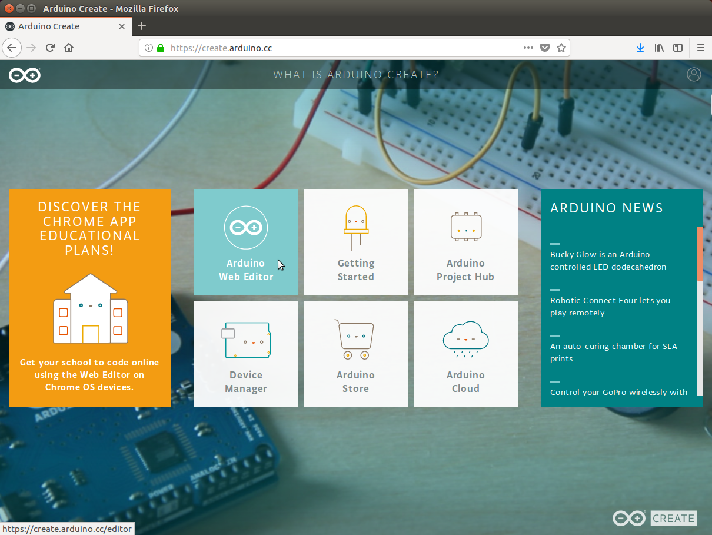

2. When the editor is first opened, it will show your last opened sketch and appear similar to below.


3. To begin to import this tutorial’s sketch, click on the up-arrow icon (hovering tooltip will say "Import") to the right of the “NEW SKETCH” button as shown below.

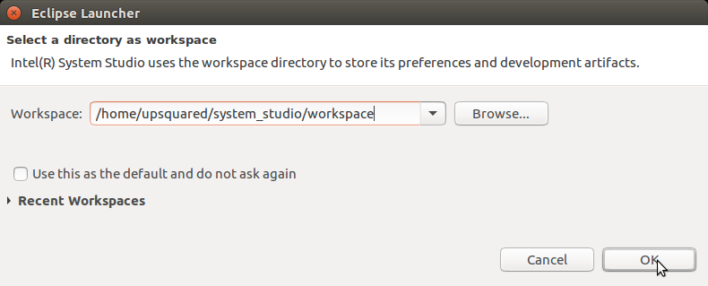

4. A "File Upload" window will appear, use it to browse to where the tutorials have been downloaded and select the file “car_detection_tutorial/step_3/cd_step_3_sketch.zip”, and then click the Open button.  After uploading and importing successfully, you will see a window similar to below.  Click the OK button to continue.

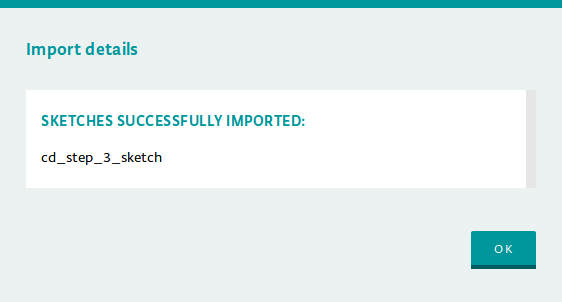

5. With the sketch now imported, it will be open in the editor similar to below and you are now ready to build.  

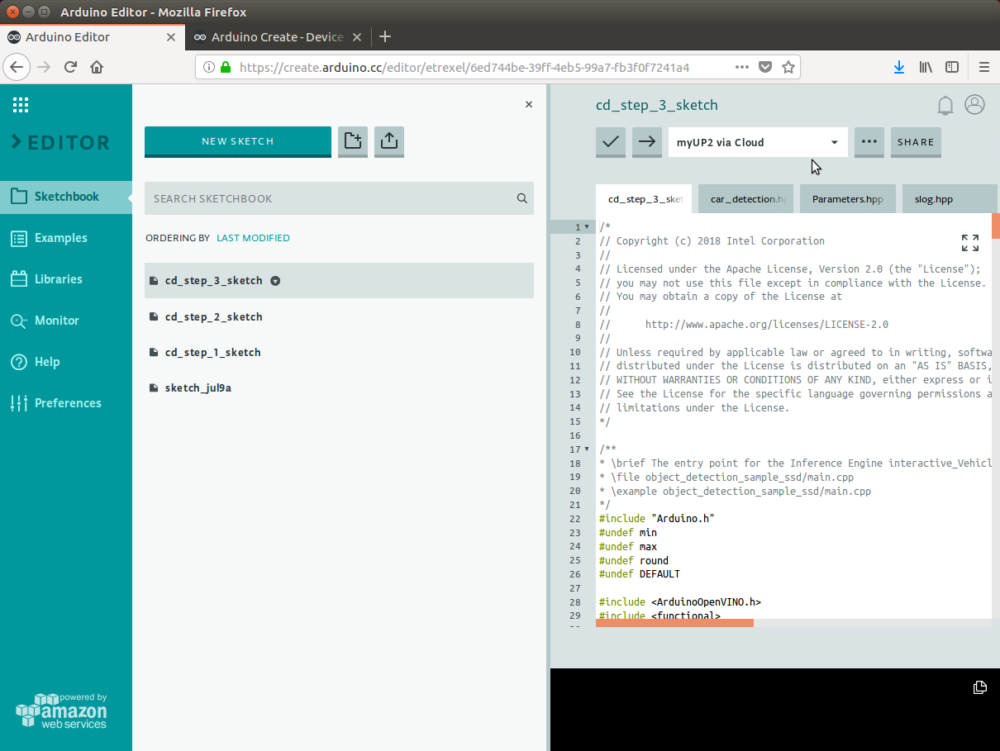

### Build and Upload Sketch Executable

1. From the Arduino Create Web Editor you build the executable and then upload it to your Arduino device.  After uploading, the executable with the same name as the sketch may be found in the "sketches" directory under your user’s home directory and may be run directly from the command line later if desired.  Before continuing, be sure that your device is ready as indicated in the box which will show “\<device name\> via Cloud” when connected as shown below for the device named “myUP2”. 


2. If unconnected and not ready, the device will appear with a line with red ‘X’ before the name as shown below.  To reconnect, you may need to refresh or reload the browser page, restart the Arduino Create Agent, or potentially run setup for your kit again.


3. After making sure your device is connected, to begin the build and upload process click on the right-arrow icon at the top of the editor as shown below.

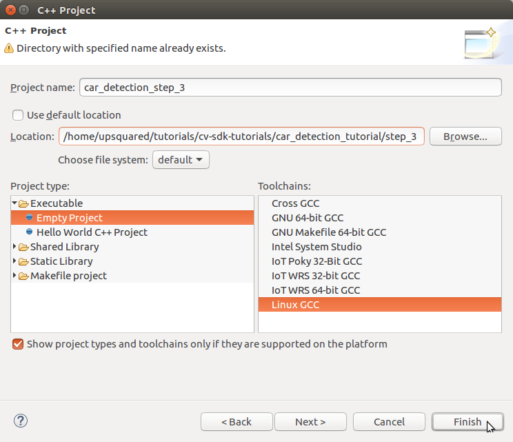

4. During the build and upload process, you will see that the button has been replaced with "BUSY" as shown below along with status text at the bottom of the window saying “Updating \<sketch name\>”.


5. Below shows after a successful build and upload.  Note that the bottom of the editor will be updated with the status and below it the output of the build.  


6. Uploading will also start the sketch which you can verify by checking the status of the sketch by clicking the "RUN/STOP" button as shown below.

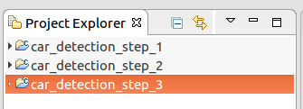

7. The status window will show all the sketches that have been uploaded to the device and the state of each as a "switch" similar below showing either “RUNNING” or “STOPPED”.  Clicking the switch will change the state of the sketch.  

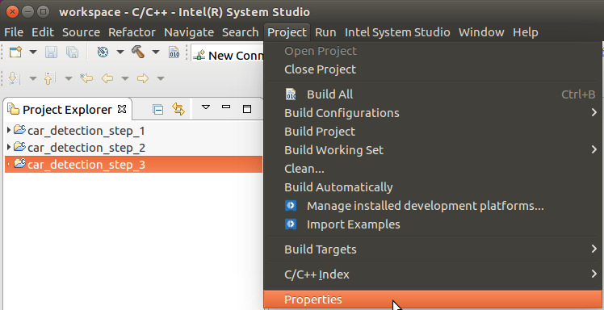

8. For now, we will stop the sketch before continuing.  First click the "RUNNING" to change it to “STOPPED”, then click the DONE button to close the window.  **Note**: Be sure to run only one tutorial sketch at a time to avoid overloading your device which may make it very slow or unresponsive.


## Run

### How to Run the Executable

1. Before starting a sketch, you will need to grant the root user access to the X server to open X windows by executing the following xhost command:

```Bash
xhost +si:localuser:root 
```


2. From the command you should see the following response.  Note the xhost command will need to be run again after rebooting Linux.

```Bash
localuser:root being added to access control list
```


3. After uploading the sketch, it can be started and stopped without re-uploading.  To control and check the status of the sketch, click the "RUN/STOP" button as shown below.


4. The sketch status window will appear with a "switch" to the right of each sketch indicating RUNNING or STOPPED as shown below already STOPPED.  

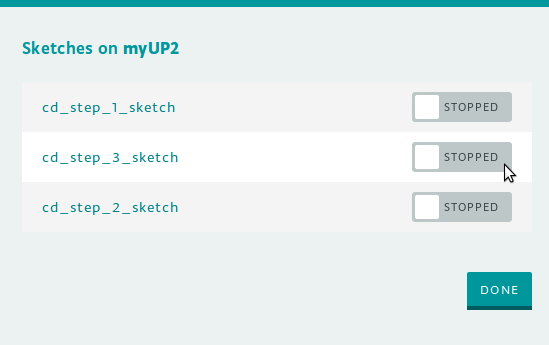

5. Clicking the RUNNING or STOPPED will change the status between states.  When starting a tutorial exercise, be sure the sketch is stopped first and then start it running.  With the sketch STOPPED, we now click it to change it to RUNNING, then click the DONE button to close the window.  **Note**: Be sure to run only one tutorial sketch at a time to avoid overloading your device which may make it very slow or unresponsive.

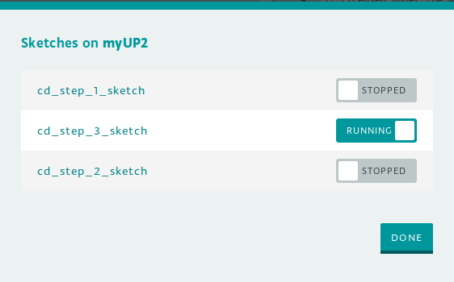

### How to Set Runtime Parameters

For flexibility and to minimize rebuilding and re-uploading the sketch when parameters change, the tutorial code allows setting parameters at runtime.  When the sketch first starts, it will first display all the current settings and then prompt for a parameters string before continuing.  Note that the sketch must first stop (or be stopped) and then restarted before accepting new parameter settings.  The steps below go through an example to set the image input parameter "i=\<video filename\>".

1. Open the "Monitor" view by clicking “Monitor” at the left side of the Arduino Create Web Editor.  The monitor is effectively the console for the sketch.  The large box will display output (stdout) from the sketch while the box to the left of the SEND button is used to send input (stdin) to the sketch.  **Note**: Be sure to open the monitor before starting the sketch otherwise you may not see initial output during startup displayed.


2. Stop the sketch if running, then start it again.  The Monitor view should now show the prompt for new parameters similar to below.  Note that each parameter is shown with a description first ("Path to a video file…"), the type of input (“sid::string”), then the current setting as name=val (“i=cam”)..  

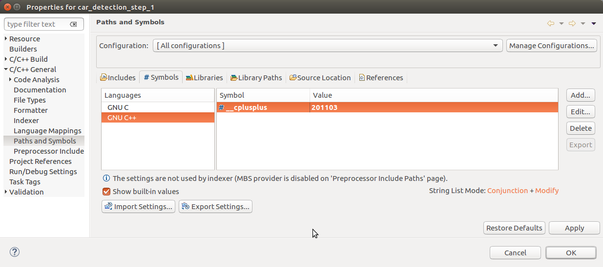

3. To change parameters, enter a string "name=val" for each parameter with a space ‘ ‘ between each “name=val”.  To change the video input file, we might use something like “i=tutorials/computer-vision-inference-dev-kit-tutorials/car_detection_tutorial/data/car_1.bmp” and press Enter or click the SEND button.  The parameters are displayed again with the new setting and a new prompt as shown below.  Note that relative paths are relative to the the user’s home directory where sketches are run.

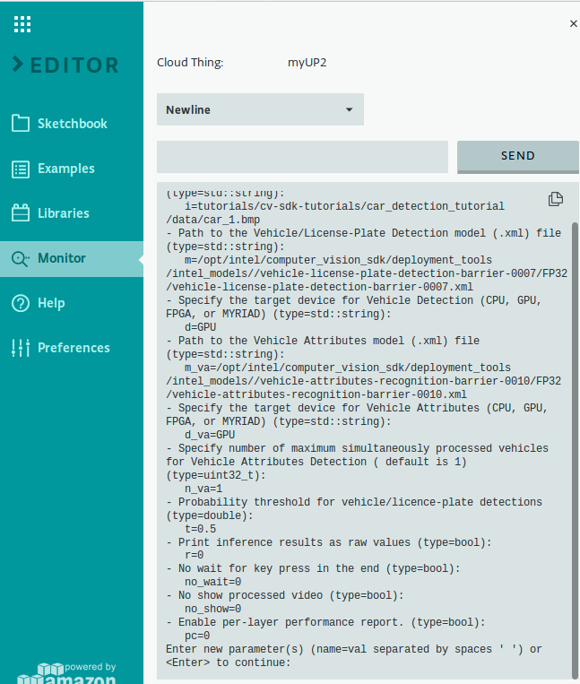

4. You may notice that default value for the parameter "m" is pretty long and may need to change especially when wanting to use an FP16 model for a device.  To make this easier, included in the tutorial “car_detection.hpp” code are additional parameters: “mVLP32” and “mVLP16”.  Instead of copying the full path, the parameter string’s ability to reference other parameters may be used such as “m=$mVLP16” which will change parameter “m” to now point to the FP16 version of the model as shown below.

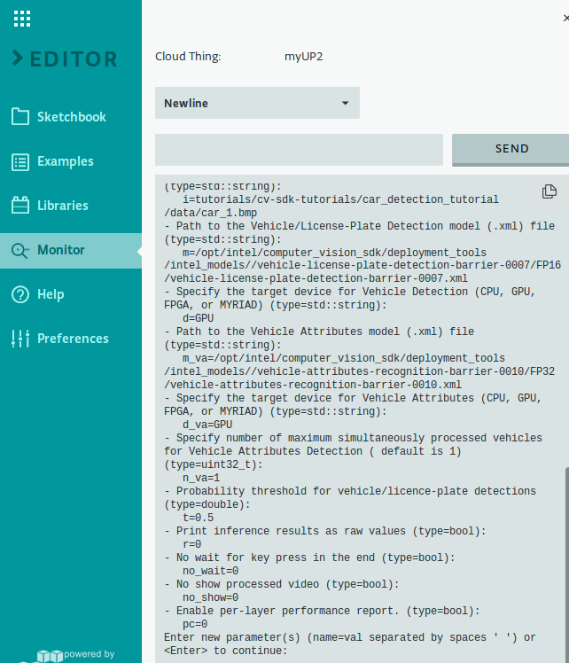

5. When ready to run the sketch with the current parameter settings, leave the input box empty and press Enter or click the SEND button.  The sketch should continue with more output shown in the monitor output box similar to below.

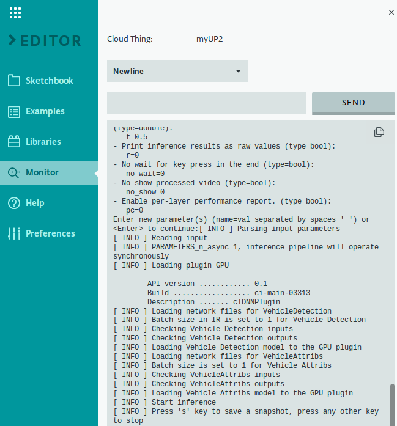

### Running

1. You now have the executable file to run.  In order to load the vehicle attribute detection model, the "m_va" parameter needs to be set followed by the full path to the model.  First let us see how it works on a single image file.  Use the parameter settings string:

```
m=$mVLP32 m_va=$mVA32 i=tutorials/computer-vision-inference-dev-kit-tutorials/car_detection_tutorial/data/car_1.bmp
```


2. The output window will show the image overlaid with colored rectangles over each of the detected vehicles and license plates.  There will also be text within the vehicle box indicating type and color.  The timing statistics for inferring the vehicle attribute results are also shown.  Next, let us try it on a video file.  Use the parameter settings string:

```
m=$mVLP32 m_va=$mVA32 i=tutorials/computer-vision-inference-dev-kit-tutorials/car_detection_tutorial/data/car-detection.mp4
```


3. You should see rectangles that follow the cars and license plates as they move around the image.  The accompanying vehicle attributes text (type and color) will also appear in the rectangles.  Finally, let us see how the application works with the default camera input.  The camera is the default source, so we do this by running the application without using any parameters or we can still specify the camera using "cam" by using the parameter settings string:

```
m=$mVLP32 m_va=$mVA32 i=cam
```


4. Again, you will see output similar to the output from the video, but appropriate to the cars in your office, or maybe outside a nearby window.

# Checking Performance

Now that we’ve seen how we have the application running two models to process images and make inferences, let us explore optimizing the performance of the application.  In general, performance increases by spreading the inference work across several devices, assign the more complex tasks to the fastest devices, and use FP16 precision instead of FP32 whenever possible.  Let us see how the models we are using perform when we start moving them to different devices using the combinations:

## Runtime Parameter Settings

The list of the parameter setting strings used:

```
# Parameter settings string #1
m=$mVLP32 d=CPU m_va=$mVA32 d_va=CPU i=tutorials/computer-vision-inference-dev-kit-tutorials/car_detection_tutorial/data/car-detection.mp4
# Parameter settings string #2
m=$mVLP32 d=CPU m_va=$mVA16 d_va=MYRIAD i=tutorials/computer-vision-inference-dev-kit-tutorials/car_detection_tutorial/data/car-detection.mp4
# Parameter settings string #3
m=$mVLP16 d=MYRIAD m_va=$mVA32 d_va=CPU i=tutorials/computer-vision-inference-dev-kit-tutorials/car_detection_tutorial/data/car-detection.mp4
# Parameter settings string #4
m=$mVLP16 d=MYRIAD m_va=$mVA16 d_va=MYRIAD i=tutorials/computer-vision-inference-dev-kit-tutorials/car_detection_tutorial/data/car-detection.mp4
# Parameter settings string #5
m=$mVLP32 d=CPU m_va=$mVA32 d_va=GPU i=tutorials/computer-vision-inference-dev-kit-tutorials/car_detection_tutorial/data/car-detection.mp4
# Parameter settings string #6
m=$mVLP32 d=CPU m_va=$mVA16 d_va=GPU i=tutorials/computer-vision-inference-dev-kit-tutorials/car_detection_tutorial/data/car-detection.mp4
# Parameter settings string #7
m=$mVLP16 d=MYRIAD m_va=$mVA32 d_va=GPU i=tutorials/computer-vision-inference-dev-kit-tutorials/car_detection_tutorial/data/car-detection.mp4
# Parameter settings string #8
m=$mVLP16 d=MYRIAD m_va=$mVA16 d_va=GPU i=tutorials/computer-vision-inference-dev-kit-tutorials/car_detection_tutorial/data/car-detection.mp4
# Parameter settings string #9
m=$mVLP32 d=GPU m_va=$mVA32 d_va=CPU i=tutorials/computer-vision-inference-dev-kit-tutorials/car_detection_tutorial/data/car-detection.mp4
# Parameter settings string #10
m=$mVLP16 d=GPU m_va=$mVA32 d_va=CPU i=tutorials/computer-vision-inference-dev-kit-tutorials/car_detection_tutorial/data/car-detection.mp4
# Parameter settings string #11
m=$mVLP32 d=GPU m_va=$mVA16 d_va=MYRIAD i=tutorials/computer-vision-inference-dev-kit-tutorials/car_detection_tutorial/data/car-detection.mp4
# Parameter settings string #12
m=$mVLP16 d=GPU m_va=$mVA16 d_va=MYRIAD i=tutorials/computer-vision-inference-dev-kit-tutorials/car_detection_tutorial/data/car-detection.mp4
# Parameter settings string #13
m=$mVLP32 d=GPU m_va=$mVA32 d_va=GPU i=tutorials/computer-vision-inference-dev-kit-tutorials/car_detection_tutorial/data/car-detection.mp4
# Parameter settings string #14
m=$mVLP32 d=GPU m_va=$mVA16 d_va=GPU i=tutorials/computer-vision-inference-dev-kit-tutorials/car_detection_tutorial/data/car-detection.mp4
```


**Note**: It can take a lot of time to run all the commands so the exercise of running and verifying is left to the user.  

Performance is measured as the average time for the main loop to process all the input frames.  The average time, and inverse as frames-per-second (fps), with number of frames processed are reported on exit.  The results seen for the configurations listed above should improve starting from the first all the way to the last.  From the end of the list, we see the fastest results are for the combinations when offloading from the CPU and running the vehicle model on the GPU and the vehicle attributes model on the GPU or MYRIAD.

# Conclusion

Building on the single model application from Tutorial Step 2, this step has shown that using a second inference model in an application is just as easy as using the first.  We also showed some techniques to pipeline the program flow.  This makes it easier to group input data with its results and pass it through the application pipeline.  We also explored increasing performance by optimizing how the application loads models onto different devices.

Continuing to Tutorial Step 4, we will see another method of increasing performance, when we introduce running the models asynchronously.  This will allow the application to have multiple models analyzing images along with the CPU using OpenCV and managing data all running in parallel.

# Navigation

[Car Detection Tutorial](../Readme.md)

[Car Detection Tutorial Step 2](../step_2/Readme.md)

[Car Detection Tutorial Step 4](../step_4/Readme.md)

