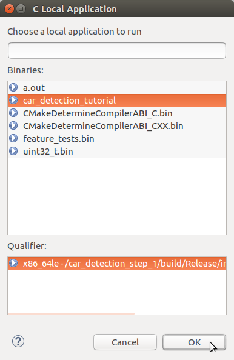
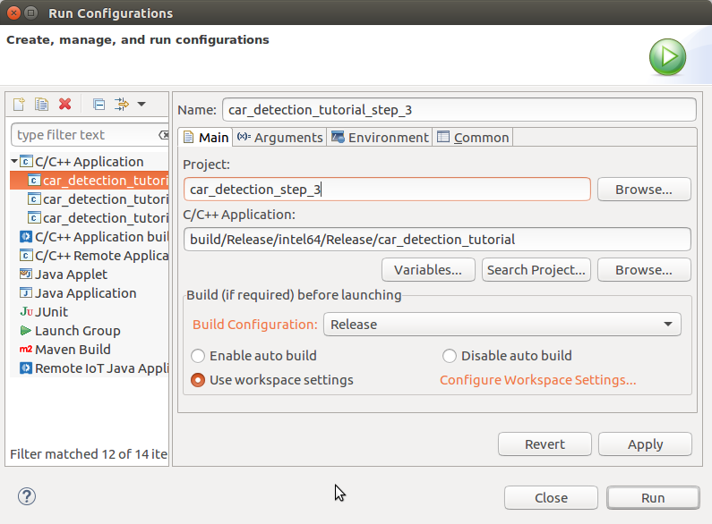
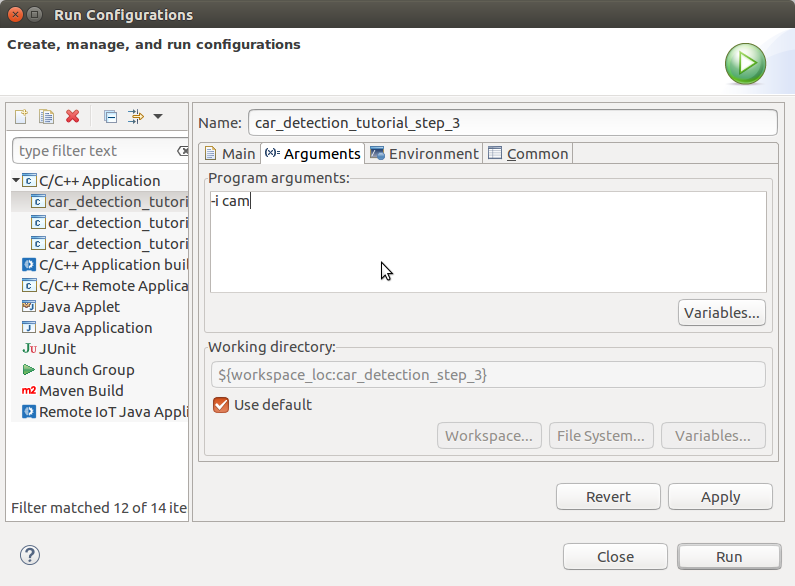
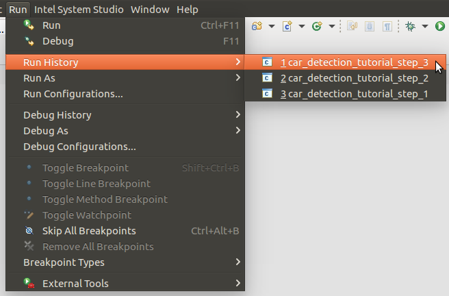

# Tutorial Step 3: Add a second model, Vehicle Attributes Detection


# Table of Contents

<p></p><div class="table-of-contents"><ul><li><a href="#tutorial-step-3-add-a-second-model-vehicle-attributes-detection">Tutorial Step 3: Add a second model, Vehicle Attributes Detection</a></li><li><a href="#table-of-contents">Table of Contents</a></li><li><a href="#introduction">Introduction</a></li><li><a href="#vehicle-attributes-detection-model">Vehicle Attributes Detection Model</a></li><li><a href="#adding-the-vehicle-attributes-detection-model">Adding the Vehicle Attributes Detection Model</a><ul><li><a href="#vehicleattribsdetection">VehicleAttribsDetection</a><ul><li><a href="#vehicleattribsdetection">VehicleAttribsDetection()</a></li><li><a href="#submitrequest">submitRequest()</a></li><li><a href="#enqueue">enqueue()</a></li><li><a href="#fetchresults">fetchResults()</a></li><li><a href="#read">read()</a></li></ul></li></ul></li><li><a href="#using-vehicleattribsdetection">Using VehicleAttribsDetection</a><ul><li><a href="#main">main()</a></li><li><a href="#main-loop">Main Loop</a><ul><li><a href="#pipeline-stage-0-prepare-and-infer-a-batch-of-frames">Pipeline Stage 0: Prepare and Infer a Batch of Frames</a></li><li><a href="#pipeline-stage-1-infer-vehicle-attributes">Pipeline Stage 1: Infer Vehicle Attributes</a></li><li><a href="#pipeline-stage-2-render-results">Pipeline Stage 2: Render Results</a></li></ul></li><li><a href="#post-main-loop">Post-Main Loop</a></li></ul></li><li><a href="#building-and-running">Building and Running</a><ul><li><a href="#command-line-using-make">Command Line using Make</a><ul><li><a href="#build">Build</a></li><li><a href="#run">Run</a></li></ul></li><li><a href="#intel-system-studio">Intel® System Studio</a><ul><li><a href="#build">Build</a><ul><li><a href="#start-intel-system-studio">Start Intel® System Studio</a></li><li><a href="#create-project">Create Project</a></li><li><a href="#configure-project">Configure Project</a></li><li><a href="#build-executable">Build Executable</a></li></ul></li><li><a href="#run">Run</a><ul><li><a href="#create-run-configuration">Create Run Configuration</a></li><li><a href="#how-to-set-command-line-arguments">How to Set Command Line Arguments</a></li><li><a href="#how-to-run-the-executable">How to Run the Executable</a></li><li><a href="#running">Running</a></li></ul></li></ul></li></ul></li><li><a href="#dynamic-batching">Dynamic Batching</a><ul><li><a href="#command-lines">Command Lines:</a></li><li><a href="#system-studio-run-configuration-arguments">System Studio Run Configuration Arguments:</a></li></ul></li><li><a href="#input-preprocessing">Input Preprocessing</a><ul><li><a href="#command-lines">Command Lines:</a></li><li><a href="#system-studio-run-configuration-arguments">System Studio Run Configuration Arguments:</a></li></ul></li><li><a href="#checking-performance">Checking Performance</a><ul><li><a href="#command-lines">Command Lines</a></li><li><a href="#system-studio-arguments">System Studio Arguments</a></li></ul></li><li><a href="#conclusion">Conclusion</a></li><li><a href="#navigation">Navigation</a></li></ul></div><p></p>

# Introduction

Welcome to Car Detection Tutorial Step 3.  Now that the application can detect vehicles in images, we want it to tell us what type of vehicles were found and what color the vehicle are.  The precompiled "vehicle-attributes-recognition-barrier-0039" model included with the Intel® Distribution of OpenVINO™ toolkit is what we will be using to accomplish this.  The sample output below shows the results where the ROI box now appears with the vehicle type (e.g. “car”) and its color (e.g. “black”).  The metrics reported now also include the time to run the vehicle attribute detection model.


# Vehicle Attributes Detection Model

The Intel® Distribution of OpenVINO™ toolkit provides a pre-compiled model for inferring vehicle type and color from an image of a car.  You can find it at:

* /opt/intel/computer_vision_sdk/deployment_tools/intel_models/vehicle-attributes-recognition-barrier-0039

   * Available model locations:

      * FP16: /opt/intel/computer_vision_sdk/deployment_tools/intel_models/vehicle-attributes-recognition-barrier-0039/FP16/vehicle-attributes-recognition-barrier-0039.xml

      * FP32: /opt/intel/computer_vision_sdk/deployment_tools/intel_models/vehicle-attributes-recognition-barrier-0039/FP32/vehicle-attributes-recognition-barrier-0039.xml

   * More details can be found at:

      * file:///opt/intel/computer_vision_sdk/deployment_tools/intel_models/vehicle-attributes-recognition-barrier-0039/description/vehicle-attributes-recognition-barrier-0039.html

The results it is capable of producing are shown in the summary below (for more details, see the descriptions HTML pages for each model): 

<table>
  <tr>
    <td>Model</td>
    <td>GFLOPS</td>
    <td>MParameters</td>
    <td>Average Accuracy</td>
  </tr>
  <tr>
    <td>vehicle-attributes-recognition-barrier-0039</td>
    <td>0.125</td>
    <td>0.626</td>
    <td>Color accuracy: 82.04%
Type accuracy: 87.70%</td>
  </tr>
</table>


# Adding the Vehicle Attributes Detection Model

Thanks to the setup work done in Tutorial Step 2, adding the vehicle attributes detection model in this step will just be a matter of deriving a new class from the BaseDetection class, adding an additional command line argument to specify the new model, and updating the application to run and track the statistics for the new model.  This means there will not be as much code to walk through this time.

1. Open up a terminal (such as xterm) or use an existing terminal to get to a command shell prompt.

2. Change to the directory containing Tutorial Step 3:

```bash
cd tutorials/computer-vision-inference-dev-kit-tutorials/car_detection_tutorial/step_3
```


3. Open the files "main.cpp" and “car_detection.hpp” in the editor of your choice such as ‘gedit’, ‘gvim’, or ‘vim’.

## VehicleAttribsDetection

VehicleAttribsDetection is derived from the BaseDetection class and adding some new member variables that will be needed along with using the operator= from the base class.

```cpp
struct VehicleAttribsDetection : BaseDetection {
    std::string inputName;
    std::string outputNameForType;
    std::string outputNameForColor;
    int enquedVehicles = 0;

    using BaseDetection::operator=;
```


### VehicleAttribsDetection()

On construction of a VehicleAttribsDetection object, the base class constructor is called, passing in the model to load specified in the command line argument FLAGS_m_va, the name to be used when we printing out informational messages, and set the batch size to the command line argument FLAFS_n_va.  This initializes the BaseDetection subclass specifically for VehicleAttribsDetection class.

```cpp
    VehicleAttribsDetection() : BaseDetection(FLAGS_m_va, "Vehicle Attribs", FLAGS_n_va) {}
```


### submitRequest()

The submitRequest() function is overridden to make sure that there are vehicles queued up to be processed before calling BaseDetection::submitRequest() to start inference.  If FLAGS_dyn_va is true (Dynamic Batching enabled), then set the actual batch size before submitting the request by calling "request->SetBatch(enquedVehicles)".

```cpp
    void submitRequest() override {
        if (!enquedVehicles) return;

        // Use Dynamic Batching to set actual number of inputs in request
        if (FLAGS_dyn_va) {
            request->SetBatch(enquedVehicles);
        }

        BaseDetection::submitRequest();
        enquedVehicles = 0;
    }
```


### enqueue()

A check is made to see that the vehicle attributes detection model is enabled.  Also check to make sure that the number of inputs does not exceed the batch size.  

```cpp
    void enqueue(const cv::Mat &Vehicle, cv::Rect roiRect = cv::Rect(0,0,0,0)) {
        if (!enabled()) {
            return;
        }
        if (enquedVehicles >= maxBatch) {
            slog::warn << "Number of detected vehicles more than maximum(" << maxBatch << ") processed by Vehicles Attributes detector" << slog::endl;
            return;
        }
```


An inference request object is created if one has not been already created.  The request object is used for holding input and output data, starting inference, and waiting for completion and results.

```cpp
        if (!request) {
            request = net.CreateInferRequestPtr();
        }
```


If FLAGS_auto_resize is true, create a new blob using wrapMat2Blob() which reuses the data buffer for the Vehicle (no copy of data is done).  If roiRect contains a valid region (doCrop == true), then create an InferenceEngine::ROI (ieRoi) to hold the crop settings and combine it with the input blob using InferenceEngine::make_shared_blob().  Finally, set the request’s input blob to the newly created blob.

```Cpp
        // check if ROI has non-zero dimensions, if so it will be used to crop input
        bool doCrop = (roiRect.width != 0) && (roiRect.height != 0);

        InferenceEngine::Blob::Ptr inputBlob;
        if (FLAGS_auto_resize) {
        	inputBlob = wrapMat2Blob(Vehicle);
        	if (doCrop) {
        		cv::Rect clippedRect = roiRect & cv::Rect(0, 0, Vehicle.cols, Vehicle.rows);
				InferenceEngine::ROI ieRoi;
				ieRoi.posX = clippedRect.x;
				ieRoi.posY = clippedRect.y;
				ieRoi.sizeX = clippedRect.width;
				ieRoi.sizeY = clippedRect.height;

				inputBlob = InferenceEngine::make_shared_blob(inputBlob, ieRoi);
        	}

            request->SetBlob(inputName, inputBlob);
```


Else, if FLAGS_auto_resize is false, use OpenCV to crop Vehicle (if needed, doCrop == true), then retrieve the input blob from the request and use matU8ToBlob() to copy the image image data into the blob.

```cpp
        } else {
        	cv::Mat cropped;
        	if (doCrop) {
        		cv::Rect clippedRect = roiRect & cv::Rect(0, 0, Vehicle.cols, Vehicle.rows);
        		cropped = Vehicle(clippedRect);
        	} else {
        		cropped = Vehicle;
        	}
			inputBlob = request->GetBlob(inputName);
			matU8ToBlob<uint8_t >(cropped, inputBlob, enquedVehicles);
    	 }

       enquedVehicles++;
    }
```


### fetchResults()

fetchResults() will parse the inference results saving them in the "Results" variable.

1. A structure and vector are declared in the main class to store the information that fetchResults() will retrieve.

```cpp
   struct Attributes { std::string type; std::string color;};
   std::vector<Attributes> results;
```


2. Lookup arrays of string names are declared for the results coming from the model.  Clear out any previous results. 

```cpp
   void fetchResults() {
      static const std::string colors[] = {
         "white", "gray", "yellow", "red", "green", "blue", "black"
      };
      static const std::string types[] = {
         "car", "van", "truck", "bus"
      };

      results.clear();
```


3. A loop is used to iterate through all the results that were returned from the model.  From each result, the vehicle type and color values are retrieved.

```cpp
      for (int bi = 0; bi < maxBatch; bi++) {
         // 7 possible colors for each vehicle and we should select the one with the maximum probability
         const auto colorsValues = request->GetBlob(outputNameForColor)->buffer().as<float*>() + (bi * 7);
         // 4 possible types for each vehicle and we should select the one with the maximum probability
         const auto typesValues  = request->GetBlob(outputNameForType)->buffer().as<float*>() + (bi * 4);
```


4. The type and color values are converted into indexes into the lookup arrays.  An Attrib object is created to hold the inferred type and color.

```cpp
         const auto color_id = std::max_element(colorsValues, colorsValues + 7) - colorsValues;
         const auto type_id =  std::max_element(typesValues,  typesValues  + 4) - typesValues;

         Attributes attrib( { types[type_id], colors[color_id] } );
```


5. A check is made to see if the application was requested to display the raw information (-r) and print it to the console if necessary.  

```cpp
         if (FLAGS_r) {
            std::cout << "[Vehicle Attribute detected: type=" << attrib.type << ","
                      << "color=" << attrib.color << "]" << std::endl;
         }
```


6. The populated Attrib object is added to the vector of results to be used later by the application.

```cpp
         results.push_back(attrib);
      }
   }
```


### read()

The next function we will walkthrough is the VehicleDetection::read() function which must be specialized specifically to the model that it will load and run. 

1. The Inference Engine API InferenceEngine::CNNNetReader object is used to load the model IR files.  This comes from the XML file that is specified on the command line using the "-m_va" parameter.  

```cpp
    CNNNetwork read() override {
        slog::info << "Loading network files for VehicleAttribs" << slog::endl;
        InferenceEngine::CNNNetReader netReader;
        /** Read network model **/
        netReader.ReadNetwork(FLAGS_m_va);
```


2. The maximum batch size is set to maxBatch (set using FLAGS_n_va which defaults to 1).

```cpp
        netReader.getNetwork().setBatchSize(maxBatch);
        slog::info << "Batch size is set to " << netReader.getNetwork().getBatchSize() << " for Vehicle Attribs" << slog::endl;
```


3. The IR .bin file of the model is read.

```cpp
        /** Extract model name and load it's weights **/
        std::string binFileName = fileNameNoExt(FLAGS_m_va) + ".bin";
        netReader.ReadWeights(binFileName);
```


4. The proper number of inputs is checked to make sure that the loaded model has only one input as expected.

```cpp
        slog::info << "Checking VehicleAttribs inputs" << slog::endl;
        InferenceEngine::InputsDataMap inputInfo(netReader.getNetwork().getInputsInfo());
        if (inputInfo.size() != 1) {
            throw std::logic_error("Vehicle Attribs topology should have only one input");
        }
```


5. The input data format is prepared by configuring it for the proper precision (U8 = 8-bit per BGR channel) for the model.  

```cpp
        auto& inputInfoFirst = inputInfo.begin()->second;
        inputInfoFirst->setInputPrecision(Precision::U8);
```


6. If FLAGS_auto_resize is true, the input is set to be automatically resized by setting the resizing algorithm to use using setResizeAlgorithm(RESIZE_BILINEAR).  The input data format is configured for the proper memory layout, NHWC when automatically resizing and NCHW when data will be copied using OpenCV.  

```cpp
        auto& inputInfoFirst = inputInfo.begin()->second;
        inputInfoFirst->setInputPrecision(Precision::U8);
	  if (FLAGS_auto_resize) {
	        // set resizing algorithm
              inputInfoFirst->getPreProcess().setResizeAlgorithm(RESIZE_BILINEAR);
			inputInfoFirst->getInputData()->setLayout(Layout::NHWC);
  	  } else {
		inputInfoFirst->getInputData()->setLayout(Layout::NCHW);
	  }

        inputName = inputInfo.begin()->first;
```


7. The model is verified to have the two output layers as expected for the vehicle color and type results.  Variables are created and initialized to hold the output names to retrieve the results from the model.

```cpp
        slog::info << "Checking VehicleAttribs outputs" << slog::endl;
        InferenceEngine::OutputsDataMap outputInfo(netReader.getNetwork().getOutputsInfo());
        if (outputInfo.size() != 2) {
            throw std::logic_error("Vehicle Attribs Network expects networks having two outputs");
        }
        auto it = outputInfo.begin();
        outputNameForColor = (it++)->second->name;  // color is the first output
        outputNameForType = (it++)->second->name;  // type is the second output
```


8. Where the model will be loaded is logged.  The model is marked as being enabled, and the InferenceEngine::CNNNetwork object containing the model is returned.

```cpp
        slog::info << "Loading Vehicle Attribs model to the "<< FLAGS_d_va << " plugin" << slog::endl;
        _enabled = true;
        return netReader.getNetwork();
    }
};
```


# Using VehicleAttribsDetection

That takes care of specializing the BaseDetector class into the  VehicleAttribsDetection class for the vehicle attribute detection model.  We now move down into the main() function to see what additions have been made to use the vehicle attribute detection model to process detected vehicles.

## main()

1. In the main() function, the command line arguments FLAGS_d_va and FLAGS_m_va are added to cmdOptions.  Remember that the flags are defined in the car_detection.hpp file.

```cpp
        std::vector<std::pair<std::string, std::string>> cmdOptions = {
            {FLAGS_d, FLAGS_m}, {FLAGS_d_va, FLAGS_m_va}
        };
```


2. The vehicle attributes detection object is instantiated.

```cpp
        VehicleAttribsDetection VehicleAttribs;
```


3. The model is loaded into the Inference Engine and associated with the device using the Load helper class previously covered.  The command line argument FLAGS_dyn_va is used to set whether the loaded model will be configured to automatically resize inputs.

```cpp
        Load(VehicleAttribs).into(pluginsForDevices[FLAGS_d_va], FLAGS_dyn_va);
```


4. The structure that holds a frame and associated data used to pass data from one pipeline stage to another is updated to include vehicle attributes results.

```cpp
      typedef struct {
         std::vector<cv::Mat*> batchOfInputFrames;
         cv::Mat* outputFrame;
         std::vector<cv::Rect> vehicleLocations;
         std::vector<cv::Rect> licensePlateLocations;
         std::vector<VehicleAttribsDetection::Attributes> vehicleAttributes;
      } FramePipelineFifoItem;
```


5. Another FIFO is added to pass data to the new pipeline stage.

```cpp
      FramePipelineFifo pipeS1toS2Fifo;
```


## Main Loop

A new pipeline stage is added to the main loop to infer vehicle attributes.

### Pipeline Stage 0: Prepare and Infer a Batch of Frames

Stage 0 remains the same passing vehicle detection results to the next stage via pipeS0toS1Fifo.

### Pipeline Stage 1: Infer Vehicle Attributes

Pipeline Stage 1 is the new stage inserted to infer vehicle attributes.

1. If the vehicle attribute detection model is enabled, then while there are items in the input fifo pipeS0toS1Fifo, get and remove the first item from the input FIFO.work pipeline.

```cpp
ms AttribsNetworkTime(0);
int AttribsInferred = 0;
if (VehicleAttribs.enabled()) {
   while(!pipeS0toS1Fifo.empty()) {
      FramePipelineFifoItem ps0s1i = pipeS0toS1Fifo.front();
      pipeS0toS1Fifo.pop();
```


2. From the results for the frame, the number of vehicles that were found is stored in totalVehicles.  A loop is started to prepare a batch of vehicles for inference.

```cpp
      const int totalVehicles = ps0s1i.vehicleLocations.size();
      int numVehiclesInferred = 0;

      int rib = 0;
      while( numVehiclesInferred < totalVehicles) {
```


3. The loop runs until the input batch is full or done with all vehicles.  The loop enqueues all vehicles ROIs from the frame.

```cpp
         for(; rib < totalVehicles; rib++) {
            if (VehicleAttribs.enquedVehicles >= VehicleAttribs.maxBatch) {
               break;
            }
            VehicleAttribs.enqueue(*ps0s1i.outputFrame, ps0s1i.vehicleLocations[rib]);
         }
```


4. If there are vehicles enqueued, then submit a request to infer the vehicle attributes and wait for the results.

```cpp
         if (VehicleAttribs.enquedVehicles > 0) {
            // track how many vehicles have been inferred
            AttribsInferred += VehicleAttribs.enquedVehicles;

            t0 = std::chrono::high_resolution_clock::now();
            VehicleAttribs.submitRequest();

            // wait for results
            VehicleAttribs.wait();
            t1 = std::chrono::high_resolution_clock::now();
            AttribsNetworkTime += std::chrono::duration_cast<ms>(t1 - t0);
```


5. The inference results are fetched and stored them in the frame being processed.  The total number of vehicles that have been inferred is tracked using numVehiclesInferred.

```cpp
            VehicleAttribs.fetchResults();
            int numVAResuls = VehicleAttribs.results.size();

            int batchIndex = 0;
            while(batchIndex < numVAResuls) {
               VehicleAttribsDetection::Attributes& res = VehicleAttribs.results[batchIndex];
               ps0s1i.vehicleAttributes.push_back(res);
               batchIndex++;
            }
            numVehiclesInferred += numVAResuls;
         }
      }
```


6. The frame is passed to the next stage.  This needs to be done whether or not there are attribute inference results to pass along.

```cpp
      pipeS1toS2Fifo.push(ps0s1i);
   }
```


7. If vehicle attribute detection was not enabled, then just pass the input frames to the next stage of the pipeline.

```cpp
   } else {
   // not running vehicle attributes, just pass along frames
      while (!pipeS0toS1Fifo.empty()) {
         FramePipelineFifoItem fpfi = pipeS0toS1Fifo.front();
         pipeS0toS1Fifo.pop();
         pipeS1toS2Fifo.push(fpfi);
      }
   }
```


### Pipeline Stage 2: Render Results

Rendering results has been moved down the pipeline now becoming Stage 2.  The stage still    takes the inference results gathered in the previous stages and renders them for display, now with the addition of rendering vehicle attributes.

1. This is the new code that adds the vehicle attribute information to the image.  

```cpp
   int numVehicles = ps1s2i.vehicleAttributes.size();
   for(int vi = 0; vi < numVehicles; vi++) {
      VehicleAttribsDetection::Attributes& res = ps1s2i.vehicleAttributes[vi];
      cv::Rect vLoc = ps1s2i.vehicleLocations[vi];
      cv::putText(outputFrame,
                  res.color,
                  cv::Point2f(vLoc.x, vLoc.y + 15),
                  cv::FONT_HERSHEY_COMPLEX_SMALL,
                  0.8,
                  cv::Scalar(255, 255, 255));
      cv::putText(outputFrame,
                  res.type,
                  cv::Point2f(vLoc.x, vLoc.y + 30),
                  cv::FONT_HERSHEY_COMPLEX_SMALL,
                  0.8,
                  cv::Scalar(255, 255, 255));
   if (FLAGS_r) {
      std::cout << "Vehicle Attributes results:" << res.color << ";" << res.type << std::endl;
      }
```


2. And the new code to print out the execution statistics for the vehicle attribute inference.

```cpp
   if (VehicleAttribs.enabled() && AttribsInferred > 0) {
      float average_time = AttribsNetworkTime.count() / AttribsInferred;
      out.str("");
      out << "Vehicle Attribs time (averaged over " << AttribsInferred << " detections) :" << std::fixed
          << std::setprecision(2) << average_time << " ms " << "(" << 1000.f / average_time << " fps)";
      cv::putText(outputFrame, out.str(), cv::Point2f(0, 65), cv::FONT_HERSHEY_SIMPLEX, 0.5,
                  cv::Scalar(255, 0, 0));
   }
```


## Post-Main Loop

Vehicle attribute detection object is added to display the performance count information.

```cpp
if (FLAGS_pc) {
   VehicleDetection.printPerformanceCounts();
   VehicleAttribs.printPerformanceCounts();
}
```


# Building and Running

Now that we have walked through the added code and learned what it does, it is time to build the application and see it in action using two models to infer image information.  To do that, two ways are covered in the following sections: 1) Command line using "make" and 2) using Intel® System Studio (ISS).  Both ways do the same things, so choose according to your preference.

## Command Line using Make

The following covers how to build and run from the command line using "make".

### Build

1. Open up a terminal or use an existing terminal to get to a command shell prompt.

2. Change to the directory containing Tutorial Step 3:

```bash
cd tutorials/computer-vision-inference-dev-kit-tutorials/car_detection_tutorial/step_3
```


3. The first step is to configure the build environment for the Intel® Distribution of OpenVINO™ toolkit by sourcing the "setupvars.sh" script.

```bash
source  /opt/intel/openvino/bin/setupvars.sh
```


4. Now, create a directory to build the tutorial in and change to it.

```bash
mkdir build
cd build
```


5. The last thing we need to do before compiling is to configure the build settings and build the executable.  We do this by running CMake to set the build target and file locations.  Then we run Make to build the executable.

```bash
cmake -DCMAKE_BUILD_TYPE=Release ../
make
```


### Run

1. Before running, be sure to source the helper script.  That will make it easier to use environment variables instead of long names to the models:

```bash
source ../../scripts/setupenv.sh 
```


2. You now have the executable file to run ./intel64/Release/car_detection_tutorial.  In order to load the vehicle attribute detection model, the "-m_va" flag needs to be added  followed by the full path to the model.  First let us see how it works on a single image file:

```bash
./intel64/Release/car_detection_tutorial -m $mVDR32 -m_va $mVA32 -i ../../data/car_1.bmp
```


3. The output window will show the image overlaid with colored rectangles over each of the detected vehicles and license plates (if model detects license plates too).  There will also be text within the vehicle box indicating type and color.  The timing statistics for inferring the vehicle attribute results are also shown.  Next, let us try it on a video file.

```bash
./intel64/Release/car_detection_tutorial -m $mVDR32 -m_va $mVA32 -i ../../data/cars_768x768.h264
```


4. You should see rectangles that follow the cars as they move around the image.  The accompanying vehicle attributes text (type and color) will also appear in the rectangles.  Finally, let us see how it works for camera input.

```bash
./intel64/Release/car_detection_tutorial -m $mVDR32 -m_va $mVA32 -i cam
```


Or

```bash
./intel64/Release/car_detection_tutorial -m $mVDR32 -m_va $mVA32
```


5. Again, you will see output similar to the output from the video, but appropriate to the cars in your office, or maybe outside a nearby window.

## Intel® System Studio

The following covers how to build and run from within Intel® System Studio (ISS).

### Build

#### Start Intel® System Studio

1. We need to start ISS using the desktop icon or the supplied scripts that will setup environment variables and launch the ISS Eclipse IDE.

   1. Desktop icon: Locate and double-click the icon shown below on the desktop.


   2. Command line: Configure the build environment when using the Intel® Distribution of OpenVINO™ toolkit by sourcing the "setupvars.sh" script.  Be sure to source the helper script “scripts/setupenv.sh” which defines environment variables that point to inference models used so that short names may be used instead of long paths.  Then finally start ISS using the supplied script that will setup environment variables and launch the ISS Eclipse IDE.

   ```bash
   source /opt/intel/openvino/bin/setupvars.sh
   # assumes shell is in step_* directory
   source ../scripts/setupenv.sh
   /opt/intel/system_studio_2019/iss_ide_eclipse-launcher.sh
   ```


2. At first, the ISS splash window will appear that looks like:


3. The splash window will automatically disappear and be replaced with the workspace selection window.  We will use the default workspace "/home/upsquared/system_studio/workspace", so click the “OK” button to continue.


4. The first time ISS is opened, the ISS IDE will show the "Getting Started" tab as shown.  We will not be using it so if it is present, close the tab using the “X” on the tab that is just to the right of “Getting Started”.


5. With the "Getting Started” tab now closed, the ISS IDE will default in the Intel® C/C++ perspective which appears similar to below:

   1. **Note**: The perspective may be different if ISS has been started before and changes were made.  A different perspective may be open, such as the standard C/C++ perspective, or if the windows have been moved.


#### Create Project

1. Before building the executable, a project must be created.  Start by opening File->New->Project...


2. Expand "Other Generic Eclipse", expand “C/C++”, select “C++ Project”, and then click the Next button.


3. The "C++ Project" window will appear.  Set the following items:

   1. Set "Project name" to: car_detection_step_3

   2. Uncheck the "Use default location" box, then click the Browse… button.  Using the file open dialog, browse to the tutorial “step_3” directory and then click the OK button.

   3. Make sure under "Project type", the Executable->”Empty Project” is selected

   4. Under "Toolchain", select “Linux GCC”

   5. When complete the window should look similar to below.  Click the Finish button to continue.


4. You may see a "Open Associated Perspective?" window prompting to open the C/C++ perspective.  If so click the Yes button.


5. You now should be in the C/C++ perspective with the tutorial added as a project similar to below.


6. Note that the "Project Explorer" window shows the new project “car_detection_step_3”.


#### Configure Project

1. To build the project, it must be configured to use the CMake files present.  Start by selecting the project in the "Project Explorer" window and then from the menu select Project->Properties.


2. The "Properties for …" window will appear.   First, expand “C/C++ Build” and select “Tool Chain Editor”.  Then in the “Current builder” drop-down list, select the “CMake Builder (portable)”.  Then click the Apply button.


3. Now change "Configuration" to “Release”, then again set “Current builder” to “CMake Builder (portable)”.  Then click the OK button.


4. At this point, if you open the source file main.cpp you will see include files not found and syntax errors listed in the "Problems" window.  These errors are not really errors and compiling the executable will succeed.  The false errors appear because the CMake builder does not automatically import include paths for the IDE’s code analysis (also referred to as the “Indexer”) from the CMake files.  To fix the false errors reported by the indexer, you must set some include paths and define a macro.  Start by again selecting the project in the “Project Explorer” window and then from the menu select Project->Properties.  Expand “C/C++ General” and then select “Paths and Symbols”.  With Configuration set to  “[All configurations]”, the path and symbol settings need to be set as follows:

   1. On the Include tab for Language "GNU C++", the list of “Include directories” needs to have:

      1. /opt/intel/computer_vision_sdk/deployment_tools/inference_engine/include

      2. /opt/intel/computer_vision_sdk/deployment_tools/inference_engine/samples/common

      3. /opt/intel/computer_vision_sdk/deployment_tools/inference_engine/samples/extension

      4. /opt/intel/computer_vision_sdk/opencv/include

      5. /opt/intel/computer_vision_sdk/deployment_tools/inference_engine/samples/common/samples

   2. On the Symbol tab for Language "GNU C++":

      1. Symbol "__cplusplus" set to value “201103”

   3. Instead of manually making all theses changes, a settings file that can be imported for all the above is included with the tutorial files under "system_studio/exported_paths_and_symbols.xml".  The following steps will use the settings file instead of entering manually.	

5. Starting from Project->Properties, "C/C++ General"->“Paths and Symbols”, import the paths and symbols needed by the indexer by clicking the “Import Settings…” button.  The “Import” window will appear.  Select the “Settings file” by clicking on the “Browse…” button then browsing to the XML file supplied with the tutorial to select the file “system_studio/exported_paths_and_symbols.xml”.   By default, “Select Configuration” should have “Debug” selected.  The window should appear similar to below.  Click the Finish button to complete (this will close the project properties window too).


6. Starting again from Project->Properties, "C/C++ General"->“Paths and Symbols”, import the paths and symbols needed by the indexer by clicking the “Import Settings…” button.  The “Import” window will appear.  Select the “Settings file” by clicking on the “Browse…” button then browsing to the XML file supplied with the tutorial to select the file “system_studio/exported_paths_and_symbols.xml”.  This time under “Select Configuration”, select “Release”.  The window should appear similar to below.  Click the Finish button to complete.


7. Going back to Project->Properties, "C/C++ General"->“Paths and Symbols” should appear similar to below for the Includes and Symbols tabs.

   1. **Note**: After these settings are made, to remove the false errors you may need to re-index the project by selecting from the menu Project->"C/C++ Index”->Rebuild


#### Build Executable

1. Now that the project is configured, we will build the executable.  We will be using the Release configuration build which is set by Project->"Build Configurations”->”Set Active” and selecting "Release”.


2. Build the executable using Project->"Build Project”.


3. The "Build Project" window will appear.  The first build will take a minute to complete because it is building all the sample libraries needed.  Click the “Run in Background” button to close the window and letting the build continue as we look at the consoles.


4. In the Console window you may see the output of CMake similar to below.  


5. To see the output of the compiler, we need to change to the build console.  To do so, click on the down-arrow to the right of the terminal icon, then select "CDT Build Console [...]".


6. When the build completes successfully, the Console will appear similar to below.


7. Now that the executable is built, we can move on to running it.

### Run

#### Create Run Configuration

1. Before running the executable from within ISS, a run configuration must be created.  The quickest way to setup a new one is to just run the project and then edit the details.  To start this, from the Run menu, select "Run As" then “Local C/C++ Application”.


2. You may see a "C Local Application" window appear similar to below prompting to choose which binary to run.  If so, choose “car_detection_tutorial” and click the OK button.  **Note**: The other binaries listed are side effects from CMake and may be ignored.



3. The project’s executable will be started with the output appearing in the Console window.  At this point no command line arguments are given to the executable which will run (or exit) accordingly.  The models need to be specified so you should see an error and exit similar to below.


4. Since the default name used is the name of the executable, it is a good idea to have the run configuration’s name match the project to make it easier to distinguish it from multiple projects.  Begin by editing the run configuration’s name by first opening the run configuration up starting from the Run menu, selecting "Run Configurations…".


5. Under "C/C++ Application", select the correct project’s run configuration which will appear in the the Project setting.  Now edit the Name at the top changing to closer match the project name, here setting it to “car_detection_tutorial_step_3” as shown below.


#### How to Set Command Line Arguments

1. The run configuration just created does not have any command line arguments being passed to it.  To add arguments when running the executable, you must edit the run configuration starting from the Run menu, selecting "Run Configurations…".  Depending upon how many configurations are present, you may need to select the one for the current project.  Initially the Main tab is selected which shows the main project settings similar to below.



2. To set command line arguments, select the Arguments tab which will appear similar to below.  

   1. In the "Program arguments" area goes the command line arguments to be passed to the executable when run.  Here we have entered “-i cam” as an example.  Literal command line arguments will be passed exactly as they appear.  Environment variables require special treatment and are specified as “${env_var:\<var_name\>}” where “\<var_name\>” is the environment variable name.

   2. Also shown is the "Working directory".  This is where the executable is run and by default set to the top project directory.  **Note**: This is important to know when command line arguments use relative paths.

   3. When done, click the Run button to run the executable or the Close button to close the window.



#### How to Run the Executable

1. Running the executable can always be done from the Run Configuration window using the Run button.  To run without opening the Run Configuration window is done using the Run Menu, "Run History", then selecting the name of the run configuration as shown below.  



#### Running

1. Before starting ISS, be sure to source the helper script that will make it easier to use environment variables instead of long names to the models:

```bash
source ../scripts/setupenv.sh 
```


2. You now have the executable file to run.  In order to load the vehicle attribute detection model, the "-m_va" flag needs to be added  followed by the full path to the model.  First let us see how it works on a single image file.  Set the command line arguments for the run configuration to:

```
-m ${env_var:mVDR32} -m_va ${env_var:mVA32} -i ../data/car_1.bmp
```


3. The output window will show the image overlaid with colored rectangles over each of the detected vehicles and license plates (if model detects license plates too).  There will also be text within the vehicle box indicating type and color.  The timing statistics for inferring the vehicle attribute results are also shown.  Next, let us try it on a video file.

```
-m ${env_var:mVDR32} -m_va ${env_var:mVA32} -i ../data/cars_768x768.h264
```


4. You should see rectangles that follow the cars as they move around the image.  The accompanying vehicle attributes text (type and color) will also appear in the rectangles.  Finally, let us see how the application works with the default camera input.  The camera is the default source, so we do this by running the application without using any parameters or we can still specify the camera using "cam" by setting the command line arguments for the run configuration to:

```
-m ${env_var:mVDR32} -m_va ${env_var:mVA32} -i cam
```


5. Again, you will see output similar to the output from the video, but appropriate to the cars in your office, or maybe outside a nearby window.

# Dynamic Batching

Batch size was explored in the Car Detection Tutorial Step 2, here we repeat a similar exercise to show the effects of using Dynamic Batching with the vehicle attributes model.

**Note**: Due to internal structure, the vehicle detection models used in this tutorial are incompatible with the Dynamic Batching feature.

Now, let us use the Dynamic Batching option ("-dyn") to run a single image through each of the batch sizes 1, 2, 4, 8, and 16 using the commands below.  As you may recall from the key concepts description, with Dynamic Batching the behavior is that setting the input batch size acts like a maximum number of inputs and the actual batch size is set per request. 

## Command Lines:

```Bash
./intel64/Release/car_detection_tutorial -m $mVDR32 -m_va $mVA32 -i ../../data/car_1.bmp -dyn_va -n_va 1
./intel64/Release/car_detection_tutorial -m $mVDR32 -m_va $mVA32 -i ../../data/car_1.bmp -dyn_va -n_va 2
./intel64/Release/car_detection_tutorial -m $mVDR32 -m_va $mVA32 -i ../../data/car_1.bmp -dyn_va -n_va 4
./intel64/Release/car_detection_tutorial -m $mVDR32 -m_va $mVA32 -i ../../data/car_1.bmp -dyn_va -n_va 8
./intel64/Release/car_detection_tutorial -m $mVDR32 -m_va $mVA32 -i ../../data/car_1.bmp -dyn_va -n_va 16
```


## System Studio Run Configuration Arguments:

```
-m ${env_var:mVDR32} -m_va ${env_var:mVA32} -i ../data/car_1.bmp -dyn_va -n_va 1
-m ${env_var:mVDR32} -m_va ${env_var:mVA32} -i ../data/car_1.bmp -dyn_va -n_va 2
-m ${env_var:mVDR32} -m_va ${env_var:mVA32} -i ../data/car_1.bmp -dyn_va -n_va 4
-m ${env_var:mVDR32} -m_va ${env_var:mVA32} -i ../data/car_1.bmp -dyn_va -n_va 8
-m ${env_var:mVDR32} -m_va ${env_var:mVA32} -i ../data/car_1.bmp -dyn_va -n_va 16
```


As you run each command, you should notice it takes about the same amount of time for each even though the batch size is being increased.  This is because inference is now run on only the one input frame present instead of the entire batch size.  

# Input Preprocessing

Now, let us use OpenCV and then Inference Engine’s image pre-processing API (option "-auto_resize") to resize input data while running a single image through using the commands below.  

## Command Lines:

```Bash
./intel64/Release/car_detection_tutorial -m $mVDR32 -m_va $mVA32 -i ../../data/car_1.bmp

./intel64/Release/car_detection_tutorial -m $mVDR32 -m_va $mVA32 -i ../../data/car_1.bmp -auto_resize
```


## System Studio Run Configuration Arguments:

```
-m ${env_var:mVDR32} -m_va ${env_var:mVA32} -i ../data/car_1.bmp 

-m ${env_var:mVDR32} -m_va ${env_var:mVA32} -i ../data/car_1.bmp -auto_resize
```


With the "-auto_resize" option, you should notice significantly less time reported on the output image for the time taken to run OpenCV.  This is because the input data resizing and cropping are being done during inference, instead of before running inference.  

# Checking Performance

Now that we’ve seen how we have the application running two models to process images and make inferences, let us explore optimizing the performance of the application.  In general, performance increases by spreading the inference work across several devices, assigning the more complex tasks to the fastest devices, and use FP16 precision instead of FP32 whenever possible.  Let us see how the models we are using perform when we start moving them to different devices using the combinations:

## Command Lines

The list of command lines used:

```Bash
# command line #1
./intel64/Release/car_detection_tutorial -m $mVDR32 -d CPU -m_va $mVA32 -d_va CPU  -i ../../data/cars_768x768.h264
# command line #2
./intel64/Release/car_detection_tutorial -m $mVDR32 -d CPU -m_va $mVA16 -d_va MYRIAD  -i ../../data/cars_768x768.h264
# command line #3
./intel64/Release/car_detection_tutorial -m $mVDR16 -d MYRIAD -m_va $mVA32 -d_va CPU  -i ../../data/cars_768x768.h264
# command line #4
./intel64/Release/car_detection_tutorial -m $mVDR16 -d MYRIAD -m_va $mVA16 -d_va MYRIAD  -i ../../data/cars_768x768.h264
# command line #5
./intel64/Release/car_detection_tutorial -m $mVDR32 -d CPU -m_va $mVA32 -d_va GPU  -i ../../data/cars_768x768.h264
# command line #6
./intel64/Release/car_detection_tutorial -m $mVDR32 -d CPU -m_va $mVA16 -d_va GPU  -i ../../data/cars_768x768.h264
# command line #7
./intel64/Release/car_detection_tutorial -m $mVDR16 -d MYRIAD -m_va $mVA32 -d_va GPU  -i ../../data/cars_768x768.h264
# command line #8
./intel64/Release/car_detection_tutorial -m $mVDR16 -d MYRIAD -m_va $mVA16 -d_va GPU  -i ../../data/cars_768x768.h264
# command line #9
./intel64/Release/car_detection_tutorial -m $mVDR32 -d GPU -m_va $mVA32 -d_va CPU  -i ../../data/cars_768x768.h264
# command line #10
./intel64/Release/car_detection_tutorial -m $mVDR16 -d GPU -m_va $mVA32 -d_va CPU  -i ../../data/cars_768x768.h264
# command line #11
./intel64/Release/car_detection_tutorial -m $mVDR32 -d GPU -m_va $mVA16 -d_va MYRIAD  -i ../../data/cars_768x768.h264
# command line #12
./intel64/Release/car_detection_tutorial -m $mVDR16 -d GPU -m_va $mVA16 -d_va MYRIAD  -i ../../data/cars_768x768.h264
# command line #13
./intel64/Release/car_detection_tutorial -m $mVDR32 -d GPU -m_va $mVA32 -d_va GPU  -i ../../data/cars_768x768.h264
# command line #14
./intel64/Release/car_detection_tutorial -m $mVDR32 -d GPU -m_va $mVA16 -d_va GPU  -i ../../data/cars_768x768.h264
```


## System Studio Arguments

The list of run configuration arguments used:

```
# Run configuration arguments #1
-m ${env_var:mVDR32} -d CPU -m_va ${env_var:mVA32} -d_va CPU -i ../data/cars_768x768.h264
# Run configuration arguments #2
-m ${env_var:mVDR32} -d CPU -m_va ${env_var:mVA16} -d_va MYRIAD -i ../data/cars_768x768.h264
# Run configuration arguments #3
-m ${env_var:mVDR16} -d MYRIAD -m_va ${env_var:mVA32} -d_va CPU -i ../data/cars_768x768.h264
# Run configuration arguments #4
-m ${env_var:mVDR16} -d MYRIAD -m_va ${env_var:mVA16} -d_va MYRIAD -i ../data/cars_768x768.h264
# Run configuration arguments #5
-m ${env_var:mVDR32} -d CPU -m_va ${env_var:mVA32} -d_va GPU -i ../data/cars_768x768.h264
# Run configuration arguments #6
-m ${env_var:mVDR32} -d CPU -m_va ${env_var:mVA16} -d_va GPU -i ../data/cars_768x768.h264
# Run configuration arguments #7
-m ${env_var:mVDR16} -d MYRIAD -m_va ${env_var:mVA32} -d_va GPU -i ../data/cars_768x768.h264
# Run configuration arguments #8
-m ${env_var:mVDR16} -d MYRIAD -m_va ${env_var:mVA16} -d_va GPU -i ../data/cars_768x768.h264
# Run configuration arguments #9
-m ${env_var:mVDR32} -d GPU -m_va ${env_var:mVA32} -d_va CPU -i ../data/cars_768x768.h264
# Run configuration arguments #10
-m ${env_var:mVDR16} -d GPU -m_va ${env_var:mVA32} -d_va CPU -i ../data/cars_768x768.h264
# Run configuration arguments #11
-m ${env_var:mVDR32} -d GPU -m_va ${env_var:mVA16} -d_va MYRIAD -i ../data/cars_768x768.h264
# Run configuration arguments #12
-m ${env_var:mVDR16} -d GPU -m_va ${env_var:mVA16} -d_va MYRIAD -i ../data/cars_768x768.h264
# Run configuration arguments #13
-m ${env_var:mVDR32} -d GPU -m_va ${env_var:mVA32} -d_va GPU -i ../data/cars_768x768.h264
# Run configuration arguments #14
-m ${env_var:mVDR32} -d GPU -m_va ${env_var:mVA16} -d_va GPU -i ../data/cars_768x768.h264
```


**Note**: It can take a lot of time to run all the commands so the exercise of running and verifying is left to the user.  

Performance is measured as the average time for the main loop to process all the input frames.  The average time, and inverse as frames-per-second (fps), with number of frames processed are reported on exit.  The results seen for the configurations listed above should improve starting from the first all the way to the last.  From the end of the list, we see the fastest results are for the combinations when offloading from the CPU and running the vehicle model on the GPU and the vehicle attributes model on the GPU or MYRIAD.

# Conclusion

Building on the single model application from Tutorial Step 2, this step has shown that using a second inference model in an application is just as easy as using the first.  We also showed some techniques to pipeline the program flow.  This makes it easier to group input data with its results and pass it through the application pipeline.  We also explored increasing performance by optimizing how the application loads models onto different devices.

Continuing to Tutorial Step 4, we will see another method of increasing performance, when we introduce running the models asynchronously.  This will allow the application to have multiple models analyzing images along with the CPU using OpenCV and managing data, all running in parallel.

# Navigation

[Car Detection Tutorial](../Readme.md)

[Car Detection Tutorial Step 2](../step_2/Readme.md)

[Car Detection Tutorial Step 4](../step_4/Readme.md)

