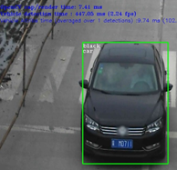

# Tutorial Step 3: Add a second model, Vehicle Attributes Detection


# Table of Contents

<p></p><div class="table-of-contents"><ul><li><a href="#tutorial-step-3-add-a-second-model-vehicle-attributes-detection">Tutorial Step 3: Add a second model, Vehicle Attributes Detection</a></li><li><a href="#table-of-contents">Table of Contents</a></li><li><a href="#introduction">Introduction</a></li><li><a href="#vehicle-attributes-detection-model">Vehicle Attributes Detection Model</a></li><li><a href="#adding-the-vehicle-attributes-detection-model">Adding the Vehicle Attributes Detection Model</a><ul><li><a href="#vehicleattribsdetection">VehicleAttribsDetection</a><ul><li><a href="#vehicleattribsdetection">VehicleAttribsDetection()</a></li><li><a href="#submitrequest">submitRequest()</a></li><li><a href="#enqueue">enqueue()</a></li><li><a href="#fetchresults">fetchResults()</a></li><li><a href="#read">read()</a></li></ul></li></ul></li><li><a href="#using-vehicleattribsdetectionx">Using VehicleAttribsDetectionx</a><ul><li><a href="#main">main()</a></li><li><a href="#main-loop">Main Loop</a><ul><li><a href="#pipeline-stage-0-prepare-and-infer-a-batch-of-frames">Pipeline Stage 0: Prepare and Infer a Batch of Frames</a></li><li><a href="#pipeline-stage-1-infer-vehicle-attributes">Pipeline Stage 1: Infer Vehicle Attributes</a></li><li><a href="#pipeline-stage-2-render-results">Pipeline Stage 2: Render Results</a></li></ul></li><li><a href="#post-main-loop">Post-Main Loop</a></li></ul></li><li><a href="#building-and-running">Building and Running</a><ul><li><a href="#build">Build</a></li><li><a href="#run">Run</a></li></ul></li><li><a href="#checking-performance">Checking Performance</a></li><li><a href="#conclusion">Conclusion</a></li><li><a href="#navigation">Navigation</a></li></ul></div><p></p>

# Introduction

Welcome to Car Detection Tutorial Step 3.  Now that the application can detect vehicles in images, we want it to tell us what type of vehicles were found and what color the vehicle are.  The precompiled "vehicle-attributes-recognition-barrier-0010" model included with the OpenVINO toolkit is what we will be using to accomplish this.  The sample output below shows the results where the ROI box now appears with the vehicle type (e.g. “car”) and its color (e.g. “black”).  The metrics reported now also include the time to run the vehicle attribute detection model.



# Vehicle Attributes Detection Model

The OpenVINO toolkit provides a pre-compiled model for inferring vehicle type and color from an image of a car.  You can find it at:

* /opt/intel/computer_vision_sdk/deployment_tools/intel_models/vehicle-attributes-recognition-barrier-0010

    * Available model locations are:

        * FP16

        * /opt/intel/computer_vision_sdk/deployment_tools/intel_models/vehicle-attributes-recognition-barrier-0010/FP16/vehicle-attributes-recognition-barrier-0010.xml

        * FP32

        * /opt/intel/computer_vision_sdk/deployment_tools/intel_models/vehicle-attributes-recognition-barrier-0010/FP32/vehicle-attributes-recognition-barrier-0010.xml

    * More details can be found at:

        * file:///opt/intel/computer_vision_sdk/deployment_tools/intel_models/vehicle-attributes-recognition-barrier-0010/description//vehicle-attributes-recognition-barrier-0010.html

The results it is capable of producing are shown in the summary below (for more details, see the descriptions HTML pages for each model): 

<table>
  <tr>
    <td>Model</td>
    <td>GFLOPS</td>
    <td>MParameters</td>
    <td>Average Accuracy</td>
  </tr>
  <tr>
    <td>vehicle-attributes-recognition-barrier-0010</td>
    <td>0.873</td>
    <td>0.626</td>
    <td>Color accuracy: 82.61%
Type accuracy: 87.85%</td>
  </tr>
</table>


# Adding the Vehicle Attributes Detection Model

Thanks to the setup work done in Tutorial Step 2, adding the vehicle attributes detection model in this step will just be a matter of deriving a new class from the BaseDetection class, adding an additional command line argument to specify the new model, and updating the application to run and track the statistics for the new model.  This means there will not be as much code to walk through this time.

1. Open up an Xterm window or use an existing window to get to a command shell prompt.

2. Change to the directory containing Tutorial Step 3:

```bash
cd tutorials/car_detection_tutorial/step_3
```


3. Open the files "main.cpp" and “car_detection.hpp” in the editor of your choice such as ‘gedit’, ‘gvim’, or ‘vim’.

## VehicleAttribsDetection

VehicleAttribsDetection is derived from the BaseDetection class and adding some new member variables that will be needed along with using the operator= from the base class.

```cpp
struct VehicleAttribsDetection : BaseDetection {
    std::string inputName;
    std::string outputNameForType;
    std::string outputNameForColor;
    int enquedVehicles = 0;

    using BaseDetection::operator=;
```


### VehicleAttribsDetection()

On construction of a VehicleAttribsDetection object, the base class constructor is called passing in the model to load specified in the command line argument FLAGS_m_va, the name to be used when we printing out informational messages, and set the batch size to the command line argument FLAFS_n_va.  This initializes the BaseDetection subclass specifically for VehicleAttribsDetection class.

```cpp
    VehicleAttribsDetection() : BaseDetection(FLAGS_m_va, "Vehicle Attribs", FLAGS_n_va) {}
```


### submitRequest()

The submitRequest() function is overridden to make sure that there are vehicles queued up to be processed before calling BaseDetection::submitRequest() to start inference.

```cpp
    void submitRequest() override {
        if (!enquedVehicles) return;
        BaseDetection::submitRequest();
        enquedVehicles = 0;
    }
```


### enqueue()

A check is made to see that the vehicle attributes detection model is enabled.  Also check to make sure that the number of inputs does not exceed the batch size.  

```cpp
    void enqueue(const cv::Mat &Vehicle) {
        if (!enabled()) {
            return;
        }
        if (enquedVehicles >= maxBatch) {
            slog::warn << "Number of detected vehicles more than maximum(" << maxBatch << ") processed by Vehicles Attributes detector" << slog::endl;
            return;
        }
```


An inference request object is created if one has not been already created.  The request object is used for holding input and output data, starting inference, and waiting for completion and results.

```cpp
        if (!request) {
            request = net.CreateInferRequestPtr();
        }
```


The input blob from the request is retrieved and then matU8ToBlob() is used to copy the image image data into the blob.

```cpp
        auto  inputBlob = request->GetBlob(input);

        if (matU8ToBlob<uint8_t>(Vehicle, inputBlob, 1.0f, enquedVehicles)) {
        	enquedVehicles++;
        }
    }
```


### fetchResults()

fetchResults() will parse the inference results saving them in the "Results" variable.

1. A structure and vector are declared in the main class to store the information that fetchResults() will retrieve.

```cpp
   struct Attributes { std::string type; std::string color;};
   std::vector<Attributes> results;
```


2. Lookup arrays of string names are declared for the results coming from the model.  Clear out any previous results. 

```cpp
   void fetchResults() {
      static const std::string colors[] = {
         "white", "gray", "yellow", "red", "green", "blue", "black"
      };
      static const std::string types[] = {
         "car", "van", "truck", "bus"
      };

      results.clear();
```


3. A loop is used to iterate through all the results that were returned from the model.  From each result the vehicle type and color values are retrieved.

```cpp
      for (int bi = 0; bi < maxBatch; bi++) {
         // 7 possible colors for each vehicle and we should select the one with the maximum probability
         const auto colorsValues = request->GetBlob(outputNameForColor)->buffer().as<float*>() + (bi * 7);
         // 4 possible types for each vehicle and we should select the one with the maximum probability
         const auto typesValues  = request->GetBlob(outputNameForType)->buffer().as<float*>() + (bi * 4);
```


4. The type and color values are converted into indexes into the lookup arrays.  An Attrib object is created to hold the inferred type and color.

```cpp
         const auto color_id = std::max_element(colorsValues, colorsValues + 7) - colorsValues;
         const auto type_id =  std::max_element(typesValues,  typesValues  + 4) - typesValues;

         Attributes attrib( { types[type_id], colors[color_id] } );
```


5. A check is made to see if the application was requested to display the raw information (-r) and print it to the console if necessary.  

```cpp
         if (FLAGS_r) {
            std::cout << "[Vehicle Attribute detected: type=" << attrib.type << ","
                      << "color=" << attrib.color << "]" << std::endl;
         }
```


6. The populated Attrib object is added to the vector of results to be used later by the application.

```cpp
         results.push_back(attrib);
      }
   }
```


### read()

The next function we will walkthrough is the VehicleDetection::read() function which must be specialized specifically to the model that it will load and run. 

1. The Inference Engine API InferenceEngine::CNNNetReader object is used to load the model IR files.  This comes from the XML file that is specified on the command line using the "-m_va" parameter.  

```cpp
    CNNNetwork read() override {
        slog::info << "Loading network files for VehicleAttribs" << slog::endl;
        InferenceEngine::CNNNetReader netReader;
        /** Read network model **/
        netReader.ReadNetwork(FLAGS_m_va);
```


2. The maximum batch size is set to maxBatch (set using FLAGS_n_va which defaults to 1).

```cpp
        netReader.getNetwork().setBatchSize(maxBatch);
        slog::info << "Batch size is set to " << netReader.getNetwork().getBatchSize() << " for Vehicle Attribs" << slog::endl;
```


3. The IR .bin file of the model is read.

```cpp
        /** Extract model name and load it's weights **/
        std::string binFileName = fileNameNoExt(FLAGS_m_va) + ".bin";
        netReader.ReadWeights(binFileName);
```


4. The proper number of inputs is checked to make sure that the loaded model has only one input as expected.

```cpp
        slog::info << "Checking VehicleAttribs inputs" << slog::endl;
        InferenceEngine::InputsDataMap inputInfo(netReader.getNetwork().getInputsInfo());
        if (inputInfo.size() != 1) {
            throw std::logic_error("Vehicle Attribs topology should have only one input");
        }
```


5. The input data format is prepared by configuring it for the proper precision (U8 = 8-bit per BGR channel) and memory layout (NCHW) for the model.  

```cpp
        auto& inputInfoFirst = inputInfo.begin()->second;
        inputInfoFirst->setInputPrecision(Precision::U8);
        inputInfoFirst->getInputData()->setLayout(Layout::NCHW);
        inputName = inputInfo.begin()->first;
```


6. The model is verified to have the two output layers as expected for the vehicle color and type results.  Variables are created and initialized to hold the output names to retrieve the results from the model.

```cpp
        slog::info << "Checking VehicleAttribs outputs" << slog::endl;
        InferenceEngine::OutputsDataMap outputInfo(netReader.getNetwork().getOutputsInfo());
        if (outputInfo.size() != 2) {
            throw std::logic_error("Vehicle Attribs Network expects networks having two outputs");
        }
        auto it = outputInfo.begin();
        outputNameForColor = (it++)->second->name;  // color is the first output
        outputNameForType = (it++)->second->name;  // type is the second output
```


7. Where the model will be loaded is logged, the model is marked as being enabled, and the InferenceEngine::CNNNetwork object containing the model is returned.

```cpp
        slog::info << "Loading Vehicle Attribs model to the "<< FLAGS_d_va << " plugin" << slog::endl;
        _enabled = true;
        return netReader.getNetwork();
    }
};
```


# Using VehicleAttribsDetection

That takes care of specializing the BaseDetector class into the  VehicleAttribsDetection class for the vehicle attribute detection model.  We now move down into the main() function to see what additions have been made to use the vehicle attribute detection model to process detected vehicles.

## main()

1. In the main() function, the command line arguments FLAGS_d_va and FLAGS_m_va are added to cmdOptions.  Remember that the flags are defined in the car_detection.hpp file.

```cpp
        std::vector<std::pair<std::string, std::string>> cmdOptions = {
            {FLAGS_d, FLAGS_m}, {FLAGS_d_va, FLAGS_m_va}
        };
```


2. The vehicle attributes detection object is instantiated.

```cpp
        VehicleAttribsDetection VehicleAttribs;
```


3. The model is loaded into the Inference Engine and associated with the device using the Load helper class previously covered.

```cpp
        Load(VehicleAttribs).into(pluginsForDevices[FLAGS_d_va]);
```


4. The structure that holds a frame and associated data used to pass data from one pipeline stage to another is updated to include vehicle attributes results.

```cpp
      typedef struct {
         std::vector<cv::Mat*> batchOfInputFrames;
         cv::Mat* outputFrame;
         std::vector<cv::Rect> vehicleLocations;
         std::vector<cv::Rect> licensePlateLocations;
         std::vector<VehicleAttribsDetection::Attributes> vehicleAttributes;
      } FramePipelineFifoItem;
```


5. Another FIFO is added to pass data to the new pipeline stage.

```cpp
      FramePipelineFifo pipeS1toS2Fifo;
```


## Main Loop

A new pipeline stage is added to the main loop to infer vehicle attributes.

### Pipeline Stage 0: Prepare and Infer a Batch of Frames

Stage 0 remains the same passing vehicle detection results to the next stage via pipeS0toS1Fifo.

### Pipeline Stage 1: Infer Vehicle Attributes

Pipeline Stage 1 is the new stage inserted to infer vehicle attributes.

1. If the vehicle attribute detection model is enabled, then while there are items in the input fifo pipeS0toS1Fifo, get and remove the first item from the input FIFO.work pipeline.

```cpp
ms AttribsNetworkTime(0);
int AttribsInferred = 0;
if (VehicleAttribs.enabled()) {
   while(!pipeS0toS1Fifo.empty()) {
      FramePipelineFifoItem ps0s1i = pipeS0toS1Fifo.front();
      pipeS0toS1Fifo.pop();
```


2. From the results for the frame, the number of vehicles that were found is stored in totalVehicles.  A loop is started to prepare a batch of vehicles for inference.

```cpp
      const int totalVehicles = ps0s1i.vehicleLocations.size();
      int numVehiclesInferred = 0;

      int rib = 0;
      while( numVehiclesInferred < totalVehicles) {
```


3. The loop runs until the input batch is full or done with all vehicles.  The loop enqueues all vehicles ROIs from the frame.

```cpp
         for(; rib < totalVehicles; rib++) {
            if (VehicleAttribs.enquedVehicles >= VehicleAttribs.maxBatch) {
               break;
            }
            auto clippedRect = ps0s1i.vehicleLocations[rib] & cv::Rect(0, 0, width, height);
            auto Vehicle = (*ps0s1i.outputFrame)(clippedRect);
            VehicleAttribs.enqueue(Vehicle);
         }
```


4. If there are vehicles enqueued, then submit a request to infer the vehicle attributes and wait for the results.

```cpp
         if (VehicleAttribs.enquedVehicles > 0) {
            // track how many vehicles have been inferred
            AttribsInferred += VehicleAttribs.enquedVehicles;

            t0 = std::chrono::high_resolution_clock::now();
            VehicleAttribs.submitRequest();

            // wait for results
            VehicleAttribs.wait();
            t1 = std::chrono::high_resolution_clock::now();
            AttribsNetworkTime += std::chrono::duration_cast<ms>(t1 - t0);
```


5. The inference results are fetched and stored them in the frame being processed.  The total number of vehicles that have been inferred is tracked using numVehiclesInferred.

```cpp
            VehicleAttribs.fetchResults();
            int numVAResuls = VehicleAttribs.results.size();

            int batchIndex = 0;
            while(batchIndex < numVAResuls) {
               VehicleAttribsDetection::Attributes& res = VehicleAttribs.results[batchIndex];
               ps0s1i.vehicleAttributes.push_back(res);
               batchIndex++;
            }
            numVehiclesInferred += numVAResuls;
         }
      }
```


6. The frame is passed to the next stage.  This needs to be done whether or not there are attribute inference results to pass along.

```cpp
      pipeS1toS2Fifo.push(ps0s1i);
   }
```


7. If vehicle attribute detection was not enabled, then just pass the input frames to the next stage of the pipeline.

```cpp
   } else {
   // not running vehicle attributes, just pass along frames
      while (!pipeS0toS1Fifo.empty()) {
         FramePipelineFifoItem fpfi = pipeS0toS1Fifo.front();
         pipeS0toS1Fifo.pop();
         pipeS1toS2Fifo.push(fpfi);
      }
   }
```


### Pipeline Stage 2: Render Results

Rendering results has been moved down the pipeline now becoming Stage 2.  The stage still    takes the inference results gathered in the previous stages and renders them for display, now with the addition of rendering vehicle attributes.

1. This is the new code that adds the vehicle attribute information to the image.  

```cpp
   int numVehicles = ps1s2i.vehicleAttributes.size();
   for(int vi = 0; vi < numVehicles; vi++) {
      VehicleAttribsDetection::Attributes& res = ps1s2i.vehicleAttributes[vi];
      cv::Rect vLoc = ps1s2i.vehicleLocations[vi];
      cv::putText(outputFrame,
                  res.color,
                  cv::Point2f(vLoc.x, vLoc.y + 15),
                  cv::FONT_HERSHEY_COMPLEX_SMALL,
                  0.8,
                  cv::Scalar(255, 255, 255));
      cv::putText(outputFrame,
                  res.type,
                  cv::Point2f(vLoc.x, vLoc.y + 30),
                  cv::FONT_HERSHEY_COMPLEX_SMALL,
                  0.8,
                  cv::Scalar(255, 255, 255));
   if (FLAGS_r) {
      std::cout << "Vehicle Attributes results:" << res.color << ";" << res.type << std::endl;
      }
```


2. And the new code to print out the execution statistics for the vehicle attribute inference.

```cpp
   if (VehicleAttribs.enabled() && AttribsInferred > 0) {
      float average_time = AttribsNetworkTime.count() / AttribsInferred;
      out.str("");
      out << "Vehicle Attribs time (averaged over " << AttribsInferred << " detections) :" << std::fixed
          << std::setprecision(2) << average_time << " ms " << "(" << 1000.f / average_time << " fps)";
      cv::putText(outputFrame, out.str(), cv::Point2f(0, 65), cv::FONT_HERSHEY_SIMPLEX, 0.5,
                  cv::Scalar(255, 0, 0));
   }
```


## Post-Main Loop

Vehicle attribute detection object is added to display the performance count information.

```cpp
if (FLAGS_pc) {
   VehicleDetection.printPerformanceCounts();
   VehicleAttribs.printPerformanceCounts();
}
```


# Building and Running

Now that we have walked through the added code and learned what it does, it is time to build the application and see it in action using two models to infer image information.

## Build

1. Open up an Xterm window or use an existing window to get to a command shell prompt.

2. Change to the directory containing Tutorial Step 3:

```bash
cd tutorials/car_detection_tutorial/step_3
```


3. The first step is to configure the build environment for the OpenCV toolkit by sourcing the "setupvars.sh" script.

```bash
source  /opt/intel/computer_vision_sdk/bin/setupvars.sh
```


4. Now we need to create a directory to build the tutorial in and change to it.

```bash
mkdir build
cd build
```


5. The last thing we need to do before compiling is to configure the build settings and build the executable.  We do this by running CMake to set the build target and file locations.  Then we run Make to build the executable.

```bash
cmake -DCMAKE_BUILD_TYPE=Release ../
make
```


## Run

1. Before running, be sure to source the helper script that will make it easier to use environment variables instead of long names to the models:

```bash
source ../../scripts/setupenv.sh 
```


2. You now have the executable file to run ./intel64/Release/car_detection_tutorial.  In order to load the vehicle attribute detection model, the "-m_va" flag needs to be added  followed by the full path to the model.  First let us see how it works on a single image file:

```bash
./intel64/Release/vehicle_detection_tutorial -m $mVLP32 -m_va $mVA32 -i ../../data/car_1.bmp
```


3. The output window will show the image overlaid with colored rectangles over each of the detected vehicles and license plates.  There will also be text within the vehicle box indicating type and color.  The timing statistics for inferring the vehicle attribute results are also shown.  Next, let us try it on a video file.

```bash
./intel64/Release/vehicle_detection_tutorial -m $mVLP32 -m_va $mVA32 -i ../../data/car-detection.mp4
```


4. You should see rectangles that follow the cars and license plates as they move around the image.  The accompanying vehicle attributes text (type and color) will also appear in the rectangles.  Finally, let us see how it works for camera input.

```bash
./intel64/Release/vehicle_detection_tutorial -m $mVLP32 -m_va $mVA32 -i cam
```


Or

```bash
./intel64/Release/vehicle_detection_tutorial -m $mVLP32 -m_va $mVA32
```


5. Again, you will see output similar to the output from the video, but appropriate to the cars in your office, or maybe outside a nearby window.

# Checking Performance

Now that we’ve seen how we have the application running two models to process images and make inferences, let us explore optimizing the performance of the application.  In general, performance increases by spreading the inference work across several devices, assign the more complex tasks to the fastest devices, and use FP16 precision instead of FP32 whenever possible.  Let us see how the models we are using perform when we start moving them to different devices using the combinations:

```Bash
# command line #1
./intel64/Release/car_detection_tutorial -m $mVLP32 -d CPU -m_va $mVA32 -d_va CPU  -i ../../data/car-detection.mp4
# command line #2
./intel64/Release/car_detection_tutorial -m $mVLP32 -d CPU -m_va $mVA16 -d_va MYRIAD  -i ../../data/car-detection.mp4
# command line #3
./intel64/Release/car_detection_tutorial -m $mVLP16 -d MYRIAD -m_va $mVA32 -d_va CPU  -i ../../data/car-detection.mp4
# command line #4
./intel64/Release/car_detection_tutorial -m $mVLP16 -d MYRIAD -m_va $mVA16 -d_va MYRIAD  -i ../../data/car-detection.mp4
# command line #5
./intel64/Release/car_detection_tutorial -m $mVLP32 -d CPU -m_va $mVA32 -d_va GPU  -i ../../data/car-detection.mp4
# command line #6
./intel64/Release/car_detection_tutorial -m $mVLP32 -d CPU -m_va $mVA16 -d_va GPU  -i ../../data/car-detection.mp4
# command line #7
./intel64/Release/car_detection_tutorial -m $mVLP16 -d MYRIAD -m_va $mVA32 -d_va GPU  -i ../../data/car-detection.mp4
# command line #8
./intel64/Release/car_detection_tutorial -m $mVLP16 -d MYRIAD -m_va $mVA16 -d_va GPU  -i ../../data/car-detection.mp4
# command line #9
./intel64/Release/car_detection_tutorial -m $mVLP32 -d GPU -m_va $mVA32 -d_va CPU  -i ../../data/car-detection.mp4
# command line #10
./intel64/Release/car_detection_tutorial -m $mVLP16 -d GPU -m_va $mVA32 -d_va CPU  -i ../../data/car-detection.mp4
# command line #11
./intel64/Release/car_detection_tutorial -m $mVLP32 -d GPU -m_va $mVA16 -d_va MYRIAD  -i ../../data/car-detection.mp4
# command line #12
./intel64/Release/car_detection_tutorial -m $mVLP16 -d GPU -m_va $mVA16 -d_va MYRIAD  -i ../../data/car-detection.mp4
# command line #13
./intel64/Release/car_detection_tutorial -m $mVLP32 -d GPU -m_va $mVA32 -d_va GPU  -i ../../data/car-detection.mp4
# command line #14
./intel64/Release/car_detection_tutorial -m $mVLP32 -d GPU -m_va $mVA16 -d_va GPU  -i ../../data/car-detection.mp4
```


Note: It can take a lot of time to run all the commands so the exercise of running and verifying is left to the user.  

The results seen from the commands should be similar in order to the summary in the table below:

<table>
  <tr>
    <td>Command Line #</td>
    <td>Vehicle</td>
    <td>Vehicle Attributes</td>
    <td>Average Main Loop Time (FPS)</td>
    <td>Average Main Loop Time (FPS)</td>
  </tr>
  <tr>
    <td>1</td>
    <td>CPU,FP32</td>
    <td>CPU,FP32</td>
    <td>256.13</td>
    <td>3.90</td>
  </tr>
  <tr>
    <td>2</td>
    <td>CPU,FP32</td>
    <td>MYRIAD,FP16</td>
    <td>158.52</td>
    <td>6.31</td>
  </tr>
  <tr>
    <td>3</td>
    <td>MYRIAD,FP16</td>
    <td>CPU,FP32</td>
    <td>154.97</td>
    <td>6.45</td>
  </tr>
  <tr>
    <td>4</td>
    <td>MYRIAD,FP16</td>
    <td>MYRIAD,FP16</td>
    <td>148.23</td>
    <td>6.75</td>
  </tr>
  <tr>
    <td>5</td>
    <td>CPU,FP32</td>
    <td>GPU,FP32</td>
    <td>139.20</td>
    <td>7.18</td>
  </tr>
  <tr>
    <td>6</td>
    <td>CPU,FP32</td>
    <td>GPU,FP16</td>
    <td>129.14</td>
    <td>7.74</td>
  </tr>
  <tr>
    <td>7</td>
    <td>MYRIAD,FP16</td>
    <td>GPU,FP32</td>
    <td>125.41</td>
    <td>7.97</td>
  </tr>
  <tr>
    <td>8</td>
    <td>MYRIAD,FP16</td>
    <td>GPU,FP16</td>
    <td>122.62</td>
    <td>8.16</td>
  </tr>
  <tr>
    <td>9</td>
    <td>GPU,FP32</td>
    <td>CPU,FP32</td>
    <td>102.86</td>
    <td>9.72</td>
  </tr>
  <tr>
    <td>10</td>
    <td>GPU,FP16</td>
    <td>CPU,FP32</td>
    <td>93.45</td>
    <td>10.70</td>
  </tr>
  <tr>
    <td>11</td>
    <td>GPU,FP32</td>
    <td>MYRIAD,FP16</td>
    <td>88.00</td>
    <td>11.36</td>
  </tr>
  <tr>
    <td>12</td>
    <td>GPU,FP16</td>
    <td>MYRIAD,FP16</td>
    <td>80.93</td>
    <td>12.36</td>
  </tr>
  <tr>
    <td>13</td>
    <td>GPU,FP32</td>
    <td>GPU,FP32</td>
    <td>62.15</td>
    <td>16.09</td>
  </tr>
  <tr>
    <td>14</td>
    <td>GPU,FP32</td>
    <td>GPU,FP16</td>
    <td>59.48</td>
    <td>16.81</td>
  </tr>
</table>


From measuring total time of the application, we see the fastest results are for the combinations when offloading from the CPU and running the vehicle model on the GPU and the vehicle attributes model on the GPU or MYRIAD.

# Conclusion

Building on the single model application from Tutorial Step 2, this step has shown that using a second inference model in an application is just as easy as using the first.  We also showed some techniques to pipeline the program flow.  This makes it easier to group input data with its results and pass it through the application pipeline.  We also explored increasing performance by optimizing how the application loads models onto different devices.

Continuing to Tutorial Step 4, we will see another method of increasing performance, when we introduce running the models asynchronously.  This will allow the application to have multiple models analyzing images along with the CPU using OpenCV and managing data all running in parallel.

# Navigation

[Car Detection Tutorial](../Readme.md)

[Car Detection Tutorial Step 2](../step_2/Readme.md)

[Car Detection Tutorial Step 4](../step_4/Readme.md)

