# Tutorial Step 4: Using Asynchronous API

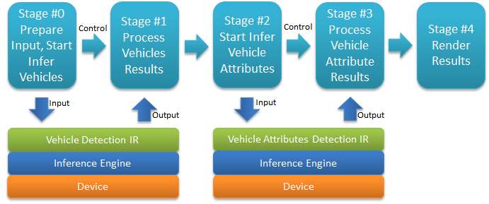

# Table of Contents

<p></p><div class="table-of-contents"><ul><li><a href="#tutorial-step-4-using-asynchronous-api">Tutorial Step 4: Using Asynchronous API</a></li><li><a href="#table-of-contents">Table of Contents</a></li><li><a href="#introduction">Introduction</a></li><li><a href="#using-the-asynchronous-api">Using the Asynchronous API</a><ul><li><a href="#command-line-arguments">Command Line Arguments</a></li><li><a href="#basedetection-class">BaseDetection Class</a><ul><li><a href="#basedetection">BaseDetection()</a></li><li><a href="#submitrequest">submitRequest()</a></li><li><a href="#wait">wait()</a></li><li><a href="#resultisready">resultIsReady()</a></li><li><a href="#requestsinprocess">requestsInProcess()</a></li><li><a href="#cansubmitrequest">canSubmitRequest()</a></li></ul></li><li><a href="#vehicledetection-class">VehicleDetection Class</a><ul><li><a href="#submitrequest">submitRequest()</a></li><li><a href="#enqueue">enqueue()</a></li><li><a href="#fetchresults">fetchResults()</a></li></ul></li><li><a href="#vehicleattribsdetection-class">VehicleAttribsDetection Class</a><ul><li><a href="#enqueue">enqueue()</a></li><li><a href="#fetchresults">fetchResults()</a></li></ul></li><li><a href="#main">main()</a><ul><li><a href="#report-async-mode">Report Async Mode</a></li><li><a href="#increase-storage">Increase Storage</a></li><li><a href="#add-pipeline-data-fields-and-storage">Add Pipeline Data Fields and Storage</a></li><li><a href="#main-loop">Main Loop</a><ul><li><a href="#pipeline-stage-0-prepare-and-start-inferring-a-batch-of-frames">Pipeline Stage #0: Prepare and Start Inferring a Batch of Frames</a></li><li><a href="#pipeline-stage-1-process-vehicles-inference-results">Pipeline Stage #1: Process Vehicles Inference Results</a></li><li><a href="#pipeline-stage-2-start-inferring-vehicle-attributes">Pipeline Stage #2: Start Inferring Vehicle Attributes</a></li><li><a href="#pipeline-stage-3-process-vehicle-attribute">Pipeline Stage #3: Process Vehicle Attribute</a></li><li><a href="#pipeline-stage-4-render-results">Pipeline Stage #4: Render Results</a></li><li><a href="#end-of-loop">End of Loop</a></li></ul></li></ul></li></ul></li><li><a href="#building-and-running">Building and Running</a><ul><li><a href="#command-line-using-make">Command Line using Make</a><ul><li><a href="#build">Build</a></li><li><a href="#run">Run</a></li></ul></li><li><a href="#intel-system-studio">Intel® System Studio</a><ul><li><a href="#build">Build</a><ul><li><a href="#start-intel-system-studio">Start Intel® System Studio</a></li><li><a href="#create-project">Create Project</a></li><li><a href="#configure-project">Configure Project</a></li><li><a href="#build-executable">Build Executable</a></li></ul></li><li><a href="#run">Run</a><ul><li><a href="#create-run-configuration">Create Run Configuration</a></li><li><a href="#how-to-set-command-line-arguments">How to Set Command Line Arguments</a></li><li><a href="#how-to-run-the-executable">How to Run the Executable</a></li><li><a href="#running">Running</a></li></ul></li></ul></li></ul></li><li><a href="#conclusion">Conclusion</a></li><li><a href="#navigation">Navigation</a></li></ul></div><p></p>

# Introduction

In Car Detection Tutorial Step 4, we will see how the code from Tutorial Step 3 has been modified to make use of the Inference Engine asynchronous API to make multiple inference requests without waiting for results.  The changes necessary include:

1. Add data structures to support multiple requests:

   1. Multiple request objects

   2. Multiple input data storage objects for each request

   3. Tracking objects for outstanding requests, data, etc.

2. Breakup previous stages #0 and #1 that ran inference synchronously into two new stages: "start inference" and “process results”

3. Change pipeline stages from running sequentially to making each stage data driven and run independently in the main loop:

   1. Stage #0 now first checks to see if new vehicle inference requests can be made, if so it prepares input image(s) and starts inference.

   2. Stage #1 now first checks to see if vehicle inference results are available and processes them, if not the main loop continues to the next stage.

   3. Stage #2 now first checks to see if there are vehicles available to infer as well as if vehicle attributes inference requests can be made, if so it prepares input vehicle(s) and starts inference.

   4. Stage #3 now first checks to see if vehicle attribute inference results are available and processes them, if not the main loop continues to the next stage.

   5. Stage #4 now first checks to see if all results are available and renders them, if not it continues the loop starting back with Stage #1.

# Using the Asynchronous API

In the Key Concepts section we learned the difference between the synchronous and asynchronous API.  Here we will see the changes necessary for asynchronous applied.  Below are code walkthroughs of the changes made to code from Tutorial Step 3 focusing primarily on the changes made rather than the entire code when possible.

1. Open up a terminal window or use an existing terminal to get to a command shell prompt.

2. Change to the directory containing Tutorial Step 4:

```bash
cd tutorials/computer-vision-inference-dev-kit-tutorials/car_detection_tutorial/step_4
```


3. Open the files "main.cpp" and “car_detection.hpp” in the editor of your choice such as ‘gedit’, ‘gvim’, or ‘vim’.

## Command Line Arguments

The command line argument -n_async has been added to control how many outstanding API requests are to be allowed when running each model.  Setting -n_async to 1 is effectively the same as synchronous mode since later stages in the pipeline will not have anything to do until the results appear.  The following code in car_detection.hpp adds the -n_async argument to appear in the code as the variable FLAGS_n_async:

``` Cpp
/// @brief message async function flag
static const char async_depth_message[] = "Maximum number of outstanding async API calls allowed (1=synchronous=default, >1=asynchronous).";

/// \brief parameter to set depth (number of outstanding requests) of asynchronous API calls <br>
/// It is an optional parameter
DEFINE_uint32(n_async, 1, async_depth_message);
```


Later in main.cpp in a check is added to ParseAndCheckCommandLine() to ensure n_async is 1 or greater.

```cpp
    if (FLAGS_n_async < 1) {
        throw std::logic_error("Parameter -n_async must be >= 1");
    }
```


## BaseDetection Class

The BaseDetection class has been modified to allow for more than one request to exist.  First the single request storage is replaced with the following:

```cpp
    std::queue<InferRequest::Ptr> submittedRequests;
    std::vector<InferRequest::Ptr> requests;
    int inputRequestIdx;
    InferRequest::Ptr outputRequest;
    int maxSubmittedRequests;
```


In the code:

* submittedRequests - is a FIFO to track outstanding inference requests 

* requests - holds all the available inference requests that are reused

* inputRequestIdx - an index into ‘requests’ used to select the next one to use

* outputRequest - holds the current output request for retrieving outputs

* maxSubmittedRequests - the maximum number of outstanding requests allowed (set using -n_async)

### BaseDetection()

The constructor is changed to initialize the new storage variables:

```cpp
    BaseDetection(std::string &commandLineFlag, std::string topoName, int maxBatch)
        : commandLineFlag(commandLineFlag), topoName(topoName), maxBatch(maxBatch), maxSubmittedRequests(FLAGS_n_async),
		  plugin(nullptr), inputRequestIdx(0), outputRequest(nullptr), requests(FLAGS_n_async) {}
```


Note specifically ‘requests’ and maxSubmittedRequests being set to FLAGS_N_async, inputEequestIdx set to start from 0, and outputRequest set to nullptr (empty).

### submitRequest()

When submitting an asynchronous request:

1. The detector must be enabled and the current input request must not be null:

```cpp
virtual void submitRequest() {
        if (!enabled() || nullptr == requests[inputEequestIdx]) return;
```


2. The request is started asynchronously:

```cpp
       requests[inputEequestIdx]->StartAsync();
```


3. The request is recorded as outstanding:

```cpp
        submittedRequests.push(requests[inputEequestIdx]);
```


4. The input index is cycled to the next input request to be used:

```cpp
        inputEequestIdx++;
        if (inputEequestIdx >= maxSubmittedRequests) {
        	inputEequestIdx = 0;
        }
    }
```


### wait()

When waiting for results of first (oldest) outstanding request:

1. A check is made to make sure detector is enabled:

```cpp
virtual void wait() {
        if (!enabled()) return;
```


2. The first outstanding request to wait on is retrieved:

```cpp
        // get next request to wait on
        if (nullptr == outputRequest) {
```


3. A check is made to make sure there is an outstanding request:

```cpp
        	if (submittedRequests.size() < 1) return;
```


4. The request is retrieved and removed from tracking FIFO :

```cpp
        	outputRequest = submittedRequests.front();
        	submittedRequests.pop();
        }
```


5. The request results are waited on until ready.  This is effectively a blocking synchronous call to Wait(), however other functions described below are used to check status without blocking.  

```cpp
        outputRequest->Wait(IInferRequest::WaitMode::RESULT_READY);
    }
```


### resultIsReady()

resultIsReady() has been added to tell when results are ready without blocking:

```cpp
    // call before wait() to check status
    bool resultIsReady() {
```


To check status, at least one outstanding request must be present:

```cpp
    	if (submittedRequests.size() < 1) return false;
```


A non-blocking call is made to the request’s Wait() to get status:

```Cpp
    	StatusCode state = submittedRequests.front()->Wait(IInferRequest::WaitMode::STATUS_ONLY);
		return (StatusCode::OK == state);
    }
```


### requestsInProcess()

requestsInProcess() has been added to tell when a request is being processed.

```Cpp
    bool requestsInProcess() {
```


The submitted requests FIFO size is checked, if it has a request in it then at least one requests is in process:

```cpp    
	// request is in progress if number of outstanding requests is > 0
    	return (submittedRequests.size() > 0);
    }
```


### canSubmitRequest()

canSubmitRequest() has been added to tell when a request can be made.

```cpp
    bool canSubmitRequest() {
```


If the number of outstanding requests is less than maximum, then a request can be made:

```Cpp
    	// ready when another request can be submitted
    	return (submittedRequests.size() < maxSubmittedRequests);
    }
```


## VehicleDetection Class

The VehicleDetection class has been updated to work with multiple requests.

### submitRequest()

submitRequest() no longer sets "resultsFetched" or clears “results”.

### enqueue()

enqueue() has the changes:

1. Instead of creating a single request, it will populate "requests[]" whenever a request object has not been created yet.

```cpp
        if (nullptr == requests[inputRequestIdx]) {
        	requests[inputRequestIdx] = net.CreateInferRequestPtr();
        }
```


2. The single "request" has been replaced to use current input request “requests[inputRequestIdx]” when using auto resize or not:

```Cpp
       if (FLAGS_auto_resize) {
            inputBlob = wrapMat2Blob(frame);
            requests[inputRequestIdx]->SetBlob(input, inputBlob);
       } else {
		inputBlob = requests[inputRequestIdx]->GetBlob(input);
		matU8ToBlob<uint8_t >(frame, inputBlob, enquedFrames);
    	 }
```


### fetchResults()

fetchResults() has the changes:

1. "resultsFetched" has been replaced with check that “outputRequest” is valid:

```cpp
        if (nullptr == outputRequest) {
        	return;
        }
```


2. The single "request" has been replaced to use “outputRequest” now set to current output request:

```cpp
        const float *detections = outputRequest->GetBlob(output)->buffer().as<float *>();
```


```cpp
\\ ...same processing of results...
```


3. The output request is marked as done by setting to nullptr:

```Cpp
		// done with request
		outputRequest = nullptr;
```


## VehicleAttribsDetection Class

The VehicleAttribsDetection class needs to be updated to work with multiple requests.

### enqueue()

enqueue() has the changes:

1. Instead of creating a single request, it will populate "requests[]" whenever a request object has not been created yet.

```cpp
        if (nullptr == requests[inputRequestIdx]) {
        	requests[inputRequestIdx] = net.CreateInferRequestPtr();
        }
```


2. The single "request" has been replaced to use current input request “requests[inputRequestIdx]” when using auto resize or not:

```cpp
        if (FLAGS_auto_resize) {
            // ... same cropping code ... 
            requests[inputRequestIdx]->SetBlob(inputName, inputBlob);
        } else {
        	// ... same cropping code ... 
        	inputBlob = requests[inputRequestIdx]->GetBlob(inputName);
		matU8ToBlob<uint8_t >(cropped, inputBlob, enquedVehicles);
    	}
```


### fetchResults()

fetchResults() has the changes:

1. "resultsFetched" has been replaced with the check that “outputRequest” is valid

```cpp
        if (nullptr == outputRequest) {
        	return;
        }
```


2. The single "request" has been replaced to use “outputRequest” now set to current output request:

```Cpp
			// 7 possible colors for each vehicle and we should select the one with the maximum probability
			const auto colorsValues = outputRequest->GetBlob(outputNameForColor)->buffer().as<float*>() + (bi * 7);
			// 4 possible types for each vehicle and we should select the one with the maximum probability
			const auto typesValues  = outputRequest->GetBlob(outputNameForType)->buffer().as<float*>() + (bi * 4);
```


```cpp
\\ ...same processing of results...
```


3. The output request is marked as done by setting to nullptr:

```Cpp
		// done with request
		outputRequest = nullptr;
```


## main()

Before the main loop in main() there are changes to output asynchronous mode being used, storage, and data fields.

### Report Async Mode

The value used for n_async is reported and whether running asynchronously or synchronously.

```Cpp 
        const bool runningAsync = (FLAGS_n_async > 1);
        slog::info << "FLAGS_n_async=" << FLAGS_n_async << ", inference pipeline will operate "
        		<< (runningAsync ? "asynchronously" : "synchronously")
        		<< slog::endl;
```


### Increase Storage

More input frames must be stored with outstanding requests being made.  The total number is increased to cover the maximum outstanding requests of batch size used:

```Cpp
        // read input (video) frames, need to keep multiple frames stored
        //  for batching and for when using asynchronous API.
        const int maxNumInputFrames = FLAGS_n_async * VehicleDetection.maxBatch + 1;  // +1 to avoid overwrite
```


### Add Pipeline Data Fields and Storage

1. "vehicleDetectionDone" and “vehicleAttributesDetectionDone” fields have been added to indicate when inference is completed for both models.  “numVehiclesInferred” has been added to track the number of inferred vehicles since Stage #2 and #3 are not complete until all vehicles have been run through vehicle attributes inference.

```cpp
		// structure to hold frame and associated data which are passed along
		//  from stage to stage for each to do its work
		typedef struct {
			std::vector<cv::Mat*> batchOfInputFrames;
			bool vehicleDetectionDone;
			cv::Mat* outputFrame;
			std::vector<cv::Rect> vehicleLocations;
			int numVehiclesInferred;
			std::vector<cv::Rect> licensePlateLocations;
			bool vehicleAttributesDetectionDone;
			std::vector<VehicleAttribsDetection::Attributes> vehicleAttributes;
		} FramePipelineFifoItem;
```


2. The previous stages that ran inference synchronously have been broken up into two new stages: "start inference" and “process results”.  More FIFOs have been added to account for more stages:

```Cpp
		FramePipelineFifo pipeS2toS3Fifo;
		FramePipelineFifo pipeS3toS4Fifo;
```


3. Stage #3 now needs to store vehicle attribute results in order to accumulate all the results coming from inference:

```cpp
		FramePipelineFifoItem accumVehAttribs;
		bool accumVehAttribsIsEmpty = true;
```


### Main Loop

The main loop sees changes to add new pipeline stages and to make each stage to be data driven and only run when there is something to do.

#### Pipeline Stage #0: Prepare and Start Inferring a Batch of Frames

Stage #0 from Tutorial Step 3 does both submit and wait for a inference request.  For asynchronous operation, it is broken up into Stage #0 to do the submit and Stage #1 to do the wait.  The new Stage #0 looks very much like the first half, up through submitting the inference request with a couple changes:

1. In addition to if there are input frames still available ("haveMoreFrames"), Stage #0 now also checks to see if an input frame buffer is available via !inputFramePtrs.empty()  and that there is a request available to use via VehicleDetection.canSubmitRequest():

```Cpp
			/* *** Pipeline Stage 0: Prepare and Start Inferring a Batch of Frames *** */
        	// if there are more frames to do and a request available, then prepare and start batch
			if (haveMoreFrames && !inputFramePtrs.empty() && VehicleDetection.canSubmitRequest()) {
				// prepare a batch of frames
                                               // ... preparation code ...
```


2. Stage #0 now ends after submitting the inference request and passing the necessary data to Stag #1 vis pipeS0toS1Fifo.push(ps0s1i).

```Cpp
				if (numFrames > 0) {
					// start request
					t0 = std::chrono::high_resolution_clock::now();
					// start inference
					VehicleDetection.submitRequest();

					// queue data for next pipeline stage
					pipeS0toS1Fifo.push(ps0s1i);
				}
```


#### Pipeline Stage #1: Process Vehicles Inference Results

Stage #1 is responsible for checking for and then processing vehicle inference results started by Stage #0.  

1. First a check is done to see whether there is work to be done.  When running synchronously (!runningAsync) if there is a request in progress, then enter the stage to wait for results.  When running asynchronously, check to see if a result is ready, then enter the stage and wait for the result (which will be a short wait).

```Cpp
			/* *** Pipeline Stage 1: Process Vehicles Inference Results *** */
			// sync: wait for results if a request was just submitted
			// async: if results are ready, then fetch and process in next stage of pipeline
			if ((!runningAsync && VehicleDetection.requestsInProcess()) || VehicleDetection.resultIsReady()) {
```


2. Results are waited on:

```cpp
        		// wait for results, async will be ready
				VehicleDetection.wait();
				t1 = std::chrono::high_resolution_clock::now();
				detection_time = std::chrono::duration_cast<ms>(t1 - t0);
```


3. The results are fetched from the request and stored in VehicleDetection.results:

```cpp
				// parse inference results internally (e.g. apply a threshold, etc)
				VehicleDetection.fetchResults();
```


4. For every request there is an input frame coming from Stage #0, it is retrieved from the FIFO:

```cpp
				// get associated data from last pipeline stage to use with results
				FramePipelineFifoItem ps0s1i = pipeS0toS1Fifo.front();
				pipeS0toS1Fifo.pop();
```


5. Each input frame in the batch that was input to the vehicle detection model now becomes its own input frame going forward down the pipeline:

```Cpp
				// prepare a FramePipelineFifoItem for each batched frame to get its detection results
				std::vector<FramePipelineFifoItem> batchedFifoItems;
				for (auto && bFrame : ps0s1i.batchOfInputFrames) {
					FramePipelineFifoItem fpfi;
					fpfi.outputFrame = bFrame;
					batchedFifoItems.push_back(fpfi);
				}
```


6. The results are iterated through putting detected vehicles and license plates (if model detects licenses plates too) with the associated input frame:

```Cpp
				// store results for next pipeline stage
				for (auto && result : VehicleDetection.results) {
					FramePipelineFifoItem& fpfi = batchedFifoItems[result.batchIndex];
					if (result.label == 1) {  // vehicle
						fpfi.vehicleLocations.push_back(result.location);
					} else { // license plate
						fpfi.licensePlateLocations.push_back(result.location);
					}
				}
```


7. The results are cleared for later re-use:

```Cpp
				// done with results, clear them
				VehicleDetection.results.clear();
```


8. Each of the input frames is sent to Stage #2:

```cpp
				// queue up output for next pipeline stage to process
				for (auto && item : batchedFifoItems) {
					item.batchOfInputFrames.clear(); // done with batch storage
					item.numVehiclesInferred = 0;
					item.vehicleDetectionDone = true;
					item.vehicleAttributesDetectionDone = false;
					pipeS1toS2Fifo.push(item);
				}
        	}
```


#### Pipeline Stage #2: Start Inferring Vehicle Attributes

Stage #1 from Tutorial Step 3 does both submit and wait for a inference request.  For asynchronous operation, it is broken up into Stage #2 to do the submit and Stage #3 to do the wait.  When VehicleAttribs.enabled() is false, Stage #2 has nothing to do so simply passes input frame to Stage #3. When VehicleAttribs.enabled() is true, the new Stage #2 looks similar to before but now has to handle submitting requests asynchronously which may require multiple passes for an input frame.

1. If Vehicle attributes model is enabled, then if there is an input frame coming from Stage #1 and requests are available to submit requests, then process an input frame:

```Cpp
			if (VehicleAttribs.enabled()) {
				if (!pipeS1toS2Fifo.empty() && VehicleAttribs.canSubmitRequest()) {
```


2. A reference to the FIFO first item is retrieved and the item will remain in the FIFO until all inference requests for the vehicles found have been made.  This can take multiple passes through Stage #2 because of batch size and/or the number of requests that can be made simultaneously. 

```cpp
					// grab reference to first item in FIFO, but do not pop until done inferring all vehicles in it
					FramePipelineFifoItem& ps1s2i = pipeS1toS2Fifo.front();

					const int totalVehicles = ps1s2i.vehicleLocations.size();
```


3. Vehicles are enqueued up to batch limit for inference starting where left off at "numVehiclesInferred":

```Cpp
					// enqueue input batch
					for(int rib = ps1s2i.numVehiclesInferred; rib < totalVehicles; rib++) {
						if (VehicleAttribs.enquedVehicles >= VehicleAttribs.maxBatch) {
							break;
						}
						VehicleAttribs.enqueue(*ps1s2i.outputFrame, ps1s2i.vehicleLocations[rib]);
					}
```


4. If there are vehicles, then an inference request is submitted and the number of inferences now started is recorded:

```Cpp
					// ----------------------------Run vehicleResult attribute inference ----------------
					// if there are vehicles to infer, submit a request to start
					if (VehicleAttribs.enquedVehicles > 0) {
						// track how many vehicles have been inferred
						ps1s2i.numVehiclesInferred += VehicleAttribs.enquedVehicles;
						AttribsInferred += VehicleAttribs.enquedVehicles;

						t0 = std::chrono::high_resolution_clock::now();
						VehicleAttribs.submitRequest();

					}
```


5. If this input frame has submitted inference requests for all its vehicles, then it is marked complete by removing (pop’ing) it from the input FIFO.  Whether all inferences are complete or not, always send an input frame to Stage #3 so it can look for inference results.

```cpp
					// make a copy before sending out
					FramePipelineFifoItem ps2s3out(ps1s2i);
					if ( ps2s3out.numVehiclesInferred >= totalVehicles) {
						// done with input FIFO item, pop from input FIFO
						pipeS1toS2Fifo.pop();
					}
					// always queue frame data for next pipeline stage to handle results even without doing inference
					pipeS2toS3Fifo.push(ps2s3out);
				}
```


6. If VehicleAttribs.enabled() is false, then the input frames are just passed through :

```Cpp
			} else {
				// not running vehicle attributes, just pass along frames
                                               // ... pass data from pipeS1toS2Fifo to pipeS2toS3Fifo ...
			}
```


#### Pipeline Stage #3: Process Vehicle Attribute

Stage #3 is responsible for checking for and then processing vehicle attributes inference results started by Stage #2.  When VehicleAttribs.enabled() is false, Stage #3 has nothing to do so simply passes input frame to Stage #4. When VehicleAttribs.enabled() is true, Stage #3 looks similar to how results were processed, but now has to handle results asynchronously and may require multiple passes to complete an input frame.

1. If the vehicle attributes model is enabled, then if there is an input frame coming from Stage #2, then an input frame is processed:

```Cpp
			/* *** Pipeline Stage 3: Process Vehicle Attribute Inference Results *** */
			if (VehicleAttribs.enabled()) {
				if (!pipeS2toS3Fifo.empty()) {
```


2. The first input frame in the FIFO is retrieved but is not removed until it has actually been processed.  Processing may not happen if inference results are not ready.

```Cpp
					FramePipelineFifoItem ps2s3i = pipeS2toS3Fifo.front();
					int numVehicles = ps2s3i.vehicleLocations.size();
```


3. If the input frame has no vehicles, then it is removed from the FIFO and sent to Stage #4.

```cpp
					if ( 0 == numVehicles) {
						// no vehicles are being inferred for this frame, we are done with it
						pipeS2toS3Fifo.pop();
						// queue frame data for next pipeline stage to handle results
						ps2s3i.vehicleAttributesDetectionDone = true;
						pipeS3toS4Fifo.push(ps2s3i);
					} else {
```


4. Input frame has vehicle(s) to infer.  If this is the first input frame (accumVehAttribsIsEmpty==true) then the attribute accumulator is reset to the new input frame, otherwise results will be added to the current input frame "accumVehAttribs".

```Cpp
						// expecting inference results, check for them while accumulating results
						// if first FIFO item for results, initialize from first item
						if (accumVehAttribsIsEmpty) {
							accumVehAttribs = ps2s3i;
							accumVehAttribsIsEmpty = false;
						}
```


5. First, a check is made to see if there is work to be done.  When running synchronously (!runningAsync) and if there is a request in progress, then enter the stage to wait for results.  When running asynchronously, a check is made to see if a result is ready, then the stage is entered to wait for the result (which will be a short wait).

```Cpp
						if ((!runningAsync && VehicleAttribs.requestsInProcess()) || VehicleAttribs.resultIsReady()) {
							// wait for results, async will be ready
							VehicleAttribs.wait();
							t1 = std::chrono::high_resolution_clock::now();
							AttribsNetworkTime += std::chrono::duration_cast<ms>(t1 - t0);
```


6. Fetch results which will be put into VehicleAttribs.results:

```Cpp
							// ----------------------------Process outputs-----------------------------------------------------
							VehicleAttribs.fetchResults();
```


7. Results are stored in current input frame in "accumVehAttribs"

```Cpp
							int numVAResuls = VehicleAttribs.results.size();

							int batchIndex = 0;
							while(batchIndex < numVAResuls) {
								VehicleAttribsDetection::Attributes& res = VehicleAttribs.results[batchIndex];
								accumVehAttribs.vehicleAttributes.push_back(res);
								batchIndex++;
							}
```


8. The number of inferred results is tracked.  If inference of all vehicles has been completed, then the input frame is sent off to Stage #4 and accumVehAttribs is marked as empty:

```cpp
							accumVehAttribs.numVehiclesInferred = ps2s3i.numVehiclesInferred;

							// only send out frame data when inference is complete
							if ( accumVehAttribs.numVehiclesInferred >= numVehicles) {
								// queue frame data for next pipeline stage to handle results
								accumVehAttribs.vehicleAttributesDetectionDone = true;
								pipeS3toS4Fifo.push(accumVehAttribs);
								accumVehAttribsIsEmpty = true;
							}
```


9. The inference results were processed for the input frame in the FIFO, it is removed from the FIFO:

```Cpp
							// done with this FIFO item
							pipeS2toS3Fifo.pop();
						}
					}
				}
```


10. VehicleAttribs.enabled() is false, the input frames are just passed through :

```Cpp
			} else {
				// not running vehicle attributes, just pass along frames
                                               // ... pass data from pipeS2toS3Fifo to pipeS3toS4Fifo ...
			}
```


#### Pipeline Stage #4: Render Results

The last pipeline stage renders all the results and looks just like the last stage in Tutorial Step 3 with the only small changes being:

1. The stage now reads from Stage #3 via pipeS3toS4Fifo:

```Cpp
			if (!pipeS3toS4Fifo.empty()) {
				FramePipelineFifoItem ps3s4i = pipeS3toS4Fifo.front();
				pipeS3toS4Fifo.pop();
```


2. When running asynchronously, the timing statistics are not accurate and are skipped:

```Cpp
				// When running asynchronously, timing metrics are not accurate so do not display them
				if (!runningAsync) {
					out.str("");
					out << "Vehicle detection time ";
					// .. statistics output code ...
```


#### End of Loop

Finally, the end of the main loop now checks to see that all stages are done before allowed to end.  The "done" variable now checks to make sure all stage FIFOs are empty before indicating the loop is done.

```Cpp
            // wait until break from key press after all pipeline stages have completed
            done = !haveMoreFrames && pipeS0toS1Fifo.empty() && pipeS1toS2Fifo.empty() && pipeS2toS3Fifo.empty() && pipeS3toS4Fifo.empty();
```


# Building and Running

Now let us build and run the complete application and see how it runs all three analysis models.  To do that, two ways are covered in the following sections: 1) Command line using "make" and 2) using Intel® System Studio (ISS).  Both ways do the same things, so choose according to your preference.

## Command Line using Make

The following covers how to build and run from the command line using "make".

### Build

1. Open up a terminal or use an existing terminal to get to a command shell prompt.

2. Change to the directory containing Tutorial Step 4:

```bash
cd tutorials/computer-vision-inference-dev-kit-tutorials/car_detection_tutorial/step_4
```


3. The first step is to configure the build environment for the Intel® Distribution of OpenVINO™ toolkit by sourcing the "setupvars.sh" script.

```bash
source  /opt/intel/computer_vision_sdk/bin/setupvars.sh
```


4. Now, create a directory to build the tutorial in and change to it.

```bash
mkdir build
cd build
```


5. The last thing we need to do before compiling is to configure the build settings and build the executable.  We do this by running CMake to set the build target and file locations.  Then run Make to build the executable.

```bash
cmake -DCMAKE_BUILD_TYPE=Release ../
make
```


### Run

1. Before running, be sure to source the helper script.  That will make it easier to use environment variables instead of long names to the models:

```bash
source ../../scripts/setupenv.sh 
```


2. First, let us see how it works on a single image file using default synchronous mode.

```bash
./intel64/Release/car_detection_tutorial -m $mVDR32 -m_va $mVA32 -i ../../data/car_1.bmp
```


3. The output window will show the image overlaid with colored rectangles over the cars and license plate (if model detects license plates too) along with and the timing statistics for computing the results.  Run the command again in asynchronous mode using the option "-n_async 2":

```bash
./intel64/Release/car_detection_tutorial -m $mVDR32 -m_va $mVA32 -i ../../data/car_1.bmp -n_async 2
```


4. The performance should be the same because a single image was run which is effectively the same as running synchronously since each pipeline stage must wait for the one image to process.

5. Next, let us try it on a video file. 

```bash
./intel64/Release/car_detection_tutorial -m $mVDR32 -m_va $mVA32 -i ../../data/cars_768x768.h264 -n_async 1
```


6. Over each frame of the video, you will see green rectangles drawn around the cars as they move through the parking lot.  Now run the command again in asynchronous mode using the option "-n_async 2":

```bash
./intel64/Release/car_detection_tutorial -m $mVDR32 -m_va $mVA32 -i ../../data/cars_768x768.h264 -n_async 2
```


7. Unexpectedly, asynchronous mode should have made the video take longer to run by >10%.  Why would that be?  With the main loop now running asynchronously and not blocking, it is now an additional thread running on the CPU along with the inference models.  Now let us shift running the models to other devices, first in synchronous mode then asynchronous with increasing -n_async value using the commands:

```Bash
./intel64/Release/car_detection_tutorial -m $mVDR16 -d GPU -m_va $mVA16 -d_va MYRIAD -i ../../data/cars_768x768.h264 -n_async 1
./intel64/Release/car_detection_tutorial -m $mVDR16 -d GPU -m_va $mVA16 -d_va MYRIAD -i ../../data/cars_768x768.h264 -n_async 2
./intel64/Release/car_detection_tutorial -m $mVDR16 -d GPU -m_va $mVA16 -d_va MYRIAD -i ../../data/cars_768x768.h264 -n_async 4
./intel64/Release/car_detection_tutorial -m $mVDR16 -d GPU -m_va $mVA16 -d_va MYRIAD -i ../../data/cars_768x768.h264 -n_async 8
./intel64/Release/car_detection_tutorial -m $mVDR16 -d GPU -m_va $mVA16 -d_va MYRIAD -i ../../data/cars_768x768.h264 -n_async 16
```


8. Asynchronous mode should be faster by some amount for "-n_async 2" then a little more for “-n_async 4” and “-n_async 8”, then not really noticeable for “-n_async 8”.  The improvements come from the CPU running in parallel more and more with the GPU and Myriad.  The absence of improvement shows when the CPU is doing less in parallel and is waiting on the other devices.  This is referred to as “diminishing returns” and will vary across devices and inference models.

9. User exercise: Modify the last commands used to try different combinations of GPU and Myriad to find the fastest asynchronous combination for your hardware.

**Hint**: You may need to increase well beyond  "-n_async 16" to hit the point of diminishing returns.

## Intel® System Studio

The following covers how to build and run from within Intel® System Studio (ISS).

### Build

#### Start Intel® System Studio

1. We need to start ISS using the desktop icon or the supplied scripts that will setup environment variables and launch the ISS Eclipse IDE.

   1. Desktop icon: Locate and double-click the icon shown below on the desktop.


   2. Command line: Configure the build environment when using the Intel® Distribution of OpenVINO™ toolkit by sourcing the "setupvars.sh" script.  Be sure to source the helper script “scripts/setupenv.sh” which defines environment variables that point to inference models used so that short names may be used instead of long paths.  Then finally start ISS using the supplied script that will setup environment variables and launch the ISS Eclipse IDE.

   ```bash
   source /opt/intel/computer_vision_sdk/bin/setupvars.sh
   # assumes shell is in step_* directory
   source ../scripts/setupenv.sh
   /opt/intel/system_studio_2019/iss_ide_eclipse-launcher.sh
   ```


2. At first, the ISS splash window will appear that looks like:


3. The splash window will automatically disappear and be replaced with the workspace selection window.  We will use the default workspace "/home/upsquared/system_studio/workspace", so click the “OK” button to continue.


4. The first time ISS is opened, the ISS IDE will show the "Getting Started" tab as shown.  We will not be using it so if it is present, close the tab using the “X” on the tab that is just to the right of “Getting Started”.

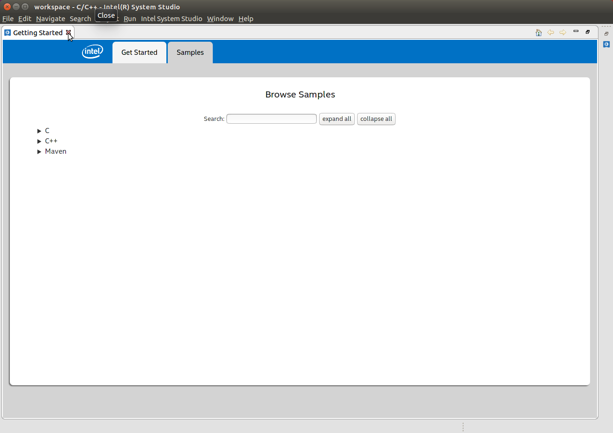

5. With the "Getting Started” tab now closed, the ISS IDE will default in the Intel® C/C++ perspective which appears similar to below:

   1. **Note**: The perspective may be different if ISS has been started before and changes were made.  A different perspective may be open, such as the standard C/C++ perspective, or if the windows have been moved.

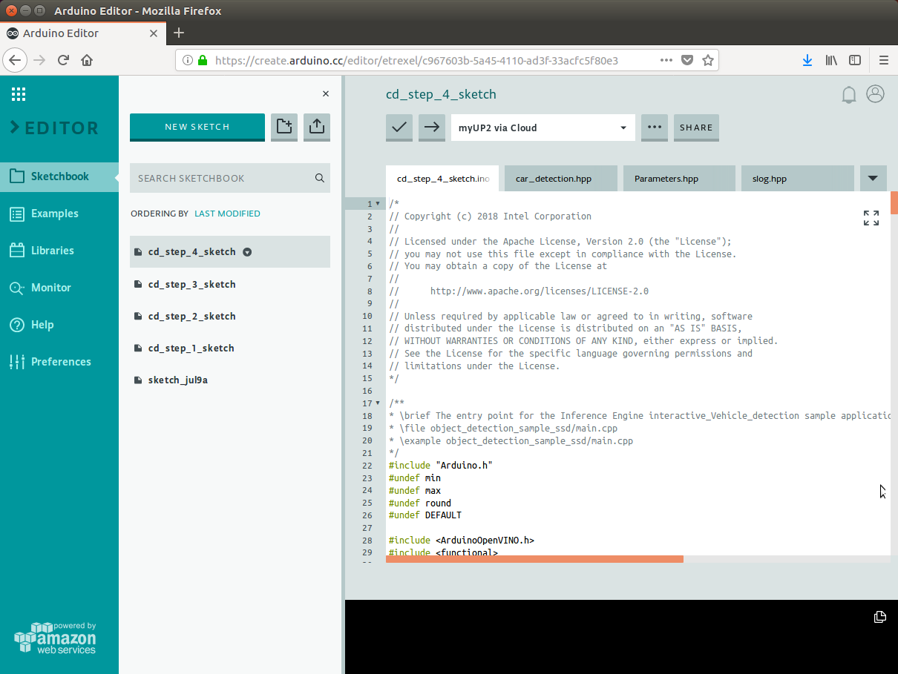

#### Create Project

1. Before building the executable, a project must be created.  Start by opening File->New->Project...


2. Expand "Other Generic Eclipse", expand “C/C++”, select “C++ Project”, and then click the Next button.


3. The "C++ Project" window will appear.  Set the following items:

   1. Set "Project name" to: car_detection_step_4

   2. Uncheck the "Use default location" box, then click the Browse… button.  Using the file open dialog, browse to the tutorial “step_4” directory and then click the OK button.

   3. Make sure under "Project type", the Executable->”Empty Project” is selected

   4. Under "Toolchain", select “Linux GCC”

   5. When complete the window should look similar to below.  Click the Finish button to continue.

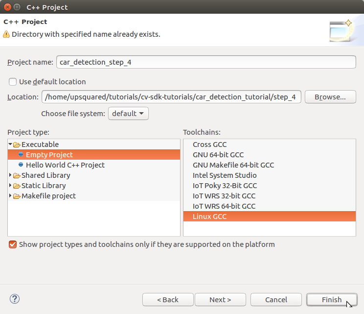

4. You may see a "Open Associated Perspective?" window prompting to open the C/C++ perspective.  If so click the Yes button.


5. You now should be in the C/C++ perspective with the tutorial added as a project similar to below.


6. Note that the "Project Explorer" window shows the new project “car_detection_step_4”.

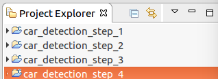

#### Configure Project

1. To build the project, it must be configured to use the CMake files present.  Start by selecting the project in the "Project Explorer" window and then from the menu select Project->Properties.

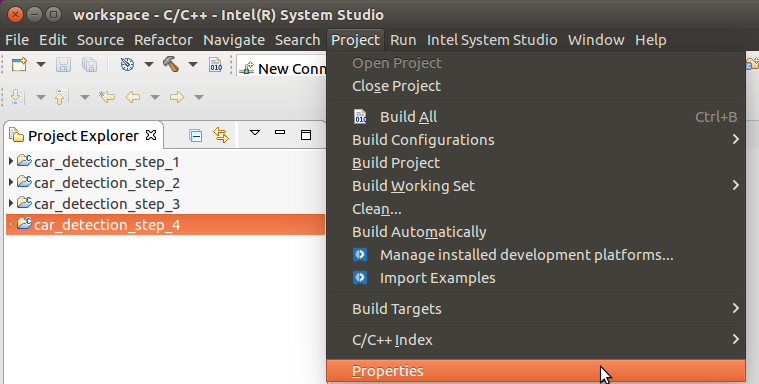

2. The "Properties for …" window will appear.   First, expand “C/C++ Build” and select “Tool Chain Editor”.  Then in the “Current builder” drop-down list, select the “CMake Builder (portable)”.  Then click the Apply button.

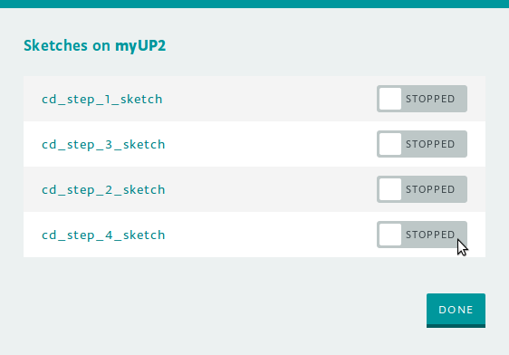

3. Now change "Configuration" to “Release”, then again set “Current builder” to “CMake Builder (portable)”.  Then click the OK button.


4. At this point, if you open the source file main.cpp you will see include files not found and syntax errors listed in the "Problems" window.  These errors are not really errors and compiling the executable will succeed.  The false errors appear because the CMake builder does not automatically import include paths for the IDE’s code analysis (also referred to as the “Indexer”) from the CMake files.  To fix the false errors reported by the indexer, you must set some include paths and define a macro.  Start by again selecting the project in the “Project Explorer” window and then from the menu select Project->Properties.  Expand “C/C++ General” and then select “Paths and Symbols”.  With Configuration set to  “[All configurations]”, the path and symbol settings need to be set as follows:

   1. On the Include tab for Language "GNU C++", the list of “Include directories” needs to have:

      1. /opt/intel/computer_vision_sdk/deployment_tools/inference_engine/include

      2. /opt/intel/computer_vision_sdk/deployment_tools/inference_engine/samples/common

      3. /opt/intel/computer_vision_sdk/deployment_tools/inference_engine/samples/extension

      4. /opt/intel/computer_vision_sdk/opencv/include

      5. /opt/intel/computer_vision_sdk/deployment_tools/inference_engine/samples/common/samples

   2. On the Symbol tab for Language "GNU C++":

      1. Symbol "__cplusplus" set to value “201103”

   3. Instead of manually making all theses changes, a settings file that can be imported for all the above is included with the tutorial files under "system_studio/exported_paths_and_symbols.xml".  The following steps will use the settings file instead of entering manually.	

5. Starting from Project->Properties, "C/C++ General"->“Paths and Symbols”, import the paths and symbols needed by the indexer by clicking the “Import Settings…” button.  The “Import” window will appear.  Select the “Settings file” by clicking on the “Browse…” button then browsing to the XML file supplied with the tutorial to select the file “system_studio/exported_paths_and_symbols.xml”.   By default, “Select Configuration” should have “Debug” selected.  The window should appear similar to below.  Click the Finish button to complete (this will close the project properties window too).

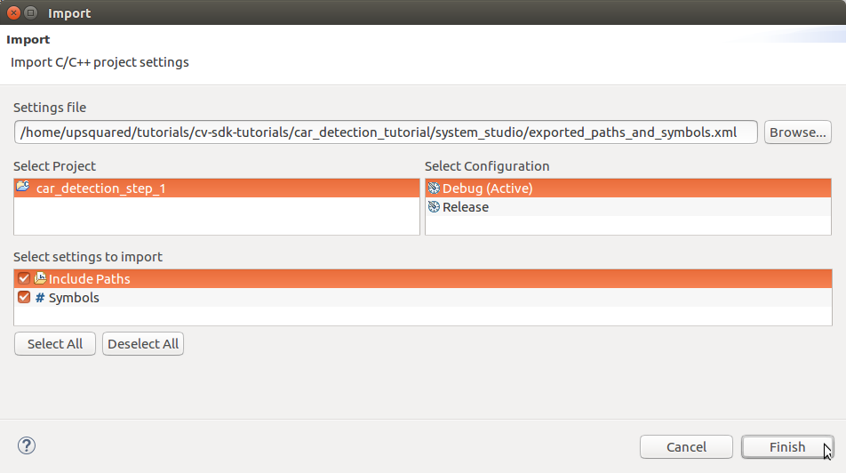

6. Starting again from Project->Properties, "C/C++ General"->“Paths and Symbols”, import the paths and symbols needed by the indexer by clicking the “Import Settings…” button.  The “Import” window will appear.  Select the “Settings file” by clicking on the “Browse…” button then browsing to the XML file supplied with the tutorial to select the file “system_studio/exported_paths_and_symbols.xml”.  This time under “Select Configuration”, select “Release”.  The window should appear similar to below.  Click the Finish button to complete.


7. Going back to Project->Properties, "C/C++ General"->“Paths and Symbols” should appear similar to below for the Includes and Symbols tabs.

   1. **Note**: After these settings are made, to remove the false errors you may need to re-index the project by selecting from the menu Project->"C/C++ Index”->Rebuild


#### Build Executable

1. Now that the project is configured, we will build the executable.  We will be using the Release configuration build which is set by Project->"Build Configurations”->”Set Active” and selecting "Release”.


2. Build the executable using Project->"Build Project”.


3. The "Build Project" window will appear.  The first build will take a minute to complete because it is building all the sample libraries needed.  Click the “Run in Background” button to close the window and letting the build continue as we look at the consoles.


4. In the Console window you may see the output of CMake similar to below.  

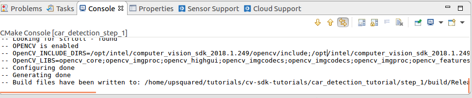

5. To see the output of the compiler, we need to change to the build console.  To do so, click on the down-arrow to the right of the terminal icon, then select "CDT Build Console [...]".


6. When the build completes successfully, the Console will appear similar to below.


7. Now that the executable is built, we can move on to running it.

### Run

#### Create Run Configuration

1. Before running the executable from within ISS, a run configuration must be created.  The quickest way to setup a new one is to just run the project and then edit the details.  To start this, from the Run menu, select "Run As" then “Local C/C++ Application”.


2. You may see a "C Local Application" window appear similar to below prompting to choose which binary to run.  If so, choose “car_detection_tutorial” and click the OK button.  **Note**: The other binaries listed are side effects from CMake and may be ignored.


3. The project’s executable will be started with the output appearing in the Console window.  At this point no command line arguments are given to the executable which will run (or exit) accordingly.  The models need to be specified so you should see an error and exit similar to below.


4. Since the default name used is the name of the executable, it is a good idea to have the run configuration’s name match the project to make it easier to distinguish it from multiple projects.  Begin by editing the run configuration’s name by first opening the run configuration up starting from the Run menu, selecting "Run Configurations…".


5. Under "C/C++ Application", select the correct project’s run configuration which will appear in the the Project setting.  Now edit the Name at the top changing to closer match the project name, here setting it to “car_detection_tutorial_step_4” as shown below.

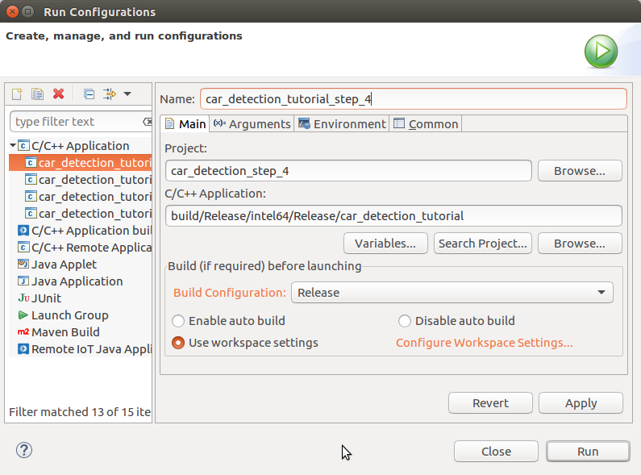

#### How to Set Command Line Arguments

1. The run configuration just created does not have any command line arguments being passed to it.  To add arguments when running the executable, you must edit the run configuration starting from the Run menu, selecting "Run Configurations…".  Depending upon how many configurations are present, you may need to select the one for the current project.  Initially the Main tab is selected which shows the main project settings similar to below.


2. To set command line arguments, select the Arguments tab which will appear similar to below.  

   1. In the "Program arguments" area goes the command line arguments to be passed to the executable when run.  Here we have entered “-i cam” as an example.  Literal command line arguments will be passed exactly as they appear.  Environment variables require special treatment and are specified as “${env_var:\<var_name\>}” where “\<var_name\>” is the environment variable name.

   2. Also shown is the "Working directory".  This is where the executable is run and by default set to the top project directory.  **Note**: This is important to know when command line arguments use relative paths.

   3. When done, click the Run button to run the executable or the Close button to close the window.

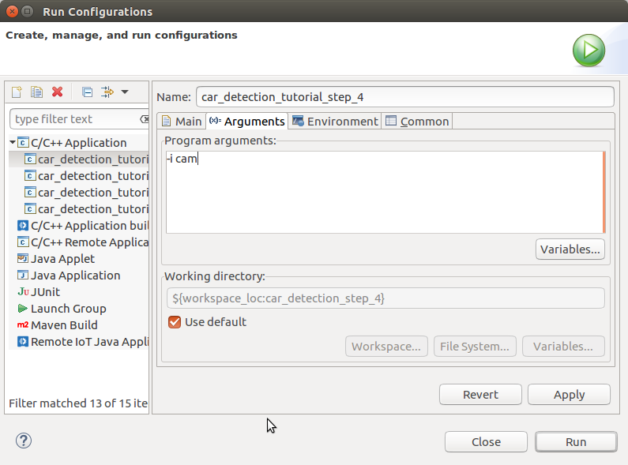

#### How to Run the Executable

1. Running the executable can always be done from the Run Configuration window using the Run button.  To run without opening the Run Configuration window is done using the Run Menu, "Run History", then selecting the name of the run configuration as shown below.  

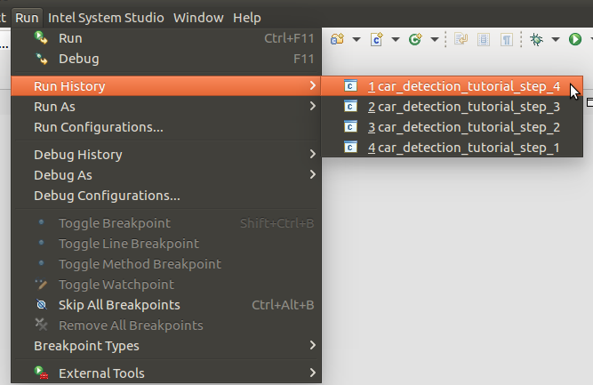

#### Running

1. Before starting ISS, be sure to source the helper script that will make it easier to use environment variables instead of long names to the models:

```bash
source ../scripts/setupenv.sh 
```


2. First, let us see how it works on a single image file using default synchronous mode.  Set the command line arguments for the run configuration to:

```
-m ${env_var:mVDR32} -m_va ${env_var:mVA32} -i ../data/car_1.bmp
```


3. The output window will show the image overlaid with colored rectangles over the cars and license plate (if model detects license plates too) along with and the timing statistics for computing the results.  Now run the command again in asynchronous mode using the option "-n_async 2":

```
-m ${env_var:mVDR32} -m_va ${env_var:mVA32} -i ../data/car_1.bmp -n_async 2
```


4. The performance should be the same because a single image was run which is effectively the same as running synchronously since each pipeline stage must wait for the one image to process.

5. Next, let us try it on a video file.  Set the command line arguments for the run configuration to: 

```
-m ${env_var:mVDR32} -m_va ${env_var:mVA32} -i ../data/cars_768x768.h264 -n_async 1
```


6. Over each frame of the video, you will see green rectangles drawn around the cars as they move through the parking lot.  Now run the command again in asynchronous mode using the option "-n_async 2":

```
-m ${env_var:mVDR32} -m_va ${env_var:mVA32} -i ../data/cars_768x768.h264 -n_async 2
```


7. Unexpectedly, asynchronous mode should have made the video take longer to run by >10%.  Why would that be?  With the main loop now running asynchronously and not blocking, it is now an additional thread running on the CPU along with the inference models.  Now let us shift running the models to other devices, first in synchronous mode then asynchronous with increasing -n_async value using the command line arguments for the run configuration:

```
-m ${env_var:mVDR16} -d GPU -m_va ${env_var:mVA16} -d_va MYRIAD -i ../data/cars_768x768.h264 -n_async 1
-m ${env_var:mVDR16} -d GPU -m_va ${env_var:mVA16} -d_va MYRIAD -i ../data/cars_768x768.h264 -n_async 2
-m ${env_var:mVDR16} -d GPU -m_va ${env_var:mVA16} -d_va MYRIAD -i ../data/cars_768x768.h264 -n_async 4
-m ${env_var:mVDR16} -d GPU -m_va ${env_var:mVA16} -d_va MYRIAD -i ../data/cars_768x768.h264 -n_async 8
-m ${env_var:mVDR16} -d GPU -m_va ${env_var:mVA16} -d_va MYRIAD -i ../data/cars_768x768.h264 -n_async 16
```


8. Asynchronous mode should be faster by some amount for "-n_async 2" then a little more for “-n_async 4” and “-n_async 8”, then not really noticeable for “-n_async 8”.  The improvements come from the CPU running in parallel more and more with the GPU and Myriad.  The absence of improvement shows when the CPU is doing less in parallel and is waiting on the other devices.  This is referred to as “diminishing returns” and will vary across devices and inference models.

9. User exercise: Modify the last commands used to try different combinations of GPU and Myriad to find the fastest asynchronous combination for your hardware.

   1. **Hint**: You may need to increase well beyond  "-n_async 16" to hit the point of diminishing returns.

# Conclusion

By adding the asynchronous use of the Inference Engine API we have seen how it can affect performance.  Performance improves when offloading the models to other devices leaving the CPU to do all the data preparation and image rendering work in parallel.  However, there is a limit to performance improvement when the CPU (or other) device starts to wait on its parallel partner devices.

# Navigation

[Car Detection Tutorial](../Readme.md)

[Car Detection Tutorial Step 3](../step_3/Readme.md)

