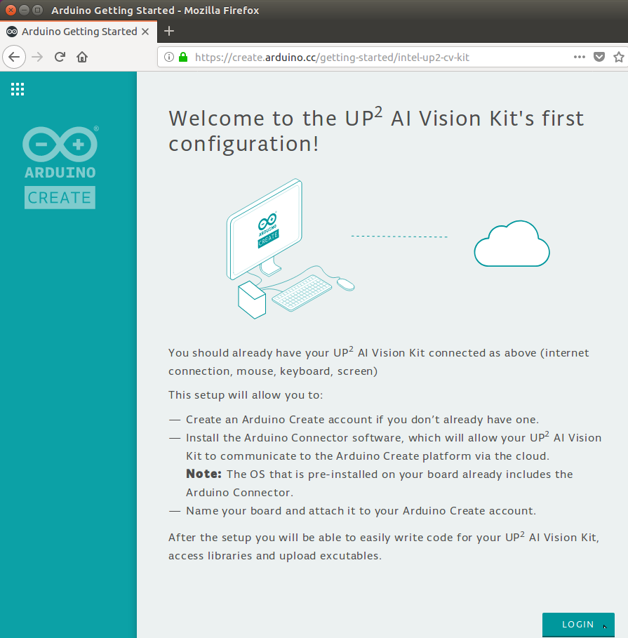
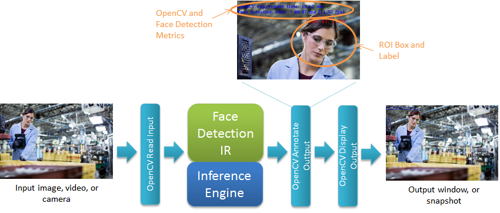
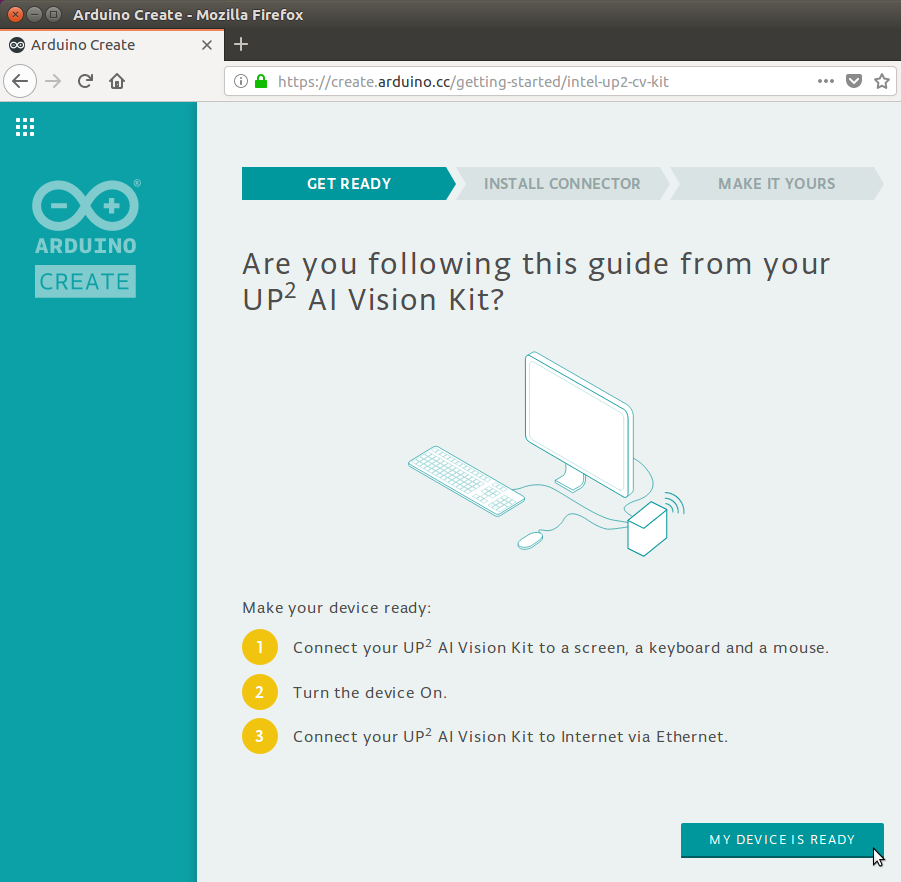

# Face Detection Tutorial

**Note**: This tutorial has been written using Intel® Distribution of OpenVINO™ toolkit version 2018 R5.0 and is for use with this version only.   Using this tutorial with any other version may not be correct.

# Table of Contents

<p></p><div class="table-of-contents"><ul><li><a href="#face-detection-tutorial">Face Detection Tutorial</a></li><li><a href="#table-of-contents">Table of Contents</a></li><li><a href="#introduction">Introduction</a></li><li><a href="#getting-started">Getting Started</a><ul><li><a href="#prerequisites">Prerequisites</a></li><li><a href="#downloading-the-tutorial-from-the-git-repository">Downloading the Tutorial from the Git Repository</a><ul><li><a href="#option-1-using-git-clone-to-clone-the-entire-repository">Option #1: Using Git Clone to Clone the Entire Repository</a></li><li><a href="#option-2-using-svn-export-to-download-only-this-tutorial">Option #2: Using SVN Export to Download Only This Tutorial</a></li><li><a href="#tutorial-files">Tutorial FIles</a></li></ul></li><li><a href="#openvino-toolkit-overview-and-terminology">Intel® Distribution of OpenVINO™ Toolkit Overview and Terminology</a><ul><li><a href="#using-the-inference-engine">Using the Inference Engine</a><ul><li><a href="#inference-engine-api-integration-flow">Inference Engine API Integration Flow</a></li><li><a href="#setting-up-command-line-to-use-the-openvino-toolkit-executables-and-libraries">Setting Up Command Line to Use the Intel® Distribution of OpenVINO™ Toolkit Executables and Libraries</a></li></ul></li><li><a href="#where-do-the-inference-models-come-from">Where Do the Inference Models Come from?</a></li></ul></li></ul></li><li><a href="#key-concepts">Key Concepts</a><ul><li><a href="#intel-opencv">Intel® OpenCV</a></li><li><a href="#floating-point-precision">Floating Point Precision</a><ul><li><a href="#why-would-we-choose-one-precision-over-the-other">Why Would We Choose One Precision Over the Other?</a></li><li><a href="#what-if-we-specify-the-wrong-precision-for-a-device">What If We Specify the Wrong Precision for a Device?</a></li></ul></li><li><a href="#batch-size">Batch Size</a></li><li><a href="#heterogenous-plugin">Heterogenous Plugin</a><ul><li><a href="#how-are-layers-assigned-to-devices">How are Layers Assigned to Devices?</a></li><li><a href="#what-if-the-devices-use-different-precisions">What If the Devices Use Different Precisions?</a></li><li><a href="#how-do-we-know-which-device-executed-which-layers">How Do We Know Which Device Executed Which Layers?</a></li></ul></li><li><a href="#tutorial-step-1-create-the-base-opencv-application">Tutorial Step 1: Create the Base OpenCV Application</a></li><li><a href="#tutorial-step-2-add-the-first-model-face-detection">Tutorial Step 2: Add the first Model, Face Detection</a></li><li><a href="#tutorial-step-3-add-the-second-model-age-and-gender">Tutorial Step 3: Add the Second Model, Age and Gender</a></li><li><a href="#tutorial-step-4-add-the-third-model-head-pose">Tutorial Step 4: Add the Third Model, Head Pose</a></li></ul></li><li><a href="#conclusion">Conclusion</a></li><li><a href="#references-and-more-information">References and More Information</a></li></ul></div><p></p>

# Introduction

The purpose of this tutorial is to examine a sample application that was created using the Intel® Distribution of Open Visual Inference & Neural Network Optimization (OpenVINO™) toolkit and UP Squared* hardware included in the UP Squared* AI Vision Development Kit.  The application is able to run inference models on the CPU, GPU and VPU devices to process images.  The models can be used to process video from the USB camera, an existing video file, or still image files.  To do that, we will download the latest Face Detection Tutorial from GitHub and then walk through the sample code for each step before compiling and running on the UP Squared* hardware.

This tutorial will start from a base application that can read in image data and output the image to a window.  From there, each step adds deep learning models that will process the image data and make inferences.  In the final step, the complete application will be able to detect a face, report age and gender for the face, and draw a 3D axis representing the head pose for each face.  Before that, some key concepts related to using the Intel® Distribution of OpenVINO™ toolkit will be introduced and later seen along the way within the steps.  

# Getting Started

## Prerequisites

The UP Squared* AI Vision Development Kit comes ready to go with all the hardware needed for this tutorial and is fully preconfigured with all software tools, libraries, drivers, etc. needed.   A summary of what is used:

* Hardware

   * From the kit:

      * UP Squared* Board

      * AI Core mPCIe board (installed), this is what is being referred to as the "Myriad"

      * USB Camera

      * Power supply

   * User supplied:

      * USB keyboard and mouse

      * HDMI or DisplayPort cable and monitor

      * Ethernet cable

* Software (pre-installed in the kit)

   * Intel® Distribution of OpenVINO™ toolkit

      * Inference Engine with plugins support for CPU, GPU, and Myriad

      * Optimized OpenCV and OpenVX libraries

      * Samples and common helper libraries

By now you should have completed the setup and getting starting guide for the kit, however before continuing, please ensure that:

* You have followed all the steps in the getting starting guide for your UP Squared* AI Vision Development Kit.  This tutorial assumes that you have already setup and run the supplied test samples to test that your kit is fully functional including:

   * The UP Squared* board is booted and running 

   * The USB camera is connected and operating correctly

* Your UP Squared* board is connected to a network and has Internet access.  To download all the files for this tutorial, the UP Squared* board will need to access GitHub on the Internet. 

## Downloading the Tutorial from the Git Repository

The first thing we need to do is create a place for the Face Detection tutorial and then download it.  To do this, we will create a directory called "tutorials" and use it to store the files that are downloaded from the “cvs-sdk-tutorial” GitHub repository.  There are two options to download this tutorial: 1) Download as part of the entire repository using “git clone”, or 2) Use “svn export” to download just this tutorial (smaller)

### Option #1: Using Git Clone to Clone the Entire Repository

1. Bring up a command shell prompt by opening a terminal (such as xterm) or selecting a terminal that is already open.

2. Create a "tutorials" directory where we can download the Face Detection tutorial and then change to it:

```Bash
mkdir tutorials
cd tutorials
```


3. Clone the repository:

```Bash
git clone https://github.com/intel-iot-devkit/computer-vision-inference-dev-kit-tutorials.git
```


4. Change to the top git repository and check out correct version:

```Bash
cd computer-vision-inference-dev-kit-tutorials
git checkout openvino_toolkit_r5_0
```


5. Change to the face detection tutorial folder:

```Bash
cd face_detection_tutorial
```


### Option #2: Using SVN Export to Download Only This Tutorial

1. Bring up a command shell prompt by opening a terminal (such as xterm) or selecting a terminal that is already open.

2. Create a "tutorials" directory where we can download the Face Detection tutorial and then change to it:

```Bash
mkdir -p tutorials/computer-vision-inference-dev-kit-tutorials
cd tutorials/computer-vision-inference-dev-kit-tutorials
```


3. Download the subdirectory for just this tutorial for the specific version from the repository:

```Bash
svn export https://github.com/intel-iot-devkit/computer-vision-inference-dev-kit-tutorials.git/branches/openvino_toolkit_r5_0/face_detection_tutorial
```


4. Change to the face detection tutorial folder:

```Bash
cd face_detection_tutorial
```


Now that we have all the files for the Face Detection Tutorial, we can take some time to look through them to see what each part of the tutorial will demonstrate.

### Tutorial FIles

In the "face_detection_tutorial" directory you will see:

* cmake\ - Common CMake files 

* data\ - Image, video, model, etc. data files used with this tutorial

* doc_support\ - Supporting documentation files including images, etc.

* scripts\ - Common helper scripts

* step_1\ - Tutorial Step 1: All files including Readme.md documentation

* step_2\ - Tutorial Step 1: All files including Readme.md documentation

* step_3\ - Tutorial Step 1: All files including Readme.md documentation

* step_4\ - Tutorial Step 1: All files including Readme.md documentation

* Readme.md - The top level of this tutorial (this page)

## Intel® Distribution of OpenVINO™ Toolkit Overview and Terminology 

Let us begin with a brief overview of the Intel® Distribution of OpenVINO™ toolkit and what this tutorial will be covering.  The Intel® Distribution of OpenVINO™ toolkit enables the quick deployment of convolutional neural networks (CNN) for heterogeneous execution on Intel® hardware while maximizing performance. This is done using the Intel® Deep Learning Deployment Toolkit (Intel® DL Deployment Toolkit) included within the Intel® Distribution of OpenVINO™ toolkit with its main components shown below.


The basic flow is:

1. Use a tool, such as Caffe, to create and train a CNN inference model

2. Run the created model through Model Optimizer to produce an optimized Intermediate Representation (IR) stored in files (.bin and .xml) for use with the Inference Engine

3. The User Application then loads and runs models onto devices using the Inference Engine and the IR files  

This tutorial will focus on the last step, the User Application and using the Inference Engine to run models on CPU, GPU, and Myriad.  

### Using the Inference Engine

Below is a more detailed view of the User Application and Inference Engine:



The Inference Engine includes a plugin library for each supported device that has been optimized for the Intel® hardware device CPU, GPU, and Myriad.  From here, we will use the terms "device" and “plugin” with the assumption that one infers the other (e.g. CPU device infers the CPU plugin and vice versa).  As part of loading the model, the User Application tells the Inference Engine which device to target which in turn loads the associated plugin library to later run on the associated device. The Inference Engine uses “blobs” for all data exchanges, basically arrays in memory arranged according the input and output data of the model.

#### Inference Engine API Integration Flow

Using the Inference Engine API follows the basic steps briefly described below.  The API objects and functions will be seen later in the code walkthroughs.

1. Load the plugin

   1. Create an instance of the plugin (InferenceEngine::InferencePlugin) for the specified device using the InferenceEngine::PluginDispatcher class

2. Read the model IR

   1. Read in IR files using InferenceEngine::CNNNetReader::ReadNetwork("Model.xml") and InferenceEngine::CNNNetReader::ReadWeights("Model.bin")

3. Configure the inputs and outputs formats

   1. Probe model for input and output information using InferenceEngine::CNNNetwork::getInputsInfo() and InferenceEngine::CNNNetwork::getOutputsInfo().

   2. Optionally configure the precision and memory layout of inputs and outputs to match the model inputs and outputs using InferenceEngine::InputInfo::setPrecision() and InferenceEngine::InputInfo::setLayout()

4. Load the model into the plugin

   1. Load the model into the plugin using InferenceEngine::InferencePlugin::LoadNetwork() which will return a InferenceEngine::ExecutableNetwork object for the loaded network

5. Create an inference request

   1. Use the loaded plugin to create a request object (InferenceEngine::InferRequest::Ptr) that is used for control and holds input and output blobs using InferenceEngine::ExecutableNetwork::CreateInferRequestPtr()

6. Prepare the input

   1. Get the input blob(s) to hold input data using InferenceEngine::InferRequest::getBlob()

   2. Reformat user input data into the format required by the model (e.g convert RGB user image to BGR for model) storing in the model’s format in the input blob.  

7. Run Inference

   1. Request plugin to perform inference and wait for results using one of two modes:

      1. Synchronous: 

         1. InferenceEngine::InferRequest::Infer() 

         2. Or InferenceEngine::InferRequest::StartAsync() immediately followed by InferenceEngine::InferRequest::Wait().

      2. Asynchronous: 

         1. InferenceEngine::InferRequest::StartAsync() 

         2. Then later InferenceEngine::InferRequest::Wait()

8. Process the output

   1. Get the output blob(s) holding output blob using InferenceEngine::InferRequest::getBlob()

   2. Parse and process the output blob(s) according to the output format specified by the model

In tutorial Steps 2, 3, and 4 we will walkthrough the code that specifically integrates each of the models used in the application.  

More details on the Inference Engine can be found in the "Integrating Inference Engine into Your Application" section of the Inference Engine Development Guide [https://software.intel.com/inference-engine-devguide](https://software.intel.com/inference-engine-devguide)

and the Inference Engine API documentation located at: /opt/intel/computer_vision_sdk/deployment_tools/documentation/docs/IntegrateIEInAppNewAPI.html

#### Setting Up Command Line to Use the Intel® Distribution of OpenVINO™ Toolkit Executables and Libraries

Whenever running the Intel® Distribution of OpenVINO™ toolkit tools, compiling, or running the user application, always remember to source the script:

```Bash
source /opt/intel/computer_vision_sdk/bin/setupvars.sh
```


This script sets up the executable and library paths along with environment variables used by the Intel® Distribution of OpenVINO™ toolkit tools as well as this tutorial.

### Where Do the Inference Models Come from?

An inference model may come from any of the supported sources and workflows such as Caffe, TensorFlow, and Apache MXNet.  For this tutorial, we will use models that have already been compiled by the Model Optimizer into .bin and .xml files and supplied within the Intel® Distribution of OpenVINO™ toolkit samples.  The development and compiling of models is beyond the scope of this tutorial, for more information see [https://software.intel.com/openvino-toolkit/deep-learning-cv](https://software.intel.com/en-us/openvino-toolkit/deep-learning-cv)

# Key Concepts

Before going into the samples in the tutorial steps, first we will go over some key concepts that will be covered in this tutorial.

## Intel® OpenCV

For the application that we will cover in Step 1, the OpenCV libraries included in the Intel® Distribution of OpenVINO™ toolkit will be used.  You may be wondering: Why is OpenCV included in the Intel® Distribution of OpenVINO™ toolkit along with the Inference Engine?  The first big reason is: They are the fastest implementation of OpenCV functions for Intel® devices.  The Intel® libraries have been optimized to run on each Intel® CPU, GPU, and Myriad device.  It also helps that by including in the libraries in the Intel® Distribution of OpenVINO™ toolkit, you get the complete set of libraries and always get the necessary version.  

The second big reason: All the extensions and additional libraries that come with Intel®’s OpenCV.  One such library is the Photography Vision Library (PVL).  PVL includes advanced implementations by Intel® already optimized for power and performance on Intel® devices to do face, blink, and smile detection along with recognizing faces.

Additional information may be found at:

Source for the OpenCV libraries: [https://github.com/opencv/opencv/releases/tag/3.4.1-cvsdk](https://github.com/opencv/opencv/releases/tag/3.4.1-cvsdk)

Samples for OpenCV on Linux*: /opt/intel/computer_vision_sdk/opencv/share/OpenCV/sample/Readme.md

Intel® OpenCV PVL library sample on Linux*:

/opt/intel/computer_vision_sdk/opencv/share/OpenCV/sample/pvl

## Floating Point Precision

Very briefly, floating point is a way to represent a wide range of real numbers with fraction within a fixed number of bits.  The upside to floating point is that a much larger range of numbers (+/-3.402823×1038 vs. integer +/-2,147,483,647) can be represented within 32 bits, while the downside is that some amount of precision may be lost.  Here we are talking about floating point being represented in either 32-bit, also referred to as "single-precision" and here we use “FP32”, or 16-bits, also referred to “half-precision” and here we use “FP16”.  Without going down to the bit-level details, just from the number of bits we can presume that 32-bits can represent more numbers than 16-bits.  

The question now becomes: why does 32 vs 16 bits matter?  When a model’s IR is created using Intel®’s Model Optimizer, it is told to target either FP16 or FP32.    For our purposes we will assume the model will work well as intended within the number of bits available (there may be differences in output of course, which are assumed to be small enough to ignore).  So now it comes down to what precision(s) are supported by the device that the model will be run on. The precisions that the CPU, GPU, and Myriad devices support is summarized in the table below:

<table>
  <tr>
    <td>Device</td>
    <td>FP16</td>
    <td>FP32</td>
  </tr>
  <tr>
    <td>CPU</td>
    <td>Not Supported</td>
    <td>Supported</td>
  </tr>
  <tr>
    <td>GPU</td>
    <td>Supported</td>
    <td>Supported</td>
  </tr>
  <tr>
    <td>Myriad</td>
    <td>Supported</td>
    <td>Not Supported</td>
  </tr>
</table>


### Why Would We Choose One Precision Over the Other?  

Primarily for speed.  FP16 is generally smaller and faster in hardware than FP32.  The smaller data size of FP16 can also reduce by up to 2x the amount of memory required for storage and the bandwidth required for transferring data to and from memory compared to FP32.  However if the difference between FP32 and FP16 does affect the accuracy of the application’s results enough to cause undesired results, then FP32 would be chosen to prioritize accuracy over speed.  Lastly, we would always choose FP16 vs. FP32 depending upon which precision the targeted device requires.

### What If We Specify the Wrong Precision for a Device?  

Nothing really will happen other than getting an error message when loading the model’s IR using the Inference Engine API which looks similar to below:

```bash
[ INFO ] Loading Face Detection model to the MYRIAD plugin
[ ERROR ] The plugin does not support networks with FP32 format.
Supported format: FP16.
```


Of course, you will need to change to a supported precision for the device to be able to run the model.

In Step 4, we will see how precision may affect performance as well as device selection.

For more detail on 32-bit "single-precision" floating point down to the bit-level, see [https://en.wikipedia.org/wiki/Single-precision_floating-point_format](https://en.wikipedia.org/wiki/Single-precision_floating-point_format)

For more detail on 16-bit "half-precision" floating point down to the bit-level, see

[https://en.wikipedia.org/wiki/Half-precision_floating-point_format](https://en.wikipedia.org/wiki/Half-precision_floating-point_format)

For more detail on the Model Optimizer, see the OpenVINO™ documentation at:

[https://software.intel.com/openvino-toolkit/documentation](https://software.intel.com/openvino-toolkit/documentation)

## Batch Size

Batch size refers to the number of input data to be inferred during a single inference run through the Inference Engine.  Things to be aware of the batch size for an inference model:

* How batch size is set:

   * The default setting is located in the model’s IR files which is set either by:

      * The Model Optimizer command line option when creating the IR 

      * Or from the original source (e.g. Caffe) 

      * **Note**: the default can be read using the Inference Engine API getBatchSize()

   * May be set explicitly using the Inference Engine API setBatchSize() function

   * **Note**: For the getBatchSize() and setBatchSize() functions, see the InferenceEngine::ICNNNetwork class in the documentation at: /opt/intel/computer_vision_sdk/deployment_tools/documentation/docs/classInferenceEngine_1_1CNNNetwork.html

* Batch size is a fixed number of inputs that will be inferred for each submitted request to the Inference Engine API regardless of how many inputs contain valid data.  Depending upon the model, invalid inputs may also result in false detections and additional unnecessary processing.

In this tutorial, face detection is done frame-by-frame expecting few results so batch size >1 will generally not give any improvements.  This makes batch size primarily about device support, such as the Myriad which requires batch size set to 1.  In a later tutorial (be sure to look forward to the [Car Detection Tutorial](../car_detection_tutorial/Readme.md)), batch size will be explored further to show how it affects latency and performance. 

## Heterogenous Plugin

As described in the Intel® Distribution of OpenVINO™ toolkit overview, the Inference Engine includes a plugin library for each supported physical (e.g CPU, GPU, VPU, etc.) device.  In addition to physical devices, the Inference Engine includes the "Heterogenous Plugin" (also referred to as “Hetero Plugin”) which may be used to run an inference model on multiple physical devices.  The plugin does this by assigning the layers within the inference model to be executed on the different plugins for the devices.  The Heteo Plugin is intended for:

1. Using a device(s) to accelerate the layers it supports best and execute less supported layers on a fallback devices like CPU.

2. Utilizing all available devices more efficiently while running an inference.

### How are Layers Assigned to Devices?

The Hetero Plugin uses affinity settings for each layer within the inference model to determine on which device the layer is executed.  Each layer’s device affinity is set in one of two ways:

1. Automatically when assigning the device an inference model is to run on.  The device name format uses: "HETERO:\<1st device\>[,\<2nd device\>][,\<3rd device\>]...".

   1. Starting with the first device, all layers directly supported by the device will be assigned.  This is repeated with any remaining layers assigned (falling back to) to the next device, and so on, until the last device which will be used to do the remainder.

2. Manually from within the application code using the layer’s CNNLayer::affinity field.  Basic outline of code is to start with the automatic affinity assignments and then manually make changes which looks like:

   1. Load the plugin normally using the "HETERO:\<device>..." string for the devices that will be used to automatically assign affinities.

   ```Cpp
   InferenceEngine::InferenceEnginePluginPtr enginePtr;
   enginePtr = dispatcher.getPluginByDevice("HETERO:FPGA,CPU");
   ```


   2. Create an InferenceEngine::HeteroPluginPtr pointer to the plugin:

   ```Cpp
   HeteroPluginPtr hetero(enginePtr);  
   ```


   3. Use InferenceEngine::HeteroInferencePlugin::SetAffinity to automatically assign affinities to layers:

   ```Cpp	
   hetero->SetAffinity(network, { }, &resp);
   ```


   4. Get a layer by name (e.g. "qqq") and manually assign its device affinity field CNNLayer::affinity to the desired device (e.g. “CPU”):

   ```Cpp	
   network.getLayerByName("qqq")->affinity = "CPU";
   ```


   5. Load the network and continue normally as described in the Inference Engine API steps described earlier.

### What If the Devices Use Different Precisions?

The Hetero Plugin will automatically convert between different precisions when transferring data between devices.  For example, when running an FP16 model on Myriad (which requires FP16) with CPU (which requires FP32) fallback, the Myriad will run FP16 normally and conversions to FP32 will be made automatically for any layers that run on the CPU.

### How Do We Know Which Device Executed Which Layers?

Performance counts (times) are kept per layer executed during an inference.  Included with the counts, is the device on which the layer was executed.  To get performance counts:

1. Enable performance counts using InferenceEngine::InferencePlugin::SetConfig() and the configuration setting {PluginConfigParams::KEY_PERF_COUNT, PluginConfigParams::YES}

2. After running inference, retrieve performance counts using InferenceEngine::InferRequest::GetPerformanceCounts()

**Note**: All code in this tutorial that runs inference includes the necessary code to optionally enable and display performance counts.  Performance counts are enabled using the "pc" option which is covered in Tutorial Step 2.

## Tutorial Step 1: Create the Base OpenCV Application


The first tutorial will show how the Intel® OpenCV libraries are used by an application.  We will see how the OpenCV functions are included in an application as they are used to get input from image files or a video camera connected to the UP Squared* board and display the image data in a window. 

[Face Detection Tutorial Step 1](./step_1/Readme.md)

## Tutorial Step 2: Add the first Model, Face Detection 



The second tutorial takes the framework in Tutorial Step 1 and adds face detection and labeling to processed images.  This step shows how an inference model has been added to use the Inference Engine to run the model on hardware.  We will also learn how to specify which device the model is run on: CPU, GPU,  the Myriad.  

[Face Detection Tutorial Step 2](./step_2/Readme.md)

## Tutorial Step 3: Add the Second Model, Age and Gender



The third tutorial step will show how a second model is added to the application by including a model that infers age and gender of each detected face.  

[Face Detection Tutorial Step 3](./step_3/Readme.md)

## Tutorial Step 4: Add the Third Model, Head Pose 


To complete the application, the fourth tutorial step adds a third model that infers head pose based on the detected face.  The three models now create the full processing pipeline which is used to explore options of assigning models to different device plugins to see differences in performance.

[Face Detection Tutorial Step 4](./step_4/Readme.md)

# Conclusion

Congratulations! you have completed the Face Detection Tutorial.  After going through this entire tutorial and all of its steps, you have now seen:

* An overview of the Inference Engine

* The final application assembled in steps:

   * How to create a base application that uses OpenCV to perform image and video input and output.  

   * How to extend the application to use the Inference Engine and CNN models to process the images and detect faces.  

   * How to take the results of the first model’s analysis and use it as input to different models that would process the faces and infer the face’s age and gender as well as the head’s orientation.  

   * How to load the analysis models onto different devices to distribute the workload and find the optimal device to get the best performance from the models.

# References and More Information

Intel® Distribution of OpenVINO™ toolkit main page: [https://software.intel.com/openvino-toolkit](https://software.intel.com/openvino-toolkit)

Intel® Distribution of OpenVINO™ toolkit documentation page: [https://software.intel.com/openvino-toolkit/documentation](https://software.intel.com/openvino-toolkit/documentation)

Intel® Deep Learning Deployment Toolkit (Intel® DL Deployment Toolkit): [https://software.intel.com/openvino-toolkit/deep-learning-cv](https://software.intel.com/openvino-toolkit/deep-learning-cv)

