# Tutorial Step 1: Create the Base OpenCV Application


# Table of Contents

<p></p><div class="table-of-contents"><ul><li><a href="#tutorial-step-1-create-the-base-opencv-application">Tutorial Step 1: Create the Base OpenCV Application</a></li><li><a href="#table-of-contents">Table of Contents</a></li><li><a href="#introduction">Introduction</a></li><li><a href="#the-basic-opencv-application-input-and-output">The Basic OpenCV Application, Input and Output</a><ul><li><a href="#parsing-command-line-arguments">Parsing Command Line Arguments</a><ul><li><a href="#create-the-argument">Create the Argument</a></li><li><a href="#parse-arguments">Parse Arguments</a></li></ul></li><li><a href="#opencv-input-to-output">OpenCV Input to Output</a><ul><li><a href="#header-files">Header Files</a></li><li><a href="#main">main()</a></li><li><a href="#main-loop">Main Loop</a></li></ul></li></ul></li><li><a href="#building-and-running">Building and Running</a><ul><li><a href="#command-line-using-make">Command Line using Make</a><ul><li><a href="#build">Build</a></li><li><a href="#run">Run</a></li></ul></li><li><a href="#intel-system-studio">Intel® System Studio</a><ul><li><a href="#build">Build</a><ul><li><a href="#start-intel-system-studio">Start Intel® System Studio</a></li><li><a href="#create-project">Create Project</a></li><li><a href="#configure-project">Configure Project</a></li><li><a href="#build-executable">Build Executable</a></li></ul></li><li><a href="#run">Run</a><ul><li><a href="#create-run-configuration">Create Run Configuration</a></li><li><a href="#how-to-set-command-line-arguments">How to Set Command Line Arguments</a></li><li><a href="#how-to-run-the-executable">How to Run the Executable</a></li><li><a href="#running">Running</a></li></ul></li></ul></li></ul></li><li><a href="#conclusion">Conclusion</a></li><li><a href="#navigation">Navigation</a></li></ul></div><p></p>

# Introduction

This tutorial will show the basics of what is needed to include and use OpenCV in an application. We will be walking through the sample application that has already been created.  The sample is designed to be a minimal application that demonstrates how to use OpenCV functions to read image data and then display the image data.  This tutorial will walkthrough the OpenCV portions of the code and explain what it does.  Then we will build and run the tutorial so we can see it in action.  In later tutorials, we will be adding processing of the input image to this basic framework.

# The Basic OpenCV Application, Input and Output

Every application needs some way of getting data in and data out.  Let us now take a look at the code we will be using to do the input and output in our OpenCV application.  Then we can compile and run our program to see how it works using the base input and output settings.  

## Parsing Command Line Arguments

To make it easier to set everything from the input video file to which model and device is to be used, command line arguments to the application will be used.  To parse the command line arguments, the application will use the "gflags" helper library that comes with the OpenVINO™ toolkit samples.  Here we will briefly go over the primary functions that are used, for reference the full source code for the gflags library may be found in the OpenVINO™ toolkit samples directory: 

```bash
/opt/intel/computer_vision_sdk/deployment_tools/inference_engine/samples/thirdparty/gflags
```


To make use of the gflags library and use the supplied functions and classes, the main header file must be included:

```cpp
#include <gflags/gflags.h>
```


This is done in the main header file "face_detection.hpp" where all the command line arguments are defined using the following steps.

### Create the Argument

Create the argument using the macro "DEFINE_string".  Here the “-i \<video filename\>” argument that will be used to specify the input video is defined:

```cpp
/// @brief message for images argument
static const char video_message[] = "Optional. Path to an video file. Default value is \"cam\" to work with camera.";

/// \brief Define parameter for set image file <br>
/// It is a required parameter
DEFINE_string(i, "cam", video_message);
```


In the above code:

* video_message[] is the argument’s help string

* DEFINE_string(i, "cam", video_message):

   * Specifies:

      * The string argument name as "i"

      * video_message as the help message

      * "cam" as the default value when not set

   * Creates the variable FLAGS_i to hold the string value for the "i" argument

### Parse Arguments

In main.cpp’s main() function, ParseAndCheckCommandLine() is called to do command line argument parsing and checking for valid arguments. The actual argument parsing and setting variables is done by the call:

```cpp
gflags::ParseCommandLineNonHelpFlags(&argc, &argv, true);
```


After returning, the FLAGS_i variable will be set with the "-i" command line arguments “<video filename>” value, or if not specified, the default value of “cam”.

This is how the "-i" argument is done, all other arguments are handled similarly using the other forms of the gflags macro according to data type needed as follows:

* DEFINE_uint32() for an unsigned 32-bit integer arguments

* DEFINE_string() for string arguments

* DEFINE_double() for double precision floating point arguments

* DEFINE_bool() for boolean arguments

## OpenCV Input to Output

1. Open up a terminal (such as xterm) or use an existing terminal to get to a command shell prompt.

2. Change to the directory containing Tutorial Step 1:

```bash
cd tutorials/face_detection_tutorial/
cd step_1
```


3. Open the files "main.cpp" and “face_detection.hpp” in the editor of your choice such as ‘gedit’, ‘gvim’, or ‘vim’.

### Header Files

1. These header files are included to define helpful utility classes used to simplify common tasks as well as some functions for making logging easier.

```cpp
#include <samples/common.hpp>
#include <samples/slog.hpp>
```


2. The opencv.hpp file is included for the Intel® optimized OpenCV libraries included in the OpenVINO™ toolkit. 

```cpp
#include <opencv2/opencv.hpp>
```


### main()

1. First, the OpenCV video capture object "cap" is created that will be used to source the image data.  Then, the image source is opened.  FLAGS_i is the command line parameter that tells the application the source of where the image.  The source can be the path to an image file, the path to a video file, or "cam" for the USB camera.

```cpp
cv::VideoCapture cap;
if (!(FLAGS_i == "cam" ? cap.open(0) : cap.open(FLAGS_i))) {
   throw std::logic_error("Cannot open input file or camera: " + FLAGS_i);
}
```


2. The width and height of the image source are stored for use later.  

```cpp
const size_t width  = (size_t) cap.get(CV_CAP_PROP_FRAME_WIDTH);
const size_t height = (size_t) cap.get(CV_CAP_PROP_FRAME_HEIGHT);
```


3. Storage for the image frame is created and then the first frame is read in. 

```cpp
cv::Mat frame;
if (!cap.read(frame)) {
   throw std::logic_error("Failed to get frame from cv::VideoCapture");
}
```


### Main Loop

The main loop will read in and then write out the image frames until there are no more available. 

1. The main loop runs forever until a break elsewhere inside the loop when there are no more images:

```cpp
while (true) {
```


2. An available image from the source is grabbed:

```cpp
    /** requesting new frame if any*/
    cap.grab();
```


3. A check is done for a key press to either saving a snapshot (pressing ‘s’) or stopping (any other key) the application.

```cpp
    int keyPressed;
    if (-1 != (keyPressed = cv::waitKey(1)))
    {
   	 if ('s' == keyPressed) {
   		 // save screen to output file
   		 slog::info << "Saving snapshot of image" << slog::endl;
   		 cv::imwrite("snapshot.bmp", frame);
   	 } else {
   		 break;
   	 }
    }
```


4. The output is shown, wrapped with time functions to measure the time it took to do:

```cpp
    auto t0 = std::chrono::high_resolution_clock::now();
    if (!FLAGS_no_show) {
   	  cv::imshow("Detection results", frame);
    }
    auto t1 = std::chrono::high_resolution_clock::now();
    ocv_render_time = std::chrono::duration_cast<ms>(t1 - t0).count();
```


5. A check is made to see if there is another image to process.  If there is nothing to retrieve then a key press is waited for if the command line parameter "-no_wait" was not used.

```cpp
    // end of file, for single frame file, like image we just keep it displayed to let user check what was shown
    cv::Mat newFrame;
    if (!cap.retrieve(newFrame)) {
   	  if (!FLAGS_no_wait) {
   		   slog::info << "Press 's' key to save a snapshot, press any other key to exit" << slog::endl;
   		   while (cv::waitKey(0) == 's') {
   			 // save screen to output file
   			 slog::info << "Saving snapshot of image" << slog::endl;
   			 cv::imwrite("snapshot.bmp", frame);
   		   }
   	  }
   	  break;
    }
    frame = newFrame;  // shallow copy
```


6. A message is output to let the user know they can stop a multi-image source like video or camera.

```cpp
    if (firstFrame) {
   	  slog::info << "Press 's' key to save a snapshot, press any other key to stop" << slog::endl;
    }

    firstFrame = false;
```


7. The loop ends and goes back to the while(true) at the top to run again

```cpp
}
```


Now that we have looked at the code and understand how the program works, let us compile and run to see it in action.  To do that, two ways are covered in the following sections: 1) Command line using "make" and 2) using Intel® System Studio (ISS).  Both ways do the same things, so choose according to your preference.

# Building and Running

## Command Line using Make

The following covers how to build and run from the command line using "make".

### Build

1. First, we need to configure the build environment when using the OpenVINO™ toolkit by running the "setupvars.sh" script.

```bash
source  /opt/intel/computer_vision_sdk/bin/setupvars.sh
```


2. Now we need to create a directory to build the tutorial in and change to it.

```bash
mkdir build
cd build
```


3. The last thing we need to do before compiling is to configure the build settings and build the executable.  We do this by running CMake to setup the build target and file locations.  Then, we run Make to build the executable:

```bash
cmake -DCMAKE_BUILD_TYPE=Release ../
make
```


4. You should now have the executable "face_detection_tutorial" file in the “./intel64/Release/” directory.  We will be using that executable to run our base OpenCV application.

### Run

1. Now, it is time to run the application.  We will run it using each type of input (image file, video file, camera) so you will know what to expect.  We have included commands that will have the application load images or videos that come with the OpenVINO™ toolkit and this tutorial, but you can also use your own images.  If the application cannot find an image, or if you have not connected the USB camera to the UP Squared* board, it will print an error message and return to the command prompt.  If that happens, check the path to the image or video file, to make sure it is correct and try again.

2. First, let us use the application to view a single image file.  We do this by using a "-i" parameter followed by the name of an image file.

```bash
./intel64/Release/face_detection_tutorial -i ../../data/face.jpg
```


3. You should now see a new window with an image.  You should also see a "Press 's' key to save a snapshot, press any other key to exit" prompt in the console window.  The application will now wait for you to press a key with the image window active.

**Note**: Pressing a key in the console window will not do anything because the image window is detecting key presses.  Use Ctrl+C to exit.

4. Next, let us see how the application handles a video file:

```bash
./intel64/Release/face_detection_tutorial -i /opt/intel/computer_vision_sdk/openvx/samples/samples/face_detection/face.mp4
```


5. You will now see a window appear and play the video.  After the video has finished playing, the window will continue to display the final frame of the video, waiting for you to press a key with the image window active.

6. Finally, we can use the application to view live video from the USB camera connected to the UP Squared* board.  The camera is the default source, so we do this by running the application without using any parameters.

```bash
./intel64/Release/face_detection_tutorial
```


Or we can still specify the camera using "cam":

```bash
./intel64/Release/face_detection_tutorial -i cam
```


7. You will now see the output window appear displaying live input from the USB camera.  When you are ready to exit the application, make sure the output window is active and press a key.

## Intel® System Studio

The following covers how to build and run from within Intel® System Studio (ISS).

### Build

#### Start Intel® System Studio

1. We need to start ISS using the desktop icon or the supplied scripts that will setup environment variables and launch the ISS Eclipse IDE.

   1. Desktop icon: Locate and double-click the icon shown below on the desktop.

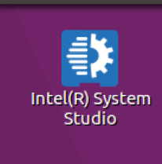

   2. Command line: Configure the build environment when using the OpenVINO™ toolkit by sourcing the "setupvars.sh" script.  Then start ISS using the supplied script that will setup environment variables and launch the ISS Eclipse IDE.

```bash
source /opt/intel/computer_vision_sdk/bin/setupvars.sh
/opt/intel/system_studio_2018/iss_ide_eclipse-launcher.sh
```


2. At first, the ISS splash window will appear that looks like:


3. The splash window will automatically disappear and be replaced with the workspace selection window.  We will use the default workspace "/home/upsquared/system_studio/workspace", so click the “OK” button to continue.


4. The first time ISS is opened, the ISS IDE will show the "Getting Started" tab as shown.  We will not be using it so if it is present, close the tab using the “X” on the tab that is just to the right of “Getting Started”.

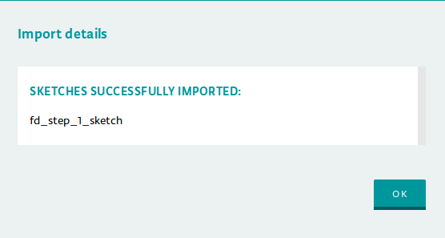

5. With the "Getting Started” tab now closed, the ISS IDE will default in the Intel® C/C++ perspective which appears similar to below:

   1. **Note**: The perspective may be different if ISS has been started before and changes were made.  A different perspective may be open, such as the standard C/C++ perspective, or if the windows have been moved.

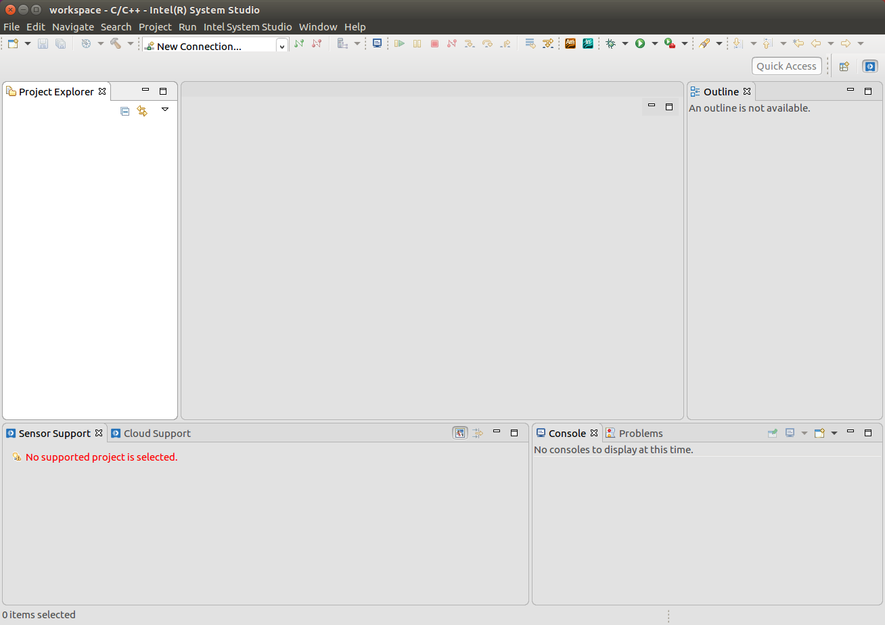

#### Create Project

1. Before building the executable, a project must be created.  Start by opening File->New->Project...


2. Expand "C/C++", select “C++ Project”, and then click the Next button.

   1. **Note**: If the "C/C++" wizard is not available, you will need to unhide it by going to Window->Preferences,”Intel System Studio”, unchecking the option “Hide unsupported wizards”, and then click the OK button.

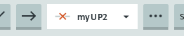

3. The "C++ Project" window will appear.  Set the following items:

   1. Set "Project name" to: face_detection_step_1

   2. Uncheck the "Use default location" box, then click the Browse… button.  Using the file open dialog, browse to the tutorial “step_1” directory and then click the OK button.

   3. Make sure under "Project type", the Executable->”Empty Project” is selected

   4. Under "Toolchain", select “Linux GCC”

   5. When complete the window should look similar to below.  Click the Finish button to continue.

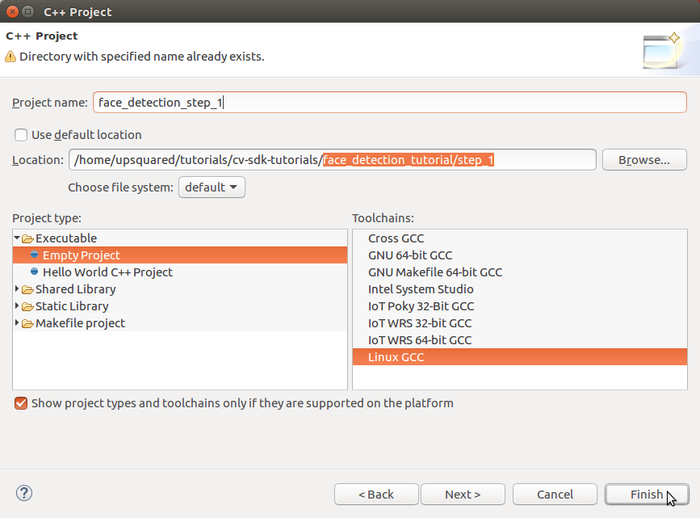

4. You may see a "Open Associated Perspective?" window prompting to open the C/C++ perspective.  If so click the Yes button.


5. You now should be in the C/C++ perspective with the tutorial added as a project similar to below.

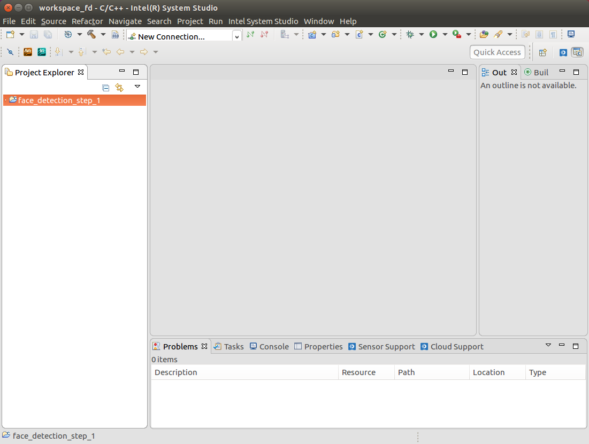

6. Note that the "Project Explorer" window shows the new project “face_detection_step_1”.

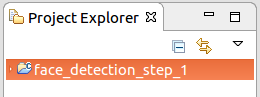

#### Configure Project

1. To build the project, it must be configured to use the CMake files present.  Start by selecting the project in the "Project Explorer" window and then from the menu select Project->Properties.

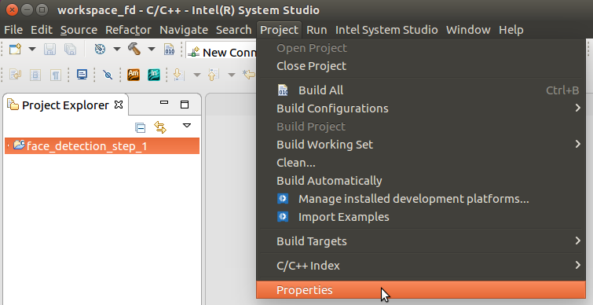

2. The "Properties for …" window will appear.   First, expand “C/C++ Build” and select “Tool Chain Editor”.  Then in the “Current builder” drop-down list, select the “CMake Builder (portable)”.  Then click the Apply button.

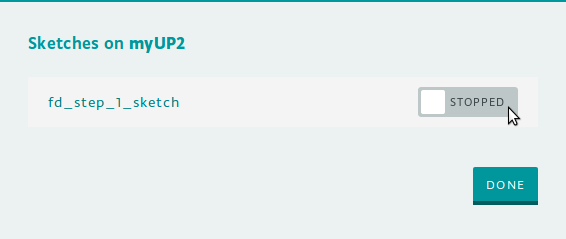

3. Now change "Configuration" to “Release”, then again set “Current builder” to “CMake Builder (portable)”.  Then click the OK button.


4. At this point, if you open the source file main.cpp you will see include files not found and syntax errors listed in the "Problems" window.  These errors are not really errors and compiling the executable will succeed.  The false errors appear because the CMake builder does not automatically import include paths for the IDE’s code analysis (also referred to as the “Indexer”) from the CMake files.  To fix the false errors reported by the indexer, you must set some include paths and define a macro.  Start by again selecting the project in the “Project Explorer” window and then from the menu select Project->Properties.  Expand “C/C++ General” and then select “Paths and Symbols”.  With Configuration set to  “[All configurations]”, the path and symbol settings need to be set as follows:

   1. On the Include tab for Language "GNU C++", the list of “Include directories” needs to have:

      1. /opt/intel/computer_vision_sdk/deployment_tools/inference_engine/include

      2. /opt/intel/computer_vision_sdk/deployment_tools/inference_engine/samples/common

      3. /opt/intel/computer_vision_sdk/deployment_tools/inference_engine/samples/extension

      4. /opt/intel/computer_vision_sdk/opencv/include

      5. /opt/intel/computer_vision_sdk/deployment_tools/inference_engine/samples/common/samples

   2. On the Symbol tab for Language "GNU C++":

      1. Symbol "__cplusplus" set to value “201103”

   3. Instead of manually making all theses changes, a settings file that can be imported for all the above is included with the tutorial files under "system_studio/exported_paths_and_symbols.xml".  The following steps will use the settings file instead of entering manually.	

5. Starting from Project->Properties, "C/C++ General"->“Paths and Symbols”, import the paths and symbols needed by the indexer by clicking the “Import Settings…” button.  The “Import” window will appear.  Select the “Settings file” by clicking on the “Browse…” button then browsing to the XML file supplied with the tutorial to select the file “system_studio/exported_paths_and_symbols.xml”.   By default, “Select Configuration” should have “Debug” selected.  The window should appear similar to below.  Click the Finish button to complete (this will close the project properties window too).


6. Starting again from Project->Properties, "C/C++ General"->“Paths and Symbols”, import the paths and symbols needed by the indexer by clicking the “Import Settings…” button.  The “Import” window will appear.  Select the “Settings file” by clicking on the “Browse…” button then browsing to the XML file supplied with the tutorial to select the file “system_studio/exported_paths_and_symbols.xml”.  This time under “Select Configuration”, select “Release”.  The window should appear similar to below.  Click the Finish button to complete.

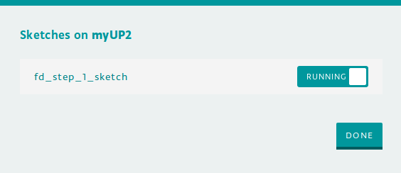

7. Going back to Project->Properties, "C/C++ General"->“Paths and Symbols” should appear similar to below for the Includes and Symbols tabs.

   1. **Note**: After these settings are made, to remove the false errors you may need to re-index the project by selecting from the menu Project->"C/C++ Index”->Rebuild

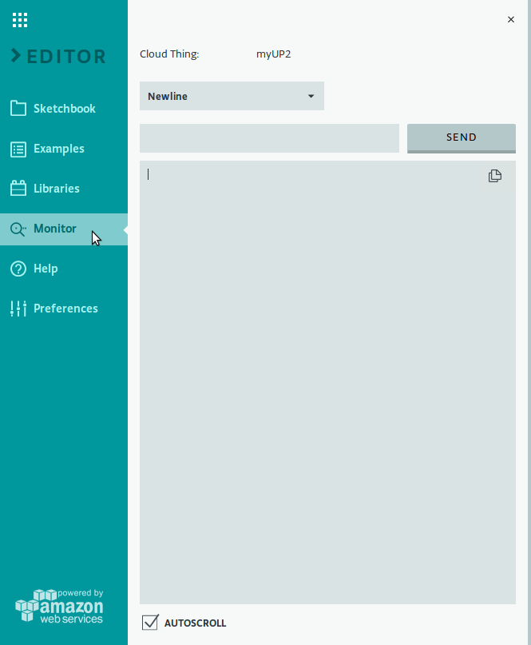

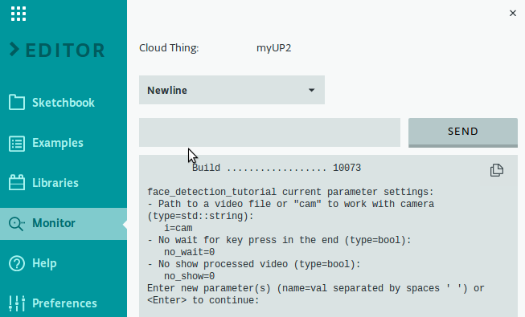

#### Build Executable

1. Now that the project is configured, we will build the executable.  We will be using the Release configuration build which is set by Project->"Build Configurations”->”Set Active” and selecting "Release”.

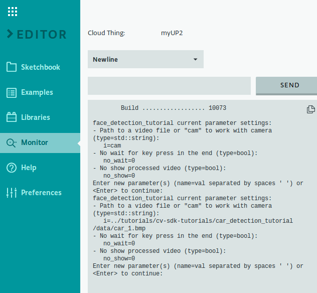

2. Build the executable using Project->"Build Project”.

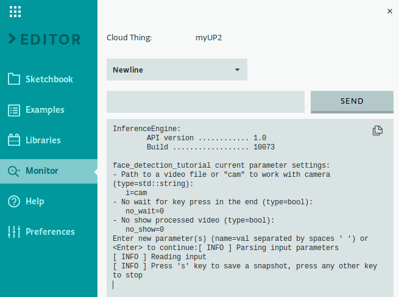

3. The "Build Project" window will appear.  The first build will take a minute to complete because it is building all the sample libraries needed.  Click the “Run in Background” button to close the window and letting the build continue as we look at the consoles.


4. In the Console window you may see the output of CMake similar to below.  


5. To see the output of the compiler, we need to change to the build console.  To do so, click on the down-arrow to the right of the terminal icon, then select "CDT Build Console [...]".


6. When the build completes successfully, the Console will appear similar to below.

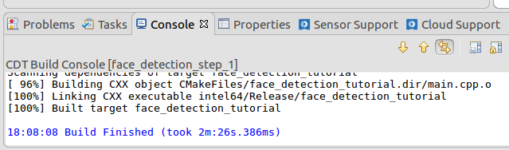

7. Now that the executable is built, we can move on to running it.

### Run

#### Create Run Configuration

1. Before running the executable from within ISS, a run configuration must be created.  The quickest way to setup a new one is to just run the project and then edit the details.  To start this, from the Run menu, select "Run As" then “Local C/C++ Application”.


2. You may see a "C Local Application" window appear similar to below prompting to choose which binary to run.  If so, choose “face_detection_tutorial” and click the OK button.  **Note**: The other binaries listed are side effects from CMake and may be ignored.


3. The project’s executable will be started with the output appearing in the Console window.  At this point no command line arguments are given to the executable which will run (or exit) accordingly.  The default input is the camera so you may have a new window open displaying the output in which to press any key to stop as prompted similar to below.


4. Since the default name used is the name of the executable, it is a good idea to have the run configuration’s name match the project to make it easier to distinguish it from multiple projects.  Begin by editing the run configuration’s name by first opening the run configuration up starting from the Run menu, selecting "Run Configurations…".


5. Under "C/C++ Application", select the correct project’s run configuration which will appear in the the Project setting.  Now edit the Name at the top changing to closer match the project name, here setting it to “face_detection_tutorial_step_1” as shown below.


#### How to Set Command Line Arguments

1. The run configuration just created does not have any command line arguments being passed to it.  To add arguments when running the executable, you must edit the run configuration starting from the Run menu, selecting "Run Configurations…".  Depending upon how many configurations are present, you may need to select the one for the current project.  Initially the Main tab is selected which shows the main project settings similar to below.

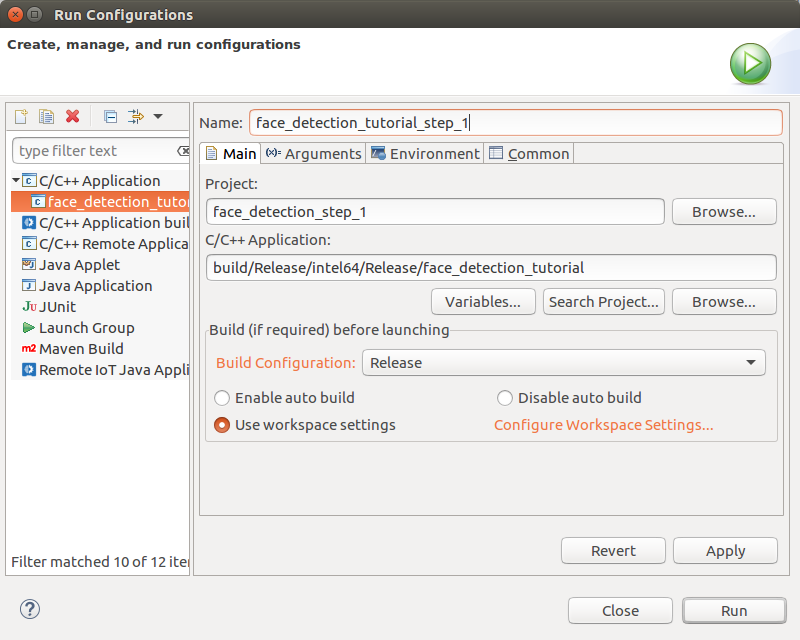

2. To set command line arguments, select the Arguments tab which will appear similar to below.  

   1. In the "Program arguments" area goes the command line arguments to be passed to the executable when run.  Here we have entered “-i cam” as an example.  Literal command line arguments will be passed exactly as they appear.  Environment variables require special treatment and are specified as “${env_var:\<var_name\>}” where “\<var_name\>” is the environment variable name.

   2. Also shown is the "Working directory".  This is where the executable is run and by default set to the top project directory.  **Note**: This is important to know when command line arguments use relative paths.

   3. When done, click the Run button to run the executable or the Close button to close the window.

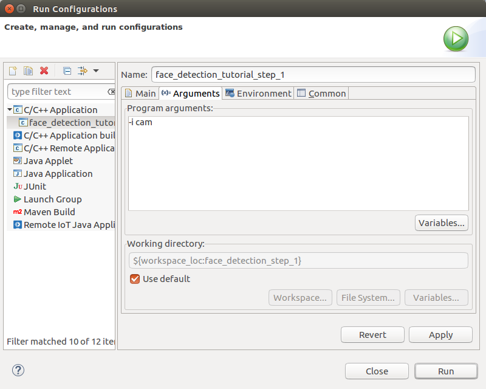

#### How to Run the Executable

1. Running the executable can always be done from the Run Configuration window using the Run button.  To run without opening the Run Configuration window is done using the Run Menu, "Run History", then selecting the name of the run configuration as shown below.  

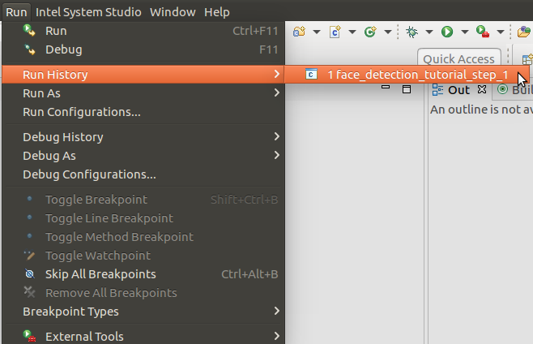

#### Running

1. Now, it is time to run the application.  We will run it using each type of input (image file, video file, camera) so you will know what to expect.  We have included commands that will have the application load images or videos that come with the OpenVINO™ toolkit and this tutorial, but you can also use your own images and video.  If the application cannot find an image, or if you have not connected the USB camera to the UP Squared* board, it will print an error message and exit.  If that happens, check the path to the image or video file, to make sure it is correct and try again.

2. First, let us use the application to view a single image file.  We do this by using a "-i" parameter followed by the name of an image file.  Set the command line arguments for the run configuration to: 

```
-i ../data/face.jpg
```


3. You should now see a new window with an image.  You should also see a "Press 's' key to save a snapshot, press any other key to exit" prompt in the console window.  The application will now wait for you to press a key with the image window active.

**Note**: Pressing a key in the console window will not do anything because the image window is detecting key presses.  Use Ctrl+C to exit.

4. Next, let us see how the application handles a video file.  Set the command line arguments for the run configuration to: 

```
-i /opt/intel/computer_vision_sdk/openvx/samples/samples/face_detection/face.mp4
```


5. You will now see a window appear and play the video.  After the video has finished playing, the window will continue to display the final frame of the video, waiting for you to press a key with the image window active.

6. Finally, we can use the application to view live video from the USB camera connected to the UP Squared* board.  The camera is the default source, so we do this by running the application without using any parameters or we can still specify the camera using "cam" by setting the command line arguments for the run configuration to:

```
-i cam
```


7. You will now see the output window appear displaying live input from the USB camera.  When you are ready to exit the application, make sure the output window is active and press a key.

# Conclusion

Now we have seen what it takes to create a basic application that uses OpenCV to read and display image data.  We have also seen how the application works with each type of image input it accepts including still images, video files, and live video from the USB camera.  We will be using the basic framework from this step of the tutorial as we move forward building up the application step-by-step.  Next, in Tutorial Step 2, we will be adding the ability to process images and actually detect faces.

# Navigation

[Face Detection Tutorial](../Readme.md)

[Face Detection Tutorial Step 2](../step_2/Readme.md)

