# Tutorial Step 2: Add the first model, Face Detection


# Table of Contents

<p></p><div class="table-of-contents"><ul><li><a href="#tutorial-step-2-add-the-first-model-face-detection">Tutorial Step 2: Add the first model, Face Detection</a></li><li><a href="#table-of-contents">Table of Contents</a></li><li><a href="#introduction">Introduction</a></li><li><a href="#face-detection-models">Face Detection Models</a><ul><li><a href="#how-do-i-specify-which-device-the-model-will-run-on">How Do I Specify Which Device the Model Will Run On?</a><ul><li><a href="#verifying-which-device-is-running-the-model">Verifying Which Device is Running the Model</a></li></ul></li></ul></li><li><a href="#adding-the-face-detection-model">Adding the Face Detection Model</a><ul><li><a href="#helper-functions-and-classes">Helper Functions and Classes</a><ul><li><a href="#matu8toblob">matU8ToBlob</a></li><li><a href="#load">Load</a></li><li><a href="#basedetection-class">BaseDetection Class</a><ul><li><a href="#read">read()</a></li><li><a href="#submitrequest">submitRequest()</a></li><li><a href="#wait">wait()</a></li><li><a href="#enabled">enabled()</a></li><li><a href="#printperformanccount">printPerformancCount()</a></li></ul></li></ul></li><li><a href="#facedetectionclass">FaceDetectionClass</a><ul><li><a href="#submitrequest">submitRequest()</a></li><li><a href="#enqueue">enqueue()</a></li><li><a href="#facedetectionclass">FaceDetectionClass()</a></li><li><a href="#read">read()</a></li><li><a href="#fetchresults">fetchResults()</a></li></ul></li></ul></li><li><a href="#using-facedetectionclass">Using FaceDetectionClass</a><ul><li><a href="#header-files">Header Files</a></li><li><a href="#main">main()</a></li><li><a href="#main-loop">Main Loop</a></li><li><a href="#post-main-loop">Post-Main Loop</a></li></ul></li><li><a href="#building-and-running">Building and Running</a><ul><li><a href="#command-line-using-make">Command Line using Make</a><ul><li><a href="#build">Build</a></li><li><a href="#run">Run</a></li></ul></li><li><a href="#intel-system-studio">Intel® System Studio</a><ul><li><a href="#build">Build</a><ul><li><a href="#start-intel-system-studio">Start Intel® System Studio</a></li><li><a href="#create-project">Create Project</a></li><li><a href="#configure-project">Configure Project</a></li><li><a href="#build-executable">Build Executable</a></li></ul></li><li><a href="#run">Run</a><ul><li><a href="#create-run-configuration">Create Run Configuration</a></li><li><a href="#how-to-set-command-line-arguments">How to Set Command Line Arguments</a></li><li><a href="#how-to-run-the-executable">How to Run the Executable</a></li><li><a href="#running">Running</a></li></ul></li></ul></li></ul></li><li><a href="#using-the-hetero-plugin">Using the Hetero Plugin</a><ul><li><a href="#heterogpucpu">HETERO:GPU,CPU</a><ul><li><a href="#command-line">Command Line:</a></li><li><a href="#system-studio-run-configuration-arguments">System Studio Run Configuration Arguments:</a></li></ul></li><li><a href="#heterocpugpu">HETERO:CPU,GPU</a><ul><li><a href="#command-line">Command Line:</a></li><li><a href="#system-studio-run-configuration-arguments">System Studio Run Configuration Arguments:</a></li></ul></li><li><a href="#heteromyriadcpu">HETERO:MYRIAD,CPU</a><ul><li><a href="#command-line">Command Line:</a></li><li><a href="#system-studio-run-configuration-arguments">System Studio Run Configuration Arguments:</a></li></ul></li></ul></li><li><a href="#conclusion">Conclusion</a></li><li><a href="#navigation">Navigation</a></li></ul></div><p></p>

# Introduction

Welcome to the Face Detection Tutorial Step 2.  This is the step of the tutorial where it gets its name by processing image data and detecting faces.  We get this ability by having the application use the Inference Engine to load and run the Intermediate Representation (IR) of a CNN model on the selected hardware device CPU, GPU, or Myriad to perform face detection.  You may recall from the OpenVINO™ toolkit overview, an IR model is a compiled version of a CNN (e.g. from Caffe) that has been optimized using the Model Optimizer for use with the Inference Engine.  This is where we start to see the power of the OpenVINO™ toolkit to load and run models on devices.  In this tutorial step, we will use the Inference Engine to run a pre-compiled model to do face detection on the input image and then output the results.  

A sample output showing the results where a Region of Interest (ROI) box appears around the detected face below.  The metrics reported include the time for OpenCV capture and display along with the time to run the face detection model.  The detected face gets a box around it along with a label as shown below.


# Face Detection Models

The OpenVINO™ toolkit includes two pre-compiled face detection models located at:

* /opt/intel/computer_vision_sdk/deployment_tools/intel_models/face-detection-adas-0001

   * Available model locations:

      * FP16: /opt/intel/computer_vision_sdk/deployment_tools/intel_models/face-detection-adas-0001/FP16/face-detection-adas-0001.xml

      * FP32: /opt/intel/computer_vision_sdk/deployment_tools/intel_models/face-detection-adas-0001/FP32/face-detection-adas-0001.xml

   * More detail may be found the OpenVINO™ toolkit at:       file:///opt/intel/computer_vision_sdk/deployment_tools/intel_models/face-detection-adas-0001/description/face-detection-adas-0001.html

* /opt/intel/computer_vision_sdk/deployment_tools/intel_models/face-detection-retail-0004

   * Available model locations:

      * FP16: /opt/intel/computer_vision_sdk/deployment_tools/intel_models/face-detection-retail-0004/FP16/face-detection-retail-0004.xml

      * FP32: /opt/intel/computer_vision_sdk/deployment_tools/intel_models/face-detection-retail-0004/FP32/face-detection-retail-0004.xml

   * More detail may be found in the OpenVINO™ toolkit at: file:///opt/intel/computer_vision_sdk/deployment_tools/intel_models/face-detection-retail-0004/description/face-detection-retail-0004.html

Each model may be used to perform face detection, the difference is how complex each underlying model is for the results it is capable of producing as shown in the summary below (for more details, see the descriptions HTML pages for each model): 

<table>
  <tr>
    <td>Model</td>
    <td>GFLOPS</td>
    <td>MParameters</td>
    <td>Average Precision</td>
  </tr>
  <tr>
    <td>face-detection-adas-0001</td>
    <td>1.4</td>
    <td>1.1</td>
    <td>AP (head height >64px) 93.1%
AP (head height >100px) 94.1%</td>
  </tr>
  <tr>
    <td>face-detection-retail-0004</td>
    <td>1.067079</td>
    <td>0.58822</td>
    <td>AP (images > 60x60px) 83.00%for </td>
  </tr>
</table>


Note that each model comes pre-compiled for both FP16 and FP32, when choosing which precision always be sure to make sure the hardware device supports it.   

## How Do I Specify Which Device the Model Will Run On?

To make it easier to try different assignments, the application will use command line arguments to specify which device a model is to be run on.  The default device will be the CPU when not set.  Now we will do a brief walkthrough how this is done in the code starting from the command line arguments to the Inference Engine API calls.  Here we are highlighting the specific code, so some code will be skipped over for now to be covered later in other walkthroughs.

To create the command line arguments, the previously mentioned gflags helper library is used to define the arguments for specifying both the face detection model and the device to run it on.  The code appears in "face_detection.hpp":

```cpp
/// @brief message for plugin argument
static const char plugin_message[] = "Plugin name. For example MKLDNNPlugin. If this parameter is pointed, " \
"the sample will look for this plugin only.";

/// \brief Define parameter for face detection  model file <br>
/// It is a required parameter
DEFINE_string(m, "", face_detection_model_message);
```


To create the command line argument: -m \<model-IR-xml-file\>, where \<model-IR-xml-file\> is the face detection model’s .xml file

```bash
/// @brief message for assigning face detection calculation to device
static const char target_device_message[] = "Specify the target device for Face Detection (CPU, GPU, FPGA, or MYRIAD. " \
"Sample will look for a suitable plugin for device specified.";

/// \brief device the target device for face detection infer on <br>
DEFINE_string(d, "CPU", target_device_message);
```


To create the argument: -d \<device\>, where <device> is set to "CPU", "GPU", or "MYRIAD" which we will see conveniently matches what will be passed to the Inference Engine later.

As a result of the macros used in the code above, the variables "FLAGS_m" and “FLAGS_d” have been created to hold the argument values.  Focusing primarily on how the “FLAGS_d” is used to tell the Inference Engine which device to use, we follow the code in “main()” of “main.cpp”:

1. First a map is declared to hold the plugins as they are loaded.  The mapping will allow the associated plugin InferencePlugin object to be found by name (e.g. "CPU")    

```cpp
     // ---------------------Load plugins for inference engine------------------------------------------------
        std::map<std::string, InferencePlugin> pluginsForDevices;
```


2. A vector is used to pair the device and model command line arguments to iterate through them:     

```cpp
   std::vector<std::pair<std::string, std::string>> cmdOptions = {
            {FLAGS_d, FLAGS_m}
        };
```


3. A loop iterates through device and model the argument pairs:

```cpp
for (auto && option : cmdOptions) {
            auto deviceName = option.first;
            auto networkName = option.second;
```


4. A check is done to make sure the plugin has not already been created and put into the pluginsForDevices map:            

```cpp
 if (pluginsForDevices.find(deviceName) != pluginsForDevices.end()) {
                continue;
            }
```


5. The plugin is created using the Inference Engine’s PluginDispatcher API for the given device’s name.  Here "deviceName" is the value for “FLAGS_d” which came directly from the command line argument “-d” which is set to “CPU”, “GPU”, or “MYRIAD”, the exact names the Inference Engine knows for devices.

```cpp
         slog::info << "Loading plugin " << deviceName << slog::endl;
            InferencePlugin plugin = PluginDispatcher({"../../../lib/intel64", ""}).getPluginByDevice(deviceName);
```


6. The plugin details are printed out:

```cpp 
           /** Printing plugin version **/
            printPluginVersion(plugin, std::cout);
```


7. The created plugin is stored to be found by device name later:

```cpp
            pluginsForDevices[deviceName] = plugin;
```


8. Finally the model is loaded passing in the plugin created for the specified device, again using the name given same as it appears on the command line ("Load" class will be described later):

```cpp
       // --------------------Load networks (Generated xml/bin files)-------------------------------------------
        Load(FaceDetection).into(pluginsForDevices[FLAGS_d]);
```


### Verifying Which Device is Running the Model

The application will give output saying what Inference Engine plugins (devices) were loaded and which models were loaded on which plugins.

Here is a sample of the output in the console window:

Inference Engine reporting its version:

```bash
InferenceEngine: 
	API version ............ (N.N)
	Build .................. (string)
[ INFO ] Parsing input parameters
[ INFO ] Reading input
```


The application reporting that it is loading the CPU plugin:

```bash
[ INFO ] Loading plugin CPU
```


Inference Engine reports that it has loaded the CPU plugin (MKLDNNPlugin) and its version:

```bash
	API version ............ (N.N)
	Build .................. (string)
	Description ....... MKLDNNPlugin
[ INFO ] Loading network files for Face Detection
[ INFO ] Batch size is set to  1
[ INFO ] Checking Face Detection inputs
[ INFO ] Checking Face Detection outputs
```


The application reporting that it is loading the CPU plugin for the face detection model:

```bash
[ INFO ] Loading Face Detection model to the CPU plugin
[ INFO ] Start inference
```


Later in Tutorial Step 4, we cover loading multiple models onto different devices.  We will also look at how the models perform on different devices.  Until then, we will let all the models load and run on the default CPU device.

# Adding the Face Detection Model

From Tutorial Step 1, we have the base application that can read and display image data, now it is time process the images.  This step of the tutorial expands the capabilities of the application to use the Inference Engine and the face detection model to process images.  To help accomplish this, first we are going to walkthrough the helper functions and classes.  The code may be found in the main.cpp file.

## Helper Functions and Classes

There will need to be a function that takes the input image and turns it into a "blob".  Which begs the question “What is a blob?”  In short, a blob, specifically the class InferenceEngine::Blob, is the data container type used by the Inference Engine for holding input and output data.  To get data into the model, the image data will need to be converted from the OpenCV cv::Mat to an InferenceEngine::Blob.  For doing that is the helper function “matU8ToBlob” in \opt\intel\computer_vision_sdk\inference_engine\samples\common\samples\ocv_common.hpp:

### matU8ToBlob

1. Variables are defined to store the dimensions for the images that the model is optimized to work with.  "blob_data" is assigned to the blob’s data buffer.

```cpp
/**
* @brief Sets image data stored in cv::Mat object to a given Blob object.
* @param orig_image - given cv::Mat object with an image data.
* @param blob - Blob object which to be filled by an image data.
* @param batchIndex - batch index of an image inside of the blob.
*/
template <typename T>
void matU8ToBlob(const cv::Mat& orig_image, InferenceEngine::Blob::Ptr& blob, int batchIndex = 0) {
    InferenceEngine::SizeVector blobSize = blob->getTensorDesc().getDims();
    const size_t width = blobSize[3];
    const size_t height = blobSize[2];
    const size_t channels = blobSize[1];
    T* blob_data = blob->buffer().as<T*>();
```


2. A check is made to see if the input image matches the dimensions of images that the model is expecting.  If the dimensions do not match, then use the OpenCV function cv::resize to resize it.  

```cpp
    cv::Mat resized_image(orig_image);
    if (width != orig_image.size().width || height!= orig_image.size().height) {
        cv::resize(orig_image, resized_image, cv::Size(width, height));
    }
```


3. Now that the image data is the proper size, the data is copied from the input image into the blob’s buffer.  A blob will hold the entire batch for a run through the inference model, so for each batch item first calculate "batchOffset" as an offset into the blob’s buffer before copying the data.

```cpp
    int batchOffset = batchIndex * width * height * channels;

    for (size_t c = 0; c < channels; c++) {
        for (size_t  h = 0; h < height; h++) {
            for (size_t w = 0; w < width; w++) {
                blob_data[batchOffset + c * width * height + h * width + w] =
                    resized_image.at<cv::Vec3b>(h, w)[c];
            }
        }
    }
}
```


For more details on the InferenceEngine::Blob class, see "Understanding Inference Engine Memory primitives" in the documentation: [https://software.intel.com/en-us/articles/OpenVINO-InferEngine](https://software.intel.com/en-us/articles/OpenVINO-InferEngine)

### Load

The helper class "Load" loads the model onto the device to be executed on.  

```cpp
struct Load {
    BaseDetection& detector;
    explicit Load(BaseDetection& detector) : detector(detector) { }

    void into(InferenceEngine::InferencePlugin & plg) const {
        if (detector.enabled()) {
            detector.net = plg.LoadNetwork(detector.read(), {});
            detector.plugin = &plg;
        }
    }
};
```


To help explain how this works, an example using "Load" will be used which looks like:

```cpp
Load(FaceDetection).into(pluginsForDevices[FLAGS_d]);
```


The line is read as "Load FaceDetection into the plugin pluginsForDevices[FLAGS_d]" which is done as follows:

1. Load(FaceDetection) is a constructor to initialize model object "detector" and returns a “Load” object

2. "into()" is called on the returned object passing in the mapped plugin from “pluginsForDevices”.  The map returns the plugin mapped to “FLAGS_d”, which is the command line argument “CPU”, “GPU”, or “MYRIAD”.  The function into() then first checks if the model object is enabled and if it is:

   1. Calls "plg.LoadNetwork(detector.read(),{})"  to load the model returned by “detector.read()” (which we will see later is reading in the model’s IR file) into the plugin.  The resulting object is stored in the model object (detetor.net) 

   2. Sets the model object’s plugin (detector.plugin) to the one used

### BaseDetection Class

Now we are going to walkthrough the BaseDetection class that is used to abstract common features and functionality when using a model which the code also refers to as "detector".  

1. The class is declared and its member variables, the constructor and destructor are defined.  The ExecutableNetwork holds the model that will be used to process the data and make inferences.  The InferencePlugin is the Inference Engine plugin that will be executing the Intermediate Reference on a specific device.  InferRequest is the object that will be used to hold input and output data, start inference, and wait for results.  The name of the model is stored in topoName and the command line argument for the model is stored in commandLineFlag.  Finally, maxBatch is used to set the number of inputs to infer during each run. 

```cpp
struct BaseDetection {
    ExecutableNetwork net;
    InferenceEngine::InferencePlugin * plugin = NULL;
    InferRequest::Ptr request;
    std::string & commandLineFlag;
    std::string topoName;
    const int maxBatch;

    BaseDetection(std::string &commandLineFlag, std::string topoName, int maxBatch)
        : commandLineFlag(commandLineFlag), topoName(topoName), maxBatch(maxBatch) {}

    virtual ~BaseDetection() {}
```


2. The operator -> is overridden for a convenient way to get access to the network.

```cpp
    ExecutableNetwork* operator ->() {
        return &net;
    }
```


#### read()

Since the networks used by the detectors will have different requirements for loading, declare the read() function to be pure virtual.  This ensures that each detector class will have a read function appropriate to the model it will be using.

```cpp
    virtual InferenceEngine::CNNNetwork read()  = 0;
```


#### submitRequest()

The submitRequest() function checks to see if the model is enabled and that there is a valid request to start.  If there is, it requests the model to start running the model asynchronously with startAsync() which returns immediately (we will show how to wait on the results next).

```cpp
    virtual void submitRequest() {
        if (!enabled() || request == nullptr) return;
        request->StartAsync();
    }
```


#### wait()

wait() will wait until results from the model are ready.  First it checks to see if the model is enabled and there is a valid request before actually waiting on the request.

```cpp
    virtual void wait() {
        if (!enabled()|| !request) return;
        request->Wait(IInferRequest::WaitMode::RESULT_READY);
    }
```


#### enabled()

Variables and the enabled() function are defined to track and check if the model is enabled or not.  The model is disabled if "commandLineFlag", the command line argument specifying the model IR .xml file (e.g. “-m”) , has not been set.

```cpp
    mutable bool enablingChecked = false;
    mutable bool _enabled = false;

    bool enabled() const  {
        if (!enablingChecked) {
            _enabled = !commandLineFlag.empty();
            if (!_enabled) {
                slog::info << topoName << " DISABLED" << slog::endl;
            }
            enablingChecked = true;
        }
        return _enabled;
    }
```


#### printPerformancCount()

The printPerformancCount() function checks to see if the detector is enabled, and if it is, then prints out the overall performance statistics for the model.

```cpp
    void printPerformanceCounts() {
        if (!enabled()) {
            return;
        }
        slog::info << "Performance counts for " << topoName << slog::endl << slog::endl;
        ::printPerformanceCounts(request->GetPerformanceCounts(), std::cout, false);
    }
```


## FaceDetectionClass 

Now that we have seen what the base class provides, we will now walkthrough the code for the derived FaceDetectionClass class to see how a model is implemented.

FaceDetectionClass is derived from the BaseDetection class and adding some new member variables that will be needed.

```cpp
struct FaceDetectionClass : BaseDetection {
    std::string input;
    std::string output;
    int maxProposalCount = 0;
    int objectSize = 0;
    int enquedFrames = 0;
    float width = 0;
    float height = 0;
    bool resultsFetched = false;
    std::vector<std::string> labels;
    using BaseDetection::operator=;

    struct Result {
        int label;
        float confidence;
        cv::Rect location;
    };

    std::vector<Result> results;
```


Notice the "Result" struct and the vector “results” that will be used since the face detection model can find more than one face in an image.  Each Result will include a cvRect indicating the location and size of the face in the input image.  It will also have a label and a value indicating the confidence that the result is a face.

### submitRequest()

The submitRequest() function is overridden to make sure there is input data ready and clear out any previous results before calling BaseDetection::submitRequest() to start inference.

```cpp
    void submitRequest() override {
        if (!enquedFrames) return;
        enquedFrames = 0;
        resultsFetched = false;
        results.clear();
        BaseDetection::submitRequest();
    }
```


### enqueue()

A check is made to see that the face detection model is enabled. 

```cpp
    void enqueue(const cv::Mat &frame) {
        if (!enabled()) return;
```


An inference request object is created if one has not been already created.  The request object is used for holding input and output data, starting inference, and waiting for completion and results.

```cpp
        if (!request) {
            request = net.CreateInferRequestPtr();
        }
```


The input blob from the request is retrieved and then matU8ToBlob() is used to copy the image image data into the blob.

```cpp
        width = frame.cols;
        height = frame.rows;

        auto  inputBlob = request->GetBlob(input);
        matU8ToBlob<uint8_t >(frame, inputBlob);
        enquedFrames = 1;
     }
```


### FaceDetectionClass()

On construction of a FaceDetectionClassobject, the base class constructor is called passing in the model to load specified in the command line argument FLAGS_m, the name to be used when printing out informational messages, and set the batch size to 1.  This initializes the BaseDetection subclass specifically for FaceDetectionClass class.

```cpp
    FaceDetectionClass() : BaseDetection(FLAGS_m, "Face Detection", 1) {}
```


### read()

The next function we will walkthrough is the FaceDetectorClass::read() function which must be specialized specifically to the model that FaceDetectorClass will load and run. 

1. Use the Inference Engine API InferenceEngine::CNNNetReader object to load the model IR files.  This comes from the XML file that is specified on the command line using the "-m" parameter.  

```cpp
    InferenceEngine::CNNNetwork read() override {
        slog::info << "Loading network files for Face Detection" << slog::endl;
        InferenceEngine::CNNNetReader netReader;
        /** Read network model **/
        netReader.ReadNetwork(FLAGS_m);
```


2. The maximum batch size is set to the value given in the constructor which is fixed at 1.

```cpp
        /** Set batch size to 1 **/
        slog::info << "Batch size is set to  "<< maxBatch << slog::endl;
        netReader.getNetwork().setBatchSize(maxBatch);
```


3. Names for the model IR .bin file and optional .label file are generated based on the model name from the "-m" parameter.

```cpp
        /** Extract model name and load it's weights **/
        std::string binFileName = fileNameNoExt(FLAGS_m) + ".bin";
        netReader.ReadWeights(binFileName);
        /** Read labels (if any)**/
        std::string labelFileName = fileNameNoExt(FLAGS_m) + ".labels";

        std::ifstream inputFile(labelFileName);
        std::copy(std::istream_iterator<std::string>(inputFile),
                  std::istream_iterator<std::string>(),
                  std::back_inserter(labels));
```


4. The input data format configured for the proper precision (U8 = 8-bit per BGR channel) and memory layout (NCHW) for the expected model being used.

```cpp
        slog::info << "Checking Face Detection inputs" << slog::endl;
        InferenceEngine::InputsDataMap inputInfo(netReader.getNetwork().getInputsInfo());
        if (inputInfo.size() != 1) {
            throw std::logic_error("Face Detection network should have only one input");
        }
        auto& inputInfoFirst = inputInfo.begin()->second;
        inputInfoFirst->setPrecision(Precision::U8);
        inputInfoFirst->getInputData()->setLayout(Layout::NCHW);
```


5. A check to make sure that there is only one output result defined for the expected model being used. 

```cpp
        slog::info << "Checking Face Detection outputs" << slog::endl;
        InferenceEngine::OutputsDataMap outputInfo(netReader.getNetwork().getOutputsInfo());
        if (outputInfo.size() != 1) {
            throw std::logic_error("Face Detection network should have only one output");
        }
```


6. A check to make sure that the output layers of the model are what are expected.

```cpp
        auto& _output = outputInfo.begin()->second;
        output = outputInfo.begin()->first;

        const auto outputLayer = netReader.getNetwork().getLayerByName(output.c_str());
        if (outputLayer->type != "DetectionOutput") {
            throw std::logic_error("Face Detection network output layer(" + outputLayer->name +
                ") should be DetectionOutput, but was " +  outputLayer->type);
        }

        if (outputLayer->params.find("num_classes") == outputLayer->params.end()) {
            throw std::logic_error("Face Detection network output layer (" +
                output + ") should have num_classes integer attribute");
        }
```


7. Check to make sure that the the number of labels read from the label file match the number of classes in the model.  If not, then clear the labels and do not use them.  

```cpp
        const int num_classes = outputLayer->GetParamAsInt("num_classes");
        if (labels.size() != num_classes) {
            if (labels.size() == (num_classes - 1))  // if network assumes default "background" class, having no label
                labels.insert(labels.begin(), "fake");
            else
                labels.clear();
        }
```


8. A check to make sure that the output the model will return matches as expected.

```cpp
        const InferenceEngine::SizeVector outputDims = _output->dims;
        maxProposalCount = outputDims[1];
        objectSize = outputDims[0];
        if (objectSize != 7) {
            throw std::logic_error("Face Detection network output layer should have 7 as a last dimension");
        }
        if (outputDims.size() != 4) {
            throw std::logic_error("Face Detection network output dimensions not compatible shoulld be 4, but was " + outputDims.size());
        }
```


9. The output format is configured to use the output precision and memory layout that is expect for results from the model being used.

```cpp
        _output->setPrecision(Precision::FP32);
        _output->setLayout(Layout::NCHW);
```


10. Tthe name of the input blob (inputInfo.begin()->first) is saved for later use when getting a blob for input data.  Finally, the InferenceEngine::CNNNetwork object that references this model is returned.

```cpp
        slog::info << "Loading Face Detection model to the "<< FLAGS_d << " plugin" << slog::endl;
        input = inputInfo.begin()->first;
        return netReader.getNetwork();
    }
```


### fetchResults()

fetchResults() will parse the inference results saving them in the "Results" variable.

1. Check to make sure that the model is enabled.  If so, clear out any previous results. 

```cpp
    void fetchResults() {
        if (!enabled()) return;
        results.clear();
```


2. Whether results have been fetched are tracked to only fetch once.  submitRequest() resets resultsFetched=false to indicate results have not been fetched yet for each request.

```cpp
        if (resultsFetched) return;
        resultsFetched = true;
```


3. "detections" is set topoint to the inference model output results held in the output blob. 

```cpp
        const float *detections = request->GetBlob(output)->buffer().as<float *>();
```


4. A loop is started to go through the results from the face detection model.  "maxProposalCount" has been set to the maximum number of results that the model can return.  

```cpp
        for (int i = 0; i < maxProposalCount; i++) {
```


5. The loop to retrieve all the results from the output blob buffer.  The output format is determined by the model.  For the face detection model used, the following fields are expected:

   1. Image_id

   2. Label

   3. Confidence 

   4. X coordinate of ROI

   5. Y coordinate of ROI

   6. Width of ROI

   ```cpp
               float image_id = detections[i * objectSize + 0];
               Result r;
               r.label = static_cast<int>(detections[i * objectSize + 1]);
               r.confidence = detections[i * objectSize + 2];
               if (r.confidence <= FLAGS_t) {
                   continue;
               }

               r.location.x = detections[i * objectSize + 3] * width;
               r.location.y = detections[i * objectSize + 4] * height;
               r.location.width = detections[i * objectSize + 5] * width - r.location.x;
               r.location.height = detections[i * objectSize + 6] * height - r.location.y;
   ```


6. If the returned image_id is not valid, no more valid outputs are expected so exit the loop.

```cpp
            if (image_id < 0) {
                break;
            }
```


7. A check to see if the application was requested to display the raw information (-r) and print it to the console if necessary.

```cpp
            if (FLAGS_r) {
                std::cout << "[" << i << "," << r.label << "] element, prob = " << r.confidence <<
                          "    (" << r.location.x << "," << r.location.y << ")-(" << r.location.width << ","
                          << r.location.height << ")"
                          << ((r.confidence > FLAGS_t) ? " WILL BE RENDERED!" : "") << std::endl;
            }
```


8. The populated Result object is added to the vector of results to be used later by the application.

```cpp
            results.push_back(r);
        }
    }
```


See the Inference Engine Development Guide [https://software.intel.com/inference-engine-devguide](https://software.intel.com/inference-engine-devguide) for more information on the steps when using a model with the Inference Engine API.

# Using FaceDetectionClass

We have now seen what happens behind the scenes in the FaceDetectionClass, we will move into the application code and see how it is used.

1. Open up a terminal (such as xterm) or use an existing terminal to get to a command shell prompt.

2. Change to the directory containing Tutorial Step 2:

```bash
cd tutorials/computer-vision-inference-dev-kit-tutorials/face_detection_tutorial/step_2
```


3. Open the files "main.cpp" and “face_detection.hpp” in the editor of your choice such as ‘gedit’, ‘gvim’, or ‘vim’.

## Header Files

1. The first header file to include is necessary to access the Inference Engine API.

```cpp
#include <inference_engine.hpp>
```


2. There are three more headers needed for using the vehicle detection model and the data it gives.

```cpp
#include "face_detection.hpp"
#include <ext_list.hpp>
using namespace InferenceEngine;
```


## main()

1. In the main() function, there are a map and vector that help make it easier to reference plugins for the Inference Engine. The map stores created plugins to be indexed by the device name of the plugin.  The vector pairs the input models with their corresponding devices using the command line arguments specifying model and device (this was also covered previously while explaining the path from command line to passing which device to use through the Inference Engine API).  Here also instantiates the FaceDetection object of type FaceDetectionClass.

```cpp
std::map<std::string, InferencePlugin> pluginsForDevices;
std::vector<std::pair<std::string, std::string>> cmdOptions = {
   {FLAGS_d, FLAGS_m}
};

FaceDetectionClass FaceDetection;
```


2. A loop is used to iterate through the device/model pairs and a check is made to see if a plugin for the device already exists.  if not, create the appropriate plugin.  

```cpp
for (auto && option : cmdOptions) {
   auto deviceName = option.first;
   auto networkName = option.second;
   if (deviceName == "" || networkName == "") {
      continue;
   }
   if (pluginsForDevices.find(deviceName) != pluginsForDevices.end()) {
      continue;
   }
```


3. The plugin for the given deviceName is loaded and then its version is reported.

```cpp
   slog::info << "Loading plugin " << deviceName << slog::endl;
   InferencePlugin plugin = PluginDispatcher({"../../../lib/intel64", ""}).getPluginByDevice(deviceName);
   std::cout << plugin.GetVersion() << std::endl << std::endl;
```


4. If loading the CPU plugin, then load the available CPU extensions library.

```cpp
   /** Load extensions for the CPU plugin **/
   if ((deviceName.find("CPU") != std::string::npos)) {
       plugin.AddExtension(std::make_shared<Extensions::Cpu::CpuExtensions>());
   }
```


5. The created plugin is stored into the map pluginsForDevices to be used later when loading the model.

```cpp
   pluginsForDevices[deviceName] = plugin;
}
```


6. The model is loaded into the Inference Engine and associated with the device using the Load helper class previously covered.

```cpp
Load(FaceDetection).into(pluginsForDevices[FLAGS_d]);
```


## Main Loop

The main loop in main() is where all the work is done.  Here we walk through the changes made to what it does.  Not all of the code from Tutorial Step 1 is shown.  Please keep in mind that each time through the loop, the application is grabbing an image and storing it in an object named "frame".

1. The code below enqueues the current image and tracks how long it takes.

```cpp
auto t0 = std::chrono::high_resolution_clock::now();
FaceDetection.enqueue(frame);
auto t1 = std::chrono::high_resolution_clock::now();
ocv_decode_time = std::chrono::duration_cast<ms>(t1 - t0).count();
```


2. The face detection model is run to infer the image using submitRequest() then the results are waited on using wait().  The submit-then-wait are enveloped with timing functions to measure how long the inference takes.

```cpp
t0 = std::chrono::high_resolution_clock::now();
FaceDetection.submitRequest();
FaceDetection.wait();
t1 = std::chrono::high_resolution_clock::now();
ms detection = std::chrono::duration_cast<ms>(t1 - t0);
```


3. The inference results are parsed and stored in FaceDetection.results.

```cpp
FaceDetection.fetchResults();
```


4. The statistics are computed for how long each processing step took and that information is printed onto the image.

```cpp
std::ostringstream out;
out << "OpenCV cap/render time: " << std::fixed << std::setprecision(2)
   << (ocv_decode_time + ocv_render_time) << " ms";
cv::putText(frame, out.str(), cv::Point2f(0, 25), cv::FONT_HERSHEY_TRIPLEX, 0.5, cv::Scalar(255, 0, 0));
out.str("");
out << "Face detection time  : " << std::fixed << std::setprecision(2) << detection.count()
   << " ms ("
   << 1000.f / detection.count() << " fps)";
cv::putText(frame, out.str(), cv::Point2f(0, 45), cv::FONT_HERSHEY_TRIPLEX, 0.5, cv::Scalar(255, 0, 0));
```


5. Using OpenCV library calls draw a rectangle around the area that the face detection model determined to be a face along with a label.

```cpp
int i = 0;
for (auto & result : FaceDetection.results) {
   cv::Rect rect = result.location;
   out.str("");
   {
      out << (result.label < FaceDetection.labels.size() ? FaceDetection.labels[result.label] :
         std::string("label #") + std::to_string(result.label))
         << ": " << std::fixed << std::setprecision(3) << result.confidence;
   }
   cv::putText(frame,
                      out.str(),
                      cv::Point2f(result.location.x, result.location.y - 15),
                      cv::FONT_HERSHEY_COMPLEX_SMALL,
                      0.8,
                      cv::Scalar(0, 0, 255));
   auto genderColor =
      cv::Scalar(0, 255, 0);
   cv::rectangle(frame, result.location, genderColor, 2);
   i++;
}
```


6. Finally, the final results for the frame are displayed while measuring the time it took to show the image.

```cpp
t0 = std::chrono::high_resolution_clock::now();
cv::imshow("Detection results", frame);
t1 = std::chrono::high_resolution_clock::now();
ocv_render_time = std::chrono::duration_cast<ms>(t1 - t0).count();
```


## Post-Main Loop

After all the images have been processed (or you have chosen to stop analyzing input from the camera), if the "-pc" command line argument was used, the performance statistics are printed out to the command window and the application is exited.

```cpp
if (FLAGS_pc) {
   FaceDetection.printPerformanceCounts();
}
```


# Building and Running

Now that we have looked at the code and understand how the program works, let us compile and run to see it in action.  To do that, two ways are covered in the following sections: 1) Command line using "make" and 2) using Intel® System Studio (ISS).  Both ways do the same things, so choose according to your preference.

## Command Line using Make

The following covers how to build and run from the command line using "make".

### Build

1. Open up a terminal (such as xterm) or use an existing terminal to get to a command shell prompt.

2. Change to the directory containing Tutorial Step 2:

```bash
cd tutorials/computer-vision-inference-dev-kit-tutorials/face_detection_tutorial/step_2
```


3. The first step is to configure the build environment for the OpenVINO™ toolkit by sourcing the "setupvars.sh" script.

```bash
source  /opt/intel/computer_vision_sdk/bin/setupvars.sh
```


4. Now we need to create a directory to build the tutorial in and change to it.

```bash
mkdir build
cd build
```


5. The last thing we need to do before compiling is to configure the build settings and build the executable.  We do this by running CMake to set the build target and file locations.  Then we run Make to build the executable.

```bash
cmake -DCMAKE_BUILD_TYPE=Release ../
make
```


### Run

1. You now have an executable file to run.  In order to have it run the face detection model, we will need to add a couple of parameters to the command line:

   1. "-i \<input-image-or-video-file\>" to specify an input image or video file instead of using the USB camera by default

   2. "-m \<model-xml-file\>"  to specify where to find the module.  For example: -m  /opt/intel/computer_vision_sdk/deployment_tools/intel_models/face-detection-adas-0001/FP32/face-detection-adas-0001.xml”

   3. That is a lot to type and keep straight, so to help make the model names shorter to type  and easier to read, let us use the helper script scripts/setupenv.sh that sets up shell variables we can use.  For reference, here are the contents of scripts/setupenv.sh:

   ```bash
   # Create variables for all models used by the tutorials to make
   #  it easier to reference them with short names

   # check for variable set by setupvars.sh in the SDK, need it to find models
   : ${InferenceEngine_DIR:?Must source the setupvars.sh in the SDK to set InferenceEngine_DIR}

   modelDir=$InferenceEngine_DIR/../../intel_models

   # Face Detection Model - ADAS
   modName=face-detection-adas-0001
   export mFDA16=$modelDir/$modName/FP16/$modName.xml
   export mFDA32=$modelDir/$modName/FP32/$modName.xml

   # Face Detection Model - Retail
   modName=face-detection-retail-0004
   export mFDR16=$modelDir/$modName/FP16/$modName.xml
   export mFDR32=$modelDir/$modName/FP32/$modName.xml

   # Age and Gender Model
   modName=age-gender-recognition-retail-0013
   export mAG16=$modelDir/$modName/FP16/$modName.xml
   export mAG32=$modelDir/$modName/FP32/$modName.xml

   # Head Pose Estimation Model
   modName=head-pose-estimation-adas-0001
   export mHP16=$modelDir/$modName/FP16/$modName.xml
   export mHP32=$modelDir/$modName/FP32/$modName.xml
   ```


   4. To use the script we source it: 

   ```bash
   source ../../scripts/setupenv.sh 
   ```


   5. And now we can start referencing the variables for each model as: $mFDA16, $mFDA32, $mFDR16, $mFDR32, $mAG16, $mAG32, $mHP16, $mHP32

2. Again, we will be using images and video files that are included with this tutorial or part of the OpenVINO™ toolkit installation in our sample instructions.  Once you have seen the application working, feel free to try it on your own images and videos.

3. Let us first run it on a single image, to see how it works.

```bash
./intel64/Release/face_detection_tutorial -m $mFDA32 -i ../../data/face.jpg
```


4. You will now see an output window open up with the image displayed.  Over the image, you will see text with the statistics of how long it took to perform the OpenCV input and output and model processing time.  You should also see a rectangle drawn around the face in the image that has been labeled with an instance number and confidence value.

5. Let us see how the application handles a video file.  And let us also see how easy it is to have the application run a different face detection model by loading the face-detection-retail-0004 IR files by just changing the -m parameter from $mFDA32 to $mFDR32.

```bash
./intel64/Release/face_detection_tutorial -m $mFDR32 -i ../../data/head-pose-face-detection-female-and-male.mp4
```


6. Now, you should see a window open, playing the video.  Over each frame of the video, you will see a rectangle drawn around the face.  As the face moves around the image, the rectangle will follow it.

7. Finally, let us see how the application works with the default camera input.

```bash
./intel64/Release/face_detection_tutorial -m $mFDA32 -i cam
```


Or

```bash
./intel64/Release/face_detection_tutorial -m $mFDA32
```


8. Now you will see a window displaying the input from the USB camera.  The performance statistics appear over the image, as the application processes each frame.  If there is a face in the image, you will see a rectangle surrounding the face with label and confidence value.  The rectangle will follow the face around the image as it moves and will change sizes to fit the face.

9. When you want to exit the program, make sure the output window is active and press a key.  The output window will close and control will return to the terminal.

10. You may remember the final step of the code walk-through, where we showed a step that printed out Performance Counts for the application.  This only happens if you specify the "-pc" command line option.  Let us run the application one more time to see what kind of output we get from printing those counts.

```bash
./intel64/Release/face_detection_tutorial -m $mFDA32 -i cam -pc
```


11. When you exit the application this time, you will notice that the terminal is updated with the final statistics from the face detection model.  The extra output shows a detailed list of the various analysis steps the model performed during the last request (Note only one, not all of them for video) and how long the model spent on each step.  At the bottom of the list, it displays the total time spent performing the face inference.

```bash
InferenceEngine: 
	API version ............ (N.N)
	Build .................. (string)
[ INFO ] Parsing input parameters
[ INFO ] Reading input
[ INFO ] Loading plugin CPU

	API version ............ (N.N)
	Build .................. (string)
	Description ....... MKLDNNPlugin

[ INFO ] Loading network files for Face Detection
[ INFO ] Batch size is set to  1
[ INFO ] Checking Face Detection inputs
[ INFO ] Checking Face Detection outputs
[ INFO ] Loading Face Detection model to the CPU plugin
[ INFO ] Start inference 
[ INFO ] Press 's' key to save a snapshot, press any other key to stop
[ INFO ] Press 's' key to save a snapshot, press any other key to exit
[ INFO ] Performance counts for Face Detection

Mul_788/Fused_Mul_1070/Fus... EXECUTED       layerType: ScaleShift         realTime: 946        cpu: 946            execType: unknown
conv1                         EXECUTED       layerType: Convolution        realTime: 2586       cpu: 2586           execType: jit_sse42
conv2_1/dw                    EXECUTED       layerType: Convolution        realTime: 1484       cpu: 1484           execType: jit_sse42_dw
conv2_1/sep                   EXECUTED       layerType: Convolution        realTime: 5594       cpu: 5594           execType: jit_sse42_1x1
conv2_2/dw                    EXECUTED       layerType: Convolution        realTime: 1860       cpu: 1860           execType: jit_sse42_dw
Total time: 91233    microseconds
[ INFO ] Execution successful
```


12. Above, is part of the output you will see in your console window.  It shows information on what the Inference Engine loaded, followed by the performance statistics gathered from running each layer within the model.  This includes the calculation run, the model layer type, the real time spent performing the calculation, the CPU time spent performing the calculation, and the type of calculation that was performed.  In this instance, since we loaded the model onto the CPU, the "realTime" and “cpu” time values are the same.  The last bit of information we see is the total time spent spent performing the face analysis.  In this example it was 91233 microseconds, or 0.091233 seconds.

## Intel® System Studio

The following covers how to build and run from within Intel® System Studio (ISS).

### Build

#### Start Intel® System Studio

1. We need to start ISS using the desktop icon or the supplied scripts that will setup environment variables and launch the ISS Eclipse IDE.

   1. Desktop icon: Locate and double-click the icon shown below on the desktop.


   2. Command line: Configure the build environment when using the OpenVINO™ toolkit by sourcing the "setupvars.sh" script.  Be sure to source the helper script “scripts/setupenv.sh” which defines environment variables that point to inference models used so that short names may be used instead of long paths.  Then finally start ISS using the supplied script that will setup environment variables and launch the ISS Eclipse IDE.

   ```bash
   source /opt/intel/computer_vision_sdk/bin/setupvars.sh
   # assumes shell is in step_* directory
   source ../scripts/setupenv.sh
   /opt/intel/system_studio_2019/iss_ide_eclipse-launcher.sh
   ```


2. At first, the ISS splash window will appear that looks like:


3. The splash window will automatically disappear and be replaced with the workspace selection window.  We will use the default workspace "/home/upsquared/system_studio/workspace", so click the “OK” button to continue.


4. The first time ISS is opened, the ISS IDE will show the "Getting Started" tab as shown.  We will not be using it so if it is present, close the tab using the “X” on the tab that is just to the right of “Getting Started”.


5. With the "Getting Started” tab now closed, the ISS IDE will default in the Intel® C/C++ perspective which appears similar to below:

   1. **Note**: The perspective may be different if ISS has been started before and changes were made.  A different perspective may be open, such as the standard C/C++ perspective, or if the windows have been moved.

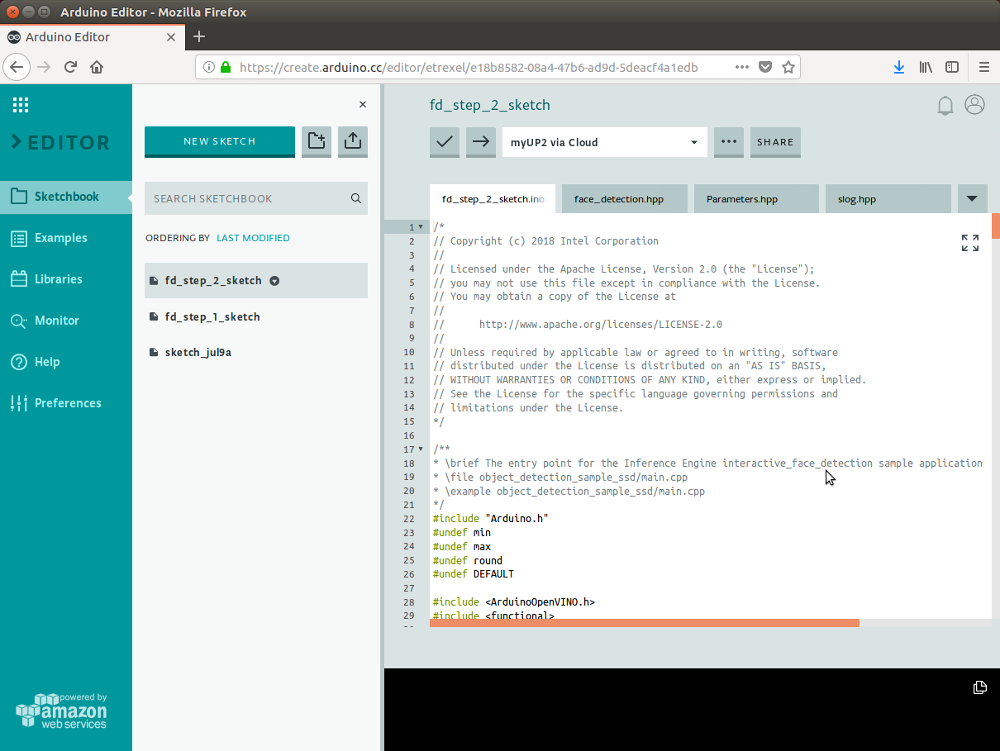

#### Create Project

1. Before building the executable, a project must be created.  Start by opening File->New->Project...


2. Expand "Other Generic Eclipse", expand “C/C++”, select “C++ Project”, and then click the Next button.


3. The "C++ Project" window will appear.  Set the following items:

   1. Set "Project name" to: face_detection_step_2

   2. Uncheck the "Use default location" box, then click the Browse… button.  Using the file open dialog, browse to the tutorial “step_2” directory and then click the OK button.

   3. Make sure under "Project type", the Executable->”Empty Project” is selected

   4. Under "Toolchain", select “Linux GCC”

   5. When complete the window should look similar to below.  Click the Finish button to continue.

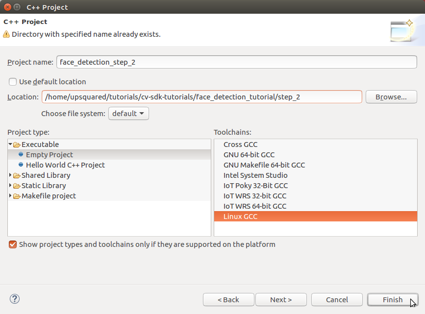

4. You may see a "Open Associated Perspective?" window prompting to open the C/C++ perspective.  If so click the Yes button.

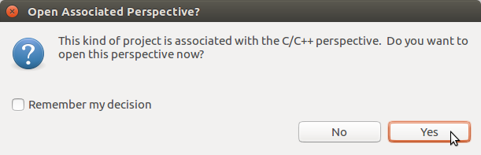

5. You now should be in the C/C++ perspective with the tutorial added as a project similar to below.

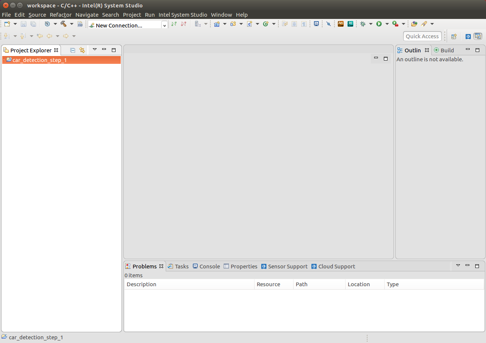

6. Note that the "Project Explorer" window shows the new project “face_detection_step_2”.

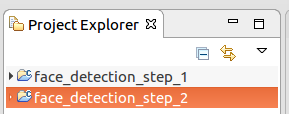

#### Configure Project

1. To build the project, it must be configured to use the CMake files present.  Start by selecting the project in the "Project Explorer" window and then from the menu select Project->Properties.

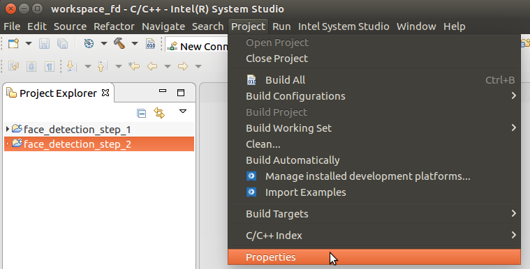

2. The "Properties for …" window will appear.   First, expand “C/C++ Build” and select “Tool Chain Editor”.  Then in the “Current builder” drop-down list, select the “CMake Builder (portable)”.  Then click the Apply button.

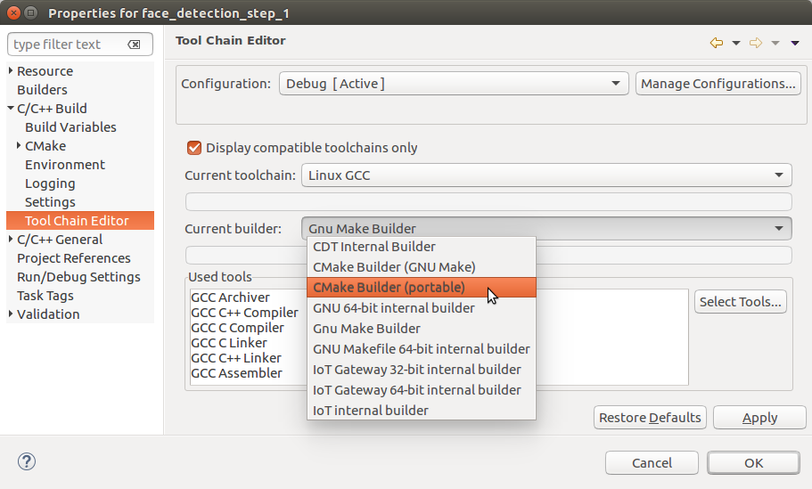

3. Now change "Configuration" to “Release”, then again set “Current builder” to “CMake Builder (portable)”.  Then click the OK button.


4. At this point, if you open the source file main.cpp you will see include files not found and syntax errors listed in the "Problems" window.  These errors are not really errors and compiling the executable will succeed.  The false errors appear because the CMake builder does not automatically import include paths for the IDE’s code analysis (also referred to as the “Indexer”) from the CMake files.  To fix the false errors reported by the indexer, you must set some include paths and define a macro.  Start by again selecting the project in the “Project Explorer” window and then from the menu select Project->Properties.  Expand “C/C++ General” and then select “Paths and Symbols”.  With Configuration set to  “[All configurations]”, the path and symbol settings need to be set as follows:

   1. On the Include tab for Language "GNU C++", the list of “Include directories” needs to have:

      1. /opt/intel/computer_vision_sdk/deployment_tools/inference_engine/include

      2. /opt/intel/computer_vision_sdk/deployment_tools/inference_engine/samples/common

      3. /opt/intel/computer_vision_sdk/deployment_tools/inference_engine/samples/extension

      4. /opt/intel/computer_vision_sdk/opencv/include

      5. /opt/intel/computer_vision_sdk/deployment_tools/inference_engine/samples/common/samples

   2. On the Symbol tab for Language "GNU C++":

      1. Symbol "__cplusplus" set to value “201103”

   3. Instead of manually making all theses changes, a settings file that can be imported for all the above is included with the tutorial files under "system_studio/exported_paths_and_symbols.xml".  The following steps will use the settings file instead of entering manually.	

5. Starting from Project->Properties, "C/C++ General"->“Paths and Symbols”, import the paths and symbols needed by the indexer by clicking the “Import Settings…” button.  The “Import” window will appear.  Select the “Settings file” by clicking on the “Browse…” button then browsing to the XML file supplied with the tutorial to select the file “system_studio/exported_paths_and_symbols.xml”.   By default, “Select Configuration” should have “Debug” selected.  The window should appear similar to below.  Click the Finish button to complete (this will close the project properties window too).


6. Starting again from Project->Properties, "C/C++ General"->“Paths and Symbols”, import the paths and symbols needed by the indexer by clicking the “Import Settings…” button.  The “Import” window will appear.  Select the “Settings file” by clicking on the “Browse…” button then browsing to the XML file supplied with the tutorial to select the file “system_studio/exported_paths_and_symbols.xml”.  This time under “Select Configuration”, select “Release”.  The window should appear similar to below.  Click the Finish button to complete.

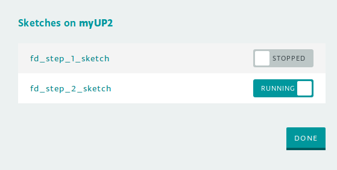

7. Going back to Project->Properties, "C/C++ General"->“Paths and Symbols” should appear similar to below for the Includes and Symbols tabs.

   1. **Note**: After these settings are made, to remove the false errors you may need to re-index the project by selecting from the menu Project->"C/C++ Index”->Rebuild


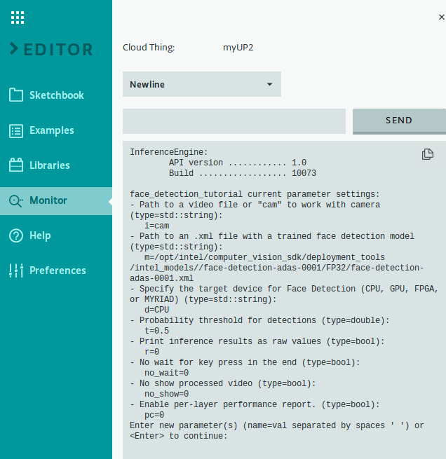

#### Build Executable

1. Now that the project is configured, we will build the executable.  We will be using the Release configuration build which is set by Project->"Build Configurations”->”Set Active” and selecting "Release”.

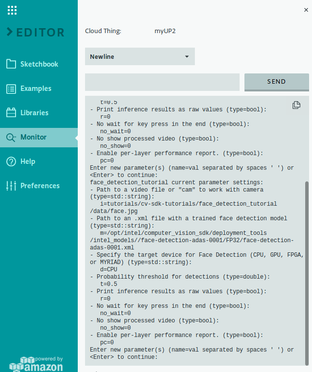

2. Build the executable using Project->"Build Project”.

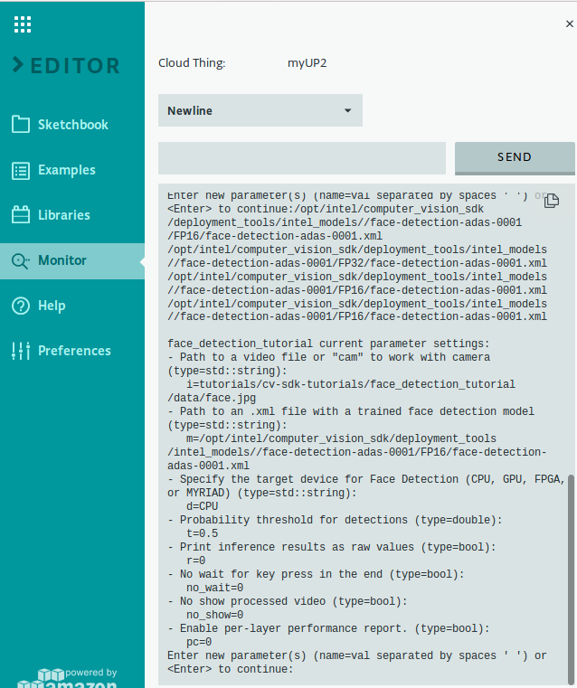

3. The "Build Project" window will appear.  The first build will take a minute to complete because it is building all the sample libraries needed.  Click the “Run in Background” button to close the window and letting the build continue as we look at the consoles.

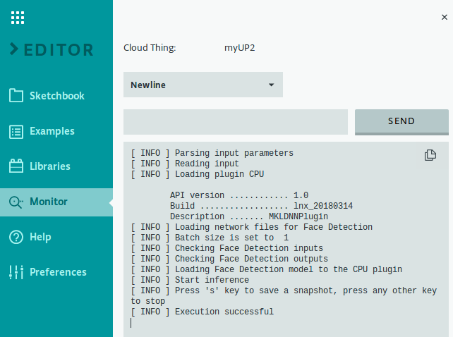

4. In the Console window you may see the output of CMake similar to below.  


5. To see the output of the compiler, we need to change to the build console.  To do so, click on the down-arrow to the right of the terminal icon, then select "CDT Build Console [...]".


6. When the build completes successfully, the Console will appear similar to below.


7. Now that the executable is built, we can move on to running it.

### Run

#### Create Run Configuration

1. Before running the executable from within ISS, a run configuration must be created.  The quickest way to setup a new one is to just run the project and then edit the details.  To start this, from the Run menu, select "Run As" then “Local C/C++ Application”.


2. You may see a "C Local Application" window appear similar to below prompting to choose which binary to run.  If so, choose “face_detection_tutorial” and click the OK button.  **Note**: The other binaries listed are side effects from CMake and may be ignored.


3. The project’s executable will be started with the output appearing in the Console window.  At this point no command line arguments are given to the executable which will run (or exit) accordingly.  The models need to be specified so you should see an error and exit similar to below.

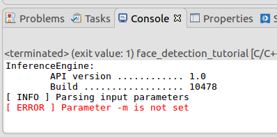

4. Since the default name used is the name of the executable, it is a good idea to have the run configuration’s name match the project to make it easier to distinguish it from multiple projects.  Begin by editing the run configuration’s name by first opening the run configuration up starting from the Run menu, selecting "Run Configurations…".


5. Under "C/C++ Application", select the correct project’s run configuration which will appear in the the Project setting.  Now edit the Name at the top changing to closer match the project name, here setting it to “face_detection_tutorial_step_2” as shown below.

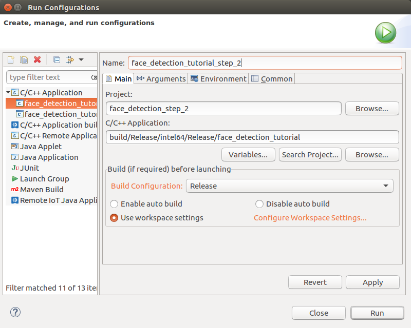

#### How to Set Command Line Arguments

1. The run configuration just created does not have any command line arguments being passed to it.  To add arguments when running the executable, you must edit the run configuration starting from the Run menu, selecting "Run Configurations…".  Depending upon how many configurations are present, you may need to select the one for the current project.  Initially the Main tab is selected which shows the main project settings similar to below.


2. To set command line arguments, select the Arguments tab which will appear similar to below.  

   1. In the "Program arguments" area goes the command line arguments to be passed to the executable when run.  Here we have entered “-i cam” as an example.  Literal command line arguments will be passed exactly as they appear.  Environment variables require special treatment and are specified as “${env_var:\<var_name\>}” where “\<var_name\>” is the environment variable name.

   2. Also shown is the "Working directory".  This is where the executable is run and by default set to the top project directory.  **Note**: This is important to know when command line arguments use relative paths.

   3. When done, click the Run button to run the executable or the Close button to close the window.

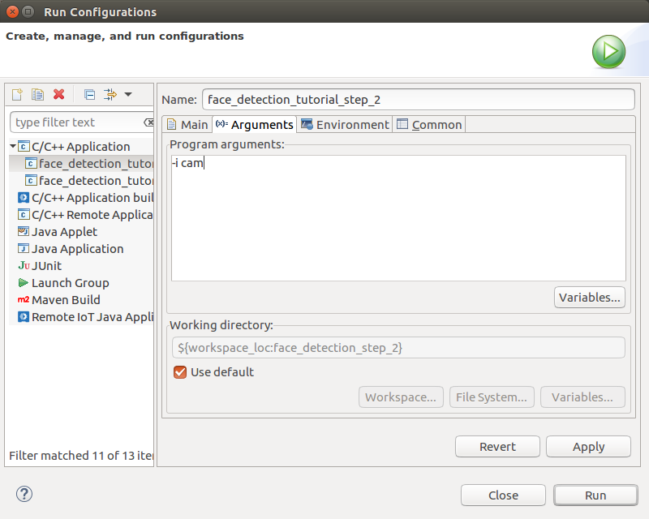

#### How to Run the Executable

1. Running the executable can always be done from the Run Configuration window using the Run button.  To run without opening the Run Configuration window is done using the Run Menu, "Run History", then selecting the name of the run configuration as shown below.  

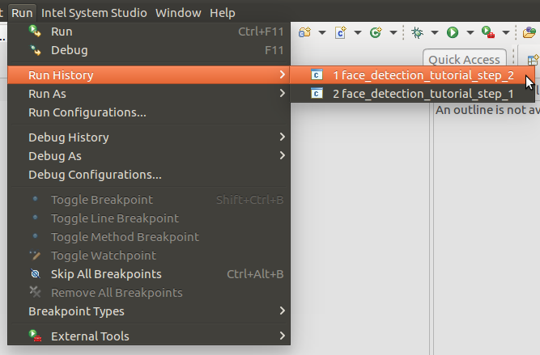

#### Running

1. You now have an executable file to run.  In order to have it run the face detection model, we will need to add a couple of parameters to the command line:

   1. "-i \<input-image-or-video-file\>" to specify an input image or video file instead of using the USB camera by default

   2. "-m \<model-xml-file\>"  to specify where to find the module.  For example: -m  /opt/intel/computer_vision_sdk/deployment_tools/intel_models/face-detection-adas-0001/FP32/face-detection-adas-0001.xml”

   3. That is a lot to type and keep straight, so to help make the model names shorter to type  and easier to read, let us use the helper script scripts/setupenv.sh that sets up shell variables we can use.  For reference, here are the contents of scripts/setupenv.sh:

   ```bash
   # Create variables for all models used by the tutorials to make
   #  it easier to reference them with short names

   # check for variable set by setupvars.sh in the SDK, need it to find models
   : ${InferenceEngine_DIR:?Must source the setupvars.sh in the SDK to set InferenceEngine_DIR}

   modelDir=$InferenceEngine_DIR/../../intel_models

   # Face Detection Model - ADAS
   modName=face-detection-adas-0001
   export mFDA16=$modelDir/$modName/FP16/$modName.xml
   export mFDA32=$modelDir/$modName/FP32/$modName.xml

   # Face Detection Model - Retail
   modName=face-detection-retail-0004
   export mFDR16=$modelDir/$modName/FP16/$modName.xml
   export mFDR32=$modelDir/$modName/FP32/$modName.xml

   # Age and Gender Model
   modName=age-gender-recognition-retail-0013
   export mAG16=$modelDir/$modName/FP16/$modName.xml
   export mAG32=$modelDir/$modName/FP32/$modName.xml

   # Head Pose Estimation Model
   modName=head-pose-estimation-adas-0001
   export mHP16=$modelDir/$modName/FP16/$modName.xml
   export mHP32=$modelDir/$modName/FP32/$modName.xml
   ```


   4. To use the script we source it using the command below.  **Note**: The script must be source’d before starting ISS in order to pass along the environment variables to the executable when running from ISS.  

   ```bash
   source ../../scripts/setupenv.sh 
   ```


2. Again, we will be using images and video files that are included with this tutorial or part of the OpenVINO™ toolkit installation in our sample instructions.  Once you have seen the application working, feel free to try it on your own images and videos.

3. Let us first run it on a single image, to see how it works.  Set the command line arguments for the run configuration to:

```
-m ${env_var:mFDA32} -i ../data/face.jpg
```


4. You will now see an output window open up with the image displayed.  Over the image, you will see text with the statistics of how long it took to perform the OpenCV input and output and model processing time.  You should also see a rectangle drawn around the face in the image that has been labeled with an instance number and confidence value.

5. Let us see how the application handles a video file.  And let us also see how easy it is to have the application run a different face detection model by loading the face-detection-retail-0004 IR files by just changing the -m parameter from ${env_var:mFDA32} to ${env_var:mFDR32}.  Set the command line arguments for the run configuration to:

```
-m ${env_var:mFDR32} -i ../data/head-pose-face-detection-female-and-male.mp4
```


6. Now, you should see a window open, playing the video.  Over each frame of the video, you will see a rectangle drawn around the face.  As the face moves around the image, the rectangle will follow it.

7. Finally, let us see how the application works with the camera input.  The camera is the default source, so we do this by running the application without using any parameters or we can still specify the camera using "cam" by setting the command line arguments for the run configuration to:

```
-m ${env_var:mFDA32} -i cam
```


8. Now you will see a window displaying the input from the USB camera.  The performance statistics appear over the image, as the application processes each frame.  If there is a face in the image, you will see a rectangle surrounding the face with label and confidence value.  The rectangle will follow the face around the image as it moves and will change sizes to fit the face.

9. When you want to exit the program, make sure the output window is active and press a key.  The output window will close.

10. You may remember the final step of the code walk-through, where we showed a step that printed out Performance Counts for the application.  This only happens if you specify the "-pc" command line option.  Let us run the application one more time to see what kind of output we get from printing those counts.  Set the command line arguments for the run configuration to:

```
-m ${env_var:mFDA32} -i cam -pc
```


11. When you exit the application this time, you will notice that the Console window is updated with the final statistics from the face detection model.  The extra output shows a detailed list of the various analysis steps the model performed during the last request (Note only one, not all of them for video) and how long the model spent on each step.  At the bottom of the list, it displays the total time spent performing the face inference.

```bash
InferenceEngine: 
	API version ............ (N.N)
	Build .................. (string)
[ INFO ] Parsing input parameters
[ INFO ] Reading input
[ INFO ] Loading plugin CPU

	API version ............ (N.N)
	Build .................. (string)
	Description ....... MKLDNNPlugin

[ INFO ] Loading network files for Face Detection
[ INFO ] Batch size is set to  1
[ INFO ] Checking Face Detection inputs
[ INFO ] Checking Face Detection outputs
[ INFO ] Loading Face Detection model to the CPU plugin
[ INFO ] Start inference 
[ INFO ] Press 's' key to save a snapshot, press any other key to stop
[ INFO ] Press 's' key to save a snapshot, press any other key to exit
[ INFO ] Performance counts for Face Detection

Mul_788/Fused_Mul_1070/Fus... EXECUTED       layerType: ScaleShift         realTime: 946        cpu: 946            execType: unknown
conv1                         EXECUTED       layerType: Convolution        realTime: 2586       cpu: 2586           execType: jit_sse42
conv2_1/dw                    EXECUTED       layerType: Convolution        realTime: 1484       cpu: 1484           execType: jit_sse42_dw
conv2_1/sep                   EXECUTED       layerType: Convolution        realTime: 5594       cpu: 5594           execType: jit_sse42_1x1
conv2_2/dw                    EXECUTED       layerType: Convolution        realTime: 1860       cpu: 1860           execType: jit_sse42_dw
Total time: 91233    microseconds
[ INFO ] Execution successful
```


12. Above, is part of the output you will see in your console window.  It shows information on what the Inference Engine loaded, followed by the performance statistics gathered from running each layer within the model.  This includes the calculation run, the model layer type, the real time spent performing the calculation, the CPU time spent performing the calculation, and the type of calculation that was performed.  In this instance, since we loaded the model onto the CPU, the "realTime" and “cpu” time values are the same.  The last bit of information we see is the total time spent spent performing the face analysis.  In this example it was 91233 microseconds, or 0.091233 seconds.

# Using the Hetero Plugin

As described earlier in the tutorial, the Hetero Plugin is used to run the layers of an inference model on multiple devices.  The Hetero Plugin and device list to use are specified using the device name "HETERO:\<1st device\>[,\<2nd device\>][,\<3rd device\>]..." which will assign layers to the first device with direct support and any remaining less supported layers fall back to the last device.  Let us now run a few examples to see working.

## HETERO:GPU,CPU

Here we run the combination with the GPU as the primary device and falling back to the CPU. 

### Command Line:

```bash
./intel64/Release/face_detection_tutorial -m $mFDA32 -i ../../data/face.jpg -pc -d HETERO:GPU,CPU
```


### System Studio Run Configuration Arguments:

```
-m ${env_var:mFDA32} -i ../data/face.jpg -pc -d HETERO:GPU,CPU
```


Once the image appears, press any key in the output window to exit.  As the application exits, the "-pc" argument will cause it to output the performance counts for the face detection model.  At the top of the performance output you should see something similar to below.  Note the “execType” field where it is specifies “N5cldnn3gpu*” which indicates clDNN library functions and that the GPU plugin executed the layer.

```
subgraph1: Mul1_/Fused_Mul... EXECUTED       layerType: ScaleShift         realTime: 2643       cpu: 14             execType: N5cldnn3gpu9scale_gpuE
subgraph1: conv1              EXECUTED       layerType: Convolution        realTime: 6943       cpu: 14             execType: N5cldnn3gpu15convolution_gpuE
subgraph1: conv2_1/dw         EXECUTED       layerType: Convolution        realTime: 16628      cpu: 13             execType: N5cldnn3gpu15convolution_gpuE
subgraph1: conv2_1/sep        EXECUTED       layerType: Convolution        realTime: 13850      cpu: 17             execType: N5cldnn3gpu15convolution_gpuE
subgraph1: conv2_2/dw         EXECUTED       layerType: Convolution        realTime: 6050       cpu: 14             execType: N5cldnn3gpu15convolution_gpuE
subgraph1: conv2_2/sep        EXECUTED       layerType: Convolution        realTime: 7769       cpu: 14             execType: N5cldnn3gpu15convolution_gpuE
subgraph1: conv3_1/dw         EXECUTED       layerType: Convolution        realTime: 9984       cpu: 13             execType: N5cldnn3gpu15convolution_gpuE
subgraph1: conv3_1/sep        EXECUTED       layerType: Convolution        realTime: 7724       cpu: 18             execType: N5cldnn3gpu15convolution_gpuE
subgraph1: conv3_2/dw         EXECUTED       layerType: Convolution        realTime: 2845       cpu: 14             execType: N5cldnn3gpu15convolution_gpuE
```


## HETERO:CPU,GPU

Here we run the combination with the CPU as the primary device and falling back to the GPU. 

### Command Line:

```bash
./intel64/Release/face_detection_tutorial -m $mFDA32 -i ../../data/face.jpg -pc -d HETERO:CPU,GPU
```


### System Studio Run Configuration Arguments:

```
-m ${env_var:mFDA32} -i ../data/face.jpg -pc -d HETERO:CPU,GPU
```


Once the image appears, press any key in the output window to exit.  As the application exits, the "-pc" argument will cause it to output the performance counts for the face detection model.  At the top of the performance output you should see something similar to below.  Note the “execType” field where it is specifies “jit_sse*” which indicates that the CPU plugin executed the layer.  You may also notice that there are no “N5cldnn3gpu*” which would indicate execution on the GPU.  This is because the CPU plugin was able to support all the layers present. 

```
subgraph1: Mul1_/Fused_Mul... EXECUTED       layerType: ScaleShift         realTime: 328        cpu: 328            execType: jit_sse42
subgraph1: conv1              EXECUTED       layerType: Convolution        realTime: 2307       cpu: 2307           execType: jit_sse42
subgraph1: conv2_1/dw         EXECUTED       layerType: Convolution        realTime: 1600       cpu: 1600           execType: jit_sse42_dw
subgraph1: conv2_1/sep        EXECUTED       layerType: Convolution        realTime: 5075       cpu: 5075           execType: jit_sse42_1x1
subgraph1: conv2_2/dw         EXECUTED       layerType: Convolution        realTime: 2772       cpu: 2772           execType: jit_sse42_dw
subgraph1: conv2_2/sep        EXECUTED       layerType: Convolution        realTime: 5287       cpu: 5287           execType: jit_sse42_1x1
subgraph1: conv3_1/dw         EXECUTED       layerType: Convolution        realTime: 1413       cpu: 1413           execType: jit_sse42_dw
subgraph1: conv3_1/sep        EXECUTED       layerType: Convolution        realTime: 11378      cpu: 11378          execType: jit_sse42_1x1
subgraph1: conv3_2/dw         EXECUTED       layerType: Convolution        realTime: 990        cpu: 990            execType: jit_sse42_dw
```


## HETERO:MYRIAD,CPU

Here we run the combination with the Myriad as the primary device and falling back to the CPU. 

### Command Line:

```bash
./intel64/Release/face_detection_tutorial -m $mFDA16 -i ../../data/face.jpg -pc -d HETERO:MYRIAD,CPU
```


### System Studio Run Configuration Arguments:

```
-m ${env_var:mFDA16} -i ../data/face.jpg -pc -d HETERO:MYRIAD,CPU
```


Once the image appears, press any key in the output window to exit.  As the application exits, the "-pc" argument will cause it to output the performance counts for the face detection model.  At the top of the performance output you should see something similar to below.  Note the “execType” field where it is specifies the same name as the “layerType” field (e.g. “ScaleShift”) which indicates the MYRIAD plugin executed the layer.  

```
subgraph1: Mul1_/Fused_Mul... EXECUTED       layerType: ScaleShift         realTime: 4319       cpu: 4319           execType: ScaleShift
subgraph1: conv1              EXECUTED       layerType: Convolution        realTime: 3141       cpu: 3141           execType: Convolution
subgraph1: conv1@biases       OPTIMIZED_OUT  layerType: Bias               realTime: 0          cpu: 0              execType: Bias
subgraph1: conv2_1/dw         EXECUTED       layerType: DepthConvolution   realTime: 3357       cpu: 3357           execType: DepthConvolution
subgraph1: conv2_1/dw@biases  OPTIMIZED_OUT  layerType: Bias               realTime: 0          cpu: 0              execType: Bias
subgraph1: conv2_1/sep        EXECUTED       layerType: Convolution        realTime: 4213       cpu: 4213           execType: Convolution
subgraph1: conv2_1/sep@biases OPTIMIZED_OUT  layerType: Bias               realTime: 0          cpu: 0              execType: Bias
subgraph1: conv2_2/dw         EXECUTED       layerType: DepthConvolution   realTime: 3499       cpu: 3499           execType: DepthConvolution
subgraph1: conv2_2/dw@biases  OPTIMIZED_OUT  layerType: Bias               realTime: 0          cpu: 0              execType: Bias
subgraph1: conv2_2/sep        EXECUTED       layerType: Convolution        realTime: 3399       cpu: 3399           execType: Convolution
subgraph1: conv2_2/sep@biases OPTIMIZED_OUT  layerType: Bias               realTime: 0          cpu: 0              execType: Bias
subgraph1: conv3_1/dw         EXECUTED       layerType: DepthConvolution   realTime: 3650       cpu: 3650           execType: DepthConvolution
subgraph1: conv3_1/dw@biases  OPTIMIZED_OUT  layerType: Bias               realTime: 0          cpu: 0              execType: Bias
subgraph1: conv3_1/sep        EXECUTED       layerType: Convolution        realTime: 6747       cpu: 6747           execType: Convolution
subgraph1: conv3_1/sep@biases OPTIMIZED_OUT  layerType: Bias               realTime: 0          cpu: 0              execType: Bias
subgraph1: conv3_2/dw         EXECUTED       layerType: DepthConvolution   realTime: 1888       cpu: 1888           execType: DepthConvolution
```


# Conclusion

Congratulations on using a CNN model to detect faces!  You have now seen that the process can be done quite quickly.  The classes and helper functions that we added here are aimed at making it easy to add more models to the application by following the same pattern.  We will see it again in action in Step 3, when we add an age and gender inferring model, and then again in Step 4, when we add head pose estimation.

# Navigation

[Face Detection Tutorial](../Readme.md)

[Face Detection Tutorial Step 1](../step_1/Readme.md)

[Face Detection Tutorial Step 3](../step_3/Readme.md)

