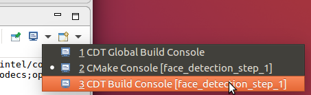
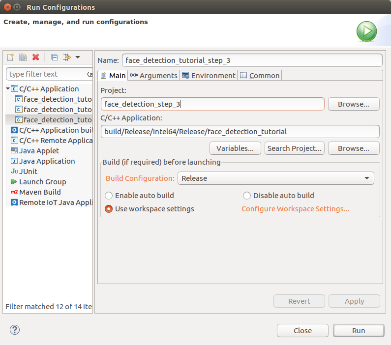
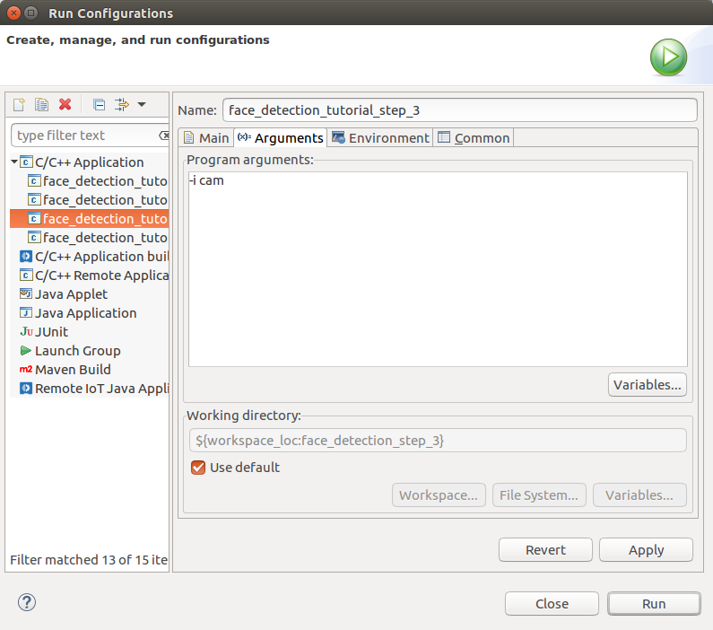
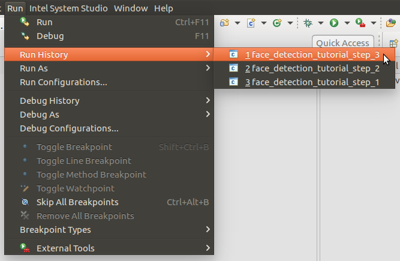

# Tutorial Step 3: Add a second model, Age and Gender Detection


# Table of Contents

<p></p><div class="table-of-contents"><ul><li><a href="#tutorial-step-3-add-a-second-model-age-and-gender-detection">Tutorial Step 3: Add a second model, Age and Gender Detection</a></li><li><a href="#table-of-contents">Table of Contents</a></li><li><a href="#introduction">Introduction</a></li><li><a href="#age-and-gender-detection-model">Age and Gender Detection Model</a></li><li><a href="#adding-the-age-and-gender-detection-model">Adding the Age and Gender Detection Model</a><ul><li><a href="#agegenderdetection">AgeGenderDetection</a><ul><li><a href="#agegenderdetection">AgeGenderDetection()</a></li><li><a href="#submitrequest">submitRequest()</a></li><li><a href="#enqueue">enqueue()</a></li><li><a href="#read">read()</a></li></ul></li></ul></li><li><a href="#using-agegenderdetection">Using AgeGenderDetection</a><ul><li><a href="#main">main()</a></li><li><a href="#main-loop">Main Loop</a></li><li><a href="#post-main-loop">Post-Main Loop</a></li></ul></li><li><a href="#building-and-running">Building and Running</a><ul><li><a href="#command-line-using-make">Command Line using Make</a><ul><li><a href="#build">Build</a></li><li><a href="#run">Run</a></li></ul></li><li><a href="#intel-system-studio">Intel® System Studio</a><ul><li><a href="#build">Build</a><ul><li><a href="#start-intel-system-studio">Start Intel® System Studio</a></li><li><a href="#create-project">Create Project</a></li><li><a href="#configure-project">Configure Project</a></li><li><a href="#build-executable">Build Executable</a></li></ul></li><li><a href="#run">Run</a><ul><li><a href="#create-run-configuration">Create Run Configuration</a></li><li><a href="#how-to-set-command-line-arguments">How to Set Command Line Arguments</a></li><li><a href="#how-to-run-the-executable">How to Run the Executable</a></li><li><a href="#running">Running</a></li></ul></li></ul></li></ul></li><li><a href="#conclusion">Conclusion</a></li><li><a href="#navigation">Navigation</a></li></ul></div><p></p>

# Introduction

Welcome to Face Detection Tutorial Step 3.  Now that the application can detect faces in images, we now want the application to estimate the age and gender for each face.  The precompiled "age-gender-recognition-retail-0013" model included with the OpenVINO™ toolkit that we will be running was trained on approximately 20,000 faces.  When it sees a face within 45 degrees (left, right, above, or below) of straight-on, it is 96.6% accurate on determining gender.  It can also determine ages to within 6 years, on average.  A sample output showing the results where the ROI box is now labeled “[M|F],<age>” appears below.  The metrics reported now also include the time to run the age and gender model.


# Age and Gender Detection Model

The OpenVINO™ toolkit provides a pre-compiled model for estimating age and gender from an image of a face.  You can find it at:

* /opt/intel/computer_vision_sdk/deployment_tools/intel_models/age-gender-recognition-retail-0013

   * Available model locations:

      * FP16: /opt/intel/computer_vision_sdk/deployment_tools/intel_models/age-gender-recognition-retail-0013/FP16/age-gender-recognition-retail-0013.xml

      * FP32: /opt/intel/computer_vision_sdk/deployment_tools/intel_models/age-gender-recognition-retail-0013/FP32/age-gender-recognition-retail-0013.xml

   * More details can be found at:

      * file:///opt/intel/computer_vision_sdk/deployment_tools/intel_models/age-gender-recognition-retail-0013/description/age-gender-recognition-retail-0013.html

The results it is capable of producing are shown in the summary below (for more details, see the descriptions HTML pages for each model): 

<table>
  <tr>
    <td>Model</td>
    <td>GFLOPS</td>
    <td>MParameters</td>
    <td>Average Precision</td>
  </tr>
  <tr>
    <td>age-gender-recognition-retail-0013</td>
    <td>0.094</td>
    <td>2.138</td>
    <td>Avg. age error: 6.07 years
Gender accuracy: 96.66%</td>
  </tr>
</table>


# Adding the Age and Gender Detection Model

Thanks to the setup work done in Tutorial Step 2, adding the age and gender detection model in this step will just be a matter of deriving a new class from the BaseDetection class, adding an additional command line argument to specify the new model, and updating the application to run and track the statistics for the new model.  This means there will not be as much code to walk through this time.  That will let us focus on how to pass the important image inference results from the face detection model to the age and gender detection model.

1. Open up a terminal (such as xterm) or use an existing terminal to get to a command shell prompt.

2. Change to the directory containing Tutorial Step 3:

```bash
cd tutorials/computer-vision-inference-dev-kit-tutorials/face_detection_tutorial/step_3
```


3. Open the files "main.cpp" and “face_detection.hpp” in the editor of your choice such as ‘gedit’, ‘gvim’, or ‘vim’.

## AgeGenderDetection

1. The AgeGenderDetection class is derived from BaseDetection and the member variables it uses are declared.

```cpp
struct AgeGenderDetection : BaseDetection {
    std::string input;
    std::string outputAge;
    std::string outputGender;
    int enquedFaces = 0;
```


2. The Result class is used to store the information that the model returns, specifically, the age of the face and the probability that it is a male or female face.

```Cpp
    struct Result { float age; float maleProb;};
```


3. The operator[] function is defined to give a convenient way to retrieve the age and gender results from the data contained in the inference request’s output blob.  The index to the appropriate locations in the blob are calculated for the batch item.  A result object is returned containing the data read for the batch index.

```cpp
    Result operator[] (int idx) const {
        auto  genderBlob = request->GetBlob(outputGender);
        auto  ageBlob    = request->GetBlob(outputAge);

        return {ageBlob->buffer().as<float*>()[idx] * 100,
                genderBlob->buffer().as<float*>()[idx * 2 + 1]};
    }
```


### AgeGenderDetection()

On construction of a AgeGenderDetection object, the base class constructor is called passing in the model to load specified in the command line argument FLAGS_m_ag, the name to be used when we printing out informational messages, and set the batch size to the command line argument FLAFS_n_ag.  This initializes the BaseDetection subclass specifically for AgeGenderDetection.

```cpp
    AgeGenderDetection() : BaseDetection(FLAGS_m_ag, "Age Gender", FLAGS_n_ag) {}
```


### submitRequest()

The submitRequest() function is overridden to make sure that there are faces queued up to be processed before calling the base class submitRequest() function to start inferring vehicle attributes from the enqueued faces.  enquedFaces is reset to 0 to indicate that all the queued data has been submitted.

```cpp
    void submitRequest() override {
        if (!enquedFaces) return;
        BaseDetection::submitRequest();
        enquedFaces = 0;
    }
```


### enqueue()

A check is made to see that the age and gender detection model is enabled.  A check is also made to make sure that the number of inputs does not exceed the batch size.  

```cpp
    void enqueue(const cv::Mat &face) {
        if (!enabled()) {
            return;
        }
        if (enquedFaces == maxBatch) {
            slog::warn << "Number of detected faces more than maximum(" << maxBatch << ") processed by Age Gender detector" << slog::endl;
            return;
        }
```


An inference request object is created if one has not been already been created.  The request object is used for holding input and output data, starting inference, and waiting for completion and results.

```cpp
        if (!request) {
            request = net.CreateInferRequestPtr();
        }
```


The input blob from the request is retrieved and then matU8ToBlob() is used to copy the image image data into the blob.

```cpp
        auto  inputBlob = request->GetBlob(input);

        matU8ToBlob<float>(face, inputBlob, 1.0f, enquedFaces);
        enquedFaces++;
    }
```


### read()

The next function we will walkthrough is the AgeGenderDetection::read() function which must be specialized specifically to the model that it will load and run. 

1. The Inference Engine API InferenceEngine::CNNNetReader object is used to load the model IR files.  This comes from the XML file that is specified on the command line using the "-m_ag" parameter.  

```cpp
    CNNNetwork read() override {
        slog::info << "Loading network files for AgeGender" << slog::endl;
        InferenceEngine::CNNNetReader netReader;
        /** Read network model **/
        netReader.ReadNetwork(FLAGS_m_ag);
```


2. The maximum batch size is set to maxBatch (set using FLAGS_n_ag which defaults to 1).

```cpp
        /** Set batch size **/
        netReader.getNetwork().setBatchSize(maxBatch);
        slog::info << "Batch size is set to " << netReader.getNetwork().getBatchSize() << " for Age Gender" << slog::endl;
```


3. The IR .bin file of the model is read.

```cpp
        /** Extract model name and load it's weights **/
        std::string binFileName = fileNameNoExt(FLAGS_m_ag) + ".bin";
        netReader.ReadWeights(binFileName);
```


4. The proper number of inputs is checked to make sure that the loaded model has only one input as expected.

```cpp
        slog::info << "Checking Age Gender inputs" << slog::endl;
        InferenceEngine::InputsDataMap inputInfo(netReader.getNetwork().getInputsInfo());
        if (inputInfo.size() != 1) {
            throw std::logic_error("Age gender topology should have only one input");
        }
```


5. The input data format is prepared by configuring it for the proper precision (FP32 = 32-bit floating point) and memory layout (NCHW) for the model.

```cpp
        auto& inputInfoFirst = inputInfo.begin()->second;
        inputInfoFirst->setPrecision(Precision::FP32);
        inputInfoFirst->getInputData()->setLayout(Layout::NCHW);
        input = inputInfo.begin()->first;
```


6. The model is verified to have the two output layers as expected for the age and gender results.  Variables are created and initialized to hold the output names to receive the results from the model.

```cpp
        slog::info << "Checking Age Gender outputs" << slog::endl;
        InferenceEngine::OutputsDataMap outputInfo(netReader.getNetwork().getOutputsInfo());
        if (outputInfo.size() != 2) {
            throw std::logic_error("Age Gender network should have two output layers");
        }
        auto it = outputInfo.begin();
        auto ageOutput = (it++)->second;
        auto genderOutput = (it++)->second;
```


7. A check is made to make sure that the model has the output layer types expected and output layers are swapped as necessary for receiving the age and the gender results.

```cpp
        // if gender output is convolution, it can be swapped with age
        if (genderOutput->getCreatorLayer().lock()->type == "Convolution") {
            std::swap(ageOutput, genderOutput);
        }

        if (ageOutput->getCreatorLayer().lock()->type != "Convolution") {
            throw std::logic_error("In Age Gender network, age layer (" + ageOutput->getCreatorLayer().lock()->name +
                ") should be a Convolution, but was: " + ageOutput->getCreatorLayer().lock()->type);
        }

        if (genderOutput->getCreatorLayer().lock()->type != "SoftMax") {
            throw std::logic_error("In Age Gender network, gender layer (" + genderOutput->getCreatorLayer().lock()->name +
                ") should be a SoftMax, but was: " + genderOutput->getCreatorLayer().lock()->type);
        }
```


8. The names of the two output layers are logged and saved into variables used to retrieve results later.

```cpp
        slog::info << "Age layer: " << ageOutput->getCreatorLayer().lock()->name<< slog::endl;
        slog::info << "Gender layer: " << genderOutput->getCreatorLayer().lock()->name<< slog::endl;

        outputAge = ageOutput->name;
        outputGender = genderOutput->name;
```


9. Where the model will be loaded is logged, the model is marked as being enabled, and the InferenceEngine::CNNNetwork object containing the model is returned.

```cpp
        slog::info << "Loading Age Gender model to the "<< FLAGS_d_ag << " plugin" << slog::endl;
        _enabled = true;
        return netReader.getNetwork();
    }
};
```


# Using AgeGenderDetection

That takes care of specializing the BaseDetector class into the AgeGenderDetection class for the age and gender detection model.  We now move down into the main() function to see what additions have been made to use the age and gender detection model to process detected faces.

## main()

1. In the main() function, the command line arguments FLAGS_d_ag and FLAGS_m_ag are added to cmdOptions.  Remember that the flags are defined in the car_detection.hpp file.

```cpp
std::vector<std::pair<std::string, std::string>> cmdOptions = {
   {FLAGS_d, FLAGS_m}, {FLAGS_d_ag, FLAGS_m_ag}
};
```


2. The age and gender detection object is instantiated.

```cpp
AgeGenderDetection AgeGender;
```


3. The model is loaded into the Inference Engine and associated with the device using the Load helper class previously covered.

```cpp
Load(AgeGender).into(pluginsForDevices[FLAGS_d_ag]);
```


## Main Loop

In the main "while(true)" loop, the inference results from the face detection model are used as input to the age and gender detection model.  

1. The loop to iterate through the fetched results is started.  The loop will infer faces in batches until all have been inferred.  The vector ageGenderResults is used to store the age and gender results while ageGenderFaceIdx tracks the index of the next face to infer and ageGenderNumFacesInferred tracks how many faces have been inferred.  ageGenderNumFacesToInfer is set to the number of faces to be inferred which is always 0 if not enabled.

```Cpp
            // fetch all face results
            FaceDetection.fetchResults();

            // track and store age and gender results for all faces
            std::vector<AgeGenderDetection::Result> ageGenderResults;
            int ageGenderFaceIdx = 0;
            int ageGenderNumFacesInferred = 0;
            int ageGenderNumFacesToInfer = AgeGender.enabled() ? FaceDetection.results.size() : 0;

            while(ageGenderFaceIdx < ageGenderNumFacesToInfer) {
```


2. A loop to enqueue a batch of faces is begun if there are faces still to infer and continues until either the batch is full (maxBatch) or there are no more faces to infer.

```Cpp
            	// enqueue input batch
            	while ((ageGenderFaceIdx < ageGenderNumFacesToInfer) && (AgeGender.enquedFaces < AgeGender.maxBatch)) {
```


3. Get the ROI for the face by clipping the face location from the input image frame.

```cpp
				FaceDetectionClass::Result faceResult = FaceDetection.results[ageGenderFaceIdx];
				auto clippedRect = faceResult.location & cv::Rect(0, 0, width, height);
				auto face = frame(clippedRect);
```


4. Enqueue the face and increment ageGenderFaceIdx to the next face index.

```cpp
				AgeGender.enqueue(face);
				ageGenderFaceIdx++;
            	}
```


5. The start time is stored in t0 and if there are faces enqueued, start inference for the batch.

```Cpp
			t0 = std::chrono::high_resolution_clock::now();

            	// if faces are enqueued, then start inference
            	if (AgeGender.enquedFaces > 0) {
					AgeGender.submitRequest();
            	}
```


6. If inference of a batch of faces has begun, then wait for the results.

```cpp
            	// if there are outstanding results, then wait for inference to complete
            	if (ageGenderNumFacesInferred < ageGenderFaceIdx) {
					AgeGender.wait();
            	}
```


7. Record the end time of inference in t1 and accumulate the total time of all batches in secondDetection.

```Cpp
				t1 = std::chrono::high_resolution_clock::now();
				secondDetection += std::chrono::duration_cast<ms>(t1 - t0).count();
```


8. If there are inference results, loop through them storing in ageGenderResults to be rendered later.

```Cpp
				// process results if there are any
				if (ageGenderNumFacesInferred < ageGenderFaceIdx) {
					for(int ri = 0; ri < AgeGender.maxBatch; ri++) {
						ageGenderResults.push_back(AgeGender[ri]);
						ageGenderNumFacesInferred++;
					}
            	}
            }
```


9. The timing metrics for inference are output with the results for the age and gender inference added to the output window.

```cpp
if (AgeGender.enabled()) {
   out.str("");
   out << (AgeGender.enabled() ? "Age Gender"  : "")
       << "time: "<< std::fixed << std::setprecision(2) << secondDetection
       << " ms ";
   if (!FaceDetection.results.empty()) {
      out << "(" << 1000.f / secondDetection << " fps)";
   }
   cv::putText(frame, out.str(), cv::Point2f(0, 65), cv::FONT_HERSHEY_TRIPLEX, 0.5, cv::Scalar(255, 0, 0));
}
```


10. Loop through all the detected faces to update the output image adding a label with the age and gender results for each detected face.  

```Cpp
            // render results
            for(int ri = 0; ri < FaceDetection.results.size(); ri++) {
            	FaceDetectionClass::Result faceResult = FaceDetection.results[ri];
                cv::Rect rect = faceResult.location;
```


11. Label the face with age and gender results if the model is enabled otherwise use a simple label.

```cpp
                out.str("");
                if (AgeGender.enabled()) {
                    out << (ageGenderResults[ri].maleProb > 0.5 ? "M" : "F");
                    out << std::fixed << std::setprecision(0) << "," << ageGenderResults[ri].age;
                } else {
                    out << (faceResult.label < FaceDetection.labels.size() ? FaceDetection.labels[faceResult.label] :
                             std::string("label #") + std::to_string(faceResult.label))
                        << ": " << std::fixed << std::setprecision(3) << faceResult.confidence;
                }
```


12. A label is placed on the output image for current result.

```cpp
  cv::putText(frame,
               out.str(),
               cv::Point2f(faceResult.location.x, faceResult.location.y - 15),
               cv::FONT_HERSHEY_COMPLEX_SMALL,
               0.8,
               cv::Scalar(0, 0, 255));
```


13. The color of the box around face is chosen based on the age and gender model’s confidence that the face is male.

```cpp
   auto genderColor =
         (AgeGender.enabled()) ?
            ((ageGenderResults[ri].maleProb < 0.5) ? cv::Scalar(0, 0, 255) : cv::Scalar(255, 0, 0)) :
            cv::Scalar(0, 255, 0);
```


14. A rectangle is drawn around the face on the output image.

```   cv::rectangle(frame, faceResult.location, genderColor, 2);
}
```


15. Finally, the final results are displayed for the frame while measuring the time it took to show the image.

```cpp
t0 = std::chrono::high_resolution_clock::now();
cv::imshow("Detection results", frame);
t1 = std::chrono::high_resolution_clock::now();
ocv_render_time = std::chrono::duration_cast<ms>(t1 - t0).count();
```


## Post-Main Loop

The age and gender detection object is added to display the performance count information.

```cpp
if (FLAGS_pc) {
   FaceDetection.printPerformanceCounts();
   AgeGender.printPerformanceCounts();
}
```


# Building and Running

Now that we have looked at the code and understand how the program works, let us compile and run to see it in action.  To do that, two ways are covered in the following sections: 1) Command line using "make" and 2) using Intel® System Studio (ISS).  Both ways do the same things, so choose according to your preference.

## Command Line using Make

The following covers how to build and run from the command line using "make".

### Build

1. Open up a terminal (such as xterm) or use an existing terminal to get to a command shell prompt.

2. Change to the directory containing Tutorial Step 3:

```bash
cd tutorials/computer-vision-inference-dev-kit-tutorials/face_detection_tutorial/step_3
```


3. The first step is to configure the build environment for the OpenVINO™ toolkit by running the "setupvars.sh" script.

```bash
source  /opt/intel/computer_vision_sdk/bin/setupvars.sh
```


4. Now we need to create a directory to build the tutorial in and change to it.

```bash
mkdir build
cd build
```


5. The last thing we need to do before compiling is to configure the build settings and build the executable.  We do this by running CMake to set the build target and file locations.  Then we run Make to build the executable.

```bash
cmake -DCMAKE_BUILD_TYPE=Release ../
make
```


### Run

1. Before running, be sure to source the helper script that will make it easier to use environment variables instead of long names to the models:

```bash
source ../../scripts/setupenv.sh 
```


2. You now have the executable file to run ./intel64/Release/face_detection_tutorial.  In order to load the age and gender detection model, the "-m_ag" flag needs to be added  followed by the full path to the model.  First let us see how it works on a single image file:

```bash
./intel64/Release/face_detection_tutorial -m $mFDA32 -m_ag $mAG32 -i ../../data/face.jpg
```


3. The output window will show the image overlaid with colored rectangles over each of the detected faces with labels showing the age and gender results.  The timing statistics for computing the results of each model along with OpenCV input and output times are also shown.  Next, let us try it on a video file.

```bash
./intel64/Release/face_detection_tutorial -m $mFDA32 -m_ag $mAG32 -i /opt/intel/computer_vision_sdk/openvx/samples/samples/face_detection/face.mp4
```


4. You will see rectangles that follow the faces around the image (if the faces move), accompanied by age and gender results for the faces, and the timing statistics for processing each frame of the video.  Finally, let us see how it works for camera input.

```bash
./intel64/Release/face_detection_tutorial -m $mFDA32 -m_ag $mAG32 -i cam
```


Or

```bash
./intel64/Release/face_detection_tutorial -m $mFDA32 -m_ag $mAG32
```


5. Again, you will see colored rectangles drawn around any faces that appear in the images, along with the results for age, gender, and the various render statistics.

## Intel® System Studio

The following covers how to build and run from within Intel® System Studio (ISS).

### Build

#### Start Intel® System Studio

1. We need to start ISS using the desktop icon or the supplied scripts that will setup environment variables and launch the ISS Eclipse IDE.

   1. Desktop icon: Locate and double-click the icon shown below on the desktop.


   2. Command line: Configure the build environment when using the OpenVINO™ toolkit by sourcing the "setupvars.sh" script.  Be sure to source the helper script “scripts/setupenv.sh” which defines environment variables that point to inference models used so that short names may be used instead of long paths.  Then finally start ISS using the supplied script that will setup environment variables and launch the ISS Eclipse IDE.

```bash
source /opt/intel/computer_vision_sdk/bin/setupvars.sh
# assumes shell is in step_* directory
source ../scripts/setupenv.sh
/opt/intel/system_studio_2018/iss_ide_eclipse-launcher.sh
```


2. At first, the ISS splash window will appear that looks like:


3. The splash window will automatically disappear and be replaced with the workspace selection window.  We will use the default workspace "/home/upsquared/system_studio/workspace", so click the “OK” button to continue.


4. The first time ISS is opened, the ISS IDE will show the "Getting Started" tab as shown.  We will not be using it so if it is present, close the tab using the “X” on the tab that is just to the right of “Getting Started”.


5. With the "Getting Started” tab now closed, the ISS IDE will default in the Intel® C/C++ perspective which appears similar to below:

   1. **Note**: The perspective may be different if ISS has been started before and changes were made.  A different perspective may be open, such as the standard C/C++ perspective, or if the windows have been moved.


#### Create Project

1. Before building the executable, a project must be created.  Start by opening File->New->Project...


2. Expand "C/C++", select “C++ Project”, and then click the Next button.

   1. **Note**: If the "C/C++" wizard is not available, you will need to unhide it by going to Window->Preferences,”Intel System Studio”, unchecking the option “Hide unsupported wizards”, and then click the OK button.


3. The "C++ Project" window will appear.  Set the following items:

   1. Set "Project name" to: face_detection_step_3

   2. Uncheck the "Use default location" box, then click the Browse… button.  Using the file open dialog, browse to the tutorial “step_3” directory and then click the OK button.

   3. Make sure under "Project type", the Executable->”Empty Project” is selected

   4. Under "Toolchain", select “Linux GCC”

   5. When complete the window should look similar to below.  Click the Finish button to continue.


4. You may see a "Open Associated Perspective?" window prompting to open the C/C++ perspective.  If so click the Yes button.


5. You now should be in the C/C++ perspective with the tutorial added as a project similar to below.


6. Note that the "Project Explorer" window shows the new project “face_detection_step_3”.


#### Configure Project

1. To build the project, it must be configured to use the CMake files present.  Start by selecting the project in the "Project Explorer" window and then from the menu select Project->Properties.


2. The "Properties for …" window will appear.   First, expand “C/C++ Build” and select “Tool Chain Editor”.  Then in the “Current builder” drop-down list, select the “CMake Builder (portable)”.  Then click the Apply button.


3. Now change "Configuration" to “Release”, then again set “Current builder” to “CMake Builder (portable)”.  Then click the OK button.


4. At this point, if you open the source file main.cpp you will see include files not found and syntax errors listed in the "Problems" window.  These errors are not really errors and compiling the executable will succeed.  The false errors appear because the CMake builder does not automatically import include paths for the IDE’s code analysis (also referred to as the “Indexer”) from the CMake files.  To fix the false errors reported by the indexer, you must set some include paths and define a macro.  Start by again selecting the project in the “Project Explorer” window and then from the menu select Project->Properties.  Expand “C/C++ General” and then select “Paths and Symbols”.  With Configuration set to  “[All configurations]”, the path and symbol settings need to be set as follows:

   1. On the Include tab for Language "GNU C++", the list of “Include directories” needs to have:

      1. /opt/intel/computer_vision_sdk/deployment_tools/inference_engine/include

      2. /opt/intel/computer_vision_sdk/deployment_tools/inference_engine/samples/common

      3. /opt/intel/computer_vision_sdk/deployment_tools/inference_engine/samples/extension

      4. /opt/intel/computer_vision_sdk/opencv/include

      5. /opt/intel/computer_vision_sdk/deployment_tools/inference_engine/samples/common/samples

   2. On the Symbol tab for Language "GNU C++":

      1. Symbol "__cplusplus" set to value “201103”

   3. Instead of manually making all theses changes, a settings file that can be imported for all the above is included with the tutorial files under "system_studio/exported_paths_and_symbols.xml".  The following steps will use the settings file instead of entering manually.	

5. Starting from Project->Properties, "C/C++ General"->“Paths and Symbols”, import the paths and symbols needed by the indexer by clicking the “Import Settings…” button.  The “Import” window will appear.  Select the “Settings file” by clicking on the “Browse…” button then browsing to the XML file supplied with the tutorial to select the file “system_studio/exported_paths_and_symbols.xml”.   By default, “Select Configuration” should have “Debug” selected.  The window should appear similar to below.  Click the Finish button to complete (this will close the project properties window too).


6. Starting again from Project->Properties, "C/C++ General"->“Paths and Symbols”, import the paths and symbols needed by the indexer by clicking the “Import Settings…” button.  The “Import” window will appear.  Select the “Settings file” by clicking on the “Browse…” button then browsing to the XML file supplied with the tutorial to select the file “system_studio/exported_paths_and_symbols.xml”.  This time under “Select Configuration”, select “Release”.  The window should appear similar to below.  Click the Finish button to complete.


7. Going back to Project->Properties, "C/C++ General"->“Paths and Symbols” should appear similar to below for the Includes and Symbols tabs.

   1. **Note**: After these settings are made, to remove the false errors you may need to re-index the project by selecting from the menu Project->"C/C++ Index”->Rebuild


#### Build Executable

1. Now that the project is configured, we will build the executable.  We will be using the Release configuration build which is set by Project->"Build Configurations”->”Set Active” and selecting "Release”.


2. Build the executable using Project->"Build Project”.


3. The "Build Project" window will appear.  The first build will take a minute to complete because it is building all the sample libraries needed.  Click the “Run in Background” button to close the window and letting the build continue as we look at the consoles.


4. In the Console window you may see the output of CMake similar to below.  


5. To see the output of the compiler, we need to change to the build console.  To do so, click on the down-arrow to the right of the terminal icon, then select "CDT Build Console [...]".



6. When the build completes successfully, the Console will appear similar to below.


7. Now that the executable is built, we can move on to running it.

### Run

#### Create Run Configuration

1. Before running the executable from within ISS, a run configuration must be created.  The quickest way to setup a new one is to just run the project and then edit the details.  To start this, from the Run menu, select "Run As" then “Local C/C++ Application”.


2. You may see a "C Local Application" window appear similar to below prompting to choose which binary to run.  If so, choose “face_detection_tutorial” and click the OK button.  **Note**: The other binaries listed are side effects from CMake and may be ignored.


3. The project’s executable will be started with the output appearing in the Console window.  At this point no command line arguments are given to the executable which will run (or exit) accordingly.  The models need to be specified so you should see an error and exit similar to below.


4. Since the default name used is the name of the executable, it is a good idea to have the run configuration’s name match the project to make it easier to distinguish it from multiple projects.  Begin by editing the run configuration’s name by first opening the run configuration up starting from the Run menu, selecting "Run Configurations…".


5. Under "C/C++ Application", select the correct project’s run configuration which will appear in the the Project setting.  Now edit the Name at the top changing to closer match the project name, here setting it to “face_detection_tutorial_step_3” as shown below.



#### How to Set Command Line Arguments

1. The run configuration just created does not have any command line arguments being passed to it.  To add arguments when running the executable, you must edit the run configuration starting from the Run menu, selecting "Run Configurations…".  Depending upon how many configurations are present, you may need to select the one for the current project.  Initially the Main tab is selected which shows the main project settings similar to below.


2. To set command line arguments, select the Arguments tab which will appear similar to below.  

   1. In the "Program arguments" area goes the command line arguments to be passed to the executable when run.  Here we have entered “-i cam” as an example.  Literal command line arguments will be passed exactly as they appear.  Environment variables require special treatment and are specified as “${env_var:\<var_name\>}” where “\<var_name\>” is the environment variable name.

   2. Also shown is the "Working directory".  This is where the executable is run and by default set to the top project directory.  **Note**: This is important to know when command line arguments use relative paths.

   3. When done, click the Run button to run the executable or the Close button to close the window.



#### How to Run the Executable

1. Running the executable can always be done from the Run Configuration window using the Run button.  To run without opening the Run Configuration window is done using the Run Menu, "Run History", then selecting the name of the run configuration as shown below.  



#### Running

1. Before starting ISS, be sure to source the helper script that will make it easier to use environment variables instead of long names to the models:

```bash
source ../../scripts/setupenv.sh 
```


2. You now have the executable file to run.  In order to load the age and gender detection model, the "-m_ag" flag needs to be added  followed by the full path to the model.  First let us see how it works on a single image file.  Set the command line arguments for the run configuration to:

```
-m ${env_var:mFDA32} -m_ag ${env_var:mAG32} -i ../data/face.jpg
```


3. The output window will show the image overlaid with colored rectangles over each of the detected faces with labels showing the age and gender results.  The timing statistics for computing the results of each model along with OpenCV input and output times are also shown.  Next, let us try it on a video file.  Set the command line arguments for the run configuration to:

```
-m ${env_var:mFDA32} -m_ag ${env_var:mAG32} -i /opt/intel/computer_vision_sdk/openvx/samples/samples/face_detection/face.mp4
```


4. You will see rectangles that follow the faces around the image (if the faces move), accompanied by age and gender results for the faces, and the timing statistics for processing each frame of the video.  Finally, let us see how it works for camera input.  The camera is the default source, so we do this by running the application without using any parameters or we can still specify the camera using "cam" by setting the command line arguments for the run configuration to:

```
-m ${env_var:mFDA32} -m_ag ${env_var:mAG32} -i cam
```


5. Again, you will see colored rectangles drawn around any faces that appear in the images, along with the results for age, gender, and the various render statistics.

# Conclusion

Building on the single model application from Tutorial Step 2, this step has shown that using a second inference model in an application is just as easy as using the first.  This also shows how powerful your applications can become by using one model to analyze the results you obtain from another model.  This is the power the OpenVINO™ toolkit brings to applications.  Continuing to Tutorial Step 4, we will expand the application once more by adding another model to estimate head pose based on the same face data that we used in Tutorial Step 3 to estimate age and gender.

# Navigation

[Face Detection Tutorial](../Readme.md)

[Face Detection Tutorial Step 2](../step_2/Readme.md)

[Face Detection Tutorial Step 4](../step_4/Readme.md)

